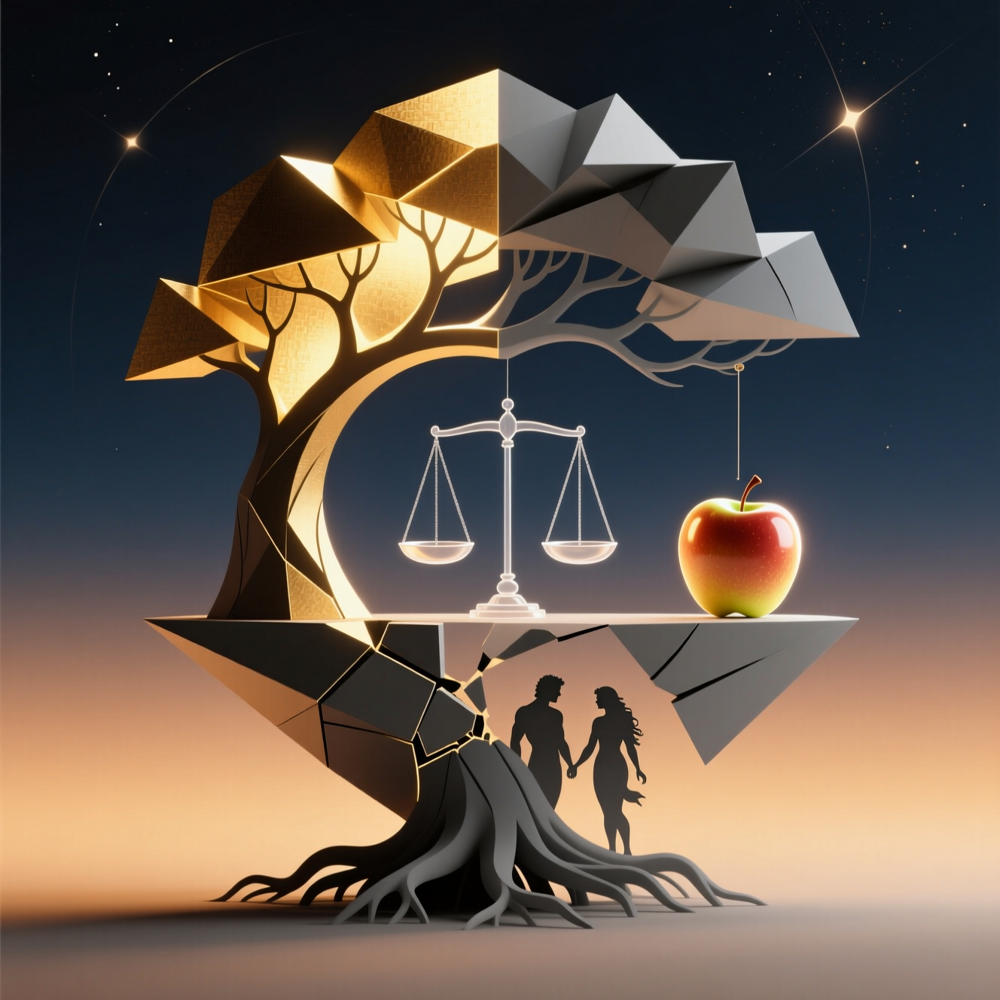

# العودة إلى عدن 

### لوباتشيف سيرجي فلاديميروفيتش 

روستوف-أون-دون 
2025 

 
   

 

## جدول المحتويات 

- [1. المقدمة](#1-introduction) 
- [2. التفكير الطفيلي](#2-التفكير-الطفيلي) 
  - [2.1 الفكرة العامة](#21-الفكرة-العامة) 
  - [2.2 الأسس النظرية](#22-الأسس-النظرية) 
  - [2.3 أسباب الحدوث](#23-أسباب-الحدوث) 
  - [2.4 أشكال التظاهر](#24-أشكال-التظاهر) 
  - [2.5 التأثير على الضحايا](#25-التأثير-على-الضحايا) 
  - [2.6 التأثير على الحاملين](#26-التأثير-على-الحاملين) 
  - [2.7 المواجهة](#27-التفاعل-المعارض) 
  - [2.8 التشخيص](#28-التشخيص) 
  - [2.9 العلاج والتصحيح](#29-العلاج-والتصحيح) 
- [3. الاستعمار والتفكير الطفيلي](#3-الاستعمار والتفكير الطفيلي) 
  - [3.1 فكرة عامة](#31-فكرة عامة) 
  - [3.2 السياق التاريخي](#32-السياق التاريخي) 
  - [3.3 آليات التأثير الاستعماري وتشكيل التفكير الطفيلي](#33-آليات التأثير الاستعماري وتشكيل التفكير الطفيلي) 
  - [3.4 التفكير الطفيلي في المجتمعات الاستعمارية](#34-التفكير الطفيلي في المجتمعات الاستعمارية) 
  - [3.5 عواقب الاستعمار من وجهة نظر التفكير الطفيلي](#35-عواقب الاستعمار من وجهة نظر التفكير الطفيلي) 
  - [3.6 المظاهر الحديثة للتفكير الاستعماري والطفيلي [3.7 مواجهة التأثير الاستعماري والتفكير الطفيلي](#37- 
  مواجهة التأثير الاستعماري والتفكير الطفيلي) - [3.8 تشكيل وعي مضاد للطفيليات](#38-تشكيل-وعي- 
  مضاد-للطفيليات) - [3.9 
  طرق لتحرير الذات من التفكير الطفيلي](#39-طرق-لتحرير-الذات-من-التفكير-الطفيلي) - [3.10 
  أمثلة للتغلب على التفكير الاستعماري والطفيلي](#310-أمثلة-للتغلب-على-التفكير-الاستعماري-والطفيلي) 
- [4. الثورات اللونية والتفكير الطفيلي](#4-الثورات-اللونية-والتفكير-الطفيلي) 
  - [4.1 مقدمة عامة](#41-مقدمة-عامة) 
  - [4.2 آليات الثورات اللونية](#42-آليات-الثورات-اللونية) 
  - [4.3 أمثلة على الثورات اللونية](#43-أمثلة-على-الثورات-اللونية) 
  - [4.4 التفكير الطفيلي في سياق الثورات اللونية](#44-التفكير-الطفيلي-في-سياق-الثورات-اللونية) 
  - [4.5 تأثير الثورات الملونة على تطور المجتمع](#45-تأثير-الثورات-اللونية-على-تطور-المجتمع)
  - [4.6 مواجهة الجوانب السلبية للثورات الملونة](#46-مكافحة-الجوانب-السلبية-للثورات-الملونة) 
  - [4.7 طرق لمنع التأثير الطفيلي](#47-طرق-منع-التأثير-الطفيلي) 
  - [4.8 إمكانيات التغيير الإيجابي](#48-إمكانيات-التغيير-الإيجابي) 
- [5. تطبيع التفكير الطفيلي](#5-تطبيع-التفكير-الطفيلي) 
  - [5.1 فكرة عامة](#51-فكرة-عامة) 
  - [5.2 الأسس النظرية لتطبيع التفكير الطفيلي](#52-الأسس-النظرية-لتطبيع-التفكير-الطفيلي) 
  - [5.3 أشكال وطرق تطبيع التفكير الطفيلي](#53-أشكال-وطرق-تطبيع-التفكير-الطفيلي) 
  - [5.4 مظاهر تطبيع التفكير الطفيلي في المجتمع الحديث](#54-مظاهر-تطبيع-التفكير-الطفيلي-في-المجتمع-الحديث) 
  - [5.5 عواقب تطبيع التفكير الطفيلي](#55-عواقب-تطبيع-التفكير-الطفيلي) 
  - [5.6 آليات [5.7 طرق للتغلب على تطبيع التفكير الطفيلي](#57-طرق- 
  للتغلب-على-تطبيع-التفكير-الطفيلي) - [5.8 آفاق- 
  التطوير-والبحث-المزيد](#58-آفاق-التطوير-والبحث-المزيد) 
- [6. العولمة والتفكير الطفيلي](#6-العولمة-والتفكير-الطفيلي) 
  - [6.1 فكرة عامة](#61-فكرة-عامة) 
  - [6.2 الأسس النظرية لتفاعل العولمة والتفكير الطفيلي](#62-الأسس-النظرية-لتفاعل-العولمة-والتفكير-الطفيلي) 
  - [6.3 أشكال تجليات التفكير الطفيلي في ظل العولمة](#63-أشكال-تجليات-التفكير-الطفيلي-في-ظل-العولمة) 
  - [6.4 آليات انتشار التفكير الطفيلي من خلال العولمة](#64-آليات-انتشار-التفكير-الطفيلي-من-خلال-العولمة) 
  - [6.5 عواقب تفاعل العولمة والطفيلي التفكير](#65-عواقب-تفاعل-العولمة-والتفكير-الطفيلي) 
  - [6.6-التفكير-الطفيلي-المُضاد-في-سياق-العولمة](#66-مُواجهة-التفكير-الطفيلي-في-سياق-العولمة) 
  - [6.7-طرق-التغلب-على-الجوانب-السلبية-للتفاعل](#67-طرق-التغلب-على-الجوانب-السلبية-للتفاعل) 
  - [6.8-آفاق-التنمية-والمزيد-من-البحث](#68-آفاق-التنمية-والمزيد-من-البحث)  
- [7. الصراعات-العسكرية-كنتيجة-للفكر-الطفيلي](#7-الصراعات-العسكرية-كنتيجة-للفكر-الطفيلي)
  - [7.1-فكرة-عامة](#71-فكرة-عامة) 
  - [7.2-الأسس-النظرية-للصراعات-العسكرية-كعواقب-للفكر-الطفيلي](#72-الأسس-النظرية-للصراعات-العسكرية-كعواقب-للفكر-الطفيلي)
  - [7.3 أشكال وأساليب الصراعات العسكرية كمظاهر للتفكير الطفيلي](#73-أشكال وأساليب الصراعات العسكرية كمظاهر للتفكير الطفيلي) 
  - [7.4 مظاهر الصراعات العسكرية كعواقب للتفكير الطفيلي في العالم الحديث](#74-مظاهر-الصراعات-العسكرية-كعواقب-للفكر-الطفيلي-في-العالم-الحديث) 
  - [7.5 عواقب الصراعات العسكرية كمظاهر للتفكير الطفيلي](#75-عواقب-الصراعات-العسكرية-كعواقب-للفكر-الطفيلي) 
  - [7.6 آليات منع الصراعات العسكرية كعواقب للتفكير الطفيلي [7.7 طرق للتغلب على عواقب الصراعات العسكرية](#77-طرق-للتغلب-على-عواقب- 
  الصراعات-العسكرية) - [7.8 آفاق-التنمية-والمزيد- 
  من-البحث](#78-آفاق-التنمية-والمزيد-من-البحث) 
- [8. التوازن كبديل للتفكير الطفيلي](#8-التوازن-كبديل-للتفكير-الطفيلي) 
  - [8.1 فكرة عامة](#81-فكرة-عامة) 
  - [8.2 الأسس النظرية للتوازن كبديل](#82-الأسس-النظرية-للتوازن-كبديل) 
  - [8.3 أشكال وطرق تحقيق التوازن](#83-أشكال-وطرق-تحقيق-التوازن) 
  - [8.4 مظاهر التوازن في المجتمع الحديث](#84-مظاهر-التوازن-في-المجتمع-الحديث) 
  - [8.5 مزايا التوازن كبديل للتفكير الطفيلي](#85-مزايا-التوازن-كبديل-للتفكير-الطفيلي) 
  - [8.6 آليات تعزيز التوازن في 
  [8.7 طرق لتطبيق مبادئ التوازن ](#87-طرق-لتطبيق-مبادئ-التوازن) - 
  [8.8 آفاق التنمية والمزيد من البحث](#88-آفاق-التنمية- والمزيد-من-البحث) 
- [9. الحق في النضال واستخدام القوة ضد التفكير الطفيلي المنظم والفردي من أجل استعادة التوازن](#9-الحق في النضال واستخدام القوة ضد التفكير الطفيلي المنظم والفردي من أجل استعادة التوازن) 
  - [9.1 عرض عام](#91-عرض عام) 
  - [9.2 الأسس النظرية لحق النضال واستخدام القوة](#92-الأسس النظرية للحق في النضال واستخدام القوة) 
  - [9.3 أشكال وأساليب النضال ضد التفكير الطفيلي](#93-أشكال وأساليب النضال ضد التفكير الطفيلي) 
  - [9.4 مظاهر النضال ضد التفكير الطفيلي في التاريخ](#94-مظاهر النضال ضد التفكير الطفيلي في التاريخ)  
  - [9.5 عواقب النضال واستخدام القوة ضد الفكر الطفيلي](#95-عواقب-النضال-واستخدام-القوة-ضد-الفكر-الطفيلي)
  - [9.6 آليات إضفاء الشرعية على النضال واستخدام القوة](#96-آليات-إضفاء-الشرعية-على-النضال-واستخدام-القوة) 
  - [9.7 طرق تنظيم وضبط استخدام القوة](#97-طرق-تنظيم-وضبط-استخدام-القوة)
  - [9.8 آفاق التنمية والبحث الإضافي](#98-آفاق-التنمية-والبحث-المزيد) 
- [10. الخاتمة](#10-الخاتمة) 

 
### 1. المقدمة 

عند التخطيط لهيكل هذا الكتاب، قررت بناء السرد بحيث يتم الكشف عن الفكرة الرئيسية على الفور ثم بالتفصيل. أود أن يكون الكتاب مفهومًا لمجموعة متنوعة من القراء: أولئك الذين يفضلون ملخصًا موجزًا ​​وأولئك الذين يرغبون في الخوض في فحص مفصل للقضية. سيجد كل قارئ شيئًا قيمًا ومفيدًا في الكتاب. 

يمكن التعبير عن مفهوم الكتاب بأكمله بحكمة صينية واحدة: كوكب واحد - إنسانية واحدة - مصير واحد. تعكس هذه الفكرة فهم أن البشرية جمعاء مرتبطة بمشاكل وآفاق مشتركة. سيفهم بعض القراء على الفور جوهر هذا الموقف؛ بالنسبة لهم، سيتم تقديم الأفكار الرئيسية للكتاب بإيجاز ووضوح. سيرغب آخرون في متابعة تطور الفكر واكتساب فهم أعمق للمفاهيم المطروحة - فبالنسبة لهم، تُطوّر كل فكرة بالتتابع في الفصول التالية. 

أفهم أن أفكاري ليست جديدة من نواحٍ عديدة: فقد كتب فيودور دوستويفسكي عن شيء مشابه، على سبيل المثال، في "الإخوة كارامازوف" وخاصةً في "الأبله". يتجلى هذا التناقض بين المجتمع والفرد الذي يعيش وفقًا لقوانين الأخلاق والآداب بوضوح خاص في "الأبله". تأمل فيودور دوستويفسكي هذا السؤال بعمق وتركه لأحفاده: أين مكان الصالحين على هذا الكوكب؟ هل يُهمّشون في المجتمع إذا لم يسعوا وراء الربح، ولم يتجاوزوا حدود الأخلاق، وإذا سعوا إلى قيم كالحب، والرفاهية العامة، والصدق، وكل ما نعتبره جديرًا بالإنسان؟ لماذا يجد الشخص الطيب والأخلاقي نفسه مهمشًا ووحيدًا في عالم قاسٍ يرفضه، ويدمره، ويبدو أنه يمزق روحه وحياته الحقيقية من الداخل، ولا يمنحه أي فرصة لحياة مزدهرة؟ 

لم يتغير العالم كثيرًا منذ أن كتب الكلاسيكيون نصوصهم وطرحوا هذه الأسئلة الصعبة. واليوم، لا تزال أسئلة البشرية على حالها. واليوم، كما في السابق، تنشأ صراعات وحروب وتناقضات بين المصالح المادية والمبادئ الأخلاقية. في عالمنا الحديث، غالبًا ما تطغى الاعتبارات الاقتصادية على الاعتبارات الأخلاقية، مما يؤدي إلى مواقف صعبة تُقدَّم فيها الربحية على القيم الإنسانية العالمية.

في هذا الكتاب، لا ندّعي تقديم أفكار جديدة كليًا. سنحاول تناول أسئلة الكلاسيكيات القديمة - ففي النهاية، تركها فيودور دوستويفسكي دون إجابة تُذكر - وسنحاول إيجاد إجابات لهذه الأسئلة المعقدة في مرحلة جديدة من التطور، مرحلة جديدة من التاريخ. نحن نحمل عصا الكلاسيكيات، ونواصل عملها، والأهم من ذلك، أن الأمر لا يتعلق بالعصا نفسها أو المنافسة، بل بمحاولة فهم المعنى، وإدراك ما يحدث لنا، ونوع العالم الذي نعيش فيه، وإلى أين نتجه. ما هي آفاق التطور البشري؟ ما الذي يُسهّل التقدم، وما الذي يُشكّل العقبات؟ سنتناول هنا جميع هذه الأسئلة التي خلّفتها الكلاسيكيات. 

الموضوع الرئيسي لهذا الكتاب هو ظاهرة أسميها "التفكير الطفيلي". بهذا المصطلح، أعني نظامًا من وجهات النظر وأنماط السلوك التي ينظر فيها الفرد أو المجموعة (بما في ذلك المنظمات والشركات أو الدول) إلى الآخرين كمورد لتلبية احتياجاتهم الخاصة فقط، متجاهلين حقوقهم ومصالحهم ورفاهيتهم. يتجلى التفكير الطفيلي في الرغبة في حل مشاكل المرء على حساب الآخرين، دون تعويض عن الضرر الناجم ودون النظر في عواقب أفعال المرء على الآخرين. 

لفهم أكثر دقة لهذه الظاهرة، من الضروري التمييز بين التفكير الطفيلي وأشكال التفاعل الأخرى: 
1. التعاون المتبادل المنفعة - عندما يستفيد جميع الأطراف ويفهمون شروط التفاعل 
2. المنافسة - عندما يتنافس المشاركون على موارد محدودة ضمن القواعد المعمول بها 
3. الاستغلال - عندما يستخدم أحد الطرفين الآخر مع تعويض ضئيل أو رمزي 
4. التفكير الطفيلي - عندما يستخدم أحد الطرفين الآخر دون أي تعويض ودون النظر في الضرر الناجم 

يمكن العثور على أمثلة محددة للتفكير الطفيلي في مجالات مختلفة من الحياة. على سبيل المثال، في الاقتصاد، يتجلى هذا عندما تُحوّل الشركات العابرة للحدود الوطنية أرباحها إلى مناطق خارجية، متهربةً من دفع الضرائب في البلدان التي تتلقى منها الموارد والعمالة. ونتيجةً لذلك، لا تتلقى ميزانيات هذه البلدان أموالاً لتطوير البنية التحتية والبرامج الاجتماعية، وتستمر الشركات في الاستفادة من المنافع التي يُنتجها المجتمع. 

في العلاقات الدولية، يتجلى التفكير الطفيلي عندما تُعالج الدول المتقدمة مشاكلها الاقتصادية على حساب الدول الأقل نمواً. على سبيل المثال، تُعدّن بعض الدول الأفريقية المعادن الأرضية النادرة، الضرورية لإنتاج الإلكترونيات، بينما لا يزال سكان هذه المناطق يعيشون في فقر، ويتدهور الوضع البيئي بشكل كبير. تتدفق أرباح بيع هذه الموارد إلى دول أخرى، تاركةً السكان المحليين يواجهون مشاكل لم تُسببها.

في العلاقات الشخصية، يُمكن ملاحظة التفكير الطفيلي في حالات الاستغلال العاطفي، عندما يستغل أحد الشريكين الآخر لإشباع احتياجاته النفسية، متجاهلاً مشاعره واحتياجاته. قد يتجلى هذا في النقد المستمر، أو التلاعب، أو تجاهل مصالح الشريك. 

يواجه العالم الحديث بعض المشاكل التي يصعب قياسها أو تحديدها علميًا، لكن هذا لا يعني أنها غير موجودة. في الواقع، لهذه الصعوبات عواقب حقيقية. يمكن القول إن البشرية تواجه بعض الصعوبات التنموية التي تؤثر على غالبية الناس. تتجلى هذه الصعوبات في مجالات مختلفة من الحياة: من الصراعات الشخصية إلى الأزمات الدولية. 

أُدرك أنني أتحدث عن أمور تُعتبر عادية في مجتمعنا ولا علاقة لها بالمشاكل أو السلوكيات السلبية، ولكن هنا يكمن تعقيد الوضع: فنحن نقبل ما يُعتبر أمرًا طبيعيًا، وقد تكون له عواقب سلبية. دعوني أقدم لكم تمرينًا منطقيًا صغيرًا لتوضيح مدى انتشار هذه الظاهرة وما يُعتبر طبيعيًا بالفعل. على سبيل المثال، كيف تُسمون شخصًا يستمتع بإلحاق الألم بالآخرين أو بالحيوانات؟ الإجابة واضحة: سادي. لكن عندما يتعلق الأمر بإيذاء الآخرين من أجل الربح، لسبب ما، لا يمكننا إيجاد مقارنة منطقية، ويبدو لنا ذلك صحيحًا وضروريًا. لكن المعنى واحد: إذا تسبب شخص ما في معاناة الآخرين سعيًا وراء الربح، فإنه يُظهر نفس سمات السادي - فهو يستفيد من معاناة الآخرين، حتى لو كانت مادية أو غير مادية. لكن هل يُغير هذا جوهر الأمر؟ هذا تمرين منطقي بسيط لتوضيح ما أتحدث عنه، ولإثبات أن السلوك السادي أصبح أمرًا طبيعيًا تقريبًا بالنسبة لنا. نحن لا ننتبه دائمًا لعواقب أفعالنا. أرى هذا في كل مكان، وأرى كيف تتجلى هذه الظاهرة في المجتمع، ويجب فعل شيء حيالها. يجب أن نجد طرقًا لمعالجتها.

أستطيع أن أتخيل بعض الناس يقولون: "يا إلهي، أحدهم ربح بعض العملات الإضافية، ومن المؤكد أن شخصًا آخر في الطرف الآخر لن يعجبه ذلك. الأمر أشبه بالمساومة في السوق: يخسر أحدهم ويربح الآخر. كيف يُمكن مقارنة ذلك بالسادية؟" لكن الأمر مختلف تمامًا إذا كنا نتحدث عن قواعد، مثل المساومة في السوق: فكلٌّ من البائع والمشتري يقبل هذه القواعد ويلتزم بها، وبالتالي تُوزّع المكاسب والخسائر بين المشاركين وفقًا للقواعد التي يلتزمون بها، ولا يوجد سلوك طفيلي. لكن دعني أسألك: ماذا لو تصرفت دولة بأكملها بهذه الطريقة؟ تخيل أنها أرادت حل مشاكلها الاقتصادية - التي تُقدر بمليارات الدولارات - على حساب دولة أخرى، لمجرد إيجاد طريقة لسرقة سكانها وإلحاق المعاناة بهم، متجاهلةً تمامًا ما يفعلونه، لأنه مربح. هل يمكنك القول إن هذا لا يُمكن أن يحدث؟ أو ربما يمكنك القول إن هذا يحدث طوال الوقت؟ أقول لك، على الأرجح هو الاحتمال الثاني. هذا النوع من السلوك، الذي يبدو بريئًا في ظاهره، عندما يؤثر على شخص أو شخصين، سواء كان ذلك داخل الأسرة أو في مكان آخر، هو بالفعل سبب للقلق. ولكن إذا تصرفت مجموعة كاملة من المجتمع، متحدة في دولة، بهذه الطريقة، ألا تمثل مشكلة ذات أبعاد عالمية؟ ألا تودي هذه الأحداث بحياة أكثر من الكوارث الطبيعية؟ يجدر بنا أن نفكر في مدى انتشار هذه الظاهرة، ومع ذلك يمكن تلخيصها في بضع كلمات فقط: التفكير الطفيلي. 

سؤال مهم آخر أود استكشافه في هذا الكتاب هو الحق في القتال. هل يحق للإنسان أن يقاتل، وأن يُظهر العزم، إذا كان يدافع عن المبادئ العليا والصالح العام؟ كيف يمكننا أن نحدد أي جانب على حق، ومن له الحق في ذلك؟ من الواضح تمامًا بالنسبة لي أنه يجب علينا أن نسعى جاهدين للتغلب على هذه الظاهرة السلبية. هذا ضروري لأن البشرية لا تزال لا تفهم تمامًا ما يحدث، ولا تفهم المشكلة، ولا تفهم بالضبط ما يجب معالجته. إنه أشبه بنظام معقد يصعب فيه عزل عناصره الفردية، ولا تتضح فيه مواطن الضعف الأساسية. إنها قضية معقدة، لكنها مع ذلك تتطلب الاهتمام والوعي، لأن فهم الوضع هو الخطوة الأولى لحله. إذا أدركنا وجود مشكلة حقيقية، فإن الخطوة التالية هي إيجاد سبل لمعالجتها، وإيجاد سبل لتغيير الوضع. واليوم، في ظل عدم إدراك المشكلة بشكل كافٍ، وافتقار المجتمع لفهم واضح لهذه الظاهرة، لا يزال هناك الكثير من العمل لتحليل الوضع وإيجاد سبل لتطويره. وبما أن هذه الأسئلة لا تزال مفتوحة في المجتمع ولم تُفهم بشكل كافٍ بعد، فربما حان الوقت لمعالجة هذه القضايا، وفهم ما يحدث لنا، وإيجاد سبل لمعالجة هذه الظاهرة.

حان وقت إنهاء المقدمة، وأود أن أقول إنني لا أحاول إلقاء اللوم على أي شخص أو الإساءة إليه. أنا أحاول ببساطة فهم ما يحدث وإيجاد طرق لتحسين الوضع. إذا أثرت اهتمامك، فيرجى متابعة القراءة - سأخبرك بالمزيد عما هو موضح هنا. 

 
## 2. التفكير الطفيلي 

 
### 2.1 مقدمة عامة 

أقترح إلقاء نظرة فاحصة على ظاهرة التفكير الطفيلي. لاحظت لأول مرة مظاهر هذا التفكير في العلاقات الشخصية، وخاصة بين الرجال والنساء. في المجتمع الحديث، غالبًا ما تتم مناقشة العلاقات الأسرية غير المتوازنة باستخدام مصطلحات رائجة مثل الإساءة والتلاعب النفسي وغيرها. ومع ذلك، يكمن وراء هذه الكلمات نفس التفكير الطفيلي. 

المفارقة هي أن التفكير الطفيلي لا يهدف دائمًا إلى الحصول على منافع مادية. غالبًا ما يكون هدفه الأساسي هو السيطرة على نفسية الضحية وصحتها العقلية وعقلها. بعد ذلك فقط يستخدم الشخص ذو التفكير الطفيلي الضحية لتحقيق أهدافه الخاصة. 

التفكير الطفيلي هو شكل من أشكال السلوك النفسي الذي يسعى فيه الشخص إلى الحصول على فوائد (مادية أو غير مادية) على حساب الآخرين، دون تقديم أي شيء ذي قيمة في المقابل. يتميز هذا النوع من التفكير بغياب التبادل المفيد للطرفين والرغبة في استخدام الآخرين لتلبية احتياجاته الخاصة، وغالبًا ما يكون ذلك على حساب الضحايا. 

معايير تشخيص التفكير الطفيلي: 
1. توقع دائم لتلقي فوائد من الآخرين دون تقديم تعويض مناسب. 
2. عدم الشعور بالذنب أو المسؤولية عن الأذى الذي يلحق بالآخرين. 
3. الميل إلى التلاعب بالآخرين لتحقيق أهداف شخصية. 
4. عدم القدرة أو عدم الرغبة في بناء علاقات مفيدة للطرفين. 
5. الاعتقاد بأن الآخرين ملزمون بالمساعدة دون تعويض. 
6. استخدام إنجازات الآخرين على أنها إنجازاتك الخاصة دون الاعتراف بمساهمة الآخرين. 
٧. الميل إلى التلاعب النفسي وأشكال أخرى من الضغط النفسي. 
٨. عدم القدرة على التعاطف مع تجارب الآخرين وفهمها. 

تُستخدم تقنيات تلاعب متنوعة لهذا الغرض، وخاصةً التلاعب النفسي. التلاعب النفسي هو شكل من أشكال التأثير يُقنع الشخص بأن الأسود أبيض والأبيض أسود. على سبيل المثال، قد يُقنع الضحية بأن خسائره هي طريقٌ إلى طاقة جديدة أو مستوىً جديد. 

يُظهر الأشخاص ذوو العقلية الطفيلية إبداعًا كبيرًا، حيث يطورون أساليب جديدة للتأثير على ضحاياهم، ونظريات جديدة، وأساليب إقناع. لكن الجوهر يبقى كما هو - الهدف يبقى كما هو: التطفل على الشخص.

كما ذُكر سابقًا، لا يسعى الشخص ذو العقلية الطفيلية دائمًا إلى تحقيق أهداف مادية. أحيانًا، يهتم بالجوانب النفسية. على سبيل المثال، قد يستغل الشخص الذي يعاني من صدمة نفسية أو كبرياء مجروح الآخرين لتعزيز ثقته بنفسه باستمرار من خلال إذلالهم. بدلًا من معالجة صدمته بالعلاج النفسي، يُدمر نفسية الآخرين، ويحل مشاكله على حسابهم. 

بهذه الأمثلة، أريد أن أوضح أن ليست كل المشاكل مرتبطة بالقيم المادية. غالبًا ما يسعى الشخص ذو العقلية الطفيلية إلى تحقيق أهداف غير مادية، متطفلًا ليس فقط على الأشياء، بل أيضًا على نفسية ضحاياه. 

يمر الشخص ذو العقلية الطفيلية بتطور شخصي معين طوال حياته. من خلال ملاحظاتي، يبدأ تطور هذا النوع من التفكير في الطفولة. يأخذ الطفل كل شيء من والديه دون أن يُعطي شيئًا في المقابل. ومع ذلك، فإن سلوك الطفل ليس تفكيرًا طفيليًا، لأنه يستخدم آلية التتابع الأسري - وهي الآلية الطبيعية التي يُربى بها الأبناء. يهتم الآباء بأطفالهم بلا أنانية، والأبناء الكبار بدورهم يفعلون الشيء نفسه تجاه أبنائهم. هذا طبيعي تمامًا ولا علاقة له بالتفكير الطفيلي. 

ومع ذلك، قد يحدث أن يبدأ الشخص الذي يجهل جوهر سباق التتابع القديم في الاعتقاد بأنه مدين بكل شيء، وأن العالم مدين له دون وجه حق. تترسخ هذه الصورة النمطية السلوكية، ويستمر الشخص، كشخص بالغ، في الاعتقاد بأن على الآخرين القيام بكل شيء من أجله مجانًا. هذا هو التفكير الطفيلي - وهو نوع من المرض الناجم عن نقص النضج العقلي. قد يكون الشخص ناضجًا جسديًا ولكنه يظل طفلًا عقليًا. عندما ينتهي سباق التتابع القديم، يبحث عن طرق للحفاظ على أسلوب الحياة المألوف، حيث يأتي إليه كل شيء مجانًا، ويبدأ في استخدام أنماط سلوكية طفيلية. 

يُظهر البالغ ذو التفكير الطفيلي قدرات إبداعية مذهلة، ويُحسّن أساليبه باستمرار، ويقضي حياته كلها في صقلها على من حوله - في العمل، وفي الأسرة، ومع أطفاله. يُسبب هذا التفكير ضررًا جسيمًا لكل من يتعامل معه. تكمن المشكلة الرئيسية لدى هذا الشخص في جهله بما يحدث، وعدم استعداده لقبول الواقع الجديد، وعدم رغبته في الانتقال إلى مرحلة البلوغ، واستمراره في استغلال كل شيء مجانًا، تمامًا كما فعل في طفولته. 

ربما يدرس علماء النفس يومًا ما ظاهرة التفكير الطفيلي بمزيد من التفصيل ويشرحون آلياتها. في عملنا، نعتبر هذه الظاهرة أمرًا واقعًا ونناقشها كظاهرة تحدث في مجتمع البالغين. سنترك الدراسات الأكثر تفصيلًا للتفكير الطفيلي للمتخصصين في هذا المجال - لعلماء النفس - ثم ننتقل إلى دراسة ما يحدث للشخص البالغ الذي اكتسب هذه الصورة النمطية السلوكية.

بالطبع، يختلف كل شخص عن الآخر: فهناك الكثير من الناس على هذا الكوكب بفرص وقدرات ومسارات حياة مختلفة. هناك أناس بمستويات نمو متفاوتة تمامًا، فكريًا وعقليًا. لذلك، غالبًا ما يُودي التفكير الطفيلي في أبسط صوره بالناس إلى السجن - هؤلاء يُسجنون لافتقارهم إلى التفكير أو صفات نفسية أخرى. بالطبع، قد يكون هذا بسبب صدمة في الطفولة أو غير ذلك، لكنهم مع ذلك لا يستطيعون التحرر من هذا النموذج الطفيلي، ولا يستطيعون، على الأقل في مرحلة معينة من حياتهم، التكيف مع حياة سلمية في المجتمع. منطق هؤلاء الأشخاص هو: "الجميع مدينون لي"، وهم لا يفهمون بصدق لماذا لا يُعطيهم الآخرون ما يريدون. ثم يقولون: "أنت لا تُعطيني ما تدين لي به؛ سآخذه بنفسي". عندما يحاولون أخذه بالقوة أو سرًا، يُعتبر ذلك جريمة، وينتهي بهم المطاف في السجن عاجلًا أم آجلًا. 

هذا النوع من الأشخاص مفهوم، لكن هناك آخرون يتمتعون بصفات وقدرات فكرية أعلى. يمكن لهؤلاء الأشخاص تحقيق نجاح مهني، بل وحتى أن يصبحوا قادة. تكمن مشكلة هؤلاء القادة في أنهم لا يركزون على تحقيق الصالح العام للمجموعة، بل يسعون جاهدين لتحقيق أهداف نفسية شخصية، مغطّين صدماتهم الشخصية، على سبيل المثال، من خلال تعزيز ثقتهم بأنفسهم أو تعويضهم عن إصاباتهم النرجسية. قد يمتلك كل شخص "باقة" كاملة من الصدمات والقدرات الفردية التي تحوله إلى طفيليات. 

أحيانًا يصبح هؤلاء الأشخاص رجال أعمال ناجحين، لكنهم لا ينخرطون في الأعمال التجارية من أجل التقدم الاجتماعي، بل للتطفل على قواهم العاملة، أي على من يعملون لديهم. هذا ليس أكثر من شكل من أشكال الاستغلال، حيث يتطفل صاحب العمل على موظفيه. مع ذلك، ليست كل الشركات ترعى الطفيليات، على الرغم من أن هذه الأفكار قد تكون سائدة في المجتمع. هناك شركات تسعى بصدق لتحسين حياة المجتمع ولا تهدف إلى استغلال الناس استغلالًا ضارًا. توجد أمثلة كهذه، وأعتقد أنها من أصح نماذج الأعمال، مثل تبرع المالك بجزء من الأرباح لبناء مدرسة أو حديقة. هذا يشير إلى أن الأعمال التجارية لا تهدف فقط إلى الربح، بل إلى خلق شيء إيجابي للمجتمع أيضًا. 

وبالطبع، لا توجد قواعد بلا استثناءات، ولكل حالة فردية خصائصها الخاصة، وصدماتها، ومزاياها المكتسبة من خلال التعليم والتربية. لذلك، يجب دراسة كل حالة على حدة؛ فلا يمكن التوصل إلى استنتاجات عامة للجميع. أود ببساطة أن أقول إن هناك أمثلة واضحة تمامًا لقادة أعمال وبناة بُنيت أعمالهم على الإبداع لا على التدمير.

على سبيل المثال، إذا أنشأ شخص ما مجموعة ابتزاز، فهي أيضًا عمل تجاري من وجهة نظره، لكنها عمل طفيلي مدمر لا يمت بصلة إلى العمل السليم النافع للمجتمع. على العكس، إذا أنشأ شخص ما عملًا تجاريًا، وضمن رفاهية موظفيه، ووفر إجازات وقسائم سفر، ووفر الرعاية الصحية، فهذا يدل على أن المدير والعمل يركزان على الأفراد والجماعات، وعلى الأرجح، إنه عمل سليم لا يمت بصلة إلى التفكير الطفيلي. 

يبدو أن نجاح شخص ذي عقلية طفيلية في مهنة ما، حتى لو أصبح مديرًا لشركة، يمكن اعتباره نجاحًا، بما في ذلك نجاحًا للمجتمع، لأنه لم يتحول إلى عنصر إجرامي، بل إنه في الواقع لا يرتكب أي فعل سيء، ويعيش حياة طبيعية وسلمية. لكن هذا ليس دقيقًا تمامًا، لأن الشخص ذي العقلية الطفيلية، عند توليه مناصب معينة، يحصل على فرص لتعظيم تأثير تفكيره الطفيلي. إذا كان الشخص العادي الذي لم يُدرك ذاته كقائد وأصبح ببساطة سجينًا، فسيؤذي بالطبع بعض الناس، لكن هذا الضرر سيكون أقل بكثير من الضرر الذي يُلحقه القائد بمرؤوسيه يومًا بعد يوم، عامًا بعد عام. وإذا كان صاحب عمل، فإنه يأخذ المال بانتظام من فائض القيمة، وهنا نتحدث عن الاستغلال والتطفل. يظل هؤلاء الأشخاص قانونيين تمامًا، لكنهم في جوهرهم يرتكبون جرائم ضد من يتطفلون عليهم. لا يقتصر ضررهم على الأضرار المادية فحسب، بل يشمل أيضًا الأضرار النفسية، والتي غالبًا ما تكون شديدة لدرجة أنهم يُصابون على مر السنين بمرض نفسي كامل. لذلك، فإن افتراض أن الشخص ذي العقلية الطفيلية، بعد أن أدرك ذاته في مهنة سلمية، أو أصبح قائدًا أو أي شيء آخر، يتوقف عن إيذاء الآخرين وأن جوهره قد تغير نتيجة لذلك هو افتراض خاطئ تمامًا. جوهر هؤلاء الأشخاص لا يتغير؛ إنهم ببساطة يجدون طرقًا لإضفاء الشرعية على تفكيرهم الطفيلي في بعض الصناعات، مستغلين عيوب القوانين التي لا تعاقبهم.

علاوة على ذلك، قد يتمتع الأشخاص ذوو العقلية الطفيلية بذكاء كافٍ يمنعهم من إظهار ميولهم الطفيلية بطريقة فظة، على سبيل المثال، في بيئة عمل تجاه رؤسائهم، لأن ذلك غير مربح ولا يرون فيه تحقيقًا لأهدافهم. على سبيل المثال، إذا كان هدفهم هو التطفل النفسي لا المادي، فقد يصبحون معلمين ويسببون أذىً نفسيًا للأطفال. ولكن نظرًا لتفاعلهم مع عدد كبير من الناس، يمكن توزيع جميع ميولهم بالتساوي بينهم دون أن يبدو ذلك غير لائق أو غير أخلاقي، مع أن الشخص قد ينجح في إخفاء صدماته على حساب الآخرين. بالطبع، هذا الشخص مفيد جزئيًا لأنه أصبح محترفًا، وتلقى تعليمًا، ودخل، على سبيل المثال، مجال التدريس. ولكن ما هي صفة هذا المعلم؟ هل يسيئون معاملة الأطفال أم أنهم يُعلّمون حقًا؟ ما هي أهدافهم؟ الحقيقة هي أن هؤلاء الأشخاص ليسوا بالضرورة معلمين - لقد ذكرت هذا المثال ببساطة لأن هذه هي المهنة التي يمكن أن يُسبب فيها أصحاب التفكير الطفيلي أكبر ضرر، بما أننا نتحدث عن الأطفال. يمكن لمثل هؤلاء الأشخاص أن يكونوا في أي مهنة على الإطلاق، طالما أن عملهم يسمح لهم بالوصول إلى عدد كبير من الناس، حتى يتمكنوا من توزيع مشاكلهم النفسية وتحقيقها على عدد كبير من الناس. 

أصبح التفكير الطفيلي في كل مكان. هذه الظاهرة منتشرة على نطاق واسع لدرجة أنه من الصعب الآن العثور على شخص لا يتصرف، بدرجة أو بأخرى، أو في بعض جوانب حياته، مثل شخص لديه تفكير طفيلي. بالطبع، كل شخص يختلف؛ هناك درجات متفاوتة من كل من المرض ودرجة التفكير الطفيلي. قد يكون لدى بعض الناس تفكير طفيلي واضح، والبعض الآخر لديه أقل وضوحًا، والبعض الآخر لديه تفكير تافه، لذلك يمكن للمرء أن يقول إنهم بصحة جيدة تقريبًا. ومع ذلك، فإن هذه الظاهرة منتشرة على نطاق واسع في المجتمع اليوم لدرجة أنه من الصعب العثور على شخص غير قابل للإصابة بها بطريقة أو بأخرى. تكمن المشكلة في أن هذا السلوك يُعتبر الآن هو القاعدة، ونحن لا ندرك مدى إعاقة تطورنا وتدهور حياتنا وحياة الآخرين بالانخراط في هذه الصور النمطية السلوكية، دون إدانتها، بل قبولها كقاعدة. 

التصدي السلمي للتفكير الطفيلي: 

لمواجهة التفكير الطفيلي بفعالية، من الضروري اتباع نهج شامل يشمل التدابير الفردية والمجتمعية. على المستوى الفردي، من المهم تطوير المهارات والصفات التالية: 

1. الذكاء العاطفي والتعاطف - القدرة على فهم الآخرين والتعاطف معهم. 
2. التأمل الذاتي - مراجعة دوافع الفرد وأفعاله بانتظام.  
3. الحدود - القدرة على وضع حدود شخصية سليمة في العلاقات.
4. التفاعل المفيد للطرفين - الرغبة في التبادل والتعاون الصادق.
٥. المرونة النفسية - القدرة على مقاومة التلاعب. 

على المستوى المجتمعي، هناك حاجة إلى تدابير لتثقيف وتغيير الثقافة، بما في ذلك: 
١. برامج تثقيفية حول الصحة النفسية. 
٢. خلق بيئة داعمة تشجع على العلاقات الصحية. 
٣. تطوير مؤسسات تعزز التبادل والتعاون العادل. 
٤. زيادة الوعي بأساليب التلاعب والعنف النفسي. 
٥. بناء ثقافة المسؤولية والاحترام المتبادل. 

من المهم أيضًا إدراك أن مكافحة التفكير الطفيلي تتطلب وقتًا وجهدًا، ولكن النتيجة ستكون مجتمعًا أكثر صحة ونوعية حياة أفضل للجميع. 
 
### ٢.٢ الأسس النظرية: 

توفر الأسس النظرية للتفكير الطفيلي الأساس لفهم هذه الظاهرة المعقدة ومتعددة الأوجه، والتي تتزايد أهميتها في المجتمع الحديث. يتطلب التفكير الطفيلي، كظاهرة نفسية، فهمًا نظريًا عميقًا، لأنه يؤثر على مجموعة واسعة من جوانب الحياة البشرية - من العلاقات الشخصية إلى العمليات الاجتماعية واسعة النطاق. 

يتطلب تعريف التفكير الطفيلي دقةً وشموليةً خاصتين، إذ يُمكن فهم المصطلح بشكلٍ مختلف في سياقاتٍ مُختلفة. لأغراض دراستنا، يُعرّف التفكير الطفيلي بأنه شكلٌ من أشكال السلوك النفسي يسعى فيه الشخص إلى الحصول على منافع (مادية أو غير مادية) على حساب الآخرين دون تقديم أي قيمةٍ في المقابل. يُركز هذا التعريف على جوانب رئيسية للظاهرة: الرغبة في الكسب، وانعدام المعاملة بالمثل، واستخدام الآخرين كأدواتٍ لتحقيق الأهداف. 

من المهم إدراك أن التفكير الطفيلي يختلف عن الأنانية الاعتيادية أو السعي وراء الكسب الشخصي. ففي الحياة اليومية، يُعدّ السعي وراء الكسب الشخصي جانبًا طبيعيًا، بل وضروريًا، من السلوك البشري. ومع ذلك، يتجاوز التفكير الطفيلي الأنانية الاعتيادية، ليصبح شكلًا مرضيًا من السلوك ذي تأثيرٍ مُدمر على كلٍّ من المُضيف ومن حوله. 

للتطور التاريخي لمفهوم التفكير الطفيلي خصائصه الخاصة. فعلى الرغم من أن السلوك الذي نُسميه الآن طفيليًا كان موجودًا دائمًا، إلا أن الاعتراف به كظاهرةٍ مُتميزة وتطوير إطارٍ نظريٍّ له حدثا مؤخرًا نسبيًا. ويرجع ذلك إلى تغير الظروف الاجتماعية، وتزايد تعقيد العلاقات الشخصية، وتطور العلوم النفسية.

ربما اتخذ التفكير الطفيلي أشكالًا ومظاهر مختلفة عبر الثقافات والعصور التاريخية المختلفة. في المجتمعات التقليدية التي سادت فيها القيم الجماعية، ربما كان السلوك الطفيلي أقل وضوحًا أو متخفيًا في شكل سلوكيات أخرى. في المجتمعات الحديثة الفردية، يصبح التفكير الطفيلي أكثر وضوحًا وانتشارًا، حيث يخلق التركيز على المكاسب الشخصية ظروفًا مواتية لتطوره. 

تُعد علاقة التفكير الطفيلي بالظواهر النفسية الأخرى جانبًا مهمًا من فهمه النظري. يرتبط التفكير الطفيلي ارتباطًا وثيقًا بالنرجسية، حيث ينطوي كلاهما على تقدير مفرط للذات وتقليل من شأن الآخرين. ومع ذلك، يختلف التفكير الطفيلي عن النرجسية في أنه لا يهدف إلى تعظيم الذات بقدر ما يهدف إلى تحقيق منفعة على حساب الآخرين. 

يرتبط التلاعب أيضًا ارتباطًا وثيقًا بالتفكير الطفيلي. في الواقع، يُعد التلاعب أحد الأدوات الرئيسية لتطبيق السلوك الطفيلي. ومع ذلك، ليس كل تلاعب طفيليًا - يمكن استخدام التلاعب أيضًا لأغراض إيجابية، على سبيل المثال، في العلاج النفسي أو التربية. تتميز التلاعبات الطفيلية بتركيزها على استغلال الآخرين. 

يرتبط السلوك المعادي للمجتمع أيضًا بالتفكير الطفيلي، ولكنه ليس متطابقًا. يمكن أن ينتج السلوك المعادي للمجتمع عن مجموعة متنوعة من العوامل ولا يرتبط دائمًا بالتفكير الطفيلي. بدوره، يمكن أن يتجلى التفكير الطفيلي في إطار المعايير الاجتماعية إذا سمحت هذه المعايير باستغلال الآخرين. 

يجب أن تأخذ النماذج النظرية للتفكير الطفيلي في الاعتبار طبيعته متعددة الطبقات. للتفكير الطفيلي جوانب معرفية وعاطفية وسلوكية وتحفيزية، تتفاعل لتكوين صورة شاملة للظاهرة. يسمح فهم هذه الجوانب بتطوير أساليب تشخيص وعلاج أكثر فعالية. 

يشمل الجانب المعرفي للتفكير الطفيلي تصورات مشوهة للعدالة والعلاقات وحقوق الفرد ومسؤوليات الآخرين. تتطور هذه التشوهات المعرفية أثناء تطور الشخصية وتصبح أساسًا للسلوك الطفيلي. يمكن أن تكون هذه الأفكار واعيةً وغير واعية، مما يجعلها خبيثةً للغاية. 

يتميز الجانب العاطفي للتفكير الطفيلي بنقص التعاطف، وتقدير الذات المفرط، والشعور بالتفوق، والاستخفاف بالآخرين. هذه السمات العاطفية تُمكّن أصحاب التفكير الطفيلي من فقدان التعاطف مع ضحاياهم، وعدم إدراك عواقب سلوكهم.

يتضمن الجانب السلوكي أفعالاً محددة تهدف إلى تحقيق منفعة على حساب الآخرين. قد تشمل هذه المطالب المباشرة، والتلاعب، واستغلال عمل الآخرين، والضغط النفسي، وأشكالاً أخرى من الاستغلال. يمكن أن يكون السلوك إما علنياً أو خفياً، حسب الموقف والبيئة. 

يتضمن الجانب التحفيزي للتفكير الطفيلي الدوافع الداخلية التي تدفع الشخص إلى التصرف بطريقة طفيلية. قد تشمل هذه الحاجة إلى السيطرة، والسلطة، والتقدير، والأمان، أو غيرها من الاحتياجات النفسية التي يحاول الشخص إشباعها على حساب الآخرين. 

يُعد تصنيف التفكير الطفيلي مهماً أيضاً للفهم النظري. يمكن تصنيف التفكير الطفيلي وفقاً لمعايير مختلفة - حسب شكل التظاهر، ودرجة الشدة، والأشخاص المؤثرين، والعواقب، وغيرها من المعايير. يسمح هذا التصنيف بفهم أفضل للظاهرة وتطوير أساليب مناسبة لمعالجتها. 

يمكن أن يكون التفكير الطفيلي علنياً أو خفياً في شكل تجلياته. يتجلى التفكير الطفيلي العلني في المطالب المباشرة، والاستغلال العلني للآخرين، وتجاهل مصالحهم. يتخفى التفكير الطفيلي الخفي وراء ستار الرعاية، والمساعدة، والصداقة، أو غيرها من السلوكيات الإيجابية. 

ويمكن تصنيفه، حسب شدته، إلى مستويات مختلفة، من الخفيف إلى الشديد. قد يظهر التفكير الطفيلي الخفيف في نوبات معزولة دون أن يكون له تأثير يُذكر على حياة الشخص. أما التفكير الطفيلي الشديد، فيصبح المبدأ السلوكي السائد، ويكون له تأثير مدمر على جميع مجالات الحياة. 

وحسب الهدف، يمكن أن يستهدف التفكير الطفيلي الأفراد، أو الجماعات، أو المنظمات، أو حتى المجتمع ككل. وتختلف أساليب تطبيق السلوك الطفيلي، باختلاف الهدف. 

وقد تكون عواقبه مدمرة إلى حد ما. قد تُسبب بعض أشكال التفكير الطفيلي ضررًا طفيفًا نسبيًا، بينما قد يكون للبعض الآخر عواقب وخيمة على كل من الضحية والمضيف. 

وينبغي أن يشمل الفهم النظري للتفكير الطفيلي دراسة وظائفه وأسبابه. ويمكن للتفكير الطفيلي أن يؤدي وظائف مختلفة للمضيف، بما في ذلك الحماية، والتعويض، والتكيف، وغيرها. ويُمكّننا فهم هذه الوظائف من فهم الدوافع البشرية بشكل أفضل، وتطوير أساليب مناسبة للمساعدة.

تتمثل الوظيفة الوقائية للتفكير الطفيلي في مساعدته على تجنب المسؤولية والخوف وعدم اليقين وغيرها من الحالات المزعجة. أما الوظيفة التعويضية فترتبط بالتعويض عن مشاعر النقص والصدمة والفشل وغيرها من المشاكل النفسية. وتتجلى الوظيفة التكيفية في التكيف مع ظروف الحياة الصعبة، لا سيما في المواقف التي لا تُثمر فيها الجهود الصادقة عن النتائج المرجوة. 

ينبغي أيضًا دراسة أسباب التفكير الطفيلي من منظور نظري، والتي قد تشمل صدمات الطفولة، وسوء التربية، والعوامل الاجتماعية، والخصائص الثقافية، والاستعدادات البيولوجية، وغيرها. إن فهم الأسباب لا يسمح فقط بتشخيص التفكير الطفيلي، بل يسمح أيضًا بوضع تدابير وقائية. 

يتطلب تطوير نظرية للتفكير الطفيلي تحليلًا مستمرًا لمظاهره الجديدة، ودراسة عواقبه، وتطوير أساليب فعّالة. يخلق المجتمع الحديث ظروفًا جديدة لتطور التفكير الطفيلي، مما يتطلب تحديثًا مستمرًا للأسس النظرية والمناهج العملية. 

من المهم إدراك أن الأسس النظرية للتفكير الطفيلي ليست جامدة، بل تتطور مع تراكم التجارب والملاحظات والأبحاث الجديدة. يتطلب هذا مرونةً في النهج واستعدادًا لإعادة النظر في الأفكار الراسخة. 

من المهم أيضًا إدراك أن التفكير الطفيلي ليس ظاهرةً فرديةً بحتة، بل قد يتجلى على مستوى الجماعات والمنظمات والمجتمع ككل. لذلك، يجب أن تأخذ الأسس النظرية في الاعتبار مستويات التحليل الكلية والجزئية والمتوسطة. 

تُعد دراسة الأسس النظرية للتفكير الطفيلي خطوةً ضروريةً لتطوير أساليب فعّالة لتشخيص هذه الظاهرة ومعالجتها والوقاية منها. فبدون فهم نظري عميق، يستحيل وضع مناهج عملية كافية للتعامل مع التفكير الطفيلي. 

يجب أن تكون الأسس النظرية للتفكير الطفيلي في متناول المتخصصين، بل لعامة الناس أيضًا. إن فهم طبيعة التفكير الطفيلي يُمكّن الناس من إدراك مظاهره، وحماية أنفسهم، ومساعدة الآخرين. وهذا مهمٌّ بشكل خاص في المجتمع الحديث، حيث يزداد انتشار التفكير الطفيلي وأهميةً اجتماعيةً. 
 
### 2.3 أسباب الحدوث

تُمثل أسباب التفكير الطفيلي منظومةً معقدةً ومتعددة الجوانب من العوامل التي تُشكل هذا النمط السلوكي المُدمر لدى البشر. يُعد فهم هذه الأسباب أمرًا أساسيًا ليس فقط للتشخيص والعلاج، بل أيضًا لمنع انتشار التفكير الطفيلي في المجتمع. يُمكن تقسيم هذه الأسباب إلى عدة فئات رئيسية: صدمة الطفولة وتأثيرها، والعوامل الاجتماعية، والجوانب الثقافية والتاريخية، والمتطلبات البيولوجية والنفسية. 

ولعل صدمة الطفولة وتأثيرها على تطور التفكير الطفيلي هو السبب الأهم لهذه الظاهرة. من المهم إدراك أن هذا لا ينطوي دائمًا على اعتداء جسدي أو جنسي شديد. غالبًا ما تكون الأسباب أكثر دقةً وأقل وضوحًا، ولكنها ليست أقل تدميرًا. على سبيل المثال، يُمكن أن يُشكل الرفض العاطفي، وتجاهل احتياجات الطفل، والحماية المفرطة، ونقص الحب والقبول، والنقد المستمر، والمقارنة مع الأطفال الآخرين، أساسًا لتطور التفكير الطفيلي. ومن 

الجوانب المهمة بشكل خاص اختلال عملية النضج الطبيعية. ففي النمو الطبيعي، يتعلم الطفل تدريجيًا الاستقلالية والمسؤولية والتفاعل مع الآخرين على أساس المنفعة المتبادلة. ومع ذلك، إذا تعطلت هذه العملية، ولم يتلقَّ الطفل الدعم اللازم لتنمية شخصيته المستقلة، فقد يعلق في حالة من التبعية التي كانت سائدة في الطفولة. في الطفولة، يكون هذا الاعتماد على الوالدين أمرًا طبيعيًا، لكنه في مرحلة البلوغ، يصبح مرضيًا. ومن 

الأسباب المهمة الأخرى ترسيخ مفهوم مشوه للعدالة والعلاقات. فإذا نشأ الطفل في بيئة تُلبى فيها احتياجاته دون مقابل، حيث يتلقى كل شيء "مجانًا"، فقد يكتسب شعورًا بأن العالم مدين له بشيء، وأن على الناس فعل كل شيء مجانًا. يستمر هذا الشعور طوال الحياة ويصبح أساسًا للتفكير الطفيلي. 

تلعب العوامل الاجتماعية أيضًا دورًا هامًا في تطور التفكير الطفيلي. فالمجتمع الحديث، بتناقضاته وعدم المساواة فيه، وعبادة النجاح والثروة، يُهيئ بيئة خصبة لتطور المواقف الطفيلية. فعندما يرى الشخص أن بعض الناس يحققون النجاح ليس من خلال العمل الصادق، بل على حساب الآخرين، قد يعتبر ذلك أمرًا طبيعيًا ويبدأ في إعادة إنتاج سلوك مماثل. 

كما تؤثر العوامل الثقافية والتاريخية على تطور التفكير الطفيلي. لدى بعض الثقافات تقاليد الاعتماد على الوالدين حتى في مرحلة البلوغ، مما قد يُسهم في تطوّر سلوكيات طفيلية. كما تُسهم الأحداث التاريخية، كالحروب والثورات والأزمات الاقتصادية، في تطوّر التفكير الطفيلي كآلية للبقاء في الظروف الصعبة.

العوامل البيولوجية والنفسية جديرة بالاهتمام أيضًا. بعض الناس أكثر عرضة بطبيعتهم للسلوك التلاعبي، ولديهم خصائص معينة في الجهاز العصبي تجعلهم عرضة لتكوين مواقف طفيلية. ومع ذلك، من المهم إدراك أن العوامل البيولوجية نادرًا ما تكون حاسمة، فهي ببساطة تخلق استعدادًا قد يتحقق أو لا يتحقق اعتمادًا على عوامل أخرى. 

الآليات النفسية الكامنة وراء تكوين المواقف معقدة ومتعددة الأوجه. قد يُطور الشخص التفكير الطفيلي كآلية دفاع ضد الصدمة، أو كوسيلة لتجنب المسؤولية، أو تعويضًا عن الشعور بالنقص، أو كوسيلة للسيطرة على الآخرين. كل حالة فريدة، وقد تختلف الأسباب حتى بين الأشخاص الذين لديهم مظاهر خارجية متشابهة. 

تُعد التأثيرات البيئية أيضًا عاملًا مهمًا. إذا نشأ الشخص في عائلة يُظهر فيها أحد الوالدين أو كليهما التفكير الطفيلي، فقد يعتبره أمرًا طبيعيًا ويبدأ في إعادة إنتاج سلوك مشابه. تحدث الظاهرة نفسها في البيئة الاجتماعية الأوسع - المدرسة، العمل، الأصدقاء. إذا كان التفكير الطفيلي يُعتبر أمرًا طبيعيًا أو حتى مُشجعًا، فقد لا يُدرك الشخص آثاره التدميرية. 

تلعب العوامل التربوية والتعليمية دورًا هامًا أيضًا. فإذا لم يكتسب الشخص، خلال فترة تربيته وتعليمه، المهارات الكافية للاستقلالية والمسؤولية والتفاعل مع الآخرين على أساس المنفعة المتبادلة، فقد يطور سلوكيات طفيلية كوسيلة للعيش في المجتمع. ويتجلى هذا بشكل خاص في النظم التربوية والتعليمية، حيث يُشجع الاعتماد على المعلمين والآباء ورجال السلطة. 

كما يمكن للعوامل الاقتصادية أن تساهم في تطور التفكير الطفيلي. ففي ظل عدم الاستقرار الاقتصادي والبطالة وانخفاض الدخل، قد يبدأ الشخص في اعتبار التطفل وسيلة للبقاء. ويتجلى هذا بشكل خاص في الحالات التي يعتقد فيها الشخص أن العمل الجاد لا يُحقق نتائج كافية، وأن التطفل على الآخرين قد يكون أكثر ربحية. 

كما تؤثر بيئة الإعلام والمعلومات على تطور التفكير الطفيلي. فالعرض المستمر لأنماط الحياة التي لا يتحقق فيها النجاح بالعمل الجاد، بل على حساب الآخرين، يخلق وهمًا بأن هذا أمر طبيعي ومقبول. ويتجلى هذا بشكل خاص على وسائل التواصل الاجتماعي، حيث يُظهر الناس أسلوب حياة مترفًا دون الكشف عن مصادر دخلهم. 

يمكن للصدمات النفسية في مرحلة البلوغ أن تُسهم أيضًا في تطور التفكير الطفيلي. ففقدان الوظيفة، والطلاق، ووفاة الأحبة، والصعوبات المالية، كلها عوامل قد تدفع الشخص إلى البحث عن سبل عيش قد لا تكون دائمًا صادقة أو أخلاقية. وفي بعض الحالات، يصبح التفكير الطفيلي وسيلة للتكيف مع ظروف الحياة الصعبة.

قد تلعب الجوانب الجنسانية دورًا أيضًا. فمع أن التفكير الطفيلي ليس ظاهرةً مقتصرةً على الذكور أو الإناث، إلا أنه في بعض الثقافات والفئات الاجتماعية، قد تُسهم أدوارٌ جنسانيةٌ مُحددةٌ في تطوره. على سبيل المثال، في المجتمعات التي تعاني من تفاوتٍ كبيرٍ بين الجنسين، قد يُطور كلٌّ من الرجال والنساء مواقفَ طفيليةً كوسيلةٍ لتحقيق أهدافهم. 

وتُعدّ عواملُ العمر مهمةً أيضًا. فرغم أن التفكير الطفيلي يتطور غالبًا في مرحلتي الطفولة والمراهقة، إلا أنه قد ينشأ أيضًا في مرحلة البلوغ، خاصةً نتيجةً لضغوط الحياة الشديدة، أو المرض، أو فقدان المكانة الاجتماعية، أو غيرها من مواقف الأزمات. في هذه الحالات، يُصبح التفكير الطفيلي وسيلةً للتكيف مع ظروف المعيشة الجديدة. 

كما يُمكن أن تُسهم العوامل الثقافية والدينية في تطور التفكير الطفيلي. تُشجع بعض الثقافات والتقاليد الدينية على الاعتماد على شخصيات السلطة وغياب التفكير النقدي، مما قد يُهيئ بيئةً خصبةً لتطور المواقف الطفيلية. ويتجلى هذا بشكل خاص في الجماعات الشمولية أو شبه الدينية، حيث يُصبح التطفل على أعضاء المجموعة هو القاعدة. 

كما تلعب الدفاعات النفسية وآليات التعويض دورًا مهمًا. قد يُطور الشخص التفكير الطفيلي كوسيلة دفاعية ضد مشاعر الدونية والخوف وانعدام الأمن. ويتجلى هذا بشكل خاص لدى الأشخاص الذين يعانون من تدني احترام الذات، والذين يلجأون إلى التطفل كوسيلة للتعويض عن مشاكلهم الداخلية. 

جميع هذه الأسباب مترابطة وتؤثر على بعضها البعض، مما يخلق نظامًا معقدًا من العوامل التي تُشكل التفكير الطفيلي. إن فهم هذه الأسباب لا يسمح فقط بتشخيص وعلاج التفكير الطفيلي، بل أيضًا بوضع تدابير وقائية تهدف إلى منع تطوره. وهذا مهم بشكل خاص في المجتمع الحديث، حيث أصبح التفكير الطفيلي ظاهرة متزايدة الانتشار وذات أهمية اجتماعية. 

من المهم إدراك أن أسباب التفكير الطفيلي لا تبرر مظاهره. وبغض النظر عن العوامل التي ساهمت في تشكيل هذا النمط السلوكي، فإنه مُدمر ومُضر لكل من المُضيف ومن حوله. لذلك، فإن فهم الأسباب مهم ليس لتبريرها، بل لتطوير أساليب فعالة لمكافحتها. 

من المهم أيضًا إدراك أن الأسباب قد تختلف من شخص لآخر، ولكل سبب درجات متفاوتة من التأثير. لذلك، عند التعامل مع التفكير الطفيلي، من الضروري مراعاة الخصائص الفردية لكل حالة، بدلًا من اتباع نهج نمطي. يتطلب هذا فهمًا عميقًا لظاهرة التفكير الطفيلي نفسها، ولخصائص الفرد وتاريخه وخبراته وشخصيته.

يجب أن تشكل دراسة أسباب التفكير الطفيلي أساسًا لتطوير برامج شاملة للوقاية من هذه الظاهرة وتشخيصها وعلاجها. فقط من خلال فهم الأسباب يمكننا مكافحة عواقبها ومنع انتشار التفكير الطفيلي في المجتمع بشكل فعال. 
 
### 2.4 أشكال التجلي 

تتنوع أشكال تجليات التفكير الطفيلي بشكل كبير، مما يجعل هذه الظاهرة خفية وبعيدة المنال بشكل خاص. يمكن أن يتخذ التفكير الطفيلي أقنعة مختلفة، ويتجلى في أكثر الأشكال غير المتوقعة وفي مجموعة واسعة من مجالات الحياة البشرية. إن فهم هذه الأشكال من التجلي ضروري لكل من التشخيص والحماية من التأثير الطفيلي. 

تُعد المظاهر في العلاقات الشخصية أحد أكثر أشكال التفكير الطفيلي شيوعًا ووضوحًا. في العلاقات الشخصية، يسعى الشخص ذو التفكير الطفيلي إلى الحصول على أقصى فائدة من شريكه، دون تقديم أي مقابل أو تقديم الحد الأدنى منه. يمكن أن يتجلى هذا في الاستغلال العاطفي، عندما يستخدم أحد الشريكين مشاعر الآخر باستمرار لتلبية احتياجاته الخاصة، دون الشعور بمشاعر متبادلة. 

في الحياة الأسرية، يمكن أن يتجلى التفكير الطفيلي بشكل مدمر بشكل خاص، حيث توفر الأسرة فرصًا كبيرة للاستغلال. يمكن للوالدين التطفل على أطفالهم، باستخدام إنجازاتهم على أنها إنجازاتهم الخاصة، والتحكم في حياتهم وقراراتهم، والتلاعب بمشاعرهم. يمكن للأطفال بدورهم التطفل على والديهم، واستغلال رعايتهم وحبهم لتحقيق مكاسب شخصية دون أي مقابل. 

في الصداقات، يتجلى التفكير الطفيلي في استخدام الأصدقاء لتلبية احتياجات المرء دون معاملة بالمثل. يمكن أن يشمل ذلك استخدام الأصدقاء في المواقف الصعبة عند الحاجة إليهم، مع تجاهلهم في مواقف أخرى. قد يقترض الشخص الطفيلي المال باستمرار، معتمدًا على الأصدقاء للمساعدة، لكنه يفشل في تقديم دعم مماثل في المقابل. 

كما أن المظاهر في البيئة المهنية متنوعة وهامة أيضًا. في بيئة العمل، قد يستغل الشخص ذو التفكير الطفيلي زملاءه لتحقيق أهدافه الخاصة، والاستيلاء على أفكار الآخرين وإنجازاتهم، والتلاعب برؤسائه ومرؤوسيه. ويُعدّ التفكير الطفيلي خطيرًا بشكل خاص بين المديرين، الذين قد يستغلون موظفيهم، مستخدمين عملهم لتحقيق مكاسب شخصية. 

وفي الفريق، قد يتجلى التفكير الطفيلي في صورة موظف "مستأجر" لا يفي بمسؤولياته ولكنه يتقاضى نفس راتب الآخرين. قد يكون هذا الشخص متأخرًا باستمرار، أو غائبًا عن العمل، أو يفشل في إنجاز المهام، ومع ذلك يطالب بنفس شروط الموظفين الملتزمين.

في العلاقات مع الرؤساء، قد يتجلى التفكير الطفيلي في شكاوى مستمرة من الزملاء، ورغبة في الظهور بمظهر أفضل من الآخرين، واستغلال إنجازات الآخرين على أنها إنجازات شخصية. قد يقضي الموظف الطفيلي وقت عمله في أمور شخصية، ويستغل منصبه لتحقيق مكاسب شخصية، ويتلاعب برؤسائه. 

تستحق مظاهر هذا التفكير في الحياة الأسرية اهتمامًا خاصًا، إذ تتشكل داخل الأسرة أنماط السلوك والعلاقات الأساسية. يمكن أن يتجلى التفكير الطفيلي في الأسرة بأشكال متنوعة، من الاستغلال العلني إلى التلاعب الخفي. قد يتطفل الآباء على أطفالهم، مستغلين نجاحاتهم على أنها نجاحاتهم، متحكمين في حياتهم، ومتلاعبين بمشاعرهم وقراراتهم. كما 

يمكن للأبناء أن يتطفلوا على والديهم، مستغلين رعايتهم وحبهم لتحقيق مكاسب شخصية دون مقابل. قد يتجلى هذا في مطالب مستمرة، وتلاعب بمشاعر والديهم، واستغلال مواردهم المالية دون أي أمل في الاستقلال. ويزداد الأمر خطورة عندما يكبر هؤلاء الأطفال وينقلون هذه الأنماط السلوكية إلى مجالات أخرى من حياتهم. 

في العلاقات الزوجية، قد يتجلى التفكير الطفيلي في صورة تبعية مالية، واستغلال عاطفي، واستغلال الشعور بالذنب والدين. قد يعتمد أحد الزوجين اعتمادًا كليًا على الآخر، فلا يُسهم في الحياة الأسرية، ومع ذلك يطالب بتلبية احتياجاته بالكامل. 

للأنشطة الاجتماعية أهمية أيضًا. في المجال العام، قد يستغل الشخص ذو العقلية الطفيلية المنظمات والحركات والمبادرات الخيرية العامة لتحقيق مكاسب شخصية. قد يتجلى هذا في رغبة في الوصول إلى مناصب قيادية ليس من أجل قضية، بل من أجل الامتيازات والاهتمام والسلطة. 

في المجال السياسي، قد يكون التفكير الطفيلي مدمرًا بشكل خاص، إذ يُتيح فرصة لاستغلال أعداد كبيرة من الناس. يستغل السياسيون ذوو العقلية الطفيلية ثقة الناخبين لتحقيق أهداف شخصية، والتلاعب بالرأي العام، واستغلال موارد الدولة لتحقيق مكاسب شخصية. 

في الأنشطة الخيرية، قد يتخفى التفكير الطفيلي في صورة الإيثار والاهتمام بالآخرين. قد يُظهر الشخص نشاطًا خيريًا، ويحصل على التقدير والمكانة والاهتمام مقابل ذلك، ولكن دون تقديم أي فائدة حقيقية للمحتاجين. 

أنماط التجلي المرتبطة بالجنس والعمر مهمة أيضًا لفهم التفكير الطفيلي. مع أن التفكير الطفيلي ليس ظاهرة تقتصر على الذكور أو الإناث، إلا أنه قد يتجلى بشكل مختلف حسب جنس الفرد. غالبًا ما تلجأ النساء ذوات التفكير الطفيلي إلى التأثير العاطفي والتلاعب العاطفي والاستغلال. بينما يلجأ الرجال غالبًا إلى أساليب مباشرة للاستغلال والسيطرة والابتزاز.

الاختلافات المرتبطة بالعمر مهمة أيضًا. لدى الأطفال، قد يتجلى التفكير الطفيلي في شكل مطالب مستمرة، وتلاعب بالوالدين، واستغلال إنجازات الآخرين. لدى المراهقين، قد يتجلى في شكل إنكار للمسؤولية، وتذمر مستمر، واستغلال للأقران. لدى البالغين، يصبح التفكير الطفيلي أكثر تعقيدًا ويتنكر في صورة سلوك طبيعي. 

لدى كبار السن، قد يتجلى التفكير الطفيلي في شكل اعتماد على الآخرين، وتذمر مستمر، واستغلال رعاية الآخرين واهتمامهم دون مقابل. يتجلى هذا بشكل خاص في الحالات التي يستخدم فيها كبار السن أطفالهم أو أقاربهم الآخرين لتلبية احتياجاتهم دون امتنان. 

الاختلافات الثقافية في المظاهر مهمة أيضًا. في الثقافات المختلفة، قد يتخذ التفكير الطفيلي أشكالًا وأقنعة مختلفة. في الثقافات ذات الروابط الأسرية القوية، قد يتنكر التفكير الطفيلي في صورة تضامن ورعاية عائلية. في الثقافات الفردية، قد يتجلى بشكل أكثر صراحةً ومباشرة. 

في المجتمعات التقليدية، قد يرتبط التفكير الطفيلي بالأدوار والمكانة الاجتماعية. في المجتمعات الحديثة، غالبًا ما يرتبط بعدم المساواة الاقتصادية وعبادة النجاح. إن فهم هذه الاختلافات الثقافية أمرٌ بالغ الأهمية للتشخيص والعلاج الصحيحين للتفكير الطفيلي. 

تُعد الأشكال الخفية للتفكير الطفيلي خبيثةً بشكل خاص لصعوبة التعرف عليها. ويمكنها أن تتنكر في صورة الرعاية أو المساعدة أو الودية أو المحبة. وقد يُصوّر الشخص نفسه على أنه ضحية أو محتاج أو عاجز من أجل الاستفادة من الآخرين. وتُعد هذه الأشكال خطيرةً بشكل خاص لأن الضحايا لا يدركون أنهم تحت تأثير الطفيلي. أما 

الأشكال العلنية للتفكير الطفيلي فهي أكثر وضوحًا ولكن لا يتم التعرف عليها دائمًا على هذا النحو. فقد يطالب الشخص بمزايا ويستغل الآخرين بشكل مباشر دون إخفاء نواياه. ومع ذلك، قد يرى الآخرون هذا سلوكًا طبيعيًا، خاصةً إذا كان الشخص يتمتع بالسلطة أو النفوذ. 

تتضمن الأشكال العاطفية للتفكير الطفيلي استغلال مشاعر الآخرين لتحقيق أهدافه. ويمكن أن يشمل ذلك التعاطف أو الحب أو الشعور بالواجب أو الذنب. وقد يخلق الشخص الطفيلي مواقف يُجبر فيها الآخرون على مساعدته لتجنب المشاعر السلبية. 

وترتبط الأشكال المادية للتفكير الطفيلي بالحصول على مكاسب مالية على حساب الآخرين. قد يتضمن ذلك استغلال أموال الآخرين أو ممتلكاتهم أو فرصهم. ويتجلى ذلك بشكل خاص في العلاقات المالية، حيث يستغل شخص ثقة شخص آخر لتحقيق مكاسب شخصية. أما 

الأشكال الفكرية للتفكير الطفيلي فتتضمن استغلال عقول الآخرين ومعارفهم وأفكارهم. فقد يستولي الشخص على أفكار الآخرين، ويستخدم عملهم على أنه ملكه، ويتلاعب بالمعرفة لتحقيق أهدافه الخاصة.

تتضمن الأشكال النفسية للتفكير الطفيلي استغلال نفسية الآخرين. يمكن أن يشمل ذلك التلاعب النفسي والتلاعب والضغط النفسي وخلق التبعية. هذه الأشكال خطيرة بشكل خاص لأنها يمكن أن يكون لها عواقب وخيمة على الصحة النفسية للضحايا. 

تتضمن الأشكال الاجتماعية للتفكير الطفيلي استغلال المكانة الاجتماعية للآخرين وعلاقاتهم وتأثيرهم. يمكن لأي شخص استغلال مكانة شخص آخر وسلطته وعلاقاته لتحقيق أهدافه الخاصة دون تقديم أي مساهمة. 

يسمح فهم الأشكال المختلفة للتفكير الطفيلي للفرد بإدراك هذه الظاهرة بشكل أفضل وحماية نفسه منها ومساعدة الآخرين. هذا مهم بشكل خاص في المجتمع الحديث، حيث أصبح التفكير الطفيلي منتشرًا ومتطورًا بشكل متزايد. فقط الفهم العميق لأشكاله يسمح للمرء بمكافحة هذه الظاهرة المدمرة بشكل فعال وبناء علاقات أكثر صحة وعدالة بين الناس. 
 
### 2.5 التأثير على الضحايا 

يعد تأثير التفكير الطفيلي على الضحايا أحد أكثر الجوانب إيلامًا وتدميرًا لهذه الظاهرة. إن فهم الأثر الكامل الذي يختبره ضحايا التفكير الطفيلي لا يقل أهميةً لفهم هذه الظاهرة عن دراسة آلية التطفل نفسها. يعاني ضحايا التفكير الطفيلي من مجموعة واسعة من العواقب السلبية التي يمكن أن تؤثر على جميع جوانب حياتهم: من النمو والتطور الشخصي إلى الإنجاز المهني ورفاه الأسرة. أما 

العواقب النفسية للضحايا فهي الأكثر وضوحًا وتدميرًا. فالشخص الواقع تحت تأثير العقلية الطفيلية يفقد ثقته بنفسه تدريجيًا ويبدأ بالشك في أحكامه وقراراته. يحدث هذا تدريجيًا، وبشكل يكاد يكون غير محسوس، مما يزيد من خبث العملية. الضغط النفسي المستمر، والتلاعب النفسي، وأشكال التلاعب الأخرى تدمر سلامة الشخصية، وتسبب تنافرًا معرفيًا، وتخلق تصورًا مشوهًا للواقع لدى الضحية. يبدأ الضحية بالشك في ذكرياته ومشاعره، وحتى فيما يحدث له حقًا. 

بمرور الوقت، يصاب الضحية بحالة من القلق والتوتر المستمرين. ويبدأ في توقع مزاج جلاده، محاولًا تجنب الصراعات والمواقف غير السارة. تُشبه هذه الحالة سلوك الحيوانات المُحبوسة في الأقفاص، حيث تبدأ بتجنب الأماكن التي قد تُضرب فيها أو تُعاقب. يبدأ الضحية بتقييد نفسه ورغباته واحتياجاته، حتى لا يُثير رد فعل سلبي من مُضيفه صاحب العقلية الطفيلية.

الآثار الاجتماعية كبيرة ومتعددة الجوانب أيضًا. غالبًا ما ينأى الضحايا بأنفسهم عن الأصدقاء والأحباء، إذ تسعى العقلية الطفيلية إلى عزلهم لتسهيل السيطرة عليهم. يحدث هذا تدريجيًا، وغالبًا ما يكون ذلك دون أن يلاحظه الفرد نفسه. في البداية، قد يقضي الضحية وقتًا أقل مع الأصدقاء، ثم يبدأ بتجنب التجمعات الاجتماعية، وفي النهاية ينقطع تمامًا عن العلاقات السابقة. يمكن للعقلية الطفيلية استخدام أساليب مختلفة لتحقيق هذا الهدف، بدءًا من الحظر التام وصولًا إلى الضغط غير المباشر، والإيحاء للضحية بأن أصدقائه أشخاص سيئون يريدون إيذاءه. 

يؤدي هذا إلى التفكك الاجتماعي، وفقدان الدعم، والشعور بالوحدة. لا يفقد الضحية أصدقاءه فحسب، بل يفقد أيضًا فرصة تلقي وجهات نظر مختلفة حول الأحداث. فبدون رأي خارجي، وبدون فرصة لمناقشة تجاربه، يصبح عرضة تمامًا للتلاعب. علاوة على ذلك، قد يبدأ الضحايا في إعادة إنتاج أنماط سلوكية طفيلية في مجالات أخرى من حياتهم، ليصبحوا إما مضيفين جدد أو ضحايا جدد. يحدث هذا لأن الشخص الذي اعتاد على نوع معين من العلاقات يبدأ بإدراكه كأمر طبيعي، وفي مواقف أخرى قد يكرر سلوك المسيء أو يقع ضحيةً له مجددًا. 

وتكون العواقب طويلة المدى مزعجة للغاية، وقد تستمر طوال حياة الشخص. يعاني العديد من ضحايا التفكير الطفيلي من مشاكل مزمنة في تقدير الذات والقلق والاكتئاب. ويبدأون بلوم أنفسهم على كل ما يحدث، حتى في أكثر المواقف عبثية. ويتطور لديهم شعور بأنهم لا يستطيعون فعل أي شيء على ما يرام، وأن لا أحد يحتاجهم، وأنهم لا يستحقون السعادة أو الحب. وقد يستمر هذا الشعور لسنوات، حتى بعد انقطاع الاتصال بحامل التفكير الطفيلي. 

وقد يُصاب البعض باضطراب ما بعد الصدمة، خاصةً إذا كان التعرض طويلًا وشديدًا. ويتجلى هذا في التوتر الدائم واليقظة وتجنب المواقف التي تُذكر بالصدمة، وذكريات مُزعجة للتجربة. وفي الحالات الشديدة، يُلاحظ فقدان كامل للهدف والمعنى في الحياة وفقدان الاهتمام بها. وقد يُصاب الناس باللامبالاة، ويفقدون الأمل، بل ويستمتعون بالأشياء البسيطة. 

يجب إيلاء اهتمام خاص لتأثير التفكير الطفيلي على الأطفال. فبما أن نفسيتهم لا تزال في طور النمو، فإن التعرض له خلال هذه الفترة قد يؤدي إلى عواقب لا رجعة فيها. غالبًا ما ينظر الأطفال الذين ينشؤون بتفكير طفيلي إلى هذه العلاقات على أنها طبيعية، مما يجعلهم عرضة لتكرار أنماط مماثلة في مرحلة البلوغ. إما أن يصبحوا حاملين للتفكير الطفيلي، مقلدين سلوك آبائهم، أو أن يصبحوا ضحايا له مجددًا، جاهلين بكيفية بناء العلاقات الصحية.

في مرحلة الطفولة، يكون غياب الحب والدعم والتفهم مؤلمًا للغاية. فالطفل الذي لا يحصل على هذا الدعم من والديه يبدأ في البحث عن التقدير والحب من الآخرين، وغالبًا ما يصبح فريسة سهلة للآخرين ذوي التفكير الطفيلي. علاوة على ذلك، يطور الأطفال آليات دفاعية قد تكون مفيدة على المدى القصير، لكنها ضارة على المدى الطويل. على سبيل المثال، قد يتعلم الطفل أن يكون "غير مرئي"، فيحاول ألا يلفت الانتباه إلى نفسه لتجنب العقاب. قد يؤدي هذا إلى تجنب الشخص أي تعبير عن نفسه في مرحلة البلوغ، والفشل في تأكيد اهتماماته واحتياجاته. 

من المهم أن نفهم أن ضحايا التفكير الطفيلي ليسوا ضعفاء أو أغبياء. إنهم غالبًا ما يكونون أفرادًا أذكياء وموهوبين وناجحين، لكنهم ببساطة يجدون أنفسهم في موقف من الإيذاء النفسي. آليات التفكير الطفيلي متطورة لدرجة أن حتى الشخص المستعد قد يصبح ضحية. الذكاء والتعليم والمكانة الاجتماعية لا توفر حماية من التفكير الطفيلي. علاوة على ذلك، غالبًا ما يقع الموهوبون والناجحون ضحايا لأنهم ذوو قيمة كبيرة لدى ذوي التفكير الطفيلي. 

كما تستحق آليات الدفاع النفسي للضحايا الاهتمام. يقاوم بعض الضحايا التأثيرَ بشكلٍ تلقائي ويطورون استراتيجياتٍ دفاعية، لكن هذا يتطلب موارد داخلية كبيرة. قد يبدأون بحياةٍ مزدوجة، فيخفون مشاعرهم وأفكارهم الحقيقية عن المُعذِّب. أما آخرون، فنظرًا لافتقارهم إلى آليات دفاعية كافية، يصبحون فريسة سهلة لأصحاب التفكير الطفيلي. يُصابون بحالةٍ من العجز المُكتسب، عندما يتوقف الشخص حتى عن محاولة تغيير أي شيء لقناعته بأن لا شيء سينجح على أي حال. 

يعاني المجال المهني أيضًا من تأثير التفكير الطفيلي. قد يواجه الضحايا صعوبةً في التركيز، ويؤثر شعورٌ دائمٌ بالقلق على كفاءتهم في العمل. قد يبدأون في تجنب المسؤولية والتوقف عن المبادرة خوفًا من النقد. قد يؤدي هذا إلى تراجع المهارات المهنية، وتدهور فرص العمل، وفي الحالات الشديدة، فقدان الوظيفة. 

كما يمكن أن تتأثر المشاكل المالية. غالبًا ما يفقد ضحايا التفكير الطفيلي السيطرة على أموالهم، خاصةً إذا استغلهم المُعتدي بنشاط. قد يبدأون في التباهي بالمال أو شراء أشياء غير ضرورية لإرضاء المُعتدي. وعلى المدى الطويل، قد يؤدي هذا إلى صعوبات مالية، وديون، وفي الحالات القصوى، الإفلاس.

تتأثر الصحة البدنية أيضًا. يؤثر التوتر والقلق والاكتئاب المستمر سلبًا على الجهاز المناعي ووظائف القلب والأوعية الدموية والهضم. يكون ضحايا التفكير الطفيلي أكثر عرضة للإصابة بأمراض مختلفة، ومشاكل في النوم والشهية، وإرهاق مزمن. في بعض الحالات، قد يؤدي ذلك إلى أمراض خطيرة، بما في ذلك السرطان. 

إن فهم تأثير التفكير الطفيلي على الضحايا لا يسمح لنا فقط بفهم حجم المشكلة، بل أيضًا بتطوير أساليب فعالة للمساعدة. فبدون فهم عواقب التعرض، يستحيل وضع تدابير مضادة وبرامج تعافي مناسبة للضحايا. لذلك، تُعد دراسة هذا الموضوع بمزيد من التفصيل أمرًا بالغ الأهمية لتطوير مناهج لمواجهة التفكير الطفيلي. 

من المهم أن نفهم أن تعافي ضحية التفكير الطفيلي عملية طويلة ومعقدة. فهي لا تتطلب فقط وقف الاتصال بالمُعذب، بل تتطلب أيضًا تحسينًا ذاتيًا جادًا، وإعادة بناء الثقة بالنفس وتقدير الذات، والقدرة على بناء علاقات صحية. وبدون مساعدة متخصصة، غالبًا ما تستمر هذه العملية لسنوات، وقد لا تؤدي في بعض الحالات إلى نتيجة إيجابية على الإطلاق. 

من المهم أيضًا أن نفهم أن الضحايا ليسوا دائمًا على دراية بحالتهم. فقد يعتقدون لسنوات أن هذه هي الطريقة التي يُفترض أن تكون عليها العلاقات، وأن هذا أمر طبيعي. وينطبق هذا بشكل خاص في الحالات التي يكون فيها الشخص ضحية للتفكير الطفيلي منذ الطفولة. لذلك، من الضروري زيادة الوعي العام بهذه الظاهرة حتى يتمكن الناس من التعرف على مثل هذه العلاقات والهروب منها على الفور. 

يجب أن يشكل البحث في تأثير التفكير الطفيلي على الضحايا أساسًا لتطوير برامج الوقاية والتثقيف والتعافي. فقط من خلال فهم المدى الكامل للدمار الذي يمكن أن يُحدثه التفكير الطفيلي يمكننا تطوير أساليب فعالة لمكافحة هذه الظاهرة ومساعدة أولئك الذين وقعوا ضحية لها بالفعل. 
 
### 2.6 التأثير على الناقلين 

إن تأثير التفكير الطفيلي على حامليه ظاهرة معقدة ومتناقضة تتطلب دراسة منفصلة. قد يبدو للوهلة الأولى أن حامل التفكير الطفيلي يستفيد من سلوكه، لكن دراسة أعمق تكشف أن هذا التفكير يصبح أيضاً مصدراً للعديد من المشاكل والصراعات الداخلية لحامليه أنفسهم.

إن الآليات الداخلية للتفكير الطفيلي لدى أصحابه متناقضة للغاية. فمن جهة، يحصل الشخص على منافع قصيرة الأجل - مادية أو عاطفية أو نفسية. ومن جهة أخرى، يعتمد اعتمادًا كليًا على مصادر خارجية لتلبية احتياجاته، مما يجعله ضعيفًا وغير حر. هذه الحالة من الاعتماد على الآخرين تُسبب توترًا وقلقًا مزمنين، إذ ينشغل حاملها باستمرار بالحفاظ على مصادر "غذائه". 

كما أن الدفاعات النفسية وآليات التعويض التي يطورها أصحاب التفكير الطفيلي ثنائية بطبيعتها. فمن جهة، تسمح للشخص بالاستمرار في الوجود ضمن إطار نموذجه السلوكي التدميري. ومن جهة أخرى، تعزل هذه الدفاعات الشخص عن الواقع، وتمنعه ​​من رؤية عواقب سلوكه، وتعيق نموه الشخصي. ومن أكثر آليات الدفاع شيوعًا التبرير، والإسقاط، والإنكار، وتكوين منظومة قيم مشوهة. 

ومن المثير للاهتمام بشكل خاص تحليل تأثير التفكير الطفيلي على تقدير الذات وهوية أصحابه. يعاني العديد من حاملي هذا الاضطراب من تضخم في تقدير الذات في بعض المجالات، مصحوبًا بانخفاض في تقدير الذات في مجالات أخرى. على سبيل المثال، قد يعتبر الشخص نفسه موهوبًا ومتميزًا، لكنه في الوقت نفسه عاجز تمامًا عن العيش باستقلالية دون استغلال الآخرين. يُولّد هذا التجزؤ في تقدير الذات صراعات داخلية واستياءً مزمنًا من الذات، يحاول الشخص تعويضه بمزيد من التطفل النشط. 

كما أن العواقب النفسية الجسدية كبيرة، وإن كانت غالبًا ما تمر دون أن يلاحظها حامل الاضطراب. يؤدي التوتر المزمن المرتبط بالحاجة إلى التحكم المستمر في الضحايا، وتجنب التعرض، والحفاظ على هوية زائفة، إلى أمراض جسدية مختلفة. غالبًا ما يعاني حاملو هذا الاضطراب من مشاكل في الهضم، والجهاز القلبي الوعائي، والنوم، والمناعة. يُنهك التوتر والقلق المستمران الجهاز العصبي، مما قد يؤدي إلى اضطرابات عصبية مختلفة. 

وتكون الآثار طويلة المدى على شخصية حاملي هذا الاضطراب مأساوية للغاية. فمع مرور الوقت، يفقد الشخص القدرة على الشعور بالمشاعر الحقيقية والتعاطف تمامًا، ويصبح أشبه بقشرة شفافة، خالية من أي شيء حقيقي في داخلها. جميع مشاعرهم وأفكارهم وسلوكياتهم مُحددة برغبتهم في التطفل. وهذا يؤدي إلى تدهور كامل في الشخصية، وفقدان الإنسانية، وتحويل الفرد إلى آلية تعمل فقط على إشباع احتياجاته الخاصة على حساب الآخرين.

تُصبح العزلة الاجتماعية حتميةً أيضًا لأصحاب العقلية الطفيلية. فرغم أنهم قد يمتلكون علاقاتٍ كثيرةً ظاهريًا، بل قد يكونون قادةً في دوائر معينة، إلا أنهم في أعماقهم يظلون وحيدين. ويجدون صعوبةً في بناء علاقاتٍ حقيقيةٍ وصادقةٍ لأن الاستغلال يُشكّل أساس جميع تفاعلاتهم. ومع مرور الوقت، يبدأ حتى المقربون منهم بإدراك هذه الطبيعة الاستغلالية، مما يؤدي إلى الاغتراب وانهيار العلاقات. 

كما يتأثر النجاح المهني، على الرغم من النجاحات القصيرة الأمد المحتملة. وغالبًا ما يعجز أصحاب العقلية الطفيلية عن الإبداع والابتكار الحقيقيين لأن تفكيرهم لا يُركّز على الإبداع، بل على اغتنام إنجازات الآخرين. قد يشغلون مناصب عليا، لكن قيادتهم مبنيةٌ على التلاعب بالمرؤوسين وقمعهم بدلًا من المساهمة الحقيقية في تنمية المنظمة أو المجتمع. 

كما أن الاعتماد المالي سمةٌ مميزةٌ لمعظم أصحاب العقلية الطفيلية. فحتى لو بدوا ناجحين وميسورين ظاهريًا، فإنهم في الواقع يعتمدون على تدفقٍ مستمرٍّ للموارد من الآخرين. قد يؤدي فقدان هذه المصادر إلى عواقب وخيمة، إذ غالبًا ما يفتقر حاملها إلى المهارات اللازمة لإعالة نفسه. 

يتجلى عدم الاستقرار العاطفي في تقلبات مزاجية مستمرة، ونوبات عدوانية، وسرعة انفعال، واكتئاب. يعيش أصحاب التفكير الطفيلي في حالة من الخوف الدائم من فقدان مصادر "غذائهم"، مما يسبب قلقًا مزمنًا. في الوقت نفسه، يعجزون عن الشعور بمشاعر إيجابية عميقة، إذ تتطلب هذه المشاعر الصدق والانفتاح، وهو ما لا يسمح به التفكير الطفيلي. 

تتفاقم التشوهات المعرفية بمرور الوقت. يطور أصحاب التفكير الطفيلي أنظمة معقدة من تبرير سلوكهم، مما يُشكل تصورًا مشوهًا للواقع، حيث يكونون دائمًا على حق، بينما يكون الآخرون إما خبيثين أو أغبياء أو مدينين لهم. تتداخل هذه التشوهات مع التصور السليم للعالم وللآخرين. 

كما أن فقدان معنى الحياة من سمات أصحاب التفكير الطفيلي. ولأن أنشطتهم لا تهدف إلى الخلق، بل إلى التدمير والاستغلال، فإنهم لا يستمدون رضا حقيقيًا من حياتهم. يؤدي هذا إلى شعور مزمن بالفراغ والملل وانعدام المعنى. يعاني العديد من حاملي هذا الاضطراب من الاكتئاب وإدمان الكحول والمخدرات وغيرها من أشكال الإدمان، محاولين ملء هذا الفراغ الداخلي. 

كما يُصبح الخوف من التغيير والتطوير الذاتي عائقًا كبيرًا. يخشى أصحاب التفكير الطفيلي الخروج من منطقة راحتهم، لأن ذلك قد يُهدد أنماط سلوكهم المعتادة. يقاومون أي تغيير، حتى لو كان مفيدًا، لأن أي تغيير يتطلب الصدق والانفتاح، وهو ما لا يتقبله التفكير الطفيلي.

العواقب القانونية والأخلاقية فورية أيضًا. يواجه العديد من أصحاب التفكير الطفيلي، عاجلًا أم آجلًا، مشاكل قانونية لأن سلوكهم غالبًا ما يتجاوز الحدود المقبولة. حتى لو لم يخالفوا القانون رسميًا، فإن أفعالهم تثير استياء الآخرين، مما قد يؤدي إلى أشكال مختلفة من العقوبات المجتمعية. 

يحدث فقدان الكرامة الإنسانية تدريجيًا ولكن حتميًا. يفقد أصحاب التفكير الطفيلي احترامهم لأنفسهم وللآخرين، ويصبحون أدوات بدلًا من أن يكونوا أفرادًا. يتوقفون عن النظر إلى الآخرين على أنهم متساوون، وينظرون إليهم كمصدر لموارد وجودهم. 

كل هذه العواقب تُظهر أن التفكير الطفيلي مدمر ليس فقط لضحاياه، بل أيضًا لحامليه. إنه يحوّل الشخص إلى أسير لنمط سلوكه التدميري، ويحرمه من الحرية والإنسانية وإمكانية السعادة الحقيقية. إن فهم هذه العواقب مهم ليس فقط للضحايا، الذين يجب أن يُدركوا طبيعة ما يواجهونه، ولكن أيضًا لحامليه أنفسهم، الذين يحتاجون إلى فهم عواقب سلوكهم. 

وحده الوعي بهذه العواقب يمكن أن يكون الخطوة الأولى نحو التغيير والشفاء. دون إدراك أن التفكير الطفيلي لا يدمر حياة الآخرين فحسب، بل يدمر حياته أيضًا، لن يتمكن حامله من بدء عملية التغلب على هذا النمط السلوكي المدمر. لذلك، فإن دراسة تأثير التفكير الطفيلي على حامليه جزء مهم من الفهم العام لهذه الظاهرة وتطوير أساليب فعالة لمكافحتها. 
 
### 2.7 المواجهة: 

إن مواجهة التفكير الطفيلي مهمة معقدة تتطلب جهودًا فردية وجهودًا مجتمعية. ولا يمكن مواجهة التفكير الطفيلي بفعالية إلا بفهم عميق لطبيعته ومظاهره وعواقبه. وبدون هذا الفهم، ستكون أي محاولات للمواجهة سطحية وغير فعالة. ينبغي أن تهدف مواجهة التفكير الطفيلي إلى حماية الضحايا المحتملين والعمل مع حاملي هذا النوع من التفكير أنفسهم. 

تبدأ الأساليب الفردية لمواجهة التفكير الطفيلي بتنمية الوعي والتفكير النقدي. يجب على الشخص أن يتعلم التعرف على علامات السلوك الطفيلي لدى الآخرين وداخله. يتطلب هذا تطويرًا مستمرًا للذات، وتنمية الذكاء العاطفي، والقدرة على تحليل الذات. من المهم إدراك أن التفكير الطفيلي قد يتخفى في صورة سلوك طبيعي، لذا يلزم قدر كبير من اليقظة والانتباه.

يُعدّ تطوير الذكاء العاطفي والتعاطف جانبًا هامًا من جوانب الاستجابة الذاتية الفردية. فالأشخاص ذوو الذكاء العاطفي العالي يفهمون مشاعرهم ومشاعر الآخرين بشكل أفضل، مما يُمكّنهم من إدراك التلاعب والضغط النفسي. يساعدهم التعاطف على رؤية الآخرين كأفراد، لا كأشياء قابلة للاستغلال، وهو عكس التفكير الطفيلي. 

كما يُعدّ التأمل الذاتي والتحليل الذاتي المنتظم لدوافع الفرد وأفعاله أمرًا بالغ الأهمية لمواجهة التفكير الطفيلي. يجب على الناس أن يسألوا أنفسهم باستمرار: "لماذا أفعل هذا؟"، "ما هي دوافعي الحقيقية؟"، و"هل أستغل شخصًا ما؟". يساعدهم هذا التحليل الذاتي على إدراك الميول الطفيلية في سلوكهم وتصحيحها فورًا. 

تُعد القدرة على وضع حدود شخصية سليمة في العلاقات مهارة أساسية لمواجهة التفكير الطفيلي. تساعد الحدود على حماية الشخص من الاستغلال والتلاعب والضغط النفسي. من المهم أن نفهم أن وضع الحدود ليس أنانية، بل ضرورة لعلاقات صحية. يجب أن يكون الشخص قادرًا على قول "لا" عند الضرورة، وأن يحمي مصالحه وقيمه. 

الالتزام بالتبادل والتعاون العادلين مهمٌّ أيضاً لمكافحة التفكير الطفيلي. تقوم العلاقات السليمة على مبدأ المعاملة بالمثل، حيث يتلقى الطرفان شيئاً ذا قيمة ويعطيانه. عندما يسعى الشخص إلى تبادل عادل، فإنه يقاوم تلقائياً التفكير الطفيلي، القائم على تحقيق مكاسب من طرف واحد. 

تُعد المرونة النفسية والقدرة على مقاومة التلاعب آليات دفاعية مهمة. ويشمل ذلك القدرة على الحفاظ على الهدوء في المواقف العصيبة، ومقاومة الاستفزاز، وتجنب الألعاب العاطفية التي يمكن استخدامها للتلاعب. تُنمّي المرونة النفسية من خلال الممارسة والتطوير الذاتي والتحسين الذاتي. 

يجب أن تكون التدابير العامة لمكافحة التفكير الطفيلي شاملةً ومنهجيةً. تلعب البرامج التعليمية حول الصحة النفسية دوراً هاماً في الوقاية من التفكير الطفيلي. يجب على الناس فهم طبيعة هذه الظاهرة، والتعرف على علاماتها، ومعرفة أساليب الحماية منها. يجب أن يبدأ التعليم في سن مبكرة ويستمر طوال الحياة. 

من المهم أيضاً تهيئة بيئة داعمة تشجع على بناء علاقات صحية. يجب على المجتمع تعزيز الصدق والمساعدة المتبادلة واحترام الآخرين. يمكن أن يتخذ هذا أشكالاً مختلفة، من دعم المبادرات الهادفة إلى بناء علاقات صحية إلى إدانة السلوك الطفيلي. من المهم أن ننشئ ثقافة لا يتم فيها فقط تثبيط التفكير الطفيلي بل وإدانته بنشاط.

من الضروري أيضًا تطوير مؤسسات تُعزز التبادل والتعاون العادل. وتشمل هذه المؤسسات منظمات وبرامج ومبادرات متنوعة تهدف إلى تعزيز أشكال صحية من التفاعل بين الناس. ومن المهم إنشاء آليات تُشجع السلوك النزيه وتُثبط السلوك الطفيلي. 

ويُعدّ التوعية بالتلاعب والعنف النفسي جانبًا هامًا من جوانب التصدي الاجتماعي. يجب أن يعرف الناس كيفية تمييز التلاعب، وكيفية حماية أنفسهم من الضغط النفسي، وكيفية مساعدة ضحايا التفكير الطفيلي. ويتطلب ذلك حملات إعلامية مكثفة، وتوفير الموارد المناسبة، وتنظيم فعاليات تثقيفية. 

وينبغي أن يُشكل تعزيز ثقافة المسؤولية والاحترام المتبادل أساسًا للتصدي الاجتماعي للتفكير الطفيلي. ففي هذه الثقافة، يُدرك الجميع مسؤوليتهم عن أفعالهم، ويحترمون الآخرين، ويسعون إلى علاقات صادقة. وهذا يُهيئ بيئةً لا يزدهر فيها التفكير الطفيلي. 

كما يُمكن للتدابير القانونية أن تلعب دورًا في التصدي للتفكير الطفيلي. فمع أن ليست جميع أشكال السلوك الطفيلي غير قانونية، إلا أن بعضها قد يقع خارج نطاق القانون. ومن المهم وجود آليات قانونية مناسبة لحماية الضحايا ومعاقبة الجناة. ومع ذلك، يجب استكمال التدابير القانونية بأشكال أخرى من المواجهة، إذ لا يمكن للقانون أن يغطي جميع جوانب التفكير الطفيلي. 

ويمكن لوسائل الإعلام والفضاء المعلوماتي أيضًا أن يُسهما في مواجهة التفكير الطفيلي. من المهم إنشاء محتوى يعزز العلاقات الصحية، ويكشف عن طبيعة التفكير الطفيلي، ويساعد الناس على إدراك مظاهره. ويمكن لوسائل الإعلام أن تلعب دورًا تعليميًا مهمًا في تشكيل الوعي العام. 

ويُعد العمل مع الأطفال والشباب أمرًا بالغ الأهمية. ومن الضروري غرس أنماط سلوكية صحية لدى الأطفال منذ سن مبكرة، وتعليمهم الصدق والاحترام المتبادل والمسؤولية. وهذا يتطلب نهجًا خاصًا في التنشئة والتعليم، وخلق بيئة مناسبة في الأسرة والمدرسة والمؤسسات الاجتماعية الأخرى. 

كما أن دعم ضحايا التفكير الطفيلي مهم أيضًا. فالأشخاص الذين وقعوا ضحايا للسلوك الطفيلي يحتاجون إلى المساعدة والدعم والتعافي. وقد يشمل ذلك المساعدة النفسية والدعم الاجتماعي والحماية القانونية. ومن المهم أيضًا إنشاء آليات مناسبة للدعم والتعافي. 

كما أن العمل مع حاملي التفكير الطفيلي أمر أساسي. على الرغم من أن هذه المهمة أكثر صعوبة، نظرًا لجهل الناقلين غالبًا بمشكلتهم، فمن المهم وضع آليات لمساعدتهم على إدراك المشكلة وبدء عملية التغيير. قد يشمل ذلك العلاج النفسي، والاستشارات، والبرامج التعليمية.

إن رصد الوضع وتحليله ضروريان أيضًا للتصدي الفعال. من الضروري رصد اتجاهات تطور الفكر الطفيلي باستمرار، وتحديد أشكال جديدة من مظاهره، وتقييم فعالية التدابير المضادة. يسمح هذا بتعديل النهج وتطوير أساليب أكثر فعالية. 

يمكن للتعاون الدولي أيضًا أن يكون مفيدًا في مكافحة الفكر الطفيلي. ولأن هذه الظاهرة لا تقتصر على الحدود الوطنية، فإن تبادل الخبرات والمعارف والأساليب يمكن أن يسهم في مكافحة أكثر فعالية على المستوى العالمي. 

يمكن للحلول التكنولوجية أيضًا أن تلعب دورًا في مكافحة الفكر الطفيلي. يمكن استخدام التقنيات الحديثة في التثقيف والرصد ودعم الضحايا والتفاعل مع حاملي المرض. من المهم الاستفادة من إمكانات التكنولوجيا لتطوير أساليب فعالة للتصدي. 

من المهم إدراك أن مكافحة الفكر الطفيلي ليست حدثًا لمرة واحدة، بل عملية مستمرة. يتكيف الفكر الطفيلي مع الظروف الجديدة ويطور أشكالًا جديدة من المظاهر، لذا يجب أن تكون إجراءات التصدي مرنة وقابلة للتكيف. وهذا يتطلب اهتمامًا وتحليلًا وتعديلًا مستمرًا للنهج. 

من المهم أيضًا إدراك أن مكافحة التفكير الطفيلي لا ينبغي أن تتفاقم إلى شكل جديد منه. يجب أن تُدار مكافحة التفكير الطفيلي بنزاهة، دون تلاعب أو ضغط أو استغلال. المقاومة الصادقة وحدها هي التي يمكن أن تكون فعّالة وأخلاقية. 

يجب أن يصبح تطوير مهارات مكافحة التفكير الطفيلي جزءًا أساسيًا من تعليم وتدريب المتخصصين في مختلف المجالات، من علم النفس والعلاج النفسي إلى الإدارة والتربية والقانون. إن الفهم الواسع لطبيعة التفكير الطفيلي والقدرة على مقاومته وحدهما كفيلان بمكافحة هذه الظاهرة المدمرة. 

ختامًا، تجدر الإشارة إلى أن مكافحة التفكير الطفيلي تتطلب تضافر جهود جميع أفراد المجتمع. ولا يمكن أن يكون النهج الشامل، الذي يشمل التدابير الفردية والمجتمعية، والتثقيف، والآليات القانونية، ودعم الضحايا، والعمل مع حاملي المرض، فعالًا في مكافحة هذه الظاهرة. إنها عملية طويلة ومعقدة، لكن نتيجتها ستكون مجتمعًا أكثر صحة ونوعية حياة أفضل للجميع. 
 
### 2.8 التشخيص

تشخيص التفكير الطفيلي عملية معقدة ومتعددة الجوانب تتطلب فهمًا عميقًا لطبيعة هذه الظاهرة، بالإضافة إلى علاماتها ومظاهرها المحددة. ولأن التفكير الطفيلي قد يتخذ أشكالًا مختلفة ويتخفى في صورة سلوك طبيعي، فإن تشخيصه يتطلب عناية خاصة وصبرًا ونهجًا احترافيًا. لا يقتصر التشخيص الفعال على تحديد وجود التفكير الطفيلي فحسب، بل يشمل أيضًا تحديد شكله وشدته وخصائص ظهوره لدى فرد معين. 

ينبغي أن تستند معايير تشخيص التفكير الطفيلي إلى نهج شامل، يأخذ في الاعتبار المظاهر الخارجية والمواقف الداخلية للفرد. المعيار الأساسي هو التوقع المستمر للمنفعة من الآخرين دون مقابل مناسب. يمكن أن يتجلى هذا بأشكال متنوعة - من المطالب المباشرة إلى التلاعب غير المباشر، ومن استغلال إنجازات الآخرين إلى الضغط النفسي. من المهم أن نفهم أن التفكير الطفيلي لا يتجلى دائمًا بطريقة فجة - فهو غالبًا ما يتخفى في صورة رعاية أو مساعدة أو حب أو صداقة. 

كما يُعدّ غياب الشعور بالذنب أو المسؤولية عن الأذى الذي يلحق بالآخرين معيارًا تشخيصيًا مهمًا. لا يستطيع أصحاب التفكير الطفيلي إدراك عواقب سلوكهم على الآخرين؛ فهم لا يشعرون بالتعاطف أو الندم، حتى عندما تُلحق أفعالهم ضررًا واضحًا بالآخرين. ويعود ذلك إلى ضعفٍ عميق في التعاطف يتطور خلال نمو الشخصية. 

ويتجلى الميل إلى التلاعب بالآخرين لتحقيق أهداف شخصية بأشكالٍ مختلفة، منها الكذب الصريح، وأنصاف الحقائق، وحذف الحقائق المهمة، واستغلال مشاعر الآخرين ونقاط ضعفهم، وخلق صور ومواقف زائفة. وقد يكون التلاعب فجًا وواضحًا، أو خفيًا وغير ملحوظ، مما يجعل تشخيصه صعبًا للغاية. من المهم الانتباه إلى الطبيعة المنهجية للتلاعب وتركيزه على تحقيق مكاسب على حساب الآخرين. إن 

عدم القدرة أو عدم الرغبة في بناء علاقات مفيدة للطرفين علامة واضحة على التفكير الطفيلي. تقوم العلاقات الإنسانية السليمة على مبدأ المعاملة بالمثل، حيث يتلقى الطرفان ويعطيان شيئًا ذا قيمة. أما في حالة التفكير الطفيلي، فيسعى أحد الطرفين إلى الحصول على أقصى فائدة مع تقديم الحد الأدنى أو لا شيء في المقابل. ويتجلى هذا في العلاقات الشخصية والمهنية على حدٍ سواء. 

إن الاعتقاد بأن الآخرين مُلزمون بالمساعدة دون مقابل هو أيضًا مؤشر تشخيصي مهم. قد يكون هذا الاعتقاد ظاهرًا أو خفيًا، ولكنه موجود دائمًا لدى ذوي العقلية الطفيلية. يتطور هذا الاعتقاد في الطفولة نتيجةً لبعض ممارسات التربية أو ظروف الحياة، ويستمر طوال الحياة، مؤثرًا على جميع جوانب التفاعل مع الآخرين.

استخدام إنجازات الآخرين على أنها إنجازات خاصة دون الاعتراف بمساهماتهم يتجلى في العديد من مجالات الحياة. يمكن أن يشمل ذلك استخدام أفكار الآخرين وتطوراتهم وعملهم وتقديمها على أنها خاصة به. يتضح هذا بشكل خاص في المجال المهني، حيث يمكن للشخص بناء مهنة على إنجازات الآخرين، والحصول على التقدير لعمله، وشغل مناصب لا يستحقها. كما أن 

الميل إلى التلاعب النفسي وغيره من أشكال الضغط النفسي هو أيضًا سمة من سمات التفكير الطفيلي. التلاعب النفسي هو شكل من أشكال التأثير النفسي حيث يقتنع الشخص بأن ذكرياته ومشاعره وإدراكه للواقع خاطئة. وهذا يسمح للمتلاعب بالسيطرة على الضحية، مما يخلق حالة من انعدام الأمن والاعتماد. تشمل أشكال الضغط النفسي الأخرى الابتزاز والتهديدات والإساءة العاطفية وطرق التحكم الأخرى. 

إن عدم القدرة على التعاطف وفهم تجارب الآخرين هو سمة أساسية للتفكير الطفيلي. التعاطف هو القدرة على فهم مشاعر الآخرين والشعور بها والتعاطف معهم. إن عدم وجود هذه القدرة يجعل الشخص غير قادر على إقامة علاقات إنسانية طبيعية؛ إنهم ينظرون إلى الآخرين كأشياء لتحقيق أهدافهم الخاصة، وليسوا متساوين. 

يجب أن تكون طرق تشخيص التفكير الطفيلي متعددة المستويات وشاملة. إحدى الطرق الأساسية هي ملاحظة سلوك الشخص في مواقف مختلفة ومع أشخاص مختلفين. نظرًا لأن التفكير الطفيلي يمكن أن يكون مخفيًا، فمن المهم مراقبة الفرد بمرور الوقت، وفي سياقات مختلفة، ومع شركاء تفاعل مختلفين. 

تُعد المقابلة النفسية أيضًا طريقة تشخيصية مهمة. أثناء المقابلة، من المهم الانتباه ليس فقط إلى محتوى الإجابات ولكن أيضًا إلى الصياغة والتأكيد وردود الفعل العاطفية والإيماءات اللاإرادية وغيرها من المظاهر. غالبًا ما يُظهر الأفراد ذوو التفكير الطفيلي أنماطًا معينة في الكلام والتفكير والسلوك يمكن تحديدها من قبل أخصائي ذي خبرة. 

يمكن أن تكون طرق التشخيص الإسقاطية مفيدة أيضًا. يسمح استخدام تقنيات الإسقاط المختلفة للشخص بالكشف عن المواقف والدوافع والمخاوف والرغبات الخفية التي قد لا يكون على دراية بها أو يعترف بها. تُعد الطرق التي تهدف إلى تحديد المواقف تجاه الآخرين والعدالة والعلاقات مفيدة بشكل خاص. 

يُعدّ التشخيص الذاتي والتقييم الذاتي محدودَي الفائدة في حالات التفكير الطفيلي، إذ عادةً ما يجهل المصابون مشكلتهم. مع ذلك، يمكن لبعض الأسئلة والتمارين أن تساعد الشخص على التفكير في مواقفه وسلوكياته. من المهم إدراك أن التشخيص الذاتي لا يغني عن التشخيص المهني، ولكنه قد يكون خطوةً أولى نحو إدراك المشكلة.

إن أدوات تحديد التفكير الطفيلي لدى الآخرين مهمة أيضًا، وخاصةً للضحايا المحتملين للتفكير الطفيلي. من الضروري التعرف على العلامات المبكرة للسلوك الطفيلي لحماية نفسك. وهذا يشمل التعرف على التلاعب، والمطالب غير المعقولة، ومحاولات السيطرة، والتلاعب النفسي، وغيرها من أشكال الإيذاء النفسي. 

تُعد الحالات الحدية والتشخيص التفريقي تحديًا خاصًا. يمكن أن يتداخل التفكير الطفيلي مع اضطرابات نفسية أخرى، مثل اضطراب الشخصية النرجسية، واضطراب الشخصية المعادية للمجتمع، واضطراب الشخصية الحدية، وغيرها. من المهم التمييز بين التفكير الطفيلي وهذه الحالات، حيث قد تختلف أساليب العلاج. 

يجب إيلاء اهتمام خاص لتشخيص التفكير الطفيلي لدى الأطفال والمراهقين. في هذا العمر، قد يبدو السلوك طفيليًا ولكنه في الواقع مرحلة نمو طبيعية. من المهم التمييز بين سلوك الطفولة الطبيعي والتفكير الطفيلي المرضي، والذي قد يكون نتيجة لصدمة أو سوء تربية أو عوامل أخرى. 

التشخيص المهني له أيضًا تفاصيله الخاصة. في بيئة العمل، قد يتخفى التفكير الطفيلي وراء فطنة العمل، وسمات القيادة، والقدرة على تحقيق النتائج. من المهم التمييز بين النشاط المهني السليم والسلوك الطفيلي الهادف إلى استغلال الزملاء والمرؤوسين. 

يُعدّ تشخيص الحالة الأسرية بالغ الأهمية، إذ غالبًا ما يتجلى التفكير الطفيلي في العلاقات الأسرية. من المهم القدرة على تحديد الأنماط الطفيلية في الأسرة وفهم تأثيرها على جميع أفرادها، وخاصة الأطفال. يتطلب تشخيص الحالة الأسرية نهجًا خاصًا، إذ يمكن لجميع أفراد الأسرة أن يكونوا حاملين للتفكير الطفيلي وضحايا له. 

كما أن الجوانب الثقافية والاجتماعية للتشخيص مهمة. يمكن أن يتجلى التفكير الطفيلي بشكل مختلف في مختلف الثقافات والفئات الاجتماعية، متخذًا أشكالًا وأقنعة متنوعة. من المهم مراعاة السياق الثقافي أثناء التشخيص لتجنب الخلط بين الخصائص الثقافية الطبيعية والسلوك المرضي. 

من المهم إدراك أن تشخيص التفكير الطفيلي ليس إجراءً لمرة واحدة، بل عملية طويلة الأمد تتطلب مراقبة وتحليلًا مستمرين. يمكن للتفكير الطفيلي أن يغير شكله، ويتكيف مع الظروف الجديدة، ويتنكر في صورة سلوك طبيعي. لذلك، يجب أن يكون التشخيص مرنًا ومتكيفًا، مع مراعاة التغيرات في سلوك الشخص ومواقفه. 

من المهم أيضًا إدراك أن التشخيص ليس غاية في حد ذاته، بل هو مساعدة الشخص على إدراك مشكلته وبدء عملية التغيير. لذلك، يجب إجراء التشخيص بأقصى درجات الحساسية والاحترام والاحترافية لتجنب إلحاق المزيد من الضرر بالشخص، خاصةً إذا كان ضحية للتفكير الطفيلي.

ينبغي أن يصبح تطوير مهارات تشخيص التفكير الطفيلي جزءًا مهمًا من تعليم وتدريب المتخصصين في مختلف المجالات - من علم النفس والعلاج النفسي إلى الإدارة والتربية. وحده الفهم الواسع لطبيعة التفكير الطفيلي والقدرة على تشخيصه يمكن أن يساعد في مكافحة هذه الظاهرة المدمرة. 

ختامًا، تجدر الإشارة إلى أن تشخيص التفكير الطفيلي لا يتطلب فقط المعرفة والمهارات المهنية، بل يتطلب أيضًا فهمًا عميقًا للطبيعة البشرية والتعاطف والحساسية. إنها عملية معقدة ومسؤولة يجب تنفيذها بأقصى درجات العناية والاحترافية، مع مراعاة جميع جوانب شخصية الفرد وحالته. 
 
### 2.9 العلاج والتصحيح 

: يُعد علاج وتصحيح التفكير الطفيلي عملية معقدة وطويلة تتطلب فهمًا عميقًا لطبيعة هذه الظاهرة، بالإضافة إلى أساليب ومناهج محددة. ولأن التفكير الطفيلي يتطور على مدى سنوات عديدة ويصبح جزءًا من بنية شخصية الشخص، فإن تصحيحه يتطلب نهجًا منهجيًا وشاملًا. ينبغي أن يهدف العلاج إلى القضاء على الأعراض ومعالجة الأسباب الكامنة وراء التفكير الطفيلي. 

وينبغي أن تراعي أساليب العلاج النفسي لتصحيح التفكير الطفيلي الطبيعة الخاصة لهذه الظاهرة والظروف الخاصة لكل حالة على حدة. ومن أهم هذه الأساليب معالجة التشوهات المعرفية الكامنة وراء التفكير الطفيلي. فالشخص المصاب بالتفكير الطفيلي لديه مواقف ومعتقدات معينة تجاه العالم والآخرين ونفسه، تنحرف عن الواقع. ويساعد العلاج النفسي على إدراك هذه التشوهات واستبدالها بتصورات أكثر ملاءمة. 

كما تُعد معالجة الجانب العاطفي أمرًا بالغ الأهمية. فغالبًا ما يعاني الشخص المصاب بالتفكير الطفيلي من ضعف في التعاطف، ويعجز عن الشعور بمشاعر الآخرين وفهمها. ويساعد العلاج النفسي على تنمية التعاطف وتعلم كيفية التعرف على مشاعر الآخرين وفهمها، وهو عكس التفكير الطفيلي. ومن المهم أيضًا التعامل مع مشاعر الفرد، وتعلم الاعتراف بها وقبولها والتعبير عنها بطريقة صحية. 

كما أن معالجة الأنماط السلوكية ضرورية أيضًا. ويتجلى التفكير الطفيلي في أفعال محددة تصبح معتادة وتلقائية. يساعد العلاج النفسي الشخص على إدراك هذه الأنماط، وفهم آلياتها، وتعلم كيفية استبدالها بسلوكيات أكثر صحة. يتطلب هذا ممارسة مستمرة وتطويرًا للذات. 

يُعدّ العمل العلاجي مع الصدمات والمواقف جانبًا مهمًا في علاج التفكير الطفيلي. غالبًا ما يتطور التفكير الطفيلي كآلية دفاع ضد الصدمات، ومشاعر الدونية، والخوف، وانعدام الأمن. يساعد العلاج النفسي الشخص على معالجة هذه الصدمات، وفهم آثارها، وإيجاد استراتيجيات تأقلم أكثر صحة.

إن تطوير مهارات المسؤولية مهم أيضًا لتصحيح التفكير الطفيلي. غالبًا ما يتجنب الأشخاص الذين يعانون من التفكير الطفيلي المسؤولية، وينقلونها إلى الآخرين. يساعد العلاج النفسي على تعلم تحمل مسؤولية أفعالهم وقراراتهم وحياتهم. وهذا يشمل تطوير مهارات الاستقلالية، وحل المشكلات، والقدرة على اتخاذ القرارات. 

كما أن العمل على احترام الذات والهوية الذاتية أمر ضروري أيضًا. غالبًا ما يرتبط التفكير الطفيلي بتقدير ذاتي مشوه - إما مرتفع جدًا أو منخفض جدًا. يساعد العلاج النفسي على تطوير تقدير ذاتي واقعي وصحي يعتمد على إنجازات الشخص وصفاته الحقيقية، بدلاً من استغلال الآخرين. 

كما أن تطوير مهارات التواصل والتفاعل الصادق أمر مهم أيضًا. يعتمد التفكير الطفيلي على التلاعب والكذب واستغلال الآخرين. يساعد العلاج النفسي على تعليم التواصل الصادق والانفتاح والقدرة على بناء علاقات صحية قائمة على الاحترام المتبادل والثقة. 

يجب أن تبدأ الوقاية من التفكير الطفيلي في سن مبكرة وتستمر طوال الحياة. من المهم غرس أنماط سلوكية صحية، والقدرة على بناء علاقات صادقة، وتحمل مسؤولية أفعال المرء منذ الطفولة. يتطلب هذا نهجًا خاصًا في التربية والتعليم، مع تهيئة بيئة مناسبة في الأسرة والمدرسة والمؤسسات الاجتماعية الأخرى. 

تلعب البرامج التعليمية المتعلقة بالصحة النفسية دورًا حيويًا في الوقاية من التفكير الطفيلي. يجب على الناس فهم طبيعة هذه الظاهرة، والتعرف على علاماتها، ومعرفة أساليب الوقاية منها. يجب أن يكون التعليم متاحًا ومفهومًا لجميع الفئات العمرية، مع مراعاة الخصائص الثقافية والاجتماعية. 

كما أن تهيئة بيئة داعمة تشجع على بناء علاقات صحية أمر بالغ الأهمية للوقاية. يجب على المجتمع تشجيع الصدق والمساعدة المتبادلة واحترام الآخرين. ويمكن التعبير عن ذلك بأشكال مختلفة - من دعم المبادرات الهادفة إلى بناء علاقات صحية إلى إدانة السلوك الطفيلي. 

كما أن العمل مع الآباء والمعلمين مهم للوقاية من التفكير الطفيلي لدى الأطفال. يجب على البالغين فهم طبيعة التفكير الطفيلي، والتعرف على علاماته لدى الأطفال، ومعرفة أساليب تصحيحه. وهذا يتطلب تدريبًا وتثقيفًا متخصصين. 

كما أن الرصد والكشف المبكر مهمان للوقاية. من المهم وضع آليات لتحديد علامات التفكير الطفيلي في المراحل المبكرة، عندما يكون العلاج أكثر فعالية. وهذا يتطلب تطوير أساليب التشخيص وزيادة الوعي بين المتخصصين. 

يجب أن تكون توصيات تغيير السلوك محددة وعملية. لا يحتاج الشخص الذي يعاني من التفكير الطفيلي إلى فهم المشكلة فحسب، بل يحتاج أيضًا إلى خطوات ملموسة لمعالجتها. قد تشمل هذه التوصيات تغييرات في نمط الحياة، أو تطوير مهارات جديدة، أو تحسين الذات.

من المهم أيضًا تطوير مهارات التأمل الذاتي والاستبطان. يجب على الشخص أن يتعلم تحليل دوافعه وأفعاله وعواقبها بشكل مستقل. هذا يساعده على إدراك الميول الطفيلية في سلوكه وتصحيحها فورًا. 

كما أن معالجة المواقف والمعتقدات ضرورية. يمتلك الشخص ذو التفكير الطفيلي مواقف معينة تجاه العالم والآخرين ونفسه تدعم السلوك الطفيلي. يساعده العلاج النفسي على إدراك هذه المواقف واستبدالها بمواقف أكثر صحة وواقعية. 

ينبغي أن تهدف الاستراتيجيات طويلة المدى لتغيير التفكير إلى إحداث تغييرات دائمة في بنية شخصية الشخص. يصبح التفكير الطفيلي جزءًا من الشخصية، لذا فإن تصحيحه يتطلب تغييرات عميقة ودائمة. وهذا يتطلب وقتًا وصبرًا وتطويرًا ذاتيًا مستمرًا. 

كما أن دعم الآخرين مهم لعلاج وتصحيح التفكير الطفيلي. يحتاج الشخص إلى الدعم والتفهم والمساعدة في عملية التغيير. ومع ذلك، يجب أن يكون هذا الدعم سليمًا وألا يتحول إلى شكل جديد من السلوك الطفيلي. 

معالجة عواقب التفكير الطفيلي ضرورية أيضًا. لا يضر التفكير الطفيلي الضحايا فحسب، بل يضر حامليه أيضًا. من المهم التغلب على هذه العواقب، وتعلم كيفية التعايش معها، وتعويض الضرر الناجم عنها. 

كما أن تطوير مهارات التفاعل الصحي مع الآخرين أمر بالغ الأهمية. يجب على الشخص ذي العقلية الطفيلية أن يتعلم بناء علاقات صادقة ومحترمة ومفيدة للطرفين. وهذا يتطلب تطوير مهارات التواصل والتعاطف والقدرة على الاستماع وفهم الآخرين. 

كما أن التعامل مع مشاعر الذنب والمسؤولية أمر ضروري أيضًا. غالبًا ما لا يدرك الشخص ذو العقلية الطفيلية أو يقبل المسؤولية عن الضرر الذي يحدثه. يساعد العلاج النفسي الناس على إدراك هذا الضرر وتحمل المسؤولية وإيجاد طرق للتعويض. 

كما أن تطوير مهارات الاستقلال مهم أيضًا. يعتمد التفكير الطفيلي على الاعتماد على الآخرين. يجب على الشخص أن يتعلم الاستقلال، وحل مشاكله بنفسه، وتلبية احتياجاته دون استغلال الآخرين. 

العمل مع التحفيز ضروري أيضًا. من المهم فهم دوافع الشخص الحقيقية ومساعدته في إيجاد مصادر تحفيز صحية تتعلق بالنمو الشخصي والتطور وتحقيق الذات، بدلاً من استغلال الآخرين. إن 

إنشاء أنماط سلوكية جديدة مهم أيضًا لتصحيح التفكير الطفيلي. يجب على الشخص ألا يتخلى عن السلوك الطفيلي فحسب، بل أن يتعلم أيضًا طرقًا جديدة وصحية للتفاعل مع العالم. يتطلب هذا ممارسةً مستمرةً وتطويرًا ذاتيًا. 

من المهم أن نفهم أن علاج التفكير الطفيلي وتصحيحه ليس حدثًا لمرة واحدة، بل عملية طويلة الأمد تتطلب جهدًا مستمرًا وتطويرًا ذاتيًا. قد لا تظهر النتائج فورًا دائمًا، ولكن مع الوقت والعمل الدؤوب، تصبح واضحة.

من المهم أيضًا فهم أن العلاج يجب أن يُجريه متخصصون ذوو خبرة في التعامل مع حالات مماثلة. قد يكون العلاج الذاتي غير فعال أو حتى ضارًا. من الضروري طلب المساعدة من متخصصين مؤهلين يمكنهم وضع خطة علاج وتصحيح فردية. 

يجب أن يكون تطوير مهارات علاج وتصحيح التفكير الطفيلي جزءًا مهمًا من تدريب المتخصصين في مختلف المجالات - من علم النفس والعلاج النفسي إلى علم التربية والعمل الاجتماعي. وحده الفهم الواسع لطبيعة التفكير الطفيلي والقدرة على التعامل معه يمكن أن يساعد في مكافحة هذه الظاهرة المدمرة. 

في الختام، تجدر الإشارة إلى أن علاج وتصحيح التفكير الطفيلي لا يتطلب فقط المعرفة والمهارات المهنية، بل يتطلب أيضًا فهمًا عميقًا للطبيعة البشرية والتعاطف والحساسية. هذه عملية معقدة ومتطلبة يجب تنفيذها بأقصى درجات العناية والاحترافية، مع مراعاة جميع جوانب شخصية الفرد ووضعه. يجب أن تكون النتيجة تكوين فرد سليم وناضج قادر على بناء علاقات صادقة ومحترمة ومفيدة للطرفين مع الآخرين. 
 
## 3. الاستعمار والتفكير الطفيلي 

 
### 3. الاستعمار والتفكير الطفيلي: 

كان للاستعمار، كظاهرة تاريخية، تأثير كبير على تشكيل التفكير الطفيلي في المجتمع. يتناول هذا الفصل العلاقة بين الممارسات الاستعمارية وتطور التفكير الطفيلي كشكل من أشكال الاستغلال. 

يغطي هذا الفصل الجوانب التالية: 
- فهم عام للاستعمار والتفكير الطفيلي 
- السياق التاريخي للعمليات الاستعمارية 
- آليات التأثير الاستعماري وتشكيل التفكير الطفيلي 
- التفكير الطفيلي في المجتمعات الاستعمارية 
- عواقب الاستعمار من وجهة نظر التفكير الطفيلي - 
المظاهر الحديثة للتفكير الاستعماري والوعي الطفيلي 
- مواجهة التأثير الاستعماري والتفكير الطفيلي - 
تشكيل وعي مضاد للطفيليات - 
طرق التحرر من التفكير الطفيلي 
- أمثلة للتغلب على التفكير الاستعماري والطفيلي 

تسمح لنا دراسة هذه العلاقة بفهم طبيعة التفكير الطفيلي بشكل أفضل وتطوير أساليب فعالة لمواجهته في الظروف الحديثة. 
 
### 3.1 الفهم العام

الاستعمار ظاهرة تاريخية واجتماعية معقدة تؤثر تأثيرًا عميقًا في تشكيل الوعي العام والتفكير الإنساني. وهو ليس مجرد نظام سياسي أو اقتصادي، بل أداة فعّالة لتشكيل نمط تفكير معين - التفكير الطفيلي - الذي يُصبح إحدى المشكلات الرئيسية في التنمية المجتمعية. 

الاستعمار نظام سياسي واقتصادي واجتماعي تُرسي فيه دولة أو أمة سيطرتها على أراضي دولة أخرى وسكانها ومواردها. ويمكن ممارسة هذه السيطرة من خلال وسائل متعددة: السيطرة الإدارية المباشرة، والنفوذ الاقتصادي، والتأثير الثقافي، أو مزيج من هذه الوسائل. الهدف الأساسي للنظام الاستعماري هو تحقيق أقصى استفادة من الأراضي المستعمرة لصالح الدولة الكبرى، بينما تُراعى مصالح السكان المحليين فقط في سياق ضمان فعالية الاستغلال. 

التفكير الطفيلي هو نوع محدد من التفكير يتميز برفض التحليل النقدي المستقل، والميل إلى الاعتماد على مصادر خارجية، وغياب منظور الفرد الخاص، والاستعداد لاتباع إملاءات الآخرين دون التحقق من اتساقها مع الواقع ومصالحه الخاصة. يميل أصحاب العقلية الطفيلية إلى اعتبار المعلومات والقيم وأنماط السلوك الخارجية ذات قيمة جوهرية، لا تخضع للتحليل النقدي، ويقبلونها دون أي تساؤل. 

والعلاقة بين الاستعمار والتفكير الطفيلي جوهرية وذات شقين. أولًا، يُنمّي الاستعمار بنشاط التفكير الطفيلي لدى السكان المستعمَرين كإحدى آلياته للسيطرة والإدارة. ثانيًا، يُسهّل وجود التفكير الطفيلي في المجتمع إقامة علاقات استعمارية والحفاظ عليها. وهكذا، توجد هاتان الظاهرتان في حالة من الاعتماد المتبادل والتعزيز المتبادل. 

وتهتم القوى الاستعمارية بغرس مواقف لدى سكان الأراضي المستعمرة تضمن استخراج الموارد دون عوائق وتحقيق أقصى قدر من كفاءة الاستغلال. ولتحقيق ذلك، من الضروري غرس عقلية معينة لدى السكان المحليين، عقلية ترى الوجود الاستعماري طبيعيًا، بل ومفيدًا، وترى أي محاولات للمقاومة غير معقولة ومدمرة. 

من أهم آليات تطور الفكر الطفيلي في ظل الاستعمار إنشاء وفرض نظام قيم هرمي، تُعتبر فيه الثقافة والتقاليد والمعرفة والخبرة المحلية أقل قيمةً من تلك المستوردة من المدن الكبرى. ويتحقق ذلك من خلال التعليم والإعلام والإجراءات الإدارية وغيرها من وسائل التأثير على الوعي.

في ظل النظام الاستعماري، تُستبدل القيم والأعراف وأنماط السلوك المحلية تدريجيًا بقيم وأعراف وأنماط سلوك المدن الكبرى. ويبدأ السكان المحليون في اعتبار هذه القيم الجديدة أكثر تقدمية وصوابًا، دون أن يدركوا أنها فُرضت عليهم لمصلحة المستعمر. وهكذا يتطور التفكير الطفيلي، عندما يتوقف الشخص عن التفكير باستقلالية ويبدأ في تقبّل المواقف الأجنبية على أنها منعزلة. 

علاوة على ذلك، يُغرس الاستعمار في نفوس السكان شعورًا بالدونية تجاه ثقافتهم وتقاليدهم وأسلوب حياتهم. ويتحقق ذلك من خلال المقارنات المستمرة بين الظروف المحلية وأسلوب الحياة المثالي في المدن الكبرى، وإظهار التفوق التكنولوجي والثقافي للمستعمر، وانتقاد العادات والتقاليد المحلية. ونتيجةً لذلك، يُصاب جزء من السكان بعقدة نقص تجعلهم أكثر عرضة للتفكير الطفيلي. ومن 

الآليات المهمة الأخرى تنامي الاعتماد على الحلول الخارجية ونماذج التنمية. يُظهر النظام الاستعماري أن أفضل الحلول والتقنيات وأساليب الإدارة وما إلى ذلك تأتي من الخارج، من المدن الكبرى، بينما القدرات والموارد المحلية وحدها لا تكفي للتنمية. هذا يخلق موقفًا نفسيًا مستمرًا يتوقع المساعدة والتعليمات من الأعلى، وهو أيضًا شكل من أشكال التفكير الطفيلي. 

وبالتالي، فإن الاستعمار والتفكير الطفيلي مترابطان ارتباطًا وثيقًا. يشكل الاستعمار بنشاط التفكير الطفيلي كواحدة من أدواته الرئيسية، ووجود التفكير الطفيلي يسهل إقامة العلاقات الاستعمارية والحفاظ عليها. إن فهم هذه الصلة أمر بالغ الأهمية لتطوير استراتيجية لمواجهة كل من التأثيرات الاستعمارية والتفكير الطفيلي في المجتمع الحديث. 
 
### 3.1 العرض العام 

الاستعمار ظاهرة تاريخية واجتماعية معقدة لها تأثير عميق على تشكيل الوعي العام وتفكير الناس. إنه ليس مجرد نظام سياسي أو اقتصادي، ولكنه أيضًا أداة قوية لتشكيل نوع معين من التفكير - التفكير الطفيلي، الذي يصبح إحدى المشكلات الرئيسية للتنمية المجتمعية. 

الاستعمار هو نظام سياسي واقتصادي واجتماعي تفرض فيه دولة أو أمة سيطرتها على أراضي وسكان وموارد دولة أخرى. يمكن ممارسة هذه السيطرة من خلال وسائل متعددة: السيطرة الإدارية المباشرة، أو النفوذ الاقتصادي، أو التأثير الثقافي، أو مزيج منها. الهدف الأساسي للنظام الاستعماري هو تحقيق أقصى استفادة من الأراضي المستعمرة لصالح المدينة الكبرى، بينما تُراعى مصالح السكان المحليين فقط في سياق ضمان كفاءة الاستغلال.

التفكير الطفيلي هو نوع محدد من التفكير يتميز برفض التحليل النقدي المستقل، والميل إلى الاعتماد على مصادر خارجية، وغياب منظور الفرد الخاص، والاستعداد لاتباع إملاءات الآخرين دون دراسة واقعهم أو مصالحهم الخاصة. يميل الأشخاص ذوو التفكير الطفيلي إلى اعتبار المعلومات والقيم والأنماط السلوكية الخارجية ذات قيمة جوهرية، لا تخضع للتحليل النقدي، ويقبلونها دون أي تساؤل. إن 

العلاقة بين الاستعمار والتفكير الطفيلي أساسية وذات شقين. أولاً، يعزز الاستعمار بنشاط التفكير الطفيلي في السكان المستعمَرين كإحدى آلياته للسيطرة والإدارة. ثانياً، يُسهّل وجود التفكير الطفيلي في المجتمع إقامة العلاقات الاستعمارية والحفاظ عليها. وبالتالي، توجد هاتان الظاهرتان في حالة من الاعتماد المتبادل والتعزيز المتبادل. 

تهتم القوى الاستعمارية بغرس مواقف لدى سكان الأراضي المستعمرة تضمن استخراج الموارد دون عوائق وتحقيق أقصى قدر من كفاءة الاستغلال. لتحقيق ذلك، لا بد من ترسيخ عقلية معينة لدى السكان المحليين، عقلية ترى الوجود الاستعماري طبيعيًا، بل ومفيدًا، بينما تُعتبر أي محاولة للمقاومة غير منطقية ومدمرة. 

ومن الآليات الرئيسية لتطور التفكير الطفيلي في ظل الاستعمار إنشاء وفرض نظام قيم هرمي تُعتبر فيه الثقافة والتقاليد والمعارف والخبرات المحلية أقل قيمةً من تلك المستوردة من المدن الكبرى. ويتحقق ذلك من خلال التعليم والإعلام والإجراءات الإدارية وغيرها من وسائل التأثير على الوعي. 

وفي ظل النظام الاستعماري، تُستبدل القيم والأعراف وأنماط السلوك المحلية تدريجيًا بقيم المدن الكبرى. وفي الوقت نفسه، يبدأ السكان المحليون في اعتبار هذه القيم الجديدة أكثر تقدميةً وصوابًا، غافلين عن أنها فُرضت لمصلحة المستعمر. وهكذا يتطور التفكير الطفيلي - عندما يتوقف الشخص عن التفكير باستقلالية ويبدأ في قبول المواقف الأجنبية باعتبارها ذات قيمة جوهرية. 

علاوة على ذلك، يغرس الاستعمار في نفوس السكان شعورًا بالدونية تجاه ثقافتهم وتقاليدهم وأسلوب حياتهم. يتحقق ذلك من خلال المقارنات المستمرة بين الظروف المحلية ونمط الحياة المثالي في المدن الكبرى، وإظهار التفوق التكنولوجي والثقافي للمستعمر، وانتقاد العادات والتقاليد المحلية. ونتيجةً لذلك، يُصاب بعض السكان بعقدة نقص، تجعلهم أكثر عرضة للتفكير الطفيلي.

من الآليات المهمة الأخرى تكوين الاعتماد على القرارات الخارجية ونماذج التنمية. يُظهر النظام الاستعماري أن أفضل الحلول والتقنيات وأساليب الإدارة، وما إلى ذلك، تأتي من الخارج، من المدن الكبرى، بينما لا تكفي القدرات والموارد المحلية وحدها للتنمية. هذا يُولّد موقفًا نفسيًا مُستمرًا بتوقع المساعدة والتعليمات من الأعلى، وهو أيضًا شكل من أشكال التفكير الطفيلي. 

وهكذا، يرتبط الاستعمار والتفكير الطفيلي ارتباطًا وثيقًا. يُنمّي الاستعمار بنشاط التفكير الطفيلي كإحدى أدواته الرئيسية، ووجود التفكير الطفيلي يُسهّل إقامة العلاقات الاستعمارية والحفاظ عليها. يُعدّ فهم هذه الصلة أمرًا بالغ الأهمية لوضع استراتيجية لمواجهة كلٍّ من التأثيرات الاستعمارية والتفكير الطفيلي في المجتمع الحديث. 
 
### 3.10 أمثلة على التغلب على التفكير الاستعماري والطفيلي: 

تُتيح لنا دراسة الأمثلة التاريخية والمعاصرة للتغلب على التأثير الاستعماري والتفكير الطفيلي فهم المناهج والأساليب الفعالة لمكافحة هاتين الظاهرتين. تُظهر هذه الأمثلة أن التحرر من الفكر الاستعماري وتكوين وعي مستقل أمرٌ ممكن، وإن كان يتطلب جهدًا ووقتًا ومثابرة كبيرة. 

وتُظهر الأمثلة التاريخية للتحرر من النفوذ الاستعماري أن هذه العملية تبدأ بإدراك الحاجة إلى التغيير وتكوين فكرة وطنية. ومن الأمثلة البارزة على ذلك عملية إنهاء الاستعمار في آسيا وأفريقيا في منتصف القرن العشرين، عندما نالت العديد من الدول استقلالها من القوى الاستعمارية. 

ومن أنجح الأمثلة الهند، التي بدأت، بعد استقلالها عام ١٩٤٧، عمليةً نشطةً لتشكيل هوية وطنية والتغلب على الفكر الاستعماري. وقد أكد قادة البلاد، مثل المهاتما غاندي، على أهمية العودة إلى القيم الهندية التقليدية ورفض تقليد النماذج الغربية. وروّجوا بنشاط لأفكار الاكتفاء الذاتي، وتنمية الصناعات المحلية، واحترام ثقافتهم. 

ومن الجوانب المهمة للتجربة الهندية تطوير فلسفتها ومنهجياتها الخاصة لحل المشكلات الاجتماعية والاقتصادية. لم تُقلّد الهند نماذج التنمية الغربية كليًا، بل طورت مناهجها الخاصة القائمة على تقاليدها وقيمها. وقد سمح هذا للبلاد بالحفاظ على هويتها الثقافية وفي الوقت نفسه تحقيق تنمية اقتصادية كبيرة.

مثال آخر على ذلك هو الصين، التي تحررت في منتصف القرن العشرين من النفوذ الاستعماري وشقّت طريقها التنموي المستقل. بعد ثورة 1949، سعت الصين جاهدةً للتغلب على اعتمادها على العوامل الخارجية، وتأسيس نموذجها التنموي الخاص. شمل ذلك تطوير الصناعة الوطنية والعلوم والتكنولوجيا، بالإضافة إلى صياغة أيديولوجيتها الخاصة. 

تُظهر التجربة الصينية أن التغلب على الفكر الاستعماري يتطلب جهودًا حثيثة لتطوير مؤسساتها وبنيتها التحتية. استثمرت الصين موارد كبيرة في التعليم والعلوم والتكنولوجيا، مما سمح لها بإنتاج منتجات تنافسية خاصة بها وتقليل اعتمادها على التقنيات المستوردة. 

تُظهر الممارسات الحديثة لتعزيز التفكير المستقل أن هذه العملية مستمرة حتى اليوم. تعمل العديد من الدول بنشاط على التغلب على الاعتماد على المعلومات، وتطوير منتجاتها الثقافية والفكرية الخاصة، وتشكيل القيم والهوية الوطنية. 

ومن الأمثلة الحديثة على ذلك تطوير سياسات ثقافية في مختلف الدول تهدف إلى دعم المنتجات والتقاليد الثقافية المحلية. وتُطبّق العديد من الدول حصصًا للمحتوى المحلي في وسائل الإعلام، وتدعم السينما والأدب الوطنيين، وتعمل بنشاط على الحفاظ على اللغات والتقاليد المحلية وتطويرها. 

ومن الأمثلة الأخرى تطوير برامج تعليمية وطنية تهدف إلى تعزيز التفكير النقدي واحترام التاريخ والثقافة. تُراجع العديد من الدول معاييرها التعليمية للتركيز على دراسة التاريخ والثقافة والإنجازات الوطنية، بالإضافة إلى تطوير المهارات والكفاءات العملية. 

يُعد دور الدولة والمجتمع في التغلب على العقلية الطفيلية عاملاً أساسياً للنجاح في هذا المجال. يجب على الدولة تهيئة الظروف اللازمة لتنمية الثقافة والعلوم والتعليم الوطني، وغيرها من المجالات التي تُعزز التفكير المستقل. ويشمل ذلك تمويل البحث العلمي، ودعم المبادرات الثقافية والتعليمية، وإنشاء مؤسسات تُعزز تنمية الهوية الوطنية. 

كما يلعب المجتمع دوراً حيوياً في التغلب على التفكير الطفيلي. يجب على المواطنين المشاركة بفعالية في الحياة الثقافية والتعليمية والاجتماعية، ودعم المبادرات والمشاريع الوطنية، وتعزيز ثقافة التفكير النقدي واحترام الهوية. 

ومن المهم أيضاً تطوير الحوار بين مختلف فئات المجتمع، بما في ذلك ممثلو الأجيال والثقافات والشرائح الاجتماعية المختلفة. يتيح هذا الحوار التوصل إلى حلول وسط، وتوحيد الجهود، وبناء فهم مشترك للأهداف والقيم الوطنية.

وهكذا، تُثبت أمثلة التغلب على التفكير الاستعماري والطفيلي أن هذه العملية ممكنة، لكنها تتطلب جهودًا منهجية من جانب الدولة والمجتمع وكل فرد. ولا يمكن ضمان التحرر الحقيقي من النفوذ الاستعماري وتنمية وعي نقدي مستقل إلا من خلال نهج شامل يشمل جميع مجالات الحياة. 
 
### 3.2 السياق التاريخي: 

يُتيح لنا التحليل التاريخي للاستعمار فهم كيفية تشكل نظام الهيمنة هذا وتطوره وتأثيره على وعي ملايين البشر على مر القرون. إن تاريخ الاستعمار ليس مجرد سجل للفتوحات والتوسع، بل هو دراسة متعمقة للعمليات التي تطور من خلالها التفكير الطفيلي لدى شعوب وأجيال بأكملها. 

بدأ تاريخ الاستعمار قبل العصر الحديث بوقت طويل، ولكنه شهد أوسع تطور له خلال عصر الاستكشاف في القرنين الخامس عشر والسابع عشر. خلال هذه الفترة، بدأت القوى الأوروبية توسعًا نشطًا خارج حدودها، سعيًا لتوسيع الأسواق وإيجاد مصادر جديدة للمواد الخام والعمالة. ومع ذلك، لم يقتصر الاستعمار كنظام على العلاقات التجارية البسيطة؛ بل مثّل مجموعة من التدابير الرامية إلى فرض سيطرة كاملة على أقاليم وشعوب أخرى. 

في البداية، كان الاستعمار عسكريًا وإداريًا ظاهريًا. أنشأت القوى الاستعمارية نظامًا إداريًا مباشرًا للحكم في الأراضي المحتلة، حيث شغل ممثلو الدولة المركزية جميع المناصب الرئيسية. حُرم السكان المحليون من حق المشاركة في الحكم، وأصبحت مصالحهم خاضعة تمامًا لمصالح المستعمر. سمح هذا النظام باستخراج الموارد بأقصى كفاءة والحفاظ على السيطرة على الإقليم. 

ومع ذلك، مع تطور الاستعمار، ازدادت أشكاله تعقيدًا. فبدلًا من السيطرة الإدارية المباشرة، بدأ استخدام أشكال مختلفة من السيطرة غير المباشرة، حيث تم الحفاظ على الاستقلال الرسمي للحكام المحليين، بينما بقيت السلطة الحقيقية بيد ممثلي القوة الاستعمارية. مكّن هذا من الحد من مقاومة السكان المحليين مع الحفاظ في الوقت نفسه على فعالية الاستغلال. 

تغيرت أشكال الحكم الاستعماري باستمرار وتكيفت مع الظروف الخاصة. في بعض الأقاليم، استُخدمت أساليب حكم مباشرة، وفي أقاليم أخرى، أساليب غير مباشرة. ولكن بغض النظر عن الشكل، فإن جميع أشكال الحكم الاستعماري كان لها شيء واحد مشترك: لقد شكلت العقلية الطفيلية للسكان المحليين كوسيلة لضمان السيطرة والاستقرار.

اتبع تطور الفكر الطفيلي في ظل الظروف الاستعمارية أنماطًا محددة. أولًا، أنشأ النظام الاستعماري هرمًا للقيم، حيث اعتُبرت التقاليد والثقافة وأسلوب الحياة المحلي أقل قيمة من العناصر المقابلة في ثقافة المدينة. ثانيًا، عزز التعليم والتربية عقلية محاكاة المستعمر كقدوة. 

ثالثًا، خلق النظام الاستعماري اعتمادًا مستمرًا لدى السكان المحليين على القرارات الخارجية ونماذج التنمية. جميع التقنيات المتقدمة وأساليب الإدارة وأنماط السلوك والقيم جاءت من المدينة، بينما اعتُبرت الموارد والقدرات المحلية غير كافية للتنمية المستقلة. هذا عزز موقفًا نفسيًا مستمرًا يتمثل في توقع المساعدة والتوجيه من الأعلى. 

كان دور النخب الاستعمارية في نشر الفكر الطفيلي بالغ الأهمية. حصلت هذه الجماعات، بالتعاون مع السلطات الاستعمارية، على امتيازات ومزايا معينة، لكنها في الوقت نفسه أصبحت قنوات للقيم والمواقف الاستعمارية بين السكان المحليين. روّجت بنشاط لأسلوب حياة المدينة وقيمها، وأثبتت التزامها بهذه القيم، ومثّلت قدوة حية. 

غالبًا ما تلقت النخب الاستعمارية تعليمها في المدن الكبرى، وتشربت ثقافتها وقيمها، ثم عادت إلى وطنها حاملةً رسالة نشر هذه القيم. وأصبحوا همزة الوصل بين النظام الاستعماري والسكان المحليين، ضامنين استقراره وفعاليته. وفي الوقت نفسه، وقعوا هم أنفسهم ضحايا للفكر الطفيلي، فانقطعت صلتهم بثقافتهم وتقاليدهم. 

وهكذا، يُظهر تاريخ الاستعمار أن نشوء الفكر الطفيلي لم يكن أثرًا جانبيًا عرضيًا للنظام الاستعماري، بل كان جزءًا متعمدًا منه. فقد عملت القوى الاستعمارية بنشاط على غرس مواقف لدى السكان تضمن استخراج الموارد دون عوائق وتحقيق أقصى قدر من كفاءة الاستغلال. إن فهم السياق التاريخي يُتيح لنا فهمًا أفضل لآليات تطور الفكر الطفيلي، ووضع تدابير فعّالة لمواجهته. 
 
### 3.3 آليات التأثير الاستعماري وتكوين التفكير الطفيلي: 

تُمثل آليات التأثير الاستعماري نظامًا معقدًا للتأثير على وعي وسلوك سكان الأراضي المستعمرة. وقد طورت القوى الاستعمارية هذه الآليات وطورتها خصيصًا لضمان سيطرة فعّالة وتحقيق أقصى عائد من المستعمرات. وكان الهدف الأهم لهذه الآليات هو تكوين التفكير الطفيلي لدى السكان المحليين كوسيلة للخضوع والتعاون الطوعي.

التبعية الاقتصادية، كأساس للعقلية الطفيلية، تتضمن خلق تبعية اقتصادية كاملة للإقليم المستعمر على العاصمة. بُني النظام الاستعماري بحيث تخصصت المستعمرة في إنتاج المواد الخام والسلع المصنعة، بينما كانت معالجة هذه المواد الخام وإنتاج المنتجات النهائية تتم في العاصمة. أدى هذا إلى اعتماد مصطنع للمستعمرة على إمدادات المعدات والتكنولوجيا والسلع المصنعة من العاصمة. 

يغرس هذا النظام في نفوس سكان المستعمرة موقفًا راسخًا تجاه استهلاك السلع والخدمات المستوردة، التي يُنظر إليها على أنها أعلى جودة وأكثر هيبة من نظيراتها المحلية. يبدأ الناس بالاعتقاد بأن كل شيء أفضل يأتي من الخارج، بينما تُعتبر المنتجات والخدمات المحلية تلقائيًا أدنى جودة. هذا مظهر كلاسيكي من مظاهر التفكير الطفيلي، حيث يعجز الشخص عن تقييم القدرات والموارد المحلية بموضوعية، ويفضل تلقائيًا الخيارات المستوردة. 

علاوة على ذلك، تخلق التبعية الاقتصادية وهمًا باستحالة التنمية بدون مساعدة واستثمار خارجيين. يواجه رواد الأعمال ورجال الأعمال المحليون صعوبات في منافسة السلع المستوردة، إذ غالبًا ما تكون هذه الأخيرة مدعومة من قِبل الدولة المركزية أو تتمتع بمزايا تنافسية أخرى. وهذا يُعزز لدى رواد الأعمال توجهًا للبحث عن شركاء واستثمارات خارجية بدلًا من تطوير إمكاناتهم الذاتية. 

ويُعدّ الاستيعاب الثقافي وفقدان الهوية آليةً قويةً أخرى لتعزيز العقلية الطفيلية. فقد روّجت القوى الاستعمارية بنشاط لثقافتها ولغتها ودينها وأسلوب حياتها على أنها أكثر تحضرًا وتقدمًا من التقاليد المحلية. وقد تحقق ذلك من خلال النظام التعليمي ووسائل الإعلام والإجراءات الإدارية وقنوات التأثير الأخرى. 

ففي إطار النظام التعليمي، كان التعليم يُجرى بلغة المستعمر، وتُستخدم الكتب المدرسية والمواد المُنتجة في المدينة المركزية، ويُتجاهل التاريخ والثقافة المحليان أو يُعرضان بشكل سلبي. وقد عزز هذا لدى الجيل الأصغر شعورًا بالدونية الثقافية والرغبة في الاستيعاب مع ثقافة المستعمر. 

كما روّجت وسائل الإعلام، الخاضعة لسيطرة السلطات الاستعمارية، بنشاط لقيم المدينة المركزية وأسلوب حياتها. ومن خلال الأفلام والإذاعة والصحف وغيرها من وسائل الإعلام، تلقى السكان المحليون رؤية مثالية للحياة في البلد المستعمر، وهو ما عزز الرغبة في تقليد واستيعاب القيم الأجنبية.

تم التأثير المعلوماتي وتكوين العقد من خلال خلق صورة معينة عن الشعب المستعمَر بأنه متخلف وجاهل ويحتاج إلى توجيه وقيادة من المدينة المتحضرة. وقد تحقق ذلك من خلال التركيز على مشاكل ونواقص المجتمع المحلي، وتجاهل الإنجازات والنجاحات، والمقارنة المستمرة للظروف المحلية بأسلوب الحياة المثالي في المدينة. 

عزز هذا التأثير المعلوماتي عقدة النقص لدى السكان، وهي إحدى السمات الرئيسية للتفكير الطفيلي. بدأ الناس يعتقدون أن ثقافتهم وتقاليدهم وأسلوب حياتهم أدنى من ثقافة المستعمر وتقاليده وأسلوب حياته، وأن المخرج الوحيد هو التقليد الكامل للنماذج الغربية. 

لعب النظام التعليمي في السياق الاستعماري دورًا خاصًا كأداة لغرس التفكير الطفيلي. لم يقتصر دوره على نقل المعرفة فحسب، بل ساهم أيضًا في تشكيل نوع معين من التفكير والنظرة للعالم ونظام القيم. لم يكن التعليم في النظام الاستعماري يهدف إلى تنمية التفكير النقدي والاستقلالية، بل إلى تخريج عمال مطيعين مستعدين لاتباع الأوامر والإملاءات من الأعلى. 

طُوّرت المناهج الدراسية في البلد الأم، ثم نُقلت إلى المستعمرات مع تكييفها بشكل طفيف مع الظروف المحلية. وُضع التركيز على دراسة تاريخ وأدب وثقافة البلد المُستعمِر، بينما مُنحت المواد المحلية أهمية ثانوية. وقد غرس هذا في خريجي المدارس والجامعات عقلية الاعتماد بشكل أساسي على مصادر المعرفة والسلطة الخارجية. 

علاوة على ذلك، كان التعليم في النظام الاستعماري متاحًا فقط لشريحة محدودة من السكان، مما خلق عامل تبعية إضافيًا. أصبح الأفراد المتعلمون جزءًا من النخبة الاستعمارية، وبدأوا في إعادة إنتاج المواقف الاستعمارية بين بقية السكان، مما عزز تأثير التفكير الطفيلي. 

وهكذا، عملت آليات التأثير الاستعماري بشكل شامل ومنهجي، مؤثرة في جميع جوانب المجتمع. لقد شكلت مواقف السكان التي ضمنت استخراج الموارد دون عوائق وأقصى قدر من كفاءة الاستغلال. يتيح لنا فهم هذه الآليات فهم كيفية ترسيخ التفكير الطفيلي بعمق في بنية الوعي الاجتماعي، وكيفية تطوير تدابير فعالة للتغلب عليه. 
 
### 3.4 التفكير الطفيلي في المجتمعات الاستعمارية

يتخذ التفكير الطفيلي في المجتمعات الاستعمارية أشكالًا ومظاهر فريدة، تختلف عن تلك الموجودة في المجتمعات المستقلة. ففي ظل الحكم الاستعماري، لا يصبح التفكير الطفيلي مجرد سمة نفسية فردية، بل ظاهرة جماعية وأهمية نظامية. ويصبح أداةً للحفاظ على السيطرة الاستعمارية، وفي الوقت نفسه، نتيجةً لتلك السيطرة. 

ويتجلى تطور عقدة النقص في المجتمعات الاستعمارية بعدة طرق. أولًا، المقارنة المستمرة بين الظروف المحلية وأسلوب الحياة المثالي في المدن الكبرى. إذ تُبرز وسائل الإعلام والتعليم وغيرها من مؤسسات النظام الاستعماري إنجازات الدولة المستعمرة بنشاط، مما يخلق انطباعًا بأن الحياة هناك أفضل بكثير وأكثر تحضرًا. 

ثانيًا، تُنتقد الثقافة والتقاليد وأسلوب الحياة المحلي وتُقلل من قيمته. ويُنظر إلى جميع الخصائص المحلية على أنها مظاهر للتخلف والجهل والوحشية. وهذا يُعزز شعورًا مستمرًا بالنقص بين السكان، ورغبة في استبدالها بالنماذج الغربية. 

ثالثًا، يُروّج النظام الاستعماري بنشاط لفكرة أن أعظم إنجازات البشرية قد صنعها ممثلو الشعوب المُستعمِرة، بينما تُعتبر مساهمة السكان المحليين في تطوير الحضارة ضئيلة أو معدومة. وهذا يُعزز الاعتقاد بأنهم غير قادرين على تحقيق التنمية والتقدم بشكل مستقل دون مساعدة وتوجيه الدول المُتحضرة. 

يتجلى الاعتماد على المدن الكبرى في المجتمعات الاستعمارية ليس فقط في المجال الاقتصادي، بل أيضًا في مجالات الحياة السياسية والثقافية والتعليمية وغيرها. يبدأ الناس في الاعتقاد بأنه بدون توجيه وإرشاد من المدن الكبرى، يستحيل اتخاذ القرار الصائب أو اختيار المسار الصحيح للتنمية. 

ويزداد هذا الاعتماد من خلال نظام التعليم، حيث يعتمد التدريس على مناهج مُطوّرة في المدن الكبرى، باستخدام الكتب المدرسية والمواد المُعدّة هناك. وغالبًا ما تُتجاهل الحقائق والاحتياجات المحلية، مما يدفع الخريجين إلى الاعتماد بشكل أساسي على مصادر المعرفة والخبرة الخارجية. 

وفي المجال السياسي، يتجلى هذا الاعتماد في تلقي النخب المحلية تعليمها في المدن الكبرى، واستيعاب قيمها ومنهجياتها في الحكم، ثم عودتها إلى الوطن مُحمّلةً بمهمة تطبيقها. لقد أصبحوا يعتقدون أن نماذج الحكم الغربية فقط هي القادرة على تحقيق الفعالية، في حين أن التقاليد والأساليب المحلية للحكم تعتبر تلقائياً قديمة وغير فعالة.

يحدث رفض الثقافة والتقاليد في المجتمعات الاستعمارية تدريجيًا ولكن بشكل منهجي. يبدأ هذا بنقد عناصر فردية من الثقافة المحلية باعتبارها مظاهر للتخلف والجهل، ثم ينتشر ليشمل الثقافة ككل. يبدأ الناس بالشعور بالخجل من ثقافتهم ولغتهم وتقاليدهم، ويسعون إلى استبدالها بنظيراتها الغربية. 

وتتعزز هذه العملية بحقيقة أن من يعتنقون الثقافة والقيم الغربية يحصلون على امتيازات ومزايا في المجتمع الاستعماري. فهم يشغلون مناصب عليا، ويتلقون رواتب أعلى، ويتمتعون بفرص أفضل للتعليم ومزايا أخرى. وهذا يخلق اعتقادًا لدى السكان بأن اتباع النماذج الغربية هو طريق النجاح والازدهار. ويصبح إضفاء 

المثالية على القيم وأنماط الحياة الغربية سمة أساسية من سمات التفكير الطفيلي في المجتمعات الاستعمارية. يبدأ الناس في إدراك القيم الغربية على أنها عالمية وذات قيمة جوهرية، لا تخضع للتأمل النقدي. ويقبلونها دون قيد أو شرط، دون مراعاة مدى توافقها مع الظروف والاحتياجات المحلية. 

ويتعزز هذا الإضفاء المثالي من خلال وسائل الإعلام والأدب والأفلام وغيرها من القنوات التي تروج بنشاط لأسلوب الحياة الغربي كمثال أعلى. يبدأ الناس في حلم الحياة في الدول الغربية، والسعي للحصول على تعليم غربي، واتباع أنماط السلوك والاستهلاك الغربية. 

يصبح تقليد المستعمر كطريق للنجاح موقفًا نفسيًا مستمرًا بين جزء كبير من سكان المجتمع الاستعماري. يبدأ الناس في الاعتقاد بأن النجاح ممكن فقط من خلال النسخ الكامل للنماذج الغربية - في الملابس والسلوك ونمط الحياة وطرق التفكير. 

يتجلى هذا التقليد في جميع مجالات الحياة - من المظهر والسلوك إلى أساليب العمل والإدارة. يبدأ الناس في الاعتقاد بأنه فقط باتباع النماذج الغربية يمكنهم تحقيق النجاح والتقدير والاحترام في المجتمع. وهذا يخلق عقلية مستمرة للتقليد كوسيلة لتحقيق الأهداف. 

وهكذا، يصبح التفكير الطفيلي في المجتمعات الاستعمارية منهجيًا ويصبح أداة قوية للحفاظ على السيطرة الاستعمارية. إنه يغرس في السكان مواقف تضمن الخضوع الطوعي والتعاون مع النظام الاستعماري. يسمح لنا فهم هذه السمات بتطوير تدابير أكثر فعالية للتغلب على التفكير الطفيلي في مجتمعات ما بعد الاستعمار. 
 
### 3.5 عواقب الاستعمار من وجهة نظر التفكير الطفيلي

إن عواقب الاستعمار، من منظور الفكر الطفيلي، عميقة وطويلة الأمد. فهي لا تؤثر فقط على الجوانب الاقتصادية والسياسية للمجتمع، بل تُشكل أيضًا مواقف نفسية راسخة قد تستمر لعقود، بل وقرون، بعد انتهاء الحقبة الاستعمارية رسميًا. 

تتجلى العواقب الاقتصادية للتفكير الطفيلي في مجتمعات ما بعد الاستعمار في استمرار الاعتماد على الأسواق والتكنولوجيا والاستثمارات الأجنبية. حتى بعد الاستقلال، لا تزال الدول تتخصص في إنتاج المواد الخام والسلع الأخرى، بينما تبقى معالجة وتصنيع السلع النهائية في أيدي الشركات الأجنبية. لا يحدث هذا فقط بسبب الجمود، بل أيضًا لأن شريحة كبيرة من السكان تعتقد أن الاستثمار والتكنولوجيا الأجنبيين وحدهما هما القادران على ضمان التنمية الاقتصادية. 

يُشكل التفكير الطفيلي عقلية رواد الأعمال ورجال الأعمال، مما يدفعهم للبحث عن شركاء واستثمارات خارجية بدلًا من تطوير إمكاناتهم الذاتية. يبدأون في الاعتقاد بأن التنمية مستحيلة بدون رأس المال والتكنولوجيا الأجنبيين، ولذلك يُفضلون التعاون مع الشركات الأجنبية على تنميتهم الذاتية. وهذا يؤدي إلى استمرار اعتماد الدول على المواد الخام حتى مع توافر الموارد والفرص. 

علاوة على ذلك، يُعزز التفكير الطفيلي تفضيل المستهلكين للسلع المستوردة، التي يُنظر إليها على أنها أعلى جودةً وأكثر هيبةً من نظيراتها المحلية. وهذا يُشكل صعوباتٍ إضافيةً أمام تطوير الصناعة والزراعة المحلية، إذ يواجه المنتجون المحليون مواقفَ متحيزةً من المستهلكين. 

تتجلى الآثار الاجتماعية والثقافية للتفكير الطفيلي في ترسيخ هرمٍ للقيم، تُعتبر فيه الثقافة والتقاليد وأسلوب الحياة المحلي أقل قيمةً من العناصر المقابلة لها في ثقافات المستعمرين السابقين. وهذا يؤدي إلى الاختفاء التدريجي للتقاليد واللغات والممارسات الثقافية المحلية، التي لا تستطيع منافسة النماذج الغربية السائدة. 

في المجال الاجتماعي، يُعزز التفكير الطفيلي موقفًا مُستمرًا نحو تقليد أنماط السلوك وأنماط الحياة والقيم الغربية. يبدأ الناس بالشعور بالخجل من ثقافتهم والسعي لاستبدالها بنظيراتها الغربية. وهذا يؤدي إلى انقسامٍ جيلي، حيث يفقد الشباب صلتهم بتقاليد أجدادهم ويشكلون هويةً جديدةً قائمةً على قيمٍ غريبة. 

علاوةً على ذلك، يُعزز التفكير الطفيلي شعورًا بالنقص لدى بعض السكان تجاه بلدهم وشعبهم. يبدأ الناس بالاعتقاد بأن كل شيء أفضل في الخارج، بينما تُتجاهل الإنجازات والنجاحات المحلية أو تُقلل من شأنها. وهذا يُولّد تحيزًا نفسيًا مستمرًا تجاه الهجرة كوسيلة لتحسين حياتهم.

إن الصدمة النفسية الناجمة عن الاستعمار والتفكير الطفيلي عميقة وطويلة الأمد. تنتقل هذه الصدمة من جيل إلى جيل، وتُشكل مواقف راسخة يصعب التغلب عليها حتى في ظل وجود فرص موضوعية للتنمية. يظل الناس يؤمنون بنقصهم وضرورة اتباع أوامر الآخرين، حتى مع توفر الظروف الموضوعية للتنمية المستقلة. 

تتجلى هذه الصدمات النفسية في الخوف من اتخاذ القرارات المستقلة، والبحث عن سلطات وتوجيهات خارجية، والعجز عن التقييم النقدي للمعلومات واتخاذ قرارات مستنيرة. يستمر الناس في البحث عن حلول الآخرين لمشاكلهم، حتى عندما تكون هذه الحلول غير فعالة أو حتى ضارة في ظروف محددة. 

يحدث تكوين الصور النمطية المستمرة للتبعية على مستوى الوعي الجماعي، ويصبح جزءًا من الهوية الوطنية. يبدأ الناس في اعتبار التبعية حالة طبيعية، والرغبة في الاستقلال والاكتفاء الذاتي خطرة ومدمرة. وهذا يخلق موقفًا نفسيًا مستمرًا يتوقع المساعدة والتوجيه من الأعلى. 

تتجلى هذه الصور النمطية للتبعية في مختلف مجالات الحياة - من الاقتصاد والسياسة إلى الثقافة والتعليم. لا يزال الناس يعتقدون أن التنمية مستحيلة بدون مساعدة وتوجيه خارجي، وبالتالي يفضلون اتباع التوجيهات والتوصيات الخارجية، حتى عندما تتعارض هذه التوجيهات مع مصالح واحتياجات المجتمع المحلي. 

وبالتالي، فإن عواقب الاستعمار من حيث التفكير الطفيلي منهجية وعميقة. فهي تؤثر على جميع جوانب المجتمع وتشكل مواقف نفسية مستقرة يمكن أن تستمر لعقود عديدة. يسمح لنا فهم هذه العواقب بتطوير تدابير أكثر فعالية للتغلب عليها وتطوير تفكير صحي ومستقل في مجتمعات ما بعد الاستعمار. 
 
### 3.6 المظاهر الحديثة للتفكير الاستعماري والوعي الطفيلي 

في العالم الحديث، تحول الاستعمار ولكنه لم يختف. لا تزال أشكاله الجديدة - الاستعمار الجديد والهيمنة الثقافية والاعتماد على المعلومات والعولمة - تؤثر على وعي الناس وتشكل التفكير الطفيلي، وإن كان ذلك في أشكال معدلة. تختلف المظاهر المعاصرة للفكر الاستعماري والوعي الطفيلي عن الأشكال الكلاسيكية للاستعمار، لكنها تحتفظ بجوهرها - التبعية والتبعية.

الاستعمار الجديد هو شكل حديث من أشكال الهيمنة الاستعمارية، حيث تظل الدول المستقلة رسميًا تابعة للدول المتقدمة من خلال النفوذ الاقتصادي والمالي والسياسي. وعلى عكس الاستعمار الكلاسيكي، يستخدم الاستعمار الجديد أشكالًا أكثر ليونة ودقة من السيطرة، تُمارس من خلال المنظمات الدولية والمؤسسات المالية والاتفاقيات الاقتصادية. 

الأدوات الرئيسية للاستعمار الجديد هي المنظمات المالية الدولية، مثل صندوق النقد الدولي والبنك الدولي، التي تقدم قروضًا للدول النامية بشروط تزيد من تعميق اعتمادها. غالبًا ما تشمل هذه الشروط مطالب بإصلاحات هيكلية، وخصخصة الشركات المملوكة للدولة، وفتح الأسواق أمام الاستثمار الأجنبي، وغيرها من التدابير التي تعزز سيطرة الدول المتقدمة على اقتصاد المقترض. 

يعزز الاستعمار الجديد عقلية طفيلية من خلال خلق وهم بأن اتباع توصيات المنظمات الدولية والخبراء الغربيين فقط هو ما يمكن أن يؤدي إلى النمو الاقتصادي والتنمية. يبدأ الناس في الاعتقاد بأن الخبراء والعلماء المحليين غير قادرين على تطوير حلول فعالة لتنمية بلادهم، وبالتالي، يجب اتباع الإملاءات الخارجية. 

علاوة على ذلك، يُشكّل الاستعمار الجديد توقعات السكان للمساعدات والاستثمارات الأجنبية كمصدر رئيسي للتنمية. يبدأ الناس في الاعتقاد بأن التنمية مستحيلة بدون رأس مال وتكنولوجيا أجنبية، ولذلك يُفضّلون جذب المستثمرين الأجانب على السعي لتحقيق تنميتهم الخاصة. هذا يُولّد موقفًا نفسيًا مستمرًا من الاعتماد على العوامل الخارجية. 

الهيمنة الثقافية هي شكل من أشكال التأثير، حيث تفرض ثقافة مهيمنة قيمها ومعاييرها على الثقافات الأخرى، مما يخلق وهمًا بعالميتها وقيمتها الجوهرية. في العالم الحديث، تُمارس الهيمنة الثقافية من خلال وسائل الإعلام والإنترنت ونظام التعليم والثقافة وقنوات التأثير الأخرى. 

تُعزز الهيمنة الثقافية عقلية طفيلية من خلال خلق تسلسل هرمي للثقافات، حيث تُعتبر الثقافة الغربية تلقائيًا أكثر تحضرًا وتطورًا وتقدمًا من الثقافات الأخرى. يبدأ الناس في اعتبار القيم وأنماط الحياة الغربية معايير عالمية يجب اتباعها، دون مراعاة مدى توافقها مع الظروف والاحتياجات المحلية. 

يلعب الإعلام والإنترنت دورًا رئيسيًا في انتشار الهيمنة الثقافية. من خلالها، يكتسب السكان صورة مثالية عن الحياة في الدول المتقدمة، مما يزيد من رغبتهم في تقليد القيم الأجنبية واستيعابها. يبدأ الناس في الحلم بالحياة في الدول الغربية، والسعي للحصول على تعليم غربي، واتباع النماذج الغربية في السلوك والاستهلاك.

يُعدّ الاعتماد على المعلومات أحد أخطر أشكال الفكر الاستعماري الحديث. يتجلى هذا في اعتماد الناس كليًا على مصادر المعلومات الأجنبية، وعجزهم عن تقييم المعلومات التي يتلقونها تقييمًا نقديًا. فهم يقبلون تلقائيًا المعلومات من وسائل الإعلام الغربية على أنها حقائق موضوعية، ويتجاهلون المعلومات الواردة من المصادر المحلية أو يقللون من شأنها. 

يُعزز هذا الاعتماد على المعلومات التفكير الطفيلي من خلال خلق وهم بأن المصادر الأجنبية وحدها هي القادرة على تقديم معلومات موضوعية وموثوقة. يبدأ الناس في الاعتقاد بأن الصحفيين والخبراء المحليين غير قادرين على تقديم معلومات موثوقة، وبالتالي، يجب عليهم اتباع إملاءات وسائل الإعلام الأجنبية. 

العولمة، كشكل جديد من الاستعمار، هي عملية دمج الأسواق والثقافات والتقنيات العالمية تحت سيطرة الدول المتقدمة. على الرغم من أن للعولمة جوانب إيجابية عديدة، إلا أنها يمكن أن تكون أيضًا أداة لنشر الفكر الاستعماري وتعزيز الوعي الطفيلي. 

تُعزز العولمة التفكير الطفيلي من خلال خلق وهم بأن الالتزام بالمعايير والممارسات العالمية وحده هو ما يضمن التنمية والتقدم. يبدأ الناس في الاعتقاد بأن التقاليد والثقافة والأساليب المحلية لحل المشكلات قد عفا عليها الزمن ويجب استبدالها بمعايير عالمية. يؤدي هذا إلى فقدان التنوع الثقافي وتكوين وعي عالمي موحد. 

إن التأثير على الوعي الجماهيري من خلال وسائل الإعلام والإنترنت يعزز جميع أشكال التفكير الاستعماري الأخرى. تتيح التقنيات الحديثة للقوى الاستعمارية ممارسة تأثير أكثر استهدافًا وفعالية على وعي السكان في البلدان النامية. يتلقى الناس كمًا هائلاً من المعلومات، مما يشكل آرائهم وقيمهم ومواقفهم. 

يتم نشر بعض الصور النمطية والمواقف من خلال وسائل الإعلام والإنترنت، مما يغرس عقلية طفيلية في السكان. يبدأ الناس في اعتبار أسلوب الحياة الغربي مثاليًا، ويسعون لتحقيقه، ويتبعون نماذج سلوكية مماثلة. هذا يخلق موقفًا نفسيًا مستمرًا تجاه التقليد والاعتماد على المصادر الخارجية. 

وبالتالي، فإن المظاهر الحديثة للتفكير الاستعماري والوعي الطفيلي أكثر تعقيدًا ودقة من تلك التي كانت في الاستعمار الكلاسيكي، لكنها تحتفظ بجوهرها - تشكيل التبعية والتبعية. يسمح لنا فهم هذه الأشكال الحديثة بتطوير تدابير أكثر فعالية لمواجهة التأثير الاستعماري وتعزيز التفكير النقدي المستقل. 
 
### 3.7 مواجهة التأثير الاستعماري والتفكير الطفيلي

تتطلب مكافحة النفوذ الاستعماري والتفكير الطفيلي نهجًا شاملًا ومنهجيًا يشمل جميع قطاعات المجتمع. ويجب أن تشمل مكافحة هذه الظواهر بفعالية تدابير خارجية للحد من تأثير العوامل الاستعمارية، وتدابير داخلية لتعزيز التفكير النقدي المستقل بين السكان. 

يُعدّ تطوير فكرة وطنية أحد المجالات الرئيسية لمواجهة النفوذ الاستعماري والتفكير الطفيلي. ينبغي أن ترتكز الفكرة الوطنية على الشعور بقيمة الذات، وتقدير ثقافة الفرد وتقاليده، والإيمان بنقاط قوته وقدراته. وينبغي أن تغرس في نفوس السكان شعورًا بالفخر ببلدهم وشعبهم، بالإضافة إلى الرغبة في التنمية المستقلة. 

يتطلب تطوير فكرة وطنية دراسةً حثيثةً ونشرًا لتاريخ البلد وثقافته وإنجازاته وتقاليده. من الضروري عرض أمثلة حقيقية على النجاحات والإنجازات التي تحققت بجهود الفرد الذاتية ودون مساعدة خارجية. سيساعد هذا الناس على إدراك أن التنمية ممكنة دون تأثير وتوجيه خارجي. 

علاوة على ذلك، يجب أن تتضمن الفكرة الوطنية فهمًا للتجربة التاريخية للاستعمار وعواقبه. يجب على الناس أن يفهموا كيف شكّل النفوذ الاستعماري تفكيرهم ومواقفهم، حتى يتمكنوا من العمل بوعي للتغلب عليها. سيسمح لهم ذلك بتطوير فهم أكثر موضوعية لتاريخهم ومكانتهم في العالم. 

يُعدّ تعزيز مؤسساتهم الخاصة وسيلةً مهمةً أخرى لمواجهة النفوذ الاستعماري. تُهيئ المؤسسات الضعيفة وغير الفعّالة أرضًا خصبة للتفكير الطفيلي، حيث يبدأ الناس في البحث عن حلول للمشاكل خارج الهياكل القائمة. تستطيع المؤسسات القوية والفعّالة حل معظم المشاكل داخل البلاد وتقليل الاعتماد على العوامل الخارجية. 

يتطلب تعزيز المؤسسات إصلاح نظام الحكم، وزيادة الشفافية والمساءلة، وتطوير الكوادر المهنية. من الضروري تهيئة الظروف التي تُمكّن المتخصصين والخبراء المحليين من معالجة قضايا التنمية بفعالية دون إشراك مستشارين ومتخصصين خارجيين. سيساعد ذلك على بناء الثقة في نقاط قوتهم وقدراتهم. 

علاوةً على ذلك، يتطلب تعزيز المؤسسات تطوير الاقتصاد الوطني والتعليم والعلوم والثقافة. وحدها الهياكل المحلية القوية قادرة على ضمان استقلال حقيقي والحد من تأثير العوامل الاستعمارية. يتطلب هذا استثمارًا وجهدًا طويلي الأجل، ولكنه شرط ضروري للتغلب على التفكير الطفيلي.

يلعب الإحياء الثقافي دورًا حيويًا في مواجهة التأثير الاستعماري والتفكير الطفيلي. وهو يتضمن دراسة الثقافة والتقاليد والقيم المحلية والحفاظ عليها وتطويرها بنشاط. يساعد الإحياء الثقافي الناس على إدراك قيمة هويتهم ورفض الرغبة في الاندماج مع الثقافات الأجنبية. 

يتطلب الإحياء الثقافي جهودًا حثيثة لنشر الثقافة المحلية عبر وسائل الإعلام والتعليم والفنون وغيرها من القنوات. من الضروري ابتكار أشكال معاصرة من التعبير الثقافي المحلي تجذب الجيل الشاب وتنافس النماذج الغربية، مما سيساعد على غرس شعور بالفخر بثقافتهم وتقاليدهم. 

علاوة على ذلك، يجب أن يتضمن الإحياء الثقافي فهمًا نقديًا للتجربة الاستعمارية وعواقبها. يجب أن يفهم الناس كيف شكّل التأثير الاستعماري ثقافتهم وقيمهم حتى يتمكنوا من العمل بوعي على تجاوزها. سيسمح هذا بفهم أكثر موضوعية لثقافتهم ومكانتهم في العالم. 

يُعدّ بناء موقف نقدي تجاه القيم الغربية عنصرًا مهمًا في مواجهة التأثير الاستعماري. هذا لا يعني رفض كل ما هو غربي، ولكنه يتطلب نهجًا واعيًا ومتوازنًا لاستيعاب القيم والتجارب الأجنبية. يجب أن يكون الناس قادرين على تقييم القيم والمناهج الغربية تقييمًا نقديًا، وتحديد أيّها مفيد في مواقف محددة، وأيها يتعارض مع مصالح واحتياجات المجتمع المحلي. 

يتطلب تطوير التفكير النقدي إصلاح نظام التعليم، الذي ينبغي أن يُنمّي لدى الخريجين القدرة على تحليل المعلومات بشكل مستقل، واتخاذ قرارات مدروسة، ومقاومة التلاعب. يجب تعليم الناس طرح الأسئلة الصحيحة، والبحث عن وجهات نظر بديلة، واتخاذ القرارات بناءً على تحليلاتهم الخاصة، بدلاً من اتباع التعليمات الخارجية. 

لذا، تتطلب مواجهة النفوذ الاستعماري والتفكير الطفيلي نهجًا شاملًا يشمل جميع قطاعات المجتمع. وحده العمل المنهجي لتعزيز الهوية الوطنية، وتطوير المؤسسات الوطنية، وتعزيز النهضة الثقافية، وتشجيع التفكير النقدي، هو ما يضمن التحرر الحقيقي من النفوذ الاستعماري والتفكير الطفيلي. 
 
### 3.8 تكوين الوعي المضاد للطفيليات

إن تنمية وعي مضاد للطفيليات أمرٌ أساسيٌّ في مكافحة عواقب الاستعمار والتفكير الطفيلي. يتطلب هذا الوعي تنمية التفكير النقدي المستقل، والقدرة على اتخاذ قرارات مستنيرة، ومقاومة التلاعب الخارجي. كما أنه يعزز الثقة بالنفس واحترام الفرد لثقافته وتقاليده. يُعدّ 

تطوير التفكير النقدي أساس الوعي المضاد للطفيليات. فهو يُمكّن الناس من تحليل المعلومات، وتقييم وجهات النظر المختلفة، واتخاذ قرارات مستنيرة، ومقاومة التلاعب. كما يُنمّي القدرة على التفكير والتصرف باستقلالية، بدلًا من اتباع الإملاءات والتوجيهات الخارجية. 

ولتنمية التفكير النقدي، من الضروري إصلاح النظام التعليمي بحيث يمتلك الخريجون القدرة على تحليل المعلومات، وطرح الأسئلة الصحيحة، والبحث عن وجهات نظر بديلة، واتخاذ القرارات بناءً على تحليلاتهم الخاصة. يجب تعليم الناس عدم قبول المعلومات بظاهرها، بل اختبارها في ضوء الواقع ومصالحهم الخاصة. 

علاوةً على ذلك، يتطلب تطوير التفكير النقدي تهيئة الظروف لتبادل الآراء والنقاشات بحرية. يجب أن يكون الناس قادرين على التعبير عن آرائهم، وانتقاد المواقف السائدة، واقتراح حلول بديلة. سيساعد هذا على تعزيز ثقافة الحوار والتفاهم المتبادل، وهو عنصر أساسي في الوعي بمكافحة الطفيليات. 

تلعب دراسة التاريخ دورًا حاسمًا في تطوير الوعي بمكافحة الطفيليات. إن معرفة تاريخ الفرد تسمح للناس بتقدير قيمة ثقافتهم وتقاليدهم، وكذلك فهم أسباب المشاكل والتحديات المعاصرة. إنه يغرس شعورًا بالفخر ببلده وشعبه، وكذلك الثقة في نقاط قوته وقدراته. 

يجب أن تشمل دراسة التاريخ ليس فقط الإنجازات والنجاحات، ولكن أيضًا الأخطاء والإخفاقات. يجب أن يفهم الناس كيف تغلب أسلافهم على الصعوبات والتحديات، وما هي الأخطاء التي ارتكبوها، وكيف تعلموا منها. سيساعد هذا على تطوير فهم أكثر موضوعية لتاريخهم ومكانتهم في العالم. 

علاوة على ذلك، يجب أن تتضمن دراسة التاريخ فحصًا نقديًا للتجربة الاستعمارية وعواقبها. يجب أن يفهم الناس كيف شكّل التأثير الاستعماري تفكيرهم ومواقفهم من أجل العمل بوعي للتغلب عليها. سيساعد هذا على تطوير فهم أكثر موضوعية لتاريخهم ومكانتهم في العالم.

يُعدّ بناء تقاليد فكرية محلية عنصرًا هامًا في تعزيز الوعي المناهض للطفيليات. تفترض هذه التقاليد تطوير الفلسفة والعلوم والفنون المحلية وغيرها من أشكال النشاط الفكري. فهي تُمكّن المجتمع من صياغة مناهجه الخاصة لحل المشكلات والاستقلال عن المصادر الخارجية. 

يتطلب بناء تقاليد فكرية عملاً حثيثًا للنهوض بالعلم والتعليم والثقافة وغيرها من مجالات النشاط الفكري. من الضروري تهيئة الظروف لتنمية العلماء والكتاب والفنانين وغيرهم من المثقفين المحليين القادرين على إنتاج أعمالهم الفكرية الخاصة ومنافسة النماذج الغربية. 

علاوة على ذلك، يتطلب بناء تقاليد فكرية دعمًا من الدولة والمجتمع. من الضروري إنشاء مؤسسات تدعم تطوير النشاط الفكري وتعزز احترام العمل الفكري وإنجازات المتخصصين المحليين. 

يُعدّ تعزيز الوطنية والفخر الوطني عنصرًا هامًا في تعزيز الوعي المناهض للطفيليات. تفترض الوطنية حب الوطن والشعب والثقافة، بالإضافة إلى الالتزام بتنميتها وازدهارها. يغرس الفخر الوطني الثقة بالنفس واحترام الذات، بالإضافة إلى احترام الهوية. 

وينبغي أن يرتكز تعزيز الوطنية والفخر الوطني على الإنجازات والنجاحات الحقيقية للبلد وشعبه. ومن الضروري إبراز نماذج حقيقية للأبطال والإنجازات والانتصارات التي تحققت بجهود الفرد الذاتية ودون مساعدة خارجية. وهذا سيساعد الناس على إدراك أن التنمية ممكنة دون تأثير وتوجيه خارجي. 

علاوة على ذلك، ينبغي أن يتضمن تعزيز الوطنية والفخر الوطني فهمًا نقديًا للتجربة التاريخية، بما في ذلك الأخطاء والإخفاقات. وينبغي أن يفهم الناس كيف تغلب أسلافهم على الصعوبات والتحديات، وما هي الأخطاء التي ارتكبوها، وكيف تعلموا منها. وهذا من شأنه أن يساعد على تعزيز فهم أكثر نضجًا ووعيًا للوطنية والفخر الوطني. 

وبالتالي، فإن تطوير وعي مضاد للطفيليات يتطلب نهجًا شاملًا يشمل تطوير التفكير النقدي، ودراسة التاريخ الشخصي، وإنشاء تقاليد فكرية، وتعزيز الوطنية. إن العمل المنهجي في هذه المجالات وحده هو الذي يمكنه ضمان التحرر الحقيقي من التفكير الطفيلي وتشكيل وعي مستقل وناقد. 
 
### 3.9 طرق للتحرر من التفكير الطفيلي

يتطلب التحرر من التفكير الطفيلي نهجًا منهجيًا وشاملًا يشمل جميع مستويات المجتمع، من الفرد إلى الدولة. والتحرر من التفكير الطفيلي عملية طويلة الأمد تتطلب جهدًا دؤوبًا وصبرًا ومثابرة. ولا يقتصر الأمر على تغيير الظروف الخارجية فحسب، بل يشمل أيضًا عملًا داخليًا عميقًا للتغلب على المواقف النفسية الراسخة. 

وتُعد البرامج التعليمية مجالًا رئيسيًا للتحرر من التفكير الطفيلي. وينبغي أن تهدف البرامج التعليمية الفعالة إلى تنمية التفكير النقدي، وتعزيز احترام الفرد لثقافته وتقاليده، وتنمية الثقة بالنفس والاعتماد على الذات. وينبغي أن تُعلّم الناس التفكير باستقلالية، واتخاذ قرارات مستنيرة، ومقاومة التلاعب الخارجي. 

وينبغي أن تتضمن البرامج التعليمية دراسة تاريخ الفرد وثقافته وإنجازاته وتقاليده. وينبغي أن يفهم الناس أن أسلافهم كانوا قادرين على التطور والتقدم بشكل مستقل، وأن المشكلات الحديثة ليست نتيجة لنقص في القدرة، بل نتيجة لعمليات تاريخية، بما في ذلك الاستعمار. 

علاوة على ذلك، ينبغي أن تتضمن البرامج التعليمية فهمًا نقديًا للتجربة الاستعمارية وعواقبها. يحتاج الناس إلى فهم كيفية تأثير التأثير الاستعماري على تفكيرهم ومواقفهم، حتى يتمكنوا من العمل بوعي على تجاوزها. سيسمح هذا بفهم أكثر موضوعية لتاريخهم ومكانتهم في العالم. 

ينبغي أن تتضمن البرامج التعليمية أيضًا تطوير المهارات والكفاءات العملية اللازمة لحل المشكلات بشكل مستقل. يجب أن يكون الناس قادرين على تطبيق المعرفة المكتسبة عمليًا، وتطوير حلولهم الخاصة، وعدم الاعتماد على مصادر خارجية للمساعدة والتوجيه. 

يُعدّ الاستقلال في الحصول على المعلومات شرطًا أساسيًا للتحرر من التفكير الطفيلي. يشجع الاعتماد على المعلومات الناس على اتباع التعليمات والإرشادات الخارجية، مما يمنعهم من تحليل المعلومات بشكل مستقل واتخاذ قرارات مستنيرة. لذلك، من الضروري تطوير مصادر معلومات خاصة بهم توفر معلومات موضوعية وموثوقة. 

يتطلب الاستقلال في الحصول على المعلومات تطوير وسائل إعلام وطنية، وموارد إلكترونية، ومصادر معلومات أخرى تعكس وجهة نظر المجتمع المحلي، ولا تخضع لمصالح الجهات الخارجية. من الضروري غرس موقف نقدي لدى السكان تجاه المعلومات من جميع المصادر، بما في ذلك المصادر المحلية والأجنبية.

علاوةً على ذلك، يتطلب استقلال المعلومات تنمية ثقافة إعلامية لدى السكان، تُمكّنهم من تقييم المعلومات نقديًا، وتحديد موثوقيتها وموضوعيتها، وكشف محاولات التلاعب والتضليل. وهذا يُساعد على بناء القدرة على مواجهة تأثيرات المعلومات الخارجية، والحد من التفكير الطفيلي. 

يُعدّ تطوير القيم الوطنية عنصرًا هامًا في تحرير الناس من التفكير الطفيلي. ينبغي أن ترتكز هذه القيم على الشعور بقيمة الذات، وتقدير ثقافة الفرد وتقاليده، والإيمان بنقاط قوته وقدراته. ينبغي أن تغرس في نفوس السكان شعورًا بالفخر ببلدهم وشعبهم، بالإضافة إلى الرغبة في التنمية المستقلة. 

يتطلب تطوير القيم الوطنية عملًا دؤوبًا لدراسة تاريخ الوطن والثقافة والإنجازات والتقاليد ونشرها. من الضروري عرض أمثلة واقعية على النجاحات والإنجازات التي تحققت بجهود الفرد الذاتية ودون مساعدة خارجية. سيساعد هذا الناس على إدراك أن التنمية ممكنة دون تأثير وتوجيه خارجي. 

علاوةً على ذلك، يتطلب تطوير القيم الوطنية فهمًا نقديًا للتجربة الاستعمارية وعواقبها. يجب على الناس أن يفهموا كيف شكّل التأثير الاستعماري قيمهم ومواقفهم ليتمكنوا من تجاوزها بوعي. هذا سيسمح بفهم أكثر موضوعية لقيم الفرد ومكانته في العالم. 

يُعدّ إنتاج الفرد لمنتجاته الثقافية والفكرية الخاصة وسيلةً مهمةً للتحرر من التفكير الطفيلي. فالاعتماد على المنتجات الثقافية والفكرية المستوردة يشجع الناس على اتباع النماذج الأجنبية ويمنعهم من تطوير تقاليدهم ومناهجهم الخاصة. لذلك، من الضروري العمل بنشاط على تطوير الثقافة الوطنية والعلوم والفنون وغيرها من أشكال النشاط الفكري. 

يتطلب إنتاج المنتجات الثقافية والفكرية دعمًا من الدولة والمجتمع. من الضروري إنشاء مؤسسات تدعم تطوير النشاط الفكري وتعزز الاحترام العام للأعمال الفكرية وإنجازات المتخصصين المحليين. 

علاوةً على ذلك، يتطلب إنتاج المنتجات الثقافية والفكرية تنمية الأفراد الموهوبين القادرين على إنتاج أعمالهم الخاصة ومنافسة النماذج الغربية. من الضروري تهيئة الظروف لتنمية العلماء والكتاب والفنانين وغيرهم من المثقفين المحليين القادرين على إنتاج منتجاتهم الفكرية الخاصة.

لذا، يتطلب التحرر من الفكر الطفيلي نهجًا شاملًا يشمل البرامج التعليمية، والاستقلالية في المعلومات، وتنمية القيم الوطنية، وإنتاج نتاجنا الثقافي والفكري الخاص. ولا يمكن ضمان التحرر الحقيقي من الفكر الطفيلي وتنمية وعي نقدي مستقل إلا من خلال العمل المنهجي في هذه المجالات. 

 
### 4. الثورات الملونة والتفكير الطفيلي: 

تُمثل الثورات الملونة، كظاهرة معاصرة، عملية اجتماعية وسياسية معقدة تتجلى فيها أشكال مختلفة من التفكير الطفيلي. يتناول هذا الفصل العلاقة بين الثورات الملونة والتفكير الطفيلي، وسبل مواجهة مظاهرهما السلبية. 

يغطي هذا الفصل الجوانب التالية: 
- لمحة عامة عن الثورات الملونة والتفكير الطفيلي 
- آليات الثورات الملونة 
- أمثلة على الثورات الملونة 
- التفكير الطفيلي في سياق الثورات الملونة 
- تأثير الثورات الملونة على تطور المجتمع 
- مواجهة الجوانب السلبية للثورات الملونة 
- طرق منع التأثير الطفيلي 
- إمكانيات التغيير الإيجابي 

يسمح لنا تحليل هذه القضايا بفهم الأشكال الحديثة للتفكير الطفيلي في المجال السياسي وتطوير أساليب فعالة لمواجهتها. 
 
### 4.1 الفكرة العامة 

يُسمع مصطلح "الثورات الملونة" بشكل متزايد في العالم الحديث. ما هي، ولماذا تحدث، وما هو الدور الذي يلعبه التفكير الطفيلي فيها هي أسئلة تتطلب تحليلًا وفهمًا متعمقين. لفهم هذه الظاهرة، من الضروري النظر إليها من منظور العمليات الداخلية في المجتمع ومن منظور التأثير الخارجي. 

الثورات الملونة شكلٌ خاصٌّ من أشكال التغيير السياسي، يختلف عن الثورات الكلاسيكية في أنها تستخدم أساليب سلمية لإسقاط الحكومة الحالية. وقد سُمّيت نسبةً إلى الرموز التي رافقتها: "الثورة المخملية" في قيرغيزستان، و"ثورة الياسمين" في تونس، و"الثورة البرتقالية" في أوكرانيا. وتشترك جميعها في نهجٍ واحد: استخدام الاحتجاجات الجماهيرية، والحملات الإعلامية، والأساليب التي تبدو ديمقراطية لتحقيق أهداف سياسية.

ومع ذلك، يُخفي هذا المظهر الديمقراطي الخارجي صورةً أكثر تعقيدًا وتناقضًا. غالبًا ما تكون الثورات الملونة أداةً لخدمة مصالح قوى خارجية تسعى إلى تغيير المسار السياسي للبلاد بما يخدم مصالحها. في الوقت نفسه، توجد أيضًا قوى داخل البلاد مستعدة لدعم مثل هذه التغييرات، وغالبًا ما يكون دافعها متجذرًا في التفكير الطفيلي. 

التفكير الطفيلي، كما ناقشنا سابقًا، هو شكل من أشكال الوعي يسعى فيه فرد أو جماعة إلى تحقيق منفعة على حساب الآخرين دون تقديم منفعة مماثلة. في سياق الثورات الملونة، يتجلى التفكير الطفيلي على مستوى الأفراد وعلى مستوى الفئات الاجتماعية بأكملها. 

داخل البلاد، يمكن أن يتجلى التفكير الطفيلي بين النخب التي ترى في تغيير السلطة فرصةً للإثراء الشخصي أو امتيازات أخرى. يبدأ هؤلاء الأفراد، الذين يمارسون السلطة والنفوذ، بالعمل ليس لمصلحة المجتمع، بل لمصالحهم الخاصة، مستغلين مشاعر الاحتجاج الشعبية كأداة لتحقيق أهدافهم الخاصة. 

يمكن للقوى الخارجية أيضًا استخدام التفكير الطفيلي كأداة للتأثير. إنهم يبحثون عن حلفاء داخل البلاد على استعداد للتعاون معهم ليس لأسباب أيديولوجية، بل من أجل الربح. قد يشمل ذلك الدعم المالي، ووعودًا بالمناصب العليا، وضمانات أمنية، وأشكالًا أخرى من المكافآت المادية والمعنوية. 

يرتبط السياق التاريخي للثورات الملونة ارتباطًا وثيقًا بالتفكير الطفيلي. بعد انهيار الاتحاد السوفيتي، وجدت العديد من الدول نفسها في حالة من عدم اليقين السياسي والاقتصادي. خلال هذه الفترة، روّجت القوى الخارجية بنشاط لمصالحها باستخدام أساليب مختلفة للتأثير، بما في ذلك الدعم المالي لحركات المعارضة، والحملات الإعلامية، وأشكال أخرى من القوة الناعمة. 

داخل هذه الدول، ازداد نشاط القوى الراغبة في التعاون مع الجهات الخارجية. غالبًا ما كان هؤلاء ممثلين للنخبة المثقفة أو رجال الأعمال أو السياسيين الذين رأوا في التعاون مع الغرب فرصة للإثراء الشخصي أو السلطة السياسية. استندت أفعالهم إلى التفكير الطفيلي - الرغبة في تحقيق منفعة على حساب الآخرين، وفي هذه الحالة، على حساب شعوبهم. 

من المهم أن نفهم أن الثورات الملونة ليست دائمًا نتيجة للتعبير التلقائي عن الإرادة الشعبية. غالبًا ما تكون عمليات مُخطط لها جيدًا، وتشترك فيها قوى خارجية وقوى نفوذ محلية. تستغل هذه العمليات المشكلات الاجتماعية الحقيقية والسخط الشعبي لإثارة مشاعر الاحتجاج، والتي تُوجَّه بدورها في الاتجاه المطلوب.

يلعب التفكير الطفيلي دورًا محوريًا في إعداد الثورات الملونة وتنفيذها. فهو يتيح للقوى الخارجية إيجاد حلفاء داخل البلاد مستعدين للتعاون، ليس انطلاقًا من اعتبارات وطنية أو أيديولوجية، بل لتحقيق مكاسب شخصية. وكثيرًا ما يبرر هؤلاء الأفراد أفعالهم بنوايا حسنة، مشيرين إلى الحاجة إلى إصلاحات ديمقراطية وتحسين حياة الناس. 

وقد يقع المشاركون في حركات الاحتجاج المنظمة كجزء من الثورات الملونة ضحايا للتفكير الطفيلي، وإن كان ذلك بمعنى مختلف بعض الشيء. إذ يُوهمون بأنهم يقاتلون من أجل العدالة والحرية، بينما يصبحون في الواقع أدوات في أيدي من يسعون إلى أهداف مختلفة تمامًا. وتُستغل طاقتهم وحماسهم، بل واستعدادهم للتضحية، لصالح الآخرين، الذين يرفضون بذلك الاعتراف بتورطهم. وهكذا 

، تُعتبر الثورات الملونة ظاهرة معقدة تتشابك فيها مصالح القوى الخارجية والجهات الفاعلة الداخلية، التي يجمعها التفكير الطفيلي. وتتجلى هذه العقلية في رغبة في تحقيق مكاسب على حساب الآخرين دون تقديم منفعة مماثلة. في حالة الثورات الملونة، تتجلى هذه الميزة في النفوذ السياسي، والسيطرة الاقتصادية، أو أشكال أخرى من الهيمنة. 

إن فهم هذه الصلة بين الثورات الملونة والتفكير الطفيلي يُتيح فهمًا أفضل للدوافع الحقيقية وراء هذه الأحداث، ويساعد على التمييز بين الحركات الشعبية الحقيقية والاحتجاجات المصطنعة والمُتلاعب بها. تُعد هذه المعرفة أداةً مهمةً لمواجهة الجوانب السلبية للثورات الملونة وحماية المصالح الوطنية. 

من المهم أيضًا ملاحظة أن ليست كل حركات الاحتجاج ثورات ملونة. فهناك انتفاضات شعبية حقيقية مدفوعة بمشاكل اجتماعية حقيقية ورغبة في العدالة. ومع ذلك، ففي مثل هذه الظروف تحديدًا، يمكن للقوى الخارجية ووكلاء التأثير الداخلي استغلال التفكير الطفيلي لانتزاع زمام المبادرة وتوجيه الاحتجاجات لصالحهم. 

يعتمد الفرق بين الحركة الشعبية الحقيقية والثورة الملونة بشكل كبير على القوى التي تقف وراءها والأهداف التي تسعى إليها. إذا كانت الحركة تخدم مصالح الشعب حقًا وتهدف إلى حل المشكلات الحقيقية، فيمكن أن تكون عاملًا إيجابيًا في تنمية المجتمع. ومع ذلك، إذا كانت القوى التي تقف وراء الحركة تسعى إلى أهداف طفيلية، فقد تُلحق هذه الحركة ضررًا جسيمًا بالبلد وشعبه. 
 
وهكذا، فإن تحليل الثورات الملونة من منظور الفكر الطفيلي يتيح فهمًا أعمق لطبيعتها وآليات عملها. وهذا الفهم ضروري للوقاية من العواقب السلبية لهذه الثورات، ولتطوير أشكال سليمة من المشاركة السياسية في الحياة العامة.
 
### 4.1 العرض العام

في عالمنا المعاصر، يتزايد استخدام مصطلح "الثورات الملونة". وتتطلب معرفة ماهيتها، وأسباب حدوثها، ودور التفكير الطفيلي فيها تحليلًا وفهمًا عميقين. ولفهم هذه الظاهرة، لا بد من دراستها من منظور العمليات الداخلية في المجتمع ومن منظور التأثيرات الخارجية.
 
الثورات الملونة شكلًا خاصًا من أشكال التغيير السياسي، يختلف عن الثورات الكلاسيكية في أنها تستخدم أساليب سلمية للإطاحة بالحكومة الحالية. وقد اشتق اسمها من الرموز التي رافقتها: "الثورة المخملية" في قيرغيزستان، و"ثورة الياسمين" في تونس، و"الثورة البرتقالية" في أوكرانيا. وتشترك جميعها في نهج مشترك، وهو استخدام الاحتجاجات الجماهيرية، والحملات الإعلامية، والأشكال التي تبدو ديمقراطية لتحقيق أهداف سياسية. 

إلا أن وراء هذه الديمقراطية الخارجية صورة أكثر تعقيدًا وتناقضًا. غالبًا ما تكون الثورات الملونة أداةً للقوى الخارجية الساعية لتغيير المسار السياسي للبلاد بما يخدم مصالحها. في الوقت نفسه، توجد أيضًا قوى داخل البلاد مستعدة لدعم مثل هذه التغييرات، غالبًا بدافع التفكير الطفيلي. 

التفكير الطفيلي، كما ناقشنا سابقًا، هو شكل من أشكال الوعي يسعى فيه فرد أو جماعة إلى الاستفادة على حساب الآخرين دون تقديم فوائد مماثلة. في سياق الثورات الملونة، يتجلى التفكير الطفيلي على مستوى الأفراد وعلى مستوى الفئات الاجتماعية بأكملها. 

داخل البلاد، يمكن أن يتجلى التفكير الطفيلي بين النخب التي ترى في تغيير السلطة فرصةً للإثراء الشخصي أو امتيازات أخرى. يبدأ هؤلاء الأفراد، الذين يمارسون السلطة والنفوذ، في التصرف ليس لمصلحة المجتمع، بل لمصالحهم الخاصة، مستغلين مشاعر الاحتجاج الشعبية كأداة لتحقيق أهدافهم. 

يمكن للقوى الخارجية أيضًا استخدام التفكير الطفيلي كأداة للتأثير. إنهم يبحثون عن حلفاء داخل البلاد على استعداد للتعاون معهم ليس لأسباب أيديولوجية، بل من أجل الربح. قد يشمل ذلك الدعم المالي، ووعودًا بالمناصب العليا، وضمانات أمنية، وغيرها من أشكال المكافآت المادية والمعنوية. 

يرتبط السياق التاريخي للثورات الملونة ارتباطًا وثيقًا بالفكر الطفيلي. بعد انهيار الاتحاد السوفيتي، وجدت العديد من الدول نفسها في حالة من عدم اليقين السياسي والاقتصادي. خلال هذه الفترة، سعت القوى الخارجية بنشاط لتعزيز مصالحها باستخدام أساليب نفوذ متنوعة، بما في ذلك الدعم المالي لحركات المعارضة، والحملات الإعلامية، وغيرها من أشكال القوة الناعمة.

داخل هذه البلدان، ازداد نشاط القوى الراغبة في التعاون مع الجهات الخارجية. وكان هؤلاء غالبًا ممثلين للنخب المثقفة أو رجال الأعمال أو السياسيين الذين رأوا في التعاون مع الغرب فرصةً للإثراء الشخصي أو النفوذ السياسي. واستندت أفعالهم إلى تفكير طفيلي - الرغبة في تحقيق منفعة على حساب الآخرين، وفي هذه الحالة، على حساب شعوبهم. 

من المهم إدراك أن الثورات الملونة لا تنجم دائمًا عن إرادة شعبية عفوية، بل غالبًا ما تكون عمليات مُخطط لها جيدًا، يشارك فيها قوى خارجية وعناصر نفوذ محلية. تستغل هذه العمليات المشكلات الاجتماعية الحقيقية والسخط الشعبي كوقودٍ لإثارة مشاعر الاحتجاج، التي تُوجَّه بدورها في الاتجاه المطلوب. 

يلعب التفكير الطفيلي دورًا رئيسيًا في إعداد وتنفيذ الثورات الملونة، إذ يسمح للقوى الخارجية بإيجاد حلفاء داخل البلاد مستعدين للتعاون، ليس من منطلق اعتبارات وطنية أو أيديولوجية، بل لتحقيق مكاسب شخصية. علاوة على ذلك، غالبًا ما يُبرر هؤلاء الأشخاص أفعالهم بنوايا حسنة، مشيرين إلى الحاجة إلى إصلاحات ديمقراطية وتحسين حياة الناس. 

قد يقع المشاركون في حركات الاحتجاج المنظمة ضمن الثورات الملونة ضحايا لتفكير طفيلي، وإن كان ذلك بشكل مختلف بعض الشيء. إذ يُوهمون بأنهم يقاتلون من أجل العدالة والحرية، بينما في الواقع، يصبحون أدوات في أيدي من يسعون إلى أهداف مختلفة تمامًا. تُستغل طاقتهم وحماسهم، بل واستعدادهم للتضحية، لصالح آخرين لا يُقرّون بمشاركتهم في هذه العملية. 

وهكذا، تُعدّ الثورات الملونة ظاهرة معقدة تتشابك فيها مصالح القوى الخارجية والجهات الفاعلة الداخلية، موحّدةً بعقلية طفيلية. تتجلى هذه العقلية في رغبة في الاستفادة على حساب الآخرين دون تقديم فوائد مماثلة. في حالة الثورات الملونة، يمكن أن تتجلى هذه الفائدة في النفوذ السياسي، أو السيطرة الاقتصادية، أو أشكال أخرى من الهيمنة. 

إن فهم هذه الصلة بين الثورات الملونة والتفكير الطفيلي يُمكّننا من فهم الدوافع الحقيقية لمن يقفون وراء هذه الأحداث بشكل أفضل، ويساعدنا على التمييز بين الحركات الشعبية الحقيقية والاحتجاجات المصطنعة والمُتلاعب بها. تُعد هذه المعرفة أداة مهمة لمواجهة الجوانب السلبية للثورات الملونة وحماية المصالح الوطنية.

من المهم أيضًا ملاحظة أن ليست كل حركات الاحتجاج ثورات ملونة. فهناك انتفاضات شعبية حقيقية مدفوعة بمشاكل اجتماعية حقيقية ورغبة في العدالة. ومع ذلك، ففي هذه الظروف تحديدًا، يمكن للقوى الخارجية والمؤثرين الداخليين استغلال التفكير الطفيلي لانتزاع زمام المبادرة وتوجيه الاحتجاجات لصالحهم. 

ويعتمد الفرق بين الحركة الشعبية الحقيقية والثورة الملونة إلى حد كبير على القوى التي تقف وراءها وأهدافها. فإذا كانت الحركة تخدم مصالح الشعب حقًا وتهدف إلى حل المشكلات الحقيقية، فقد تكون عاملًا إيجابيًا في تنمية المجتمع. أما إذا كانت القوى التي تقف وراء الحركة تسعى إلى أهداف طفيلية، فقد تُلحق هذه الحركة ضررًا جسيمًا بالبلد وشعبه. 

وبالتالي، فإن تحليل الثورات الملونة من منظور التفكير الطفيلي يسمح بفهم أعمق لطبيعتها وآليات عملها. وهذا الفهم ضروري لمنع العواقب السلبية لهذه الثورات ولتطوير أشكال سليمة من المشاركة السياسية في الحياة العامة. 
 
### 4.2 آليات الثورات الملونة: 

تُمثل الثورات الملونة آليةً معقدةً للتأثير على النظام السياسي في أي بلد، مستخدمةً طيفًا واسعًا من الأساليب والأدوات. لفهم آلية عملها، لا بد من دراسة جميع مكونات هذه العملية، بدءًا من العمل التحضيري ووصولًا إلى الإطاحة المباشرة بالحكومة. ترتبط جميع هذه الآليات ارتباطًا وثيقًا بالعقلية الطفيلية التي تُشكل أساس كلٍّ من التأثير الخارجي والتعاون الداخلي. 

العنصر الأول والأساسي لآلية الثورات الملونة هو المتطلبات والشروط الداخلية. فبدون وجود تربة خصبة داخل البلاد، لن تتمكن أي قوة خارجية من القيام بثورة ناجحة. قد تشمل هذه المتطلبات الصعوبات الاقتصادية، والتوتر الاجتماعي، وعدم الرضا عن الحكومة الحالية، والفساد، وضعف المؤسسات، وعوامل أخرى تُهيئ بيئةً مواتيةً لمشاعر الاحتجاج. 

من المهم أن نفهم أن وجود هذه المتطلبات لا يعني بالضرورة عدم فعالية الحكومة الحالية. غالبًا ما تكون هذه الأزمات نتائج طبيعية لعمليات اجتماعية واقتصادية معقدة، أو فترات انتقالية، أو ضغوط خارجية. ومع ذلك، ففي مثل هذه الظروف تحديدًا، ترى القوى الخارجية فرصةً لتحقيق مصالحها، مستغلةً المشاكل الحقيقية ذريعةً لخلق أزمة مصطنعة.

تلعب العوامل الاقتصادية دورًا خاصًا في آلية الثورات الملونة. فالضائقة الاقتصادية والبطالة والتضخم وتدهور مستويات المعيشة كلها عوامل تُهيئ أرضيةً للسخط والاحتجاج. لكن الأهم من ذلك هو مسألة المصالح الاقتصادية داخل الدولة. غالبًا ما تُصبح المصالح الاقتصادية القوة الدافعة وراء التعاون الداخلي مع القوى الخارجية. 

يُعدّ رشوة النخب الطفيلية عنصرًا أساسيًا في آلية الثورات الملونة. تسمح الموارد الاقتصادية التي توفرها القوى الخارجية بتأسيس حلفاء داخل الدولة على استعداد لدعم التغيير الثوري ليس لأسباب أيديولوجية، بل لتحقيق مكاسب شخصية. يصبح هؤلاء الأفراد، الذين يمتلكون السلطة أو النفوذ أو الموارد، عملاء داخليين ذوي نفوذ، يعملون لصالح جهات خارجية. 

يمكن أن تتخذ الرشوة أشكالًا مختلفة: من التحويلات النقدية المباشرة إلى عروض العقود المربحة، والوعود بالمناصب العليا، وضمانات الأمن، وغيرها من أشكال المكافآت المادية والمعنوية. الشيء الرئيسي الذي يوحد كل هذه الأشكال هو العقلية الطفيلية، حيث يسعى الشخص إلى الكسب على حساب الآخرين دون تقديم منفعة مماثلة. 

يُعدّ استخدام وسائل الإعلام وتكنولوجيا المعلومات لتنظيم حشود ذات توجهات طفيلية آليةً مهمةً أخرى للثورات الملونة. تُمكّن التقنيات الحديثة من نشر المعلومات بسرعة، وتشكيل الرأي العام، وتعبئة الجماهير للمشاركة في الاحتجاجات. ومع ذلك، يُمكن استخدام هذه الأداة باسم العدالة ولصالح الفكر الطفيلي. 

تمتلك القوى الخارجية موارد هائلة لشنّ حملات إعلامية. يُمكنها تمويل وسائل إعلام مستقلة، وإنشاء موارد إلكترونية، واستخدام وسائل التواصل الاجتماعي وغيرها من المنصات لنشر المعلومات التي تسعى إليها. قد تكون هذه المعلومات صادقة أو مُضلّلة، مُصممة لتشكيل تصور مُحدد للوضع. 

داخل البلاد، توجد أيضًا قوى مستعدة للتعاون في الحملات الإعلامية. قد يكون هؤلاء صحفيين، أو مدونين، أو مُمثلين عن النخبة المثقفة ممن يُشاركون آراءً مُعينة أو يسعون وراء مصالح شخصية. قد يكون دافع مشاركتهم في الحملة الإعلامية أيضًا هو التفكير الطفيلي - الرغبة في تحقيق الربح على حساب الآخرين. 

تُمثل الحشود المُنظمة كجزء من الثورات الملونة عنصرًا آخر من هذه الآلية. غالبًا ما يكون المشاركون في هذه الأحداث مُحتجين صادقين قلقين بصدق بشأن الوضع في البلاد. ومع ذلك، فإن طاقتهم وحماسهم واستعدادهم للتضحيات يمكن استغلالها من قبل آخرين يسعون إلى تحقيق أهداف مختلفة تماما.

يتطلب تنظيم الفعاليات الجماهيرية مهارات وموارد محددة. من الضروري القدرة على حشد الناس وتنسيق تحركاتهم وضمان اللوجستيات والأمن. كل هذا يتطلب تمويلًا ونهجًا احترافيًا. غالبًا ما تكون القوى الخارجية وعناصر التأثير الداخلية هي من تُوفر هذا العمل التنظيمي. 

يصعب المبالغة في تقدير دور التأثير الخارجي في آلية الثورات الملونة. تمتلك القوى الخارجية موارد وخبرات وتقنيات هائلة، تُمكّنها من التأثير بفعالية على الوضع السياسي في الدول الأخرى. يمكنها استخدام قنوات التأثير الرسمية (الدبلوماسية، والضغط الاقتصادي) والأساليب غير الرسمية (تمويل المعارضة، والحملات الإعلامية، ودعم المنظمات غير الحكومية). 

يُعد التمويل شكلًا رئيسيًا من أشكال التأثير الخارجي. تُمكّن الموارد المالية الكبيرة من دعم حركات المعارضة، وتمويل وسائل الإعلام، وتقديم الدعم التنظيمي للاحتجاجات. ومع ذلك، غالبًا ما تكون مصادر التمويل مخفية، ويمكن أن تتدفق الأموال نفسها عبر وسطاء أو هياكل خارجية. 

يُعد التدريب والاستشارات أيضًا شكلين مهمين من أشكال التأثير الخارجي. يمكن لخبراء "التحول الديمقراطي" من دول أخرى تدريب النشطاء المحليين على أساليب الاحتجاج، وتنظيم الحملات، والعمل الإعلامي. يُساعد هذا على إضفاء طابع احترافي على حركات المعارضة وزيادة فعاليتها. 

ويُستخدم الضغط الدبلوماسي كشكل رسمي للتأثير الخارجي. فمن خلال البيانات الرسمية، وقرارات المنظمات الدولية، والعقوبات، وغيرها من التدابير، يُمكن للقوى الخارجية ممارسة الضغط على الحكومة الحالية، مطالبةً بإصلاحات أو تغيير المسار. 

تعمل جميع هذه الآليات بتناغم، مُعززةً بعضها البعض ومُحدثةً تأثير كرة الثلج. بدءًا من تهيئة الظروف المواتية داخل البلاد، من خلال رشوة النخب وتنظيم الحملات الإعلامية، ووصولًا إلى تنظيم الاحتجاجات مباشرةً وممارسة الضغط الدبلوماسي، يلعب كل عنصر من عناصر آلية الثورة الملونة دورًا. 

من المهم إدراك أن آلية الثورة الملونة ليست ثابتة، بل تتكيف باستمرار مع الظروف المتغيرة، مستخدمةً تقنيات وأساليب تأثير جديدة. في العصر الرقمي، تكتسب منصات الإنترنت، ووسائل التواصل الاجتماعي، وتطبيقات الهاتف المحمول، وغيرها من الأدوات أهمية خاصة، إذ تتيح الاستجابة السريعة للمواقف المتغيرة وتعديل الاستراتيجية. 

يتغلغل التفكير الطفيلي في جميع مستويات آلية الثورة الملونة. ويتجلى ذلك على مستوى القوى الخارجية التي تسعى للاستفادة من تغيير المسار السياسي للبلاد، وعلى مستوى وكلاء النفوذ الداخليين الطامحين إلى الإثراء الشخصي أو السلطة. وحتى المشاركين في الحركات الاحتجاجية قد يقعون ضحايا للتفكير الطفيلي، دون أن يدركوا أن جهودهم تُستغل لصالح الآخرين.

إن فهم آليات الثورات الملونة يسمح بفهم أفضل للعمليات الفعلية التي تحدث في الحياة السياسية للبلد وتطوير تدابير مضادة فعالة. هذه المعرفة هي أداة مهمة لحماية المصالح الوطنية ومنع العواقب السلبية للتأثير الخارجي. 
 
### 4.3 أمثلة على الثورات الملونة 

لفهم ظاهرة الثورات الملونة بشكل أفضل، من الضروري دراسة أمثلة محددة توضح كيفية عمل هذه الآلية في الممارسة العملية. يسمح لنا تحليل الحالات المختلفة بتحديد الأنماط العامة والخصائص والعواقب لمثل هذه الثورات، بالإضافة إلى فهم دور التفكير الطفيلي في تنفيذها. 

أصبحت الثورات في الفضاء ما بعد السوفيتي نوعًا من بطاقة تعريف الثورات الملونة. هنا، تجلت جميع الآليات التي نوقشت أعلاه بشكل أوضح: من استخدام التأثير الخارجي إلى المشاركة النشطة لوكلاء النفوذ الداخليين بالتفكير الطفيلي. كانت لهذه الأحداث أهمية هائلة ليس فقط بالنسبة للدول نفسها، ولكن للمنطقة بأكملها ككل. 

أصبحت "الثورة البرتقالية" في أوكرانيا عام 2004 من أوائل وأشهر الثورات الملونة. اندلعت بعد الانتخابات الرئاسية التي فاز بها رئيس الوزراء آنذاك، فيكتور يانوكوفيتش. اتهم خصمه، فيكتور يوشينكو، السلطات بتزوير الانتخابات وطالب بإعادة الانتخابات. 

حظيت الأحداث بتغطية دولية واسعة، وأصبحت الاحتجاجات الجماهيرية تحت الرايات البرتقالية رمزًا للنضال من أجل الديمقراطية. إلا أن هذه الديمقراطية الظاهرية أخفت عمليات أكثر تعقيدًا. كانت لفيكتور يوشينكو علاقات وثيقة بالمؤسسات الغربية، وكانت حملته تُموّل بنشاط من الخارج. علاوة على ذلك، ظهرت داخل أوكرانيا قوى مستعدة لدعم تغيير السلطة أملًا في الربح. 

بعد تولي الرئيس الجديد السلطة، لم تتحقق التحسينات المتوقعة في حياة البلاد. بل وجدت أوكرانيا نفسها متورطة في مواجهة بين الغرب وروسيا، مما أدى في النهاية إلى عواقب أكثر خطورة، بما في ذلك الصراع المسلح في شرق البلاد وضم روسيا لشبه جزيرة القرم. 

تُعد "الثورة المخملية" في جورجيا عام ٢٠٠٣ مثالاً صارخاً على الثورات الملونة. فبعد الانتخابات البرلمانية التي فاز بها حزب الرئيس الحالي إدوارد شيفرنادزه، اتهمت المعارضة الحكومة بتزوير الانتخابات. وأدت الاحتجاجات الحاشدة بقيادة ميخائيل ساكاشفيلي إلى استقالة الرئيس وإجراء انتخابات جديدة.

أطلق ساكاشفيلي، الذي أصبح الرئيس الجديد، إصلاحات جذرية من شأنها، حسب قوله، أن تُواكب البلاد المعايير الأوروبية. إلا أن العديد من هذه الإصلاحات أملته مصالح قوى خارجية، في حين تفاقم التفاوت الاجتماعي داخل البلاد. علاوة على ذلك، فشل صعود الزعيم الجديد إلى السلطة في تحسين العلاقات مع جيرانه، مما أدى لاحقًا إلى صراع عسكري مع روسيا. 

كما أظهرت "الثورة الصفراء" (أو "ثورة الورود") في قيرغيزستان عام 2005 سمات نموذجية للثورات الملونة. بعد الانتخابات البرلمانية، اتهمت المعارضة السلطات بتزوير الانتخابات، مما أدى إلى احتجاجات حاشدة وإطاحة الرئيس عسكر أكاييف. ووعد الرئيس الجديد، كرمان بك باكييف، بتنفيذ إصلاحات وتحسين الحياة في البلاد. 

ومع ذلك، حتى هنا، لم ترق التغييرات الحقيقية إلى مستوى التوقعات. لم يتراجع الفساد فحسب، بل تفاقم، وظلت المشاكل الاجتماعية دون معالجة. أدت التناقضات الداخلية داخل الحكومة الجديدة إلى احتجاجات جديدة، أدت في النهاية إلى الإطاحة بباكييف عام ٢٠١٠. 

وتُظهر الأحداث في مناطق أخرى من العالم أيضًا آلية الثورات الملونة. فقد كانت "ثورة الياسمين" في تونس بين عامي ٢٠١٠ و٢٠١١ نقطة انطلاق لما يُسمى "الربيع العربي". إذ لم يستطع البائع الشاب محمد البوعزيزي تحمّل وحشية الشرطة، فأشعل النار في نفسه، مشعلًا شرارة احتجاجات جماهيرية ضد نظام زين العابدين بن علي. 

ورغم أن الاحتجاجات اندلعت في البداية بسبب مشاكل اجتماعية حقيقية، إلا أنها حُفّزت لاحقًا من قِبل قوى خارجية رأت فيها فرصة لتغيير المسار السياسي للبلاد. بعد الإطاحة ببن علي، لم يتحسن الوضع في تونس، بل ازداد سوءًا. وغرقت البلاد في حالة من عدم الاستقرار السياسي، واستمر الوضع الاقتصادي في التدهور. 

وتُظهر "ثورة الأرز" في لبنان عام ٢٠٠٥ أيضًا سمات الثورات الملونة. في أعقاب اغتيال رئيس الوزراء رفيق الحريري، اندلعت احتجاجات حاشدة ضد الوجود السوري في لبنان في بيروت. ورغم أن الاحتجاجات اندلعت بسبب مأساة حقيقية، إلا أنها استُخدمت لتحقيق أهداف سياسية أخرى. 

دعمت قوى خارجية حركة الاحتجاج بنشاط، مما أدى إلى انسحاب القوات السورية من لبنان. إلا أن هذا لم يحل المشاكل الداخلية للبلاد، بل عزز نفوذ الجهات الخارجية الأخرى. استمر عدم الاستقرار السياسي في لبنان، وظلت المشاكل الاجتماعية دون حل. 

يُظهر تحليل العواقب على مختلف البلدان أن الثورات الملونة نادرًا ما تؤدي إلى النتائج الإيجابية المتوقعة. في كثير من الحالات، تخلق هذه الثورات وهمًا بالتغيير، بينما تظل المشاكل الحقيقية دون حل. علاوة على ذلك، غالبًا ما تؤدي إلى تدهور الوضع في البلاد وتعزيز النفوذ الخارجي.

يلعب التفكير الطفيلي دورًا محوريًا في تحليل عواقب الثورات الملونة. فكثيرًا ما يُصاب من دعموا هذه الثورات لتحقيق مكاسب شخصية بخيبة أمل من النتائج، إذ لم تتحقق توقعاتهم. في غضون ذلك، يقع المشاركون في الاحتجاجات ضحايا للتفكير الطفيلي من جانب من استغلوا طاقتهم لتحقيق أهدافهم الخاصة. 

ومن المهم أيضًا ملاحظة أن عواقب الثورات الملونة غالبًا ما تتجاوز حدود بلد واحد، إذ يمكن أن تؤثر على منطقة بأكملها، مما يُسبب عدم الاستقرار ويُفاقم المواجهة بين مختلف القوى. ويتجلى هذا بشكل خاص في دول ما بعد الاتحاد السوفيتي، حيث أدت الثورات الملونة إلى تدهور خطير في العلاقات بين الدول، بل وحتى إلى صراعات مسلحة. 

وهكذا، تُثبت أمثلة الثورات الملونة أن هذه الظاهرة آلية معقدة تتشابك فيها مصالح القوى الخارجية وقوى النفوذ الداخلية. ويجمع الجميع التفكير الطفيلي، والرغبة في تحقيق المنافع على حساب الآخرين. يُتيح لنا تحليل هذه الأمثلة فهم طبيعة الثورات الملونة بشكل أفضل، ووضع تدابير فعالة لمواجهة عواقبها السلبية. 
 
### 4.4 التفكير الطفيلي في سياق الثورات الملونة 

التفكير الطفيلي، كما ناقشنا سابقًا، هو شكل من أشكال الوعي يسعى فيه شخص أو مجموعة من الأشخاص إلى الاستفادة على حساب الآخرين، دون تقديم فوائد مماثلة. في سياق الثورات الملونة، يتجلى هذا التفكير على جميع المستويات - من القوى الخارجية التي بدأت الثورة، إلى وكلاء النفوذ الداخليين، وحتى المشاركين في حركات الاحتجاج. يسمح فهم دور التفكير الطفيلي في الثورات الملونة بفهم أعمق لطبيعتها وآليات عملها. 

كيف يُستخدم التفكير الطفيلي كأداة؟ لا تستطيع القوى الخارجية التي تسعى إلى تغيير المسار السياسي لبلد ما لصالحها القيام بذلك بشكل مباشر. إنهم بحاجة إلى حلفاء داخليين يعملون نيابة عنها ولصالحها. يسمح التفكير الطفيلي للمرء بإيجاد مثل هؤلاء الحلفاء بين ممثلي النخبة والمثقفين ورجال الأعمال وغيرهم من الأفراد المؤثرين داخل البلد. 

هؤلاء الأفراد، أصحاب السلطة والنفوذ والموارد، قد يجنيون فوائد جمة من التعاون مع قوى خارجية. قد تشمل هذه الفوائد تحويلات مالية، ووعودًا بمناصب عليا، وضمانات أمنية، وغيرها من المكافآت المادية والمعنوية. لا تنبع أفعالهم من الوطنية أو السعي لتحقيق العدالة، بل من تحقيق مكاسب شخصية، وهو مظهر من مظاهر التفكير الطفيلي.

من المهم أن ندرك أن هؤلاء الأشخاص غالبًا ما يبررون أفعالهم بنوايا حسنة. يتحدثون عن الحاجة إلى إصلاحات ديمقراطية، ومكافحة الفساد، وتحسين حياة الناس. إلا أن دوافعهم الحقيقية هي الرغبة في تحقيق الربح على حساب الآخرين، وفي هذه الحالة، على حساب شعبهم. 

كما تستخدم القوى الخارجية التفكير الطفيلي كأداة للتأثير، حيث يقدمون المنافع لحلفائهم الداخليين دون مراعاة العواقب على البلاد وشعبها. هدفهم هو السيطرة على الموارد والأسواق والمسار السياسي للبلاد، وليس تحسين حياة السكان المحليين. وهذا أيضًا مظهر من مظاهر التفكير الطفيلي على المستوى الدولي. 

كيف يؤثر التفكير الطفيلي على تصور الثورات؟ غالبًا ما يكون المشاركون في الحركات الاحتجاجية المنظمة كجزء من الثورات الملونة متظاهرين صادقين مهتمين بالمشاكل الحقيقية في البلاد. ومع ذلك، يمكن أن تتشكل تصوراتهم للوضع من خلال الحملات الإعلامية التي تستغل التفكير الطفيلي. 

إنهم مقتنعون بأن الحكومة الحالية فاسدة، وأن تغيير السلطة وحده كفيل بحل جميع المشاكل، وأن القادة الجدد سيجلبون الرخاء والرفاهية. في الوقت نفسه، لا يُذكر أي ذكر للمصالح الحقيقية لمن يقفون وراء حركة الاحتجاج. يقع المتظاهرون ضحية التفكير الطفيلي لمن يستغلون طاقتهم وحماسهم لتحقيق أهدافهم الخاصة. 

من المهم أيضًا ملاحظة أن التفكير الطفيلي يؤثر على نظرة المجتمع الدولي للثورات الملونة. تُصوّر العديد من وسائل الإعلام والمحللين والسياسيين هذه الأحداث على أنها صراع بين الخير والشر، بين الديمقراطية والاستبداد. مع ذلك، لا تُذكر المصالح الحقيقية للأطراف التي تقف وراء هذه الأحداث. 

كما أن دور التفكير الطفيلي في تشكيل الرأي العام مهم. تُستخدم أدوات معلومات متنوعة لتشكيل تصور معين لموقف ما، قد لا يتوافق مع الواقع. هذا يُمكّن من التلاعب بالرأي العام وتوجيه مشاعر الاحتجاج في الاتجاه المطلوب. 

يمكن استخدام وسائل التواصل الاجتماعي والتلفزيون والموارد الإلكترونية وغيرها من وسائل الإعلام لخلق صورة معينة عن الحكومة الحالية والمعارضة والقوى الخارجية وحركات الاحتجاج نفسها. علاوة على ذلك، يمكن أن تكون المعلومات صادقة ومضللة في آن واحد، مصممة لتشكيل التصور المطلوب للأحداث. 

يتجلى التفكير الطفيلي أيضًا في كيفية تفسير مختلف الفئات داخل المجتمع للأحداث. يرى البعض في الاحتجاجات نضالًا من أجل العدالة، بينما يرى آخرون تدخلًا خارجيًا، ويرى آخرون أنها ألاعيب سياسية داخلية. كل جهة تفسر الأحداث من منظور مصالحها الخاصة، وهو ما قد يكون أيضًا مظهرًا من مظاهر التفكير الطفيلي.

من المهم إدراك أن التفكير الطفيلي ليس واضحًا دائمًا. غالبًا ما يتخفى وراء أهداف نبيلة أو قناعات أيديولوجية أو مشاعر وطنية. وهذا ما يجعله خطيرًا للغاية، إذ قد يتصرف الناس بما يخدم مصالح هذا التفكير دون أن يدركوا ذلك. 

في سياق الثورات الملونة، يصبح التفكير الطفيلي مدمرًا للغاية، إذ لا يقتصر تأثيره على الأفراد أو الجماعات، بل يمتد إلى دول وشعوب بأكملها. قد تكون عواقب هذه الثورات كارثية على جميع المشاركين فيها، باستثناء القلة التي تستفيد من منفعتها الشخصية. 

كما يؤثر التفكير الطفيلي على العواقب طويلة المدى للثورات الملونة. فبعد تولي القادة الجدد السلطة، غالبًا ما تفشل التغييرات الحقيقية، ولا تتحقق التحسينات الموعودة. ويحدث هذا لأن القادة الجدد يعملون أيضًا في إطار هذا التفكير الطفيلي، ساعين إلى تحقيق مكاسب على حساب الآخرين. 

ومن المهم أيضًا ملاحظة أن التفكير الطفيلي قد يتجلى أيضًا لدى معارضي الثورات الملونة. إذ يمكنهم أيضًا استغلال مشاعر الاحتجاج لتحقيق مآربهم الخاصة، سعيًا للاحتفاظ بالسلطة أو الوصول إليها. هذا يزيد الوضع تعقيدًا وإرباكًا. 

وبالتالي، يلعب التفكير الطفيلي دورًا رئيسيًا في سياق الثورات الملونة. فهو القوة الدافعة وراء كل من التأثير الخارجي والتعاون الداخلي. يتيح فهم هذا الدور فهمًا أفضل للعمليات الحقيقية التي تحدث في الحياة السياسية للبلاد، ووضع تدابير فعالة لمواجهة المظاهر السلبية للثورات الملونة. 

تتطلب مكافحة التفكير الطفيلي في سياق الثورات الملونة نهجًا شاملاً. من الضروري تنمية التفكير النقدي بين السكان، وزيادة الثقافة السياسية، وإنشاء مؤسسات وآليات مراقبة شفافة. بهذه الطريقة فقط يمكن حماية المجتمع من التأثير السلبي للتفكير الطفيلي ومنع استغلال مشاعر الاحتجاج لمصالح فئات معينة. 
 
### 4.5 تأثير الثورات الملونة على تنمية المجتمع: 

للثورات الملونة تأثير كبير على تنمية المجتمع، ويمكن أن يكون هذا التأثير قصير المدى وطويل المدى. لفهم حجم هذا التأثير، لا بد من دراسته من جميع الجوانب: السياسية والاجتماعية والاقتصادية والثقافية. ومن المهم الأخذ في الاعتبار أن هذا التأثير قد يكون إيجابيًا أو سلبيًا، تبعًا للظروف الخاصة والدوافع الحقيقية للأطراف التي تقف وراء هذه الثورات.

غالبًا ما ترتبط العواقب قصيرة المدى للثورات الملونة بتغييرات فورية في النظام السياسي للبلاد. قد يشمل ذلك تغييرًا في الحكومة، وتعديلات دستورية، وإصلاحات تشريعية، وغيرها من التغييرات الرسمية. مع ذلك، لا تؤدي هذه التغييرات دائمًا إلى تحسن حقيقي في الوضع في البلاد. غالبًا ما تكون مجرد علامات خارجية على التغيير، بينما تظل المشاكل الحقيقية دون حل. 

على المدى القصير، يمكن للثورات الملونة أن تُولّد نشوة لدى شريحة من السكان، الذين يرون فيها فرصة للتغيير. إلا أن هذه النشوة غالبًا ما تكون قصيرة الأمد، إذ يُبدد الواقع الأوهام بسرعة. يواجه القادة الجدد الذين يصلون إلى السلطة نفس مشاكل أسلافهم، وأحيانًا مواقف أكثر صعوبة. 

من المهم أيضًا ملاحظة أن العواقب قصيرة المدى للثورات الملونة غالبًا ما ترتبط بزعزعة استقرار الوضع في البلاد. عدم اليقين السياسي، وعدم الاستقرار الاقتصادي، والتوتر الاجتماعي - كل هذه يمكن أن تنجم عن التغييرات الثورية. علاوة على ذلك، خلال هذه الفترات تحديدًا، يمكن للقوى الخارجية والجهات المؤثرة الداخلية أن تزيد من تأثيرها على الوضع. 

يمكن أن تكون العواقب طويلة المدى للثورات الملونة أكثر خطورة. فهي لا تؤثر فقط على النظام السياسي للبلد، بل أيضًا على اقتصاده وثقافته وعلاقاته الدولية. في بعض الحالات، قد تكون هذه العواقب كارثية على المجتمع ككل، مما يؤدي إلى تدهور طويل الأمد في وضع البلد. 

ومن العواقب طويلة المدى للثورات الملونة تغير المكانة الدولية للبلد. فقد تسعى الحكومة الجديدة إلى تغيير مسار البلاد نحو أحد الأطراف الخارجية، مما قد يؤدي إلى تدهور العلاقات مع الدول الأخرى. وقد يؤدي هذا إلى عقوبات اقتصادية وضغوط دبلوماسية وأشكال أخرى من التأثير الخارجي. 

ويُعد التأثير على النظام السياسي أيضًا جانبًا مهمًا من عواقب الثورات الملونة. يمكن للقادة الجدد إدخال تغييرات على الدستور والتشريعات وهيكل الحكومة. ومع ذلك، لا تعكس هذه التغييرات دائمًا مصالح غالبية السكان. وغالبًا ما تُجرى لصالح تلك المجموعات التي دعمت الثورة، مما قد يؤدي إلى زيادة عدم المساواة والظلم الاجتماعي. 

وقد يصبح النظام السياسي بعد ثورة ملونة أقل استقرارًا. التغييرات الحكومية المتكررة، والأزمات السياسية، والصراعات بين القوى المختلفة - كل هذه يمكن أن تنجم عن تغيرات ثورية. ومع ذلك، يُعدّ الاستقرار شرطًا أساسيًا للتنمية المجتمعية، وغيابه قد يؤدي إلى ركود طويل الأمد.

للثورات الملونة آثار اجتماعية بالغة الأهمية، إذ قد تؤدي إلى تحسين الوضع الاجتماعي في بلد ما أو تدهوره. فمن جهة، قد تنجم الثورات عن مشاكل اجتماعية حقيقية، ويكون هدفها حلّها. ومن جهة أخرى، قد تختلف المصالح الحقيقية للأطراف التي تقف وراءها اختلافًا كبيرًا. 

ففي كثير من الأحيان، يتدهور الوضع الاجتماعي في البلاد بعد الثورة الملونة، نتيجةً لأزمة اقتصادية، أو عدم استقرار سياسي، أو ضغوط خارجية، وعوامل أخرى. علاوة على ذلك، فإن الشرائح السكانية الأكثر ضعفًا هي التي تعاني أكثر من غيرها، لأنها أقل حماية من الآثار السلبية للتغيير. 

كما تتفاوت الآثار الاقتصادية للثورات الملونة. فعلى المدى القصير، غالبًا ما ترتبط بعدم الاستقرار الاقتصادي - انخفاض الإنتاج، والتضخم، والبطالة. أما على المدى الطويل، فتعتمد العواقب الاقتصادية على التغييرات التي تُجرى على النظام الاقتصادي للبلاد. 

وقد تسعى الحكومة الجديدة إلى تطبيق إصلاحات اقتصادية ترى أنها ستؤدي إلى تحسين الوضع. ومع ذلك، لا تتوافق هذه الإصلاحات دائمًا مع الأوضاع الراهنة في البلاد ومصالح غالبية السكان. وغالبًا ما تُنفَّذ لصالح فئات معينة، مما قد يؤدي إلى تفاقم التفاوت الاقتصادي. 

ويلعب التأثير الخارجي أيضًا دورًا هامًا في العواقب الاقتصادية للثورات الملونة. فقد يسعى القادة الجدد إلى دمج البلاد في هياكل اقتصادية تسيطر عليها قوى خارجية، مما قد يؤدي إلى اعتماد البلاد على هذه القوى وفقدان سيادتها الاقتصادية. كما أن 

العواقب الثقافية للثورات الملونة كبيرة أيضًا، إذ قد تؤدي إلى تحول في قيم المجتمع، وفقدان الهوية الثقافية، وتغيير في نمط الحياة. ويمكن أن تحدث هذه التغييرات نتيجة سياسات واعية للقادة الجدد، وتحت تأثير عوامل خارجية. 

ومن المهم إدراك أن التغيرات الثقافية التي تحدث نتيجة للثورات الملونة ليست دائمًا إيجابية، إذ قد تؤدي إلى فقدان القيم التقليدية، وتدمير الروابط الاجتماعية، وتفتيت المجتمع. وفي الوقت نفسه، تُعد الهوية الثقافية عاملًا مهمًا في استقرار المجتمع وتطوره. 

كما ذكرنا سابقًا، يلعب التفكير الطفيلي دورًا محوريًا في الثورات الملونة وعواقبها. ويتجلى ذلك على مستوى القوى الخارجية الساعية إلى الاستفادة من تغيير المسار السياسي للبلاد، وعلى مستوى الجهات الداخلية ذات النفوذ الطامحة إلى الإثراء الشخصي أو الاستحواذ على السلطة. إن 

فهم تأثير الثورات الملونة على تطور المجتمع يتيح فهمًا أفضل للعمليات الحقيقية التي تجري في الحياة السياسية للبلاد. وتُعد هذه المعرفة أداةً مهمةً لوضع تدابير فعالة لمواجهة الآثار السلبية للثورات الملونة وحماية المصالح الوطنية.

من المهم أيضًا ملاحظة أن تأثير الثورات الملونة على تطور المجتمع يعتمد على عوامل عديدة: مستوى الثقافة السياسية، والتنمية الاقتصادية، والتماسك الاجتماعي، والوضع الدولي، وغيرها. لذلك، لكل وضع خصوصيته، ويجب أن يكون نهج التحليل فرديًا. 

وبالتالي، فإن تأثير الثورات الملونة على تطور المجتمع عملية معقدة ومتعددة الأوجه. يمكن أن تؤدي إلى نتائج إيجابية وسلبية، اعتمادًا على الدوافع الحقيقية للأطراف التي تقف وراء هذه الثورات ومدى قدرة المجتمع على مقاومة التأثير السلبي للتفكير الطفيلي. 
 
### 4.6 مواجهة الجوانب السلبية للثورات الملونة 

: كما رأينا سابقًا، يمكن أن يكون للثورات الملونة عواقب وخيمة على تطور المجتمع. غالبًا ما تصبح أداة للتأثير الخارجي، مستغلةً التفكير الطفيلي لتحقيق أهداف لا تتوافق مع مصالح غالبية السكان. لذلك، يُعدّ وضع وتنفيذ تدابير فعّالة لمواجهة الجوانب السلبية للثورات الملونة مهمةً بالغة الأهمية لأي دولة. 

وتلعب التدابير المتخذة على مستوى الدولة دورًا محوريًا في مواجهة هذه الثورات. تمتلك الدولة موارد وقدراتٍ كبيرة لحماية مصالحها الوطنية ومنع التأثير الخارجي السلبي. ومع ذلك، تعتمد فعالية هذه التدابير على شموليتها واتساقها وارتباطها بالتهديدات الحقيقية. ومن 

التدابير المهمة على مستوى الدولة وضع إطار تشريعي ينظم أنشطة العملاء الأجانب والمنظمات غير الحكومية وغيرها من الكيانات التي يمكن استخدامها للتأثير الخارجي. ومن المهم ضمان الشفافية في تمويل هذه الكيانات والرقابة على أنشطتها، دون انتهاك مبادئ الديمقراطية وحرية تكوين الجمعيات. 

ومن الضروري أيضًا تطوير مؤسسات المجتمع المدني القادرة على مقاومة التلاعب والتضليل الإعلامي. ويشمل ذلك دعم وسائل الإعلام المستقلة، وتطوير البرامج التعليمية، وخلق منصات للحوار المفتوح بين مختلف فئات المجتمع. ويُعد المجتمع المدني القوي حاجزًا هامًا أمام انتشار الفكر الطفيلي. 

كما يُعدّ تعزيز الاستقلال الاقتصادي للبلاد مجالًا مهمًا من مجالات سياسة الدولة. إن الاعتماد الاقتصادي على القوى الخارجية يجعل البلاد عرضة لمختلف أشكال الضغوط، بما في ذلك الثورات الملونة. إن تطوير الإنتاج المحلي، وتنويع الاقتصاد، وتقليل الاعتماد على الواردات، كل ذلك يعزز قدرة البلاد على مواجهة التهديدات الخارجية.

يجب على الدولة أيضًا التركيز على تطوير الثقافة السياسية للمواطنين. ويشمل ذلك تعزيز الثقافة السياسية، وتنمية التفكير النقدي، وتزويد المواطنين بمهارات تحليل المعلومات وكشف التلاعب. فالمواطنون المتعلمون والناشطون سياسيًا أقل عرضة لمختلف أشكال التأثير الخارجي. 

كما أن دور المجتمع المدني في مواجهة الجوانب السلبية للثورات الملونة بالغ الأهمية. فالمجتمع المدني هو مجموعة من المؤسسات والمنظمات غير الحكومية التي تُعبر عن مصالح مختلف فئات المجتمع وتشارك في الحياة السياسية للبلاد. ويُعد المجتمع المدني القوي عنصرًا أساسيًا في النظام الديمقراطي وآلية فعالة لمواجهة التأثير الخارجي. 

ويمكن لمنظمات المجتمع المدني أن تلعب دورًا هامًا في تثقيف الجمهور، ونشر معلومات موثوقة، وكشف التلاعب وكشفه. كما يمكنها المشاركة في مراقبة الانتخابات، والإشراف على أنشطة الهيئات الحكومية، وحماية حقوق المواطنين وحرياتهم. 

ومن المهم أن تكون منظمات المجتمع المدني مستقلة وممولة من مصادر متنوعة. فهذا يسمح لها بالحفاظ على الموضوعية ومقاومة ضغوط الجهات الحكومية وغير الحكومية. وفي الوقت نفسه، يجب ضمان شفافية أنشطتها وتمويلها. 

تُعد الأنشطة التعليمية أيضًا عنصرًا مهمًا في مواجهة الجوانب السلبية للثورات الملونة. يُمكّن التعليم السكان من فهم العمليات الحقيقية التي تحدث في الحياة السياسية للبلاد بشكل أفضل، وتحديد التلاعب، واتخاذ قرارات مستنيرة. 

يمكن أن تشمل الأنشطة التعليمية برامج تعليمية ومنشورات ومحاضرات ومناقشات وموارد عبر الإنترنت وأشكال أخرى من نشر المعرفة. من المهم أن تكون هذه الأنشطة في متناول شريحة واسعة من السكان وأن تستند إلى معلومات موثوقة. 

يُعد تطوير التفكير النقدي لدى السكان أمرًا بالغ الأهمية. يسمح التفكير النقدي للناس بتحليل المعلومات وتحديد التناقضات والتحقق من المصادر واستخلاص استنتاجاتهم الخاصة. الأشخاص الذين يتمتعون بمهارات التفكير النقدي أقل عرضة للتلاعب والتضليل. 

يجب أن يبدأ تطوير التفكير النقدي بالتعليم. يجب أن تركز المدارس والجامعات والمدارس المهنية على تطوير مهارات الطلاب في تحليل المعلومات والتفكير المنطقي والقدرة على مناقشة قضيتهم. سيمكن هذا الخريجين من التعامل بشكل أفضل مع المواقف السياسية المعقدة.

من المهم أيضًا تطوير مهارات التفكير النقدي لدى البالغين. يمكن تحقيق ذلك من خلال أشكال مختلفة من الأنشطة التعليمية والتدريبات والندوات والمنشورات الإعلامية. من الضروري أن يفهم الناس كيفية عمل التلاعب، وكيفية التعرف على المعلومات المضللة، وكيفية التحقق من المعلومات. 

يُعد أمن المعلومات أيضًا عنصرًا مهمًا في مواجهة الثورات الملونة. في العصر الرقمي، أصبحت المعلومات أحد الأسلحة الرئيسية في صراع النفوذ. إن القدرة على الاستخدام الفعال للفضاء المعلوماتي تجعل من الممكن إجراء ثورات ملونة ومقاومتها في نفس الوقت. 

يجب على الدولة ضمان حماية الفضاء المعلوماتي للبلاد من التدخل الخارجي. وهذا يشمل تطوير مواردها المعلوماتية الخاصة، والسيطرة على انتشار المعلومات المضللة، وحماية البنية التحتية الحيوية. من المهم أيضًا الحفاظ على التوازن بين الأمن وحرية التعبير. 

ومن الضروري أيضًا تطوير مصادر معلومات مستقلة داخل البلاد. يجب أن يتمكن المواطنون من الوصول إلى معلومات موثوقة من مصادر متنوعة لتكوين آرائهم الخاصة. وهذا يساعد على مواجهة احتكارات المعلومات والتلاعب بها من قبل مجموعات معينة. 

لذا، فإن مواجهة الجوانب السلبية للثورات الملونة تتطلب نهجًا شاملًا، يشمل التدابير الحكومية، وتنمية المجتمع المدني، والأنشطة التعليمية، وأمن المعلومات. يجب أن تعمل جميع هذه المجالات بشكل منسق ومتكامل. 

من المهم إدراك أن مواجهة الثورات الملونة لا تعني قمع الديمقراطية أو تقييد الحريات، بل الهدف هو حماية المصالح الحقيقية للشعب ومنع استغلال مشاعر الاحتجاج لصالح جماعات تعمل وفقًا لمبدأ التفكير الطفيلي. 

فقط من خلال نهج شامل ومشاركة فعّالة من جميع شرائح المجتمع، يمكن مواجهة الجوانب السلبية للثورات الملونة بفعالية وحماية المصالح الوطنية للبلاد. 
 
### 4.7 طرق منع التأثير الطفيلي 

: يلعب التأثير الطفيلي، كما أشرنا مرارًا وتكرارًا، دورًا رئيسيًا في آلية الثورات الملونة. يتجلى ذلك على مستوى القوى الخارجية التي تسعى إلى تغيير المسار السياسي للبلاد لمصالحها الخاصة، وعلى مستوى وكلاء النفوذ الداخليين الطامحين لتحقيق مكاسب شخصية. ومن ثم فإن تطوير وتنفيذ أساليب فعالة للوقاية من التأثير الطفيلي يعد مهمة هامة لأي مجتمع يسعى إلى تحقيق التنمية المستدامة والمتناغمة.

يُعدّ تطوير التفكير النقدي من أكثر الطرق فعاليةً للوقاية من التأثير الطفيلي. فهو يُمكّن الأفراد من تحليل المعلومات، وتحديد مصادر التلاعب، والتحقق من المصادر، واستخلاص استنتاجاتهم المستنيرة. الأشخاص الذين يمتلكون مهارات التفكير النقدي أقل عرضة لمختلف أشكال التأثير الخارجي والداخلي الناتج عن التفكير الطفيلي. 

ينبغي أن يبدأ تطوير التفكير النقدي في سن مبكرة جدًا. ينبغي على الأسرة والمدرسة والجامعة - جميع هذه المؤسسات - تعزيز تنمية مهارات تحليل المعلومات، والتفكير المنطقي، والقدرة على طرح القضايا لدى الأطفال والشباب. سيُمكّنهم ذلك من التعامل بشكل أفضل مع المواقف السياسية والمعلوماتية المعقدة في المستقبل. 

من المهم أيضًا تطوير التفكير النقدي لدى البالغين. قد يكون العديد من البالغين، وخاصةً في بيئة معلوماتية سريعة التغير، عرضة للتلاعب والمعلومات المضللة. لذلك، من الضروري إنشاء أشكال مختلفة من الأنشطة التعليمية والتدريبات والندوات والمنشورات الإعلامية التي تهدف إلى تطوير هذه المهارات. 

كما تلعب البرامج التعليمية دورًا مهمًا في الوقاية من التأثير الطفيلي. لا ينبغي للتعليم أن يقتصر على نشر المعرفة في مختلف المواضيع، بل ينبغي أن ينمي أيضاً مهارات الطلاب التحليلية، والتفكير النقدي، وفهم آليات التأثير والتلاعب. ويكتسب هذا أهمية خاصة في عالمنا المعاصر، حيث أصبحت المعلومات أحد الأسلحة الرئيسية في صراع النفوذ. 

ينبغي أن تغطي البرامج التعليمية جوانب مختلفة من التأثير الطفيلي: كيفية ظهوره، والأساليب المستخدمة، وكيفية التعرف عليه ومقاومته. من المهم أن تكون هذه البرامج متاحة لشريحة واسعة من السكان، وأن تستند إلى معلومات موثوقة. من 

الضروري أيضاً تطوير برامج لتعزيز الثقافة السياسية. تُمكّن الثقافة السياسية الناس من فهم العمليات السياسية بشكل أفضل، والتعرف على حقوقهم ومسؤولياتهم، واتخاذ قرارات مستنيرة أثناء الانتخابات. الأشخاص الذين يتمتعون بمستوى عالٍ من الثقافة السياسية أقل عرضة لمختلف أشكال التلاعب. 

كما يُعدّ تطوير القيم السليمة وسيلة مهمة للوقاية من التأثير الطفيلي. تستند القيم السليمة إلى مبادئ العدالة، والمساعدة المتبادلة، والمسؤولية، واحترام الآخرين. إنها نقيض التفكير الطفيلي، القائم على السعي وراء الربح على حساب الآخرين. 

ينبغي أن تُنمّي القيم الصحية على جميع مستويات المجتمع: في الأسرة، والمدرسة، والمؤسسات العامة، ووسائل الإعلام. ومن المهم تعزيز هذه القيم ليس فقط قولاً، بل فعلاً أيضاً. فالناس بحاجة إلى رؤية أمثلة على السلوك الصحي لفهم معناه عملياً.

من المهم أيضًا تطوير مؤسسات تُعزز القيم السليمة. قد تشمل هذه المؤسسات المنظمات الدينية، والمؤسسات الثقافية، والأندية الرياضية، والمنظمات التطوعية، وغيرها من الهياكل التي تُعزز الشعور بالمسؤولية، والمساعدة المتبادلة، واحترام الآخرين. 

يُعدّ إنشاء مؤسسات شفافة وسيلةً مهمةً أخرى لمنع التأثير الطفيلي. المؤسسات الشفافة هي تلك التي تكون أنشطتها مفتوحةً للرقابة العامة، وخاضعةً للمساءلة أمام المجتمع، وتعمل لصالح غالبية المواطنين. هذه المؤسسات أقل عرضة للفساد وغيره من مظاهر التفكير الطفيلي. 

ينبغي أن تشمل الشفافية جميع مستويات الحكومة، من الحكومة المحلية إلى أعلى هيئات السلطة في الدولة. من الضروري ضمان وصول المواطنين إلى المعلومات المتعلقة بأنشطة الهيئات الحكومية، ونفقات الميزانية، والقرارات المتخذة. هذا يسمح للمجتمع بمراقبة أنشطة الحكومة ومنع التجاوزات. 

من المهم أيضًا تطوير آليات للرقابة العامة على الهيئات الحكومية. قد تشمل هذه الآليات المجالس العامة، ومكتب أمين مظالم حقوق الإنسان، ومراقبي الانتخابات العامة، والخبراء المستقلين، وغيرها من أشكال مشاركة المواطنين في الرقابة الحكومية. 

يُعدّ تطوير الاستقلال الاقتصادي أيضًا وسيلةً مهمةً لمنع التأثير الطفيلي. إن الاعتماد الاقتصادي على القوى الخارجية يجعل الدولة عرضة لمختلف أشكال الضغوط، بما في ذلك الثورات الملونة. إن تطوير الإنتاج المحلي، وتنويع الاقتصاد، وتقليل الاعتماد على الواردات، كلها عوامل تزيد من قدرة الدولة على الصمود في وجه التهديدات الخارجية. 

كما يُسهم الاستقلال الاقتصادي في الحد من التأثيرات الطفيلية الداخلية. فعندما يتطور اقتصاد الدولة ويتنوع، تتراجع احتمالية الفساد والاستغلال وغيرها من أشكال السلوك الطفيلي. ويصبح الناس أكثر استقلالية عن بعضهم البعض، مما يقلل من احتمالية التفكير الطفيلي. 

ومن المهم أيضًا تطوير ثقافة المسؤولية في المجتمع. ثقافة المسؤولية هي ثقافة يُدرك فيها الناس مسؤوليتهم عن أفعالهم، وعن حالة المجتمع، وعن مستقبل البلاد. وتتعارض هذه الثقافة مع التفكير الطفيلي، القائم على الرغبة في تحقيق الربح على حساب الآخرين دون تحمّل مسؤولية عواقب أفعال الفرد. 

وتتشكل ثقافة المسؤولية من خلال التربية والتعليم، واتباع نماذج يُحتذى بها من قادة المجتمع. ومن المهم أن يرى الناس كيف يُكافأ السلوك المسؤول ويُدان السلوك غير المسؤول. وهذا يساهم في تشكيل قواعد سلوكية مستقرة تتعارض مع التفكير الطفيلي.

لذا، تتنوع سبل الوقاية من التأثير الطفيلي وتتطلب نهجًا شاملًا. وتشمل هذه السبل تطوير التفكير النقدي، والبرامج التعليمية، وتكوين القيم السليمة، وإنشاء مؤسسات شفافة، وتنمية الاستقلال الاقتصادي، وثقافة المسؤولية. يجب أن تعمل جميع هذه المجالات بشكل منسق ومتكامل. 

من المهم إدراك أن الوقاية من التأثير الطفيلي ليست إجراءً لمرة واحدة، بل هي عملية مستمرة تتطلب جهود جميع أفراد المجتمع. ولا يمكن مواجهة التأثير الطفيلي بفعالية وتهيئة الظروف لتنمية مستدامة ومتناغمة للمجتمع إلا من خلال المشاركة الفعّالة للمواطنين، والمؤسسات المتطورة، وسياسة الدولة المتسقة. 
 
### 4.8 فرص التغيير الإيجابي: 

على الرغم من أن الثورات الملونة غالبًا ما ترتبط بعواقب سلبية ومظاهر التفكير الطفيلي، إلا أنه من المهم إدراك أن الرغبة في التغيير في المجتمع لا يجب أن تكون مدمرة بالضرورة. فهناك فرص للتغيير الإيجابي يمكن أن تؤدي إلى تحسينات حقيقية في حياة الناس وتنمية المجتمع. لكن، لكي يتحقق ذلك، يجب أن ترتكز هذه التغييرات على مبادئ سليمة، لا على تفكير طفيلي. 

تفترض المناهج البنّاءة للتغيير السياسي أن أي تحولات في المجتمع يجب أن تُنفذ في إطار القانون، مع احترام حقوق المواطنين وحرياتهم، ومراعاة مصالح جميع فئات المجتمع. وتستبعد هذه المناهج استخدام العنف والتضليل والتلاعب وغيرها من أشكال الضغط، التي تُميّز الثورات الملونة. 

من المهم ألا تبدأ عملية التغيير السياسي من قِبَل مجموعات فردية تسعى لتحقيق مصالحها الخاصة، بل من قِبَل شريحة واسعة من المواطنين المهتمين حقًا بمشاكل المجتمع والساعي لحلها. من المهم أيضًا إدراك أن المشاكل المجتمعية الحقيقية تتطلب نهجًا شاملًا ووقتًا لحلها، بدلًا من التغييرات الفورية التي تعد بها الحركات الثورية. 

ومن المهم أيضًا أن يقوم التغيير السياسي على الحوار والتوافق بين مختلف قوى المجتمع. وهذا يسمح بمراعاة مصالح جميع الأطراف والتوصل إلى حلول مقبولة لدى غالبية المواطنين. في المقابل، غالبًا ما تقوم الثورات الملونة على تحريض بعض المجموعات ضد بعضها البعض، مما يؤدي إلى مزيد من الانقسامات في المجتمع. 

يُعدّ تطوير المؤسسات الديمقراطية أيضًا مجالًا هامًا للتغيير الإيجابي. والمؤسسات الديمقراطية هي تلك التي تضمن مشاركة المواطنين في الحكم، وحماية حقوقهم وحرياتهم، ومساءلة الحكومة أمام المجتمع. ويُسهم تطوير هذه المؤسسات في تهيئة الظروف لتنمية مجتمعية مستقرة ومستدامة.

من المهم للمؤسسات الديمقراطية أن تكون موجودةً شكليًا، بل أن تؤدي وظائفها على أكمل وجه. هذا يعني أنها يجب أن تضمن مشاركةً حقيقيةً للمواطنين في صنع القرار، ورقابةً فعّالة على أنشطة الحكومة، وحماية حقوق وحريات كل فرد. عندها فقط، يمكن للمؤسسات الديمقراطية أن تُصبح أساسًا للتغيير الإيجابي. 

من الضروري أيضًا ضمان استقلال المؤسسات الديمقراطية عن تأثير بعض الجماعات التي تعمل وفق مبدأ التفكير الطفيلي. وهذا يتطلب تطوير آليات الشفافية والمساءلة والرقابة العامة. فالمؤسسات المستقلة وحدها هي القادرة على ضمان معاملة عادلة ومتساوية لجميع أفراد المجتمع. 

إن تعزيز التنمية المتناغمة للمجتمع هو الهدف الأسمى للتغيير الإيجابي. تفترض التنمية المتناغمة أن تتطور جميع جوانب المجتمع - الاقتصادية والاجتماعية والثقافية والسياسية - بطريقة منسقة وبما يخدم مصالح غالبية المواطنين. وهذا يأخذ في الاعتبار مصالح مختلف الفئات السكانية، ويضمن العدالة الاجتماعية، ويحمي حقوق الإنسان وحرياته. 

كما تفترض التنمية المتناغمة للمجتمع الاستدامة والاستقرار. وهذا يعني أن التغييرات تحدث تدريجيًا وبعناية، مع مراعاة عواقبها. يساعد هذا النهج على تجنب الاضطرابات المفاجئة التي قد تكون مدمرة للمجتمع. في المقابل، غالبًا ما تؤدي الثورات الملونة إلى تغييرات مفاجئة وغير متوقعة، قد تكون عواقبها كارثية. 

من المهم أيضًا إدراك أن التغيير الإيجابي يتطلب وقتًا وجهدًا. لا يمكن أن يحدث بين عشية وضحاها، كما تعد الحركات الثورية. التغيير الحقيقي يتطلب عملًا منهجيًا ومثابرة وصبرًا. ومع ذلك، فإن هذا النهج تحديدًا هو ما يسمح بتحقيق نتائج مستدامة وطويلة الأمد. 

يُعد تطوير المجتمع المدني أيضًا عنصرًا مهمًا من عناصر التغيير الإيجابي. المجتمع المدني هو مجموعة من المؤسسات والمنظمات غير الحكومية التي تُعبر عن مصالح مختلف فئات المجتمع وتشارك في الحياة السياسية للبلاد. يُسهم المجتمع المدني القوي في تطوير الديمقراطية، وحماية حقوق المواطنين وحرياتهم، ومقاومة مختلف أشكال الضغط، بما في ذلك التأثير الطفيلي. 

من المهم أن يكون المجتمع المدني متنوعًا ويمثل مصالح مختلف فئات المجتمع. هذا يُساعد على ضمان توازن المصالح في المجتمع ومنع هيمنة فئات معينة. من الضروري أيضًا أن تكون منظمات المجتمع المدني مستقلة وممولة من مصادر متنوعة.

يلعب التعليم والتوعية دورًا حيويًا في تعزيز التغيير الإيجابي. فالمواطنون المتعلمون يفهمون العمليات الجارية في المجتمع بشكل أفضل، ويتمكنون من اتخاذ قرارات مدروسة، ويكونون أقل عرضة للتلاعب والتضليل. لذلك، يُعدّ تطوير التعليم والتوعية مجالًا بالغ الأهمية لتحقيق التغيير الإيجابي. ومن 

الضروري أيضًا تطوير ثقافة الحوار والتوافق في المجتمع. فهذا يسمح لمختلف الفئات بإيجاد حلول مشتركة، ومراعاة مصالح بعضها البعض، وتجنب الصراع. إن ثقافة الحوار والتوافق هي نقيض العقلية الطفيلية القائمة على الرغبة في تحقيق المنافع على حساب الآخرين. ومن 

الضروري أيضًا تطوير مؤسسات تُسهّل التوفيق بين مختلف المصالح في المجتمع. ويمكن أن تشمل هذه المؤسسات أشكالًا مختلفة من النقاش العام، وجلسات المائدة المستديرة، والمشاورات، والوساطة، وغيرها من الآليات التي تُمكّن من التوصل إلى حلول توافقية ومتفق عليها. 

من المهم إدراك أن التغيير الإيجابي لا يمكن تحقيقه إلا إذا كان قائمًا على مبادئ وقيم سليمة. وهذا يعني أن التغيير يجب أن يهدف إلى مصلحة المجتمع ككل، وليس مصالح فئات محددة. من الضروري أيضًا أن يحترم هذا التغيير حقوق وحريات جميع أفراد المجتمع ويضمن العدالة الاجتماعية. 

وبالتالي، توجد فرص للتغيير الإيجابي، ولكن لتحقيقها، من الضروري التغلب على تأثير التفكير الطفيلي، وتطوير مؤسسات ديمقراطية سليمة، وتعزيز التنمية المتناغمة للمجتمع. وهذا يتطلب جهودًا من جميع أفراد المجتمع، من المواطنين الأفراد إلى مؤسسات الدولة. 

يمكن أن يؤدي التغيير الإيجابي إلى تحسينات حقيقية في حياة الناس، والتنمية الاقتصادية، وتعزيز الديمقراطية، وزيادة الرفاه الاجتماعي. ومع ذلك، فإن هذا يتطلب من جميع المشاركين في العملية السياسية العمل وفقًا لمبادئ سليمة، وليس لصالح التفكير الطفيلي. 

عندها فقط يمكننا الحديث عن آفاق حقيقية للتنمية المجتمعية وتحسين حياة المواطنين. إن الثورات الملونة القائمة على التفكير الطفيلي غير قادرة على تحقيق مثل هذه النتائج. بل على العكس، غالبًا ما تصبح مصدرًا لعدم الاستقرار والصراع وتدهور الوضع في البلاد. 
 
## 5. تطبيع التفكير الطفيلي 

 
### 5.1 فكرة عامة: 

تطبيع التفكير الطفيلي هو عملية تُصبح خلالها أشكال التفكير والسلوك الهدّامة مقبولة بشكل عام ويُنظر إليها على أنها القاعدة في المجتمع. تُعد هذه الظاهرة خطيرة بشكل خاص، لأنها تختلف عن المظهر العلني للتفكير الطفيلي في أنها تتخفى في صورة أشكال سلوكية عادية ومألوفة، مما يجعلها أكثر خبثًا وصعوبة في اكتشافها.

عندما نتحدث عن التفكير الطفيلي، فإننا نعني نوعًا محددًا من التفكير يسعى فيه الشخص إلى تحقيق منفعة على حساب الآخرين دون تقديم أي مقابل. في الظروف العادية، يُنظر إلى هذا السلوك باستياء من المجتمع، ويُجبر أصحاب هذه الميول على إخفاء دوافعهم الحقيقية. لكن عندما يُصبح التفكير الطفيلي أمرًا طبيعيًا، لا يصبح هذا السلوك مقبولًا فحسب، بل مُشجعًا أيضًا، بل يُعتبر في بعض الحالات معيارًا للسلوك الناجح. 

يحدث تطبيع التفكير الطفيلي تدريجيًا وبشكل غير محسوس. في البداية، قد تبدو المظاهر الفردية لهذا التفكير غير مهمة أو حتى مُبررة في ظروف معينة. لكن مع مرور الوقت، يزداد انتشاره، ويتوقف المجتمع عن ملاحظة طبيعته الهدامة. يحدث هذا لأن التطبيع يصاحبه تغيير في منظومات القيم والمبادئ الأخلاقية وتصورات السلوك المقبول. 

من أهم علامات تطبيع التفكير الطفيلي أنه لم يعد يُنظر إليه على أنه أمر سلبي أو غير أخلاقي. علاوة على ذلك، في الظروف الطبيعية، يمكن للأشخاص الذين يستخدمون استراتيجيات طفيلية أن يكتسبوا تقديرًا اجتماعيًا ونجاحًا ومكانة. يتجلى هذا بشكل خاص في مجالات الأعمال والسياسة والتعليم وغيرها، حيث يُعطى تحقيق النتائج بأي وسيلة أولويةً على المبادئ الأخلاقية. 

ويحدث تطبيع التفكير الطفيلي من خلال آليات مختلفة، من أهمها تغيير نظام التربية والتعليم، حيث تُستبدل قيم التعاون والصدق والمسؤولية بالتركيز على النجاح الفردي مهما كلف الأمر. في هذه الحالة، يتوقف التفكير الطفيلي عن كونه أمرًا خاطئًا، ويصبح استراتيجيةً فعّالة للبقاء وتحقيق الأهداف. ومن 

آليات التطبيع الأخرى تأثير الإعلام والثقافة الشعبية. فعندما تُبرز الأفلام والكتب والأخبار والإعلانات باستمرار أمثلةً على السلوك الطفيلي كاستراتيجية ناجحة، يبدأ المجتمع تدريجيًا في اعتباره أمرًا طبيعيًا. ويزداد الأمر خطورةً عندما يُتنكر هذا السلوك تحت ستار "اللعب وفقًا لقواعد النظام" أو "أن يكون أذكى من الآخرين". 

ويحدث تطبيع التفكير الطفيلي أيضًا من خلال التغيير المؤسسي. فعندما تتغير القوانين والقواعد والمؤسسات في المجتمع بحيث يصبح السلوك الطفيلي قانونيًا أو حتى مُشجعًا، فإن ذلك يُسهّل انتشاره. على سبيل المثال، عندما يشجع النظام الاقتصادي استغلال العمالة، وعندما يسمح النظام السياسي بالاستيلاء على السلطة من خلال التلاعب، وعندما يقدر النظام التعليمي الأداء أكثر من المعرفة الفعلية - كل هذا يخلق الأرض لتطبيع التفكير الطفيلي.

يرتبط تطبيع التفكير الطفيلي ارتباطًا وثيقًا ومتعدد الجوانب بأشكال أخرى من التفكير التدميري. يتداخل التفكير الطفيلي مع السلوك النرجسي والعدواني والتلاعبي، وغيرها من أشكال السلوك التدميري. ومع ذلك، فإن ميزته الفريدة هي قدرته على التخفي وراء قناع السلوك المقبول اجتماعيًا، مما يجعله خطيرًا للغاية. 

من المهم إدراك أن تطبيع التفكير الطفيلي ليس عملية طبيعية أو حتمية، بل هو نتيجة لتغيرات اجتماعية واقتصادية وثقافية معينة قد تُغير، بوعي أو بغير وعي، منظومة قيم المجتمع. علاوة على ذلك، يمكن أن يحدث التطبيع نتيجة لتأثيرات خارجية وعمليات داخلية في المجتمع. 

يُعد تطبيع التفكير الطفيلي خطيرًا للغاية لأنه لا يؤثر على الأفراد فحسب، بل على طبقات كاملة من المجتمع. عندما يصبح سلوك معين هو القاعدة، فإنه يؤثر على جميع أفراد المجتمع، حتى أولئك الذين لا يميلون إلى التفكير الطفيلي. قد يبدأ الناس في اعتبار السلوك الطفيلي شرًا لا بد منه، وجزءًا لا مفر منه من الحياة العصرية، ويتوقفون عن مقاومته. 

علاوة على ذلك، يؤدي تطبيع التفكير الطفيلي إلى تدمير الروابط الاجتماعية والثقة داخل المجتمع. فعندما يبدأ الناس بتوقع سلوك طفيلي من الآخرين، يصبحون هم أنفسهم أكثر حذرًا وانطواءً وعرضةً لردود فعل دفاعية. وهذا يخلق حلقة مفرغة يصبح فيها التفكير الطفيلي مُستديمًا ذاتيًا. 

كما أن لتطبيع التفكير الطفيلي عواقب وخيمة على نمو الشخصية. فعندما ينشأ الشخص في بيئة يُنظر فيها إلى السلوك الطفيلي على أنه القاعدة، قد لا يُدرك طبيعته الهدامة. وهذا يُشكل خطرًا بالغًا على نمو شخصية سليمة قادرة على التفكير المستقل والمسؤولية والتفاعل مع الآخرين على أساس الاحترام المتبادل. 

في المجتمع الحديث، تتسارع عملية تطبيع التفكير الطفيلي بنشاط بفضل تأثير التكنولوجيا الرقمية ووسائل التواصل الاجتماعي. ففي البيئة الافتراضية، يُمكن إخفاء السلوك الطفيلي بفعالية أكبر، وتصبح عواقبه أقل وضوحًا. وهذا يُسبب صعوبات إضافية في إدراك تطبيع التفكير الطفيلي ومواجهته. 

وبالتالي، فإن تطبيع التفكير الطفيلي ظاهرة اجتماعية معقدة تتطلب اهتمامًا وفهمًا خاصين. هذا ليس مجرد تغيير في معايير السلوك الفردية، بل هو تحول جذري في منظومة القيم والأفكار حول السلوك المقبول في المجتمع. علاوة على ذلك، يختلف التطبيع عن المظهر العلني للفكر الطفيلي في سريته، واتساع نطاقه، ومقاومته لأشكال المقاومة التقليدية.

إن فهم عمليات تطبيع التفكير الطفيلي خطوة مهمة نحو مواجهة هذه الظاهرة. فقط من خلال إدراك كيف يصبح التفكير الطفيلي هو القاعدة يمكننا تطوير استراتيجيات فعالة لمنعه والتغلب عليه. وهذا يتطلب جهودًا فردية للحفاظ على البوصلة الأخلاقية الخاصة بالفرد وعملًا جماعيًا لتغيير الظروف الاجتماعية التي تساهم في تطبيع السلوك التدميري. 
 
### 5.2 الأسس النظرية لتطبيع التفكير الطفيلي 

يتطلب الفهم النظري لعمليات تطبيع التفكير الطفيلي نهجًا متعدد التخصصات، يجمع بين عناصر من علم النفس وعلم الاجتماع والفلسفة وعلوم أخرى. وهذا ضروري لأن التطبيع ظاهرة معقدة تؤثر على كل من الوعي الفردي والأشكال الجماعية للوجود الاجتماعي. 

من منظور نفسي، يعتمد تطبيع التفكير الطفيلي على آليات معينة للتكيف الفردي مع البيئة الاجتماعية. من الآليات النفسية الرئيسية عملية التنشئة الاجتماعية، حيث يستوعب الشخص المعايير والقيم وأنماط السلوك المقبولة في بيئته الاجتماعية. عندما تسود المواقف الطفيلية في المجتمع، تصبح جزءًا من عملية التنشئة الاجتماعية، ويستوعبها الفرد على أنها طبيعية وصحيحة. 

ومن الجوانب النفسية المهمة للتطبيع تطور التشوهات المعرفية التي تسمح للشخص بتبرير سلوكه الطفيلي. وتشمل هذه التشوهات التبرير (تفسير السلوك الطفيلي كاستراتيجية عقلانية)، والإسقاط (نقل الميول الطفيلية إلى الآخرين)، والتقليل من شأن الضرر (التقليل من شأن الضرر الناجم عن السلوك الطفيلي)، وآليات دفاع نفسية أخرى. ومن 

الآليات النفسية المهمة الأخرى للتطبيع تطور الاعتماد على مصادر خارجية لإشباع الحاجات. فعندما يعتاد الشخص على تلقي منافع دون مساهمة مقابلة، فإنه يطور اعتمادًا نفسيًا على هذا النوع من التفاعل. وهذا يجعله عرضة لمزيد من تأثير التفكير الطفيلي وتطبيعه. 

من منظور علم الاجتماع، يرتبط تطبيع التفكير الطفيلي بعمليات الضبط الاجتماعي وشرعنة بعض أشكال السلوك. لكل مجتمع معايير وقواعد تُحدد السلوك المقبول. وعندما يصبح السلوك الطفيلي شرعيًا، يحدث ذلك من خلال تغييرات في المؤسسات الاجتماعية وهياكل السلطة.

يجب أن يأخذ التحليل الاجتماعي لتطبيع التفكير الطفيلي في الاعتبار دور المؤسسات الاجتماعية في تشكيل والحفاظ على معايير جديدة. يمكن للتعليم والسياسة والاقتصاد والثقافة وغيرها من المؤسسات أن تسهل أو تعيق تطبيع التفكير الطفيلي. عندما تبدأ المؤسسات في العمل بطريقة تجعل السلوك الطفيلي مربحًا، فإنه يصبح تدريجيًا طبيعيًا. 

ومن الجوانب الاجتماعية المهمة الأخرى دور الأدوار والمكانات الاجتماعية في عملية التطبيع. عندما تفترض بعض الأدوار الاجتماعية السلوك الطفيلي أو تشجعه، فإن ذلك يساهم في تطبيعه. على سبيل المثال، عندما يسمح نظام سياسي أو اقتصادي لفئات معينة بالاستفادة على حساب الآخرين دون مساءلة واجبة، فإن ذلك يخلق الأساس لتطبيع التفكير الطفيلي. 

تلعب الشروط الثقافية والتاريخية المسبقة لتطبيع التفكير الطفيلي دورًا مهمًا أيضًا. تشكل الثقافة نظامًا من القيم والأفكار حول الخير والشر والسلوك المقبول وغير المقبول. عندما تهيمن القيم التي تشجع السلوك الطفيلي (على سبيل المثال، عبادة النجاح بأي ثمن، عبادة الفردية دون مراعاة المصالح الجماعية) على ثقافة ما، فإن هذا يخلق أرضًا خصبة لتطبيع التفكير الطفيلي. 

يلعب السياق التاريخي أيضًا دورًا. يمكن إدراك أشكال السلوك نفسها بشكل مختلف في فترات تاريخية مختلفة. ما يعتبر غير مقبول في سياق تاريخي قد يُنظر إليه على أنه القاعدة في سياق آخر. ويرجع ذلك إلى التغيرات في أنظمة القيم والظروف الاقتصادية والأنظمة السياسية وعوامل أخرى. 

من منظور فلسفي، يثير تطبيع التفكير الطفيلي أسئلة مهمة حول طبيعة الأخلاق والآداب والعدالة. يسمح التحليل الفلسفي بفهم أعمق لسبب اعتبار التفكير الطفيلي هو القاعدة والمبادئ الفلسفية التي تقوم عليها هذه الظاهرة. 

أحد الجوانب الفلسفية الرئيسية هو مسألة العلاقة بين الخير الفردي والجماعي. يعتمد التفكير الطفيلي على السعي وراء المنفعة الفردية على حساب الجماعة. عندما يبدأ نظام فلسفي بتشجيع أو تبرير هذا السلوك، فإنه يُسهم في تطبيع التفكير الطفيلي. 

ومن الجوانب الفلسفية المهمة الأخرى فهم طبيعة الحرية والمسؤولية البشرية. يفترض التفكير الطفيلي تجنب المسؤولية والسعي وراء المنافع دون بذل الجهد اللازم. وعندما يبدأ نظام فلسفي بتبرير هذا السلوك أو اعتباره تعبيرًا عن الحرية، فإنه يُسهم أيضًا في تطبيع التفكير الطفيلي.

تشمل الآليات النفسية لتطبيع التفكير الطفيلي تطوير مواقف وعادات تفكير وأنماط سلوكية معينة. ومن هذه الآليات عملية إزالة الحساسية، حيث يتوقف الشخص عن إدراك العواقب السلبية لسلوكه الطفيلي. ويحدث ذلك تدريجيًا، من خلال تكرار أفعال معينة وتكوين مواقف ثابتة. ومن 

الآليات المهمة الأخرى نظرية التنافر المعرفي، التي يسعى بموجبها الشخص إلى حل التناقضات بين أفعاله ومعتقداته. ومع تطبيع التفكير الطفيلي، يبدأ الشخص في تبرير سلوكه، وتعديل معتقداته لتتناسب مع أفعاله، مما يُسهّل المزيد من التطبيع. 

تشمل الجوانب الاجتماعية لعملية التطبيع تحليل البنى الاجتماعية والمؤسسات والعمليات التي تُسهّل إضفاء الشرعية على السلوك الطفيلي. ويلعب التفاوت الاجتماعي دورًا هامًا في هذا الصدد، إذ يُمكن أن يُهيئ ظروفًا للسلوك الطفيلي من قِبل فئات معينة على حساب فئات أخرى. 

ومن المهم أيضًا تحليل دور وسائل الإعلام والتكنولوجيا في عملية التطبيع. يمكن للتقنيات الحديثة تعزيز عمليات التطبيع من خلال توفير منصات لنشر التفكير الطفيلي وتكوين مجتمعات مماثلة. 

ترتبط الشروط الثقافية المسبقة لتطبيع التفكير الطفيلي بأنظمة القيم السائدة في المجتمع. عندما تبدأ ثقافة ما بتشجيع الفردية والمنافسة بأي ثمن والاستهلاكية وغيرها من القيم التي قد تتوافق مع التفكير الطفيلي، فإن هذا يخلق أرضًا خصبة للتطبيع. 

تتضمن الشروط التاريخية المسبقة تحليلًا لكيفية تطبيع أشكال معينة من السلوك في فترات تاريخية مختلفة. تتيح لنا التجربة التاريخية فهم آليات التطبيع ووضع استراتيجيات لمواجهة هذه العمليات. 

وبالتالي، فإن الأسس النظرية لتطبيع التفكير الطفيلي تمثل نظامًا معقدًا من العوامل المترابطة، بما في ذلك الجوانب النفسية والاجتماعية والثقافية والتاريخية. إن فهم هذه الأسس ضروري لتطوير استراتيجيات فعالة لمواجهة تطبيع التفكير الطفيلي وتعزيز أشكال صحية من الوعي الاجتماعي. 
 
### 5.3 أشكال وطرق تطبيع التفكير الطفيلي: 

يُطبّق التفكير الطفيلي من خلال أشكال وطرق متنوعة، قد تكون ظاهرة أو خفية. يتيح فهم هذه الأشكال والطرق إدراكًا أكثر فعالية لعمليات التطبيع وتطوير تدابير مضادة.

تُمثل الأشكال المؤسسية للتطبيع أحد أقوى أشكال إضفاء الشرعية على التفكير الطفيلي وأكثرها استمرارية. يمكن للمؤسسات المجتمعية - كالهياكل الحكومية، والمنظمات الاقتصادية، والمؤسسات التعليمية، والمنظمات الدينية، وغيرها - أن تلعب دورًا محوريًا في تطبيع السلوك الطفيلي. 

عندما تبدأ المؤسسات في العمل بطريقة تجعل السلوك الطفيلي مفيدًا أو حتى إلزاميًا، فإن ذلك يُنشئ آلية قوية للتطبيع. على سبيل المثال، في الهياكل الحكومية، لا يصبح الفساد مقبولًا فحسب، بل معيارًا سلوكيًا متوقعًا. في الاقتصاد، قد يُنظر إلى استغلال العمال كجزء ضروري من ممارسة الأعمال. في التعليم، قد يصبح الامتثال الرسمي للمتطلبات دون استيعاب حقيقي للمعرفة هو المعيار. 

يُعد التطبيع المؤسسي خطيرًا بشكل خاص لأنه يُحدث تغييرات منهجية في المجتمع. عندما يصبح التفكير الطفيلي جزءًا من الهيكل المؤسسي، فإنه يؤثر على جميع المشاركين في هذه المؤسسات، بغض النظر عن مواقفهم الشخصية ومبادئهم الأخلاقية. قد يبدأ الناس في اعتبار السلوك الطفيلي شرًا لا بد منه أو حتى استراتيجية معقولة للبقاء في بيئة معينة. 

تلعب وسائل الإعلام وتكنولوجيا المعلومات دورًا حاسمًا في التطبيع الحديث للتفكير الطفيلي. يمكن لوسائل الإعلام أن تُسهم بفعالية في تشكيل مفاهيم حول السلوك المقبول، مُرسخةً صورًا مُعينة للنجاح والسلطة والمكانة الاجتماعية. 

وقد أصبحت وسائل التواصل الاجتماعي والمنصات الرقمية أدوات فعّالة للغاية في التطبيع. في هذه البيئات، قد يتخفى السلوك الطفيلي في صورة النجاح أو الشعبية أو الفعالية. ويمكن للأشخاص الذين يُظهرون سلوكًا طفيليًا أن يحصلوا على الإعجابات والموافقة والتقدير، مما يُعزز عملية التطبيع. 

كما تُنشئ تكنولوجيا المعلومات أشكالًا جديدة من التفكير الطفيلي، قد تكون أقل وضوحًا ولكنها ليست أقل تدميرًا. على سبيل المثال، يُمكن أن يُصبح التطفل الرقمي، المتمثل في التنمر الإلكتروني والانتحال والتلاعب بوسائل التواصل الاجتماعي وغيرها، جزءًا من الثقافة الرقمية. 

كما يُمكن للنظام التعليمي أن يلعب دورًا هامًا في تطبيع التفكير الطفيلي. فعندما يبدأ النظام التعليمي في تفضيل الأداء الخارجي على المعرفة والمهارات الفعلية، فإنه يُرسي أسسًا لتطور السلوك الطفيلي. إن الحصول الرسمي على الشهادات دون استيعاب حقيقي للمادة، والغش، والانتحال، والفساد في المؤسسات التعليمية - كلها أشكال من تطبيع التفكير الطفيلي في البيئة التعليمية.

علاوة على ذلك، يمكن للنظام التعليمي أن يُشكل بفعالية قيمًا ومواقف تُسهم في تطبيع التفكير الطفيلي. فعندما تُهيمن على العملية التعليمية قيم المنافسة بأي ثمن، والنجاح الفردي دون مراعاة المصالح الجماعية، والتوجه الاستهلاكي نحو المعرفة، يُهيئ ذلك بيئة خصبة لنمو التفكير الطفيلي. 

تشمل الأساليب الاقتصادية للتطبيع تهيئة الظروف التي تُصبح فيها السلوك الطفيلي مُربحًا اقتصاديًا. ويمكن أن يحدث ذلك من خلال أشكال مُختلفة من دعم السلوك الطفيلي، وتقديم المزايا والامتيازات لفئات مُعينة على حساب فئات أخرى، وإنشاء هياكل احتكارية تُتيح الربح دون مُساهمة مُقابلة. 

كما يُمكن للمؤسسات المالية أن تُساهم في تطبيع التفكير الطفيلي من خلال إنشاء أنظمة تُشجع السلوك المضاربي، واستغلال الآخرين، وتحقيق الربح دون خلق قيمة حقيقية. وعندما يبدأ النظام المالي بمكافأة المكاسب قصيرة الأجل على حساب مصالح المجتمع طويلة الأجل، فإن ذلك يُخلق حافزًا قويًا لتطبيع التفكير الطفيلي. 

وتشمل الأساليب السياسية للتطبيع إضفاء الشرعية على السلوك الطفيلي من خلال الهياكل والعمليات السياسية. يمكن أن يحدث هذا من خلال الفساد، والشعبوية، والتلاعب بالرأي العام، وإنشاء جماعات ضغط تحمي مصالح فئات معينة على حساب المجتمع ككل. 

يمكن للنظام القانوني أيضًا أن يساهم في تطبيع التفكير الطفيلي، عندما تبدأ القوانين وممارسات إنفاذ القانون في حماية مصالح فئات معينة، مما يسمح لها بالاستفادة على حساب فئات أخرى دون مساءلة قانونية. يمكن أن يحدث هذا من خلال الثغرات التشريعية، والتطبيق الانتقائي للقوانين، والفساد في النظام القانوني. 

تشمل الأساليب الثقافية للتطبيع تشكيل أنظمة قيم معينة من خلال الفن والأدب والأفلام والإعلانات وغيرها من أشكال التعبير الثقافي. عندما تبدأ ثقافة ما في تمجيد السلوك الطفيلي، وتقديمه على أنه نجاح أو قوة أو جاذبية، فإن هذا يخلق آلية قوية للتطبيع. 

يمكن للمؤسسات الدينية والأيديولوجية أيضًا أن تساهم في تطبيع التفكير الطفيلي عندما تبدأ في تبرير أو تشجيع هذا السلوك. يمكن أن يحدث هذا من خلال تفسير النصوص الدينية أو الأيديولوجية التي تبرر استغلال الآخرين وإنشاء هياكل هرمية تشجع السلوك الطفيلي لفئات معينة. 

تتضمن أساليب التطبيع الاجتماعي تشكيل معايير ومواقف جماعية تُشجع السلوكيات الطفيلية. يمكن أن يحدث هذا في مختلف الفئات الاجتماعية، من العائلات ودوائر الصداقة إلى الجمعيات المهنية والأحزاب السياسية.

تتزايد أهمية الأساليب التكنولوجية للتطبيع في المجتمع الحديث. يمكن لخوارزميات وسائل التواصل الاجتماعي، وأنظمة الذكاء الاصطناعي، والمنصات الرقمية، وغيرها من التقنيات أن تُسهم بفعالية في تطبيع التفكير الطفيلي من خلال خلق فقاعات معلوماتية، وزيادة الاستقطاب، وتسهيل التلاعب وغيره من أشكال السلوك الطفيلي. 

تشمل الأساليب النفسية للتطبيع استخدام تقنيات التأثير النفسي المختلفة، والتي قد تكون واضحة أو خفية. قد يشمل ذلك تكوين الإدمان، والتلاعب بالوعي، وخلق احتياجات مصطنعة يمكن إشباعها من خلال السلوك الطفيلي. 

وبالتالي، فإن أشكال وأساليب تطبيع التفكير الطفيلي متنوعة ومترابطة. فهي تشمل جميع مجالات الحياة الاجتماعية، ويمكن أن تعمل بشكل فردي أو جماعي، معززةً بعضها البعض، ومنشئةً أنظمة تطبيع مستدامة. يُعد فهم هذه الأشكال والأساليب خطوة مهمة نحو تطوير استراتيجيات فعالة لمواجهة تطبيع التفكير الطفيلي. 
 
### 5.4 مظاهر تطبيع التفكير الطفيلي في المجتمع الحديث: 

يُظهر المجتمع الحديث مظاهر عديدة لتطبيع التفكير الطفيلي، والتي تشمل تقريبًا جميع مجالات الحياة العامة. تتجلى هذه المظاهر بشكل خاص عند النظر إليها في سياق العمليات المؤسسية والاقتصادية والسياسية والثقافية. 

في السياسة والإدارة العامة، يتجلى تطبيع التفكير الطفيلي في أشكال مختلفة من الفساد، والشعبوية، والتلاعب بالرأي العام، وغيرها من الممارسات التي تضع مصالح فئات ضيقة فوق مصالح المجتمع ككل. يُعتبر السياسيون الذين يستغلون مناصبهم للإثراء الشخصي ناجحين، وليسوا متجاوزين على المجتمع. وهذا يخلق حلقة مفرغة يصبح فيها الفساد هو القاعدة، والنزاهة استثناءً نادرًا. 

علاوة على ذلك، في المجال السياسي، يتجلى التطبيع في حقيقة أن الناخبين بدأوا ينظرون إلى التلاعب كجزء طبيعي من العملية السياسية. عندما يعتاد الناس على الوعود التي لا تُنفذ، والشعارات الشعبوية بدلًا من الحلول الحقيقية، واستخدام الخوف والكراهية كأدوات للسيطرة، فإن هذا يُشير إلى تطبيع عميق للتفكير الطفيلي. 

في الإدارة العامة، يتجلى هذا التطبيع في الممارسات البيروقراطية التي تُعطي الأولوية للتنفيذ الرسمي للإجراءات على حل المشكلات بشكل جدي. إن المسؤولين الذين يخلقون عقبات مصطنعة "لمساعدتهم" على تجاوزها مقابل أجر يُظهرون سلوكًا طفيليًا كلاسيكيًا أصبح هو القاعدة.

في الاقتصاد والأعمال، يتجلى تطبيع التفكير الطفيلي في طيف واسع من الممارسات، بدءًا من خداع المستهلك البسيط وصولًا إلى الاحتيال المالي المعقد. عندما تبدأ الشركات بالنظر إلى عملائها كأدوات لتحقيق أقصى قدر من الأرباح دون تقديم قيمة مكافئة، فهذا مظهر من مظاهر تطبيع التفكير الطفيلي. 

ويتجلى هذا بشكل خاص في القطاع المالي، حيث أصبحت عمليات المضاربة، والتلاعب بالسوق، وخلق نقص مصطنع، وزيادة في الطلب هي القاعدة. تُجسّد المؤسسات المالية التي تستفيد من الأزمات، وتُنشئ المخاطر، ثم تُنقذها دافعو الضرائب، تطبيع التفكير الطفيلي على أعلى مستوى. 

في مجال العمل، يتجلى التطبيع في استغلال العمال، مما يُعطي الأولوية للأرباح على رفاهية الإنسان. عندما ينظر أصحاب العمل إلى العمال كأدوات قابلة للاستهلاك بدلًا من أن يكونوا شركاء، فهذا أيضًا شكل من أشكال تطبيع التفكير الطفيلي. 

في العلاقات الشخصية، يتجلى تطبيع التفكير الطفيلي بأشكال متنوعة، بدءًا من العنف النفسي في الأسرة، وصولًا إلى التلاعب في الصداقات والعلاقات المهنية. عندما يبدأ الناس في إدراك التلاعب والتلاعب النفسي والضغط العاطفي كطرق طبيعية للتفاعل، فهذا يشير إلى تطبيع عميق للتفكير الطفيلي. 

في العلاقات الأسرية، يمكن أن يتجلى هذا التطبيع في استخدام الآباء لأطفالهم لتلبية احتياجاتهم النفسية الخاصة، دون مراعاة مصالح أطفالهم. أو على العكس من ذلك، يستمر الأبناء البالغون في التطفل على والديهم، دون تحمل مسؤولية حياتهم الخاصة. 

في العلاقات المهنية، يتجلى التطبيع في الاستخدام المنهجي للزملاء والمرؤوسين والشركاء لتحقيق أهداف شخصية دون منفعة متبادلة. عندما يصبح هذا هو الوضع الطبيعي، يتوقف الناس عن ملاحظة مثل هذه المظاهر، بل ويبدأون في اعتبارها استراتيجية ناجحة. 

في البيئة التعليمية، يتجلى تطبيع التفكير الطفيلي في موقف سطحي تجاه المعرفة والغش والانتحال والفساد. عندما يبدأ الطلاب في اعتبار التعليم إجراءً شكليًا بدلاً من طريق إلى المعرفة الحقيقية، فهذا يشير إلى تطبيع التفكير الطفيلي. 

في الثقافة والفن، يتجلى التطبيع في إضفاء الطابع التجاري على الإبداع، حيث تُقاس قيمة الفن بنجاحه التجاري، لا بقيمته الروحية أو الجمالية. عندما يبدأ الفنانون بإبداع ما يُباع بدلًا من ما له قيمة، فهذا أيضًا شكل من أشكال تطبيع التفكير الطفيلي.

في مجال الإعلام والمعلومات، يتجلى التطبيع في نشر المعلومات المضللة، والتلاعب بالرأي العام، وخلق صراعات مصطنعة لتعزيز نسب المشاهدة. عندما تبدأ الصحافة بإعطاء الأولوية للإثارة على الحقيقة، فإن ذلك يُهيئ الأرضية لتطبيع التفكير الطفيلي. 

في وسائل التواصل الاجتماعي والفضاء الرقمي، يتجلى التطبيع في التنمر الإلكتروني، والانتحال، والتلاعب، وإنشاء هويات ومحتوى مزيف. عندما يبدأ المستخدمون في اعتبار هذه الممارسات هي القاعدة، فإن ذلك يُشير إلى انتشار التفكير الطفيلي في البيئة الرقمية. 

في المجال الديني، يمكن أن يتجلى التطبيع في استخدام الإيمان للتلاعب، وجمع التبرعات، واكتساب السلطة. عندما يبدأ القادة الروحيون بوضع مصالحهم الخاصة فوق مصالح أتباعهم، فإن ذلك يُعد مظهرًا من مظاهر تطبيع التفكير الطفيلي. 

في المجتمع العلمي، يتجلى التطبيع في الانتحال، وتزوير البيانات، والبحوث المتحيزة، واستغلال السلطة العلمية لتحقيق مكاسب شخصية. عندما يبدأ المجتمع العلمي بالتسامح مع مثل هذه الممارسات، فهذا يدل على تطبيع التفكير الطفيلي، حتى في مجال ينبغي أن يقوم على الصدق والموضوعية. 

في البيئة الرياضية، يتجلى التطبيع في المنشطات والفساد واستغلال الرياضة لأغراض سياسية أو تجارية. عندما يصبح الفوز بأي ثمن هو القاعدة، فإن هذا يخلق أرضية لتطبيع التفكير الطفيلي. 

وبالتالي، فإن تطبيع التفكير الطفيلي يتخلل جميع مجالات المجتمع الحديث تقريبًا. وهذا يجعله خطيرًا بشكل خاص، حيث يصبح جزءًا لا يتجزأ من الحياة اليومية، ويتوقف الناس عن ملاحظة طبيعته المدمرة. إن إدراك هذه المظاهر هو الخطوة الأولى نحو مواجهة تطبيع التفكير الطفيلي. 
 
### 5.5 عواقب تطبيع التفكير الطفيلي: 

لتطبيع التفكير الطفيلي عواقب عميقة ومتعددة الطبقات تؤثر على كل من الأفراد والمجتمع ككل. يمكن أن تكون هذه العواقب فورية وطويلة الأمد، وتتجلى في مختلف مجالات الحياة. 

فتطبيع التفكير الطفيلي له عواقب مدمرة على التطور الشخصي. فعندما يعتاد الشخص على تلقي منافع دون مساهمة مقابلة، يفقد الدافع لتطوير قدراته ومهاراته. وهذا يؤدي إلى ركود في النمو الشخصي وتنامي الاعتماد على الآخرين. فبدلاً من تنمية الاستقلالية والمسؤولية، يتعلم الشخص التلاعب بالآخرين واستخدامهم لتحقيق أهدافه الخاصة.

تشمل العواقب النفسية لتطبيع التفكير الطفيلي نمو عقدة النقص، وعدم القدرة على بناء علاقات سليمة، وضعف تقدير الذات. غالبًا ما يجد الشخص الذي اعتاد على نمط حياة طفيلي صعوبة في بناء علاقات قائمة على الثقة، إذ يعجز عن الثقة بالآخرين ولا يستحق ثقتهم. 

علاوة على ذلك، يؤدي تطبيع التفكير الطفيلي إلى فقدان البوصلة الأخلاقية. فعندما يتوقف الشخص عن التمييز بين الخير والشر، والصدق والكذب، يصبح عرضة لمزيد من الانحطاط. وقد يتجلى هذا في فقدان التعاطف والشعور بالمسؤولية عن أفعاله وعواقبها. 

ولا تقل عواقب تطبيع التفكير الطفيلي على سير المجتمع تدميرًا. فعندما يصبح السلوك الطفيلي هو القاعدة، فإنه يقوض الثقة بين أفراد المجتمع. ويبدأ الناس في التعامل مع بعضهم البعض بشك وحذر، مما يدمر الروابط الاجتماعية ويعيق التعاون. أما 

العواقب الاقتصادية للتطبيع فتتجلى في انخفاض كفاءة النظام الاقتصادي. عندما ينخرط جزء كبير من المشاركين الاقتصاديين في أنشطة طفيلية، يؤدي ذلك إلى توزيع غير عقلاني للموارد، وانخفاض الإنتاجية، وتدهور جودة السلع والخدمات. كما يُسهم هذا في تفاقم التفاوت الاجتماعي، حيث تُركز الطفيليات الموارد في أيديها على حساب المشاركين الاقتصاديين الشرفاء. 

تنعكس العواقب السياسية لتطبيع التفكير الطفيلي في تدهور النظام السياسي. عندما يصبح الفساد هو القاعدة، فإنه يُقوّض شرعية السلطة، ويُقلل من فعالية الإدارة العامة، ويؤدي إلى فقدان ثقة الجمهور بمؤسسات الدولة. قد يؤدي هذا إلى عدم الاستقرار السياسي، والصراع الاجتماعي، وحتى انهيار الدولة. 

تتجلى العواقب الثقافية للتطبيع في تدهور القيم والتقاليد الثقافية. عندما تبدأ القيم التي تُشجع السلوك الطفيلي بالهيمنة على ثقافة ما، يؤدي ذلك إلى فقدان البوصلة الأخلاقية، وتراجع جودة الإنتاج الثقافي، وفقدان المُثُل الروحية والأخلاقية. قد يؤدي هذا إلى التدهور الثقافي وفقدان الهوية الوطنية. 

تتجلى العواقب التعليمية للتطبيع في تراجع جودة التعليم. عندما يصبح الموقف السطحي تجاه المعرفة والسرقة والفساد أمرًا طبيعيًا في النظام التعليمي، فإن هذا يؤدي إلى تدريب متخصصين غير مؤهلين، وانخفاض مستوى التعليم في المجتمع، وفقدان هيبة المؤسسات التعليمية.

إن لتطبيع التفكير الطفيلي عواقب وخيمة على العلاقات الدولية. فعندما يُصبح الاستغلال والتلاعب والعدوان أمرًا طبيعيًا في السياسة الدولية، يؤدي ذلك إلى زعزعة استقرار النظام الدولي، وتفاقم الصراعات، وتدهور التعاون بين الدول. كما يمكن أن يؤدي ذلك إلى نشوء علاقات غير متكافئة، حيث تستغل الدول القوية الدول الضعيفة. 

وتتجلى العواقب البيئية لتطبيع التفكير الطفيلي في تدمير البيئة. وعندما يكافئ النظام الاقتصادي تعظيم الأرباح دون مراعاة العواقب البيئية، يؤدي ذلك إلى استنزاف الموارد الطبيعية، والتلوث، وفقدان التنوع البيولوجي. وهذا يهدد التنمية المستدامة ومستقبل البشرية. 

وتتجلى العواقب الاجتماعية للتطبيع في تزايد التوتر الاجتماعي، وتدهور جودة الحياة، وارتفاع معدلات الجريمة. وعندما ينخرط جزء كبير من السكان في سلوك طفيلي، فإن ذلك يخلق منافسة على الموارد المحدودة، ويؤدي إلى الظلم الاجتماعي، ويفاقم مناخ المجتمع. 

وتشمل العواقب النفسية على المجتمع ككل زيادة القلق والاكتئاب وفقدان معنى الحياة. عندما يتعرض الناس باستمرار لمظاهر التفكير الطفيلي، فإنه يخلق جوًا من انعدام الثقة والشك والعزلة. وقد يؤدي هذا إلى السلبية الاجتماعية، وفقدان المشاركة المدنية، والسخرية من المؤسسات العامة. 

ويمكن أن تتجلى العواقب الديموغرافية لتطبيع التفكير الطفيلي في انخفاض معدلات المواليد، وزيادة معدلات الطلاق، وتدهور العلاقات بين الأجيال. وعندما يُصبح السلوك الطفيلي طبيعيًا في الأسر، فإنه يخلق بيئة غير مواتية لتربية الأطفال، مما قد يؤدي إلى انتقال المواقف الطفيلية إلى الجيل التالي. 

ويشكل تطبيع التفكير الطفيلي عقبات خطيرة أمام التنمية المستدامة. وتفترض التنمية المستدامة توازنًا بين النمو الاقتصادي والعدالة الاجتماعية والاستدامة البيئية. وعندما يصبح التفكير الطفيلي هو القاعدة، فإنه يُخل بهذا التوازن، ويضع مصالح فئات محدودة فوق المصالح العامة للمجتمع والكوكب. 

وبالتالي، فإن عواقب تطبيع التفكير الطفيلي عميقة ومتعددة الأوجه. فهي تؤثر على جميع جوانب الحياة البشرية والاجتماعية، مما يخلق حلقة مفرغة يديم فيها السلوك الطفيلي ويتفاقم. إن التغلب على هذه العواقب يتطلب نهجًا شاملاً وجهودًا كبيرة على جميع مستويات المجتمع. 
 
### 5.6 آليات لمواجهة تطبيع التفكير الطفيلي

تتطلب مواجهة تطبيع التفكير الطفيلي نهجًا شاملًا، يجمع بين الآليات الفردية والجماعية. ينبغي أن تهدف هذه الآليات إلى منع التطبيع، وتحديد أشكال التفكير الطفيلي المُسيّرة بالفعل، والتغلب عليها. 

يُعدّ تطوير وعي مناهض للطفيليات إحدى الآليات الرئيسية لمواجهة هذا التطبيع. ويشمل ذلك تطوير قدرة الأفراد على إدراك السلوك الطفيلي، وفهم طبيعته المدمرة، ومقاومته. ويشمل الوعي المناهض للطفيليات تنمية التفكير النقدي، والبوصلة الأخلاقية، والشعور بالمسؤولية، واحترام الآخرين. 

وتلعب البرامج التعليمية دورًا حاسمًا في تطوير هذا الوعي. ويمكن للنظام التعليمي أن يغرس قيم الصدق والإنصاف والمساعدة المتبادلة والمسؤولية في الناس. وهذا يتطلب مراجعة البرامج التعليمية، وأساليب التدريس، ومناهج التربية. من المهم ليس فقط نقل المعرفة، بل أيضًا غرس المواقف الأخلاقية الراسخة لدى الطلاب. 

كما تُعد الأنشطة التعليمية آلية مهمة لمواجهة هذا التطبيع، ويشمل ذلك نشر المعلومات حول طبيعة التفكير الطفيلي ومظاهره وعواقبه. يمكن تنفيذ الأنشطة التعليمية من خلال وسائل الإعلام، والمؤسسات العامة، والفعاليات الثقافية، وغيرها من الأشكال. 

يُعدّ تطوير التفكير النقدي أداةً مهمةً لمواجهة تطبيع التفكير الطفيلي. فعندما يتمكن الناس من تحليل المعلومات نقديًا، وتقييم دوافع الآخرين، وتمييز المصالح الخفية وراء المظاهر الخارجية، يصبحون أقل عرضة للتأثير الطفيلي. ينبغي أن يكون تطوير التفكير النقدي جزءًا من العملية التعليمية على جميع المستويات. كما 

يُعدّ تهيئة بيئة داعمة تُشجّع على بناء علاقات صحية آليةً مهمةً أيضًا. ويشمل ذلك تطوير معايير وقيم في المجتمع تُشجّع على الصدق والإنصاف والمساعدة المتبادلة والتعاون. وينبغي تهيئة هذه البيئة في الأسر، والمؤسسات التعليمية، وأماكن العمل، والمؤسسات العامة. كما 

يُعدّ تطوير مؤسسات تُعزّز التبادل والتعاون العادل آليةً مهمةً أخرى. ويشمل ذلك إصلاح المؤسسات القائمة وإنشاء مؤسسات جديدة تُشجّع على السلوك النزيه وتُثبّط السلوك الطفيلي. على سبيل المثال، تطوير مؤسسات الشفافية والمساءلة والرقابة المستقلة. 

كما يُعدّ التوعية بالتلاعب والعنف النفسي إجراءً مضادًا مهمًا. يحتاج الناس إلى فهم كيفية التلاعب بهم، والأساليب التي يستخدمها المتلاعبون، وكيفية تمييز السلوك التلاعبي. هذا يُمكّن الناس من حماية أنفسهم ومقاومة التأثير الطفيلي بشكل أفضل.

إن تعزيز ثقافة المسؤولية والاحترام المتبادل آلية طويلة الأمد لمواجهة التطبيع. وهذا يتطلب تغيير منظومة القيم في المجتمع، وخلق مواقف تشجع على السلوك المسؤول وتدين السلوك الطفيلي. ويجب تعزيز هذه الثقافة على جميع مستويات المجتمع، من الأسر إلى المؤسسات الحكومية. 

كما تلعب الآليات القانونية دورًا مهمًا في مواجهة تطبيع التفكير الطفيلي. ويشمل ذلك وضع وتنفيذ قوانين تثبط السلوك الطفيلي وتشجع على السلوك النزيه. ومن المهم أيضًا ضمان إنفاذ القانون بفعالية حتى لا تظل القوانين حبرًا على ورق. 

وتشمل التدابير الاقتصادية المضادة خلق حوافز اقتصادية للسلوك النزيه وعقوبات على السلوك الطفيلي. وقد يشمل ذلك أنظمة مكافآت للعمل الجاد، وإجراءات شفافة لتخصيص الموارد، وآليات فعالة لمراقبة استخدام الأموال العامة. 

وتشمل التدابير الاجتماعية المضادة تشكيل الرأي العام لإدانة السلوك الطفيلي وتشجيع النزاهة. ويمكن تحقيق ذلك من خلال وسائل الإعلام والمنظمات المجتمعية والفعاليات الثقافية. ومن المهم خلق جو يصبح فيه السلوك الطفيلي مرفوضًا اجتماعيًا. 

تشمل التدابير النفسية المضادة العملَ على الوعي الفردي، وتنميةَ مواقف أخلاقية راسخة، وتنميةَ التعاطف والمسؤولية والتأمل الذاتي. ويمكن تحقيق ذلك من خلال الإرشاد النفسي والتدريب والبرامج التعليمية. 

تتزايد أهمية الآليات التكنولوجية في المجتمع الحديث. ويشمل ذلك تطوير تقنيات تمنع التلاعب، وتضمن الشفافية، وتساعد على كشف المعلومات المضللة وغيرها من أشكال التأثير الطفيلي. ومن المهم أيضًا تنظيم استخدام التكنولوجيا بحيث لا تساهم في تطبيع التفكير الطفيلي. 

كما تُعد آليات التنظيم الذاتي في مختلف الفئات المهنية والاجتماعية مهمة. ويشمل ذلك وضع مدونات أخلاقية، وأنظمة لمراقبة الامتثال للمعايير المهنية، وآليات للمساءلة عن الانتهاكات. 

ويمكن للتعاون الدولي أيضًا أن يلعب دورًا في مكافحة تطبيع التفكير الطفيلي، لا سيما في سياق العولمة. ويشمل ذلك تبادل الخبرات، وتنسيق الجهود لمكافحة أشكال السلوك الطفيلي العابرة للحدود الوطنية، ووضع معايير وقواعد دولية.

آليات التغذية الراجعة والرصد مهمة لتقييم فعالية التدابير المتخذة وتعديل استراتيجية التصدي. ويشمل ذلك جمع وتحليل المعلومات حول مظاهر التفكير الطفيلي، وتقييم فعالية مختلف تدابير التصدي، ووضع توصيات لتحسين الاستراتيجية. 

وبالتالي، يجب أن تكون آليات التصدي لتطبيع التفكير الطفيلي متعددة المستويات وشاملة. وينبغي أن تغطي جميع مجالات الحياة العامة، وأن تشمل التدابير الوقائية والتأهيلية على حد سواء. فالنهج الشامل وحده هو الذي يضمن التصدي الفعال لتطبيع التفكير الطفيلي وتكوين وعي عام سليم. 
 
### 5.7 طرق التغلب على تطبيع التفكير الطفيلي: 

يُعد التغلب على تطبيع التفكير الطفيلي مهمة معقدة ومتعددة المستويات تتطلب نهجًا منهجيًا وجهدًا طويل الأمد. وهي عملية يجب أن تشمل جميع مستويات المجتمع - من الفرد إلى الدولة. 

تلعب الأساليب والممارسات الفردية دورًا أساسيًا في التغلب على تطبيع التفكير الطفيلي. يجب على كل شخص أن يبدأ بالعمل على تطوير نفسه، وأن يصبح أكثر وعيًا بدوافعه ومواقفه وأنماط سلوكه. من المهم تطوير الوعي الذاتي والتفكير النقدي والبوصلة الأخلاقية. 

ومن أهم المسارات الفردية تطوير الذكاء العاطفي، الذي يسمح للشخص بفهم مشاعره ودوافعه بشكل أفضل، وكذلك مشاعر ودوافع الآخرين. يساعد الذكاء العاطفي المتطور على التعرف على أساليب التلاعب ومقاومتها. 

كما يُعد التأمل الذاتي أداة مهمة. فالتحليل المنتظم لأفعال المرء ودوافعه وعواقبه يسمح للشخص بتحديد المواقف الطفيلية والعمل على التغلب عليها. وهذا يتطلب الصدق مع النفس والاستعداد للاعتراف بأخطائه. كما يُعد 

تطوير الشعور بالمسؤولية مسارًا فرديًا مهمًا آخر. يجب على الشخص أن يفهم أنه مسؤول عن حياته وأفعاله وعواقبها. وهذا يتطلب التخلي عن موقف الضحية وتبني نهج استباقي في الحياة. كما أن 

ممارسة الصدق والشفافية في العلاقات مع الآخرين تساعد أيضًا في التغلب على تطبيع التفكير الطفيلي. إن تعلم الصدق في نواياهم وأفعالهم ودوافعهم يُساعد على بناء علاقات سليمة ومقاومة التأثيرات السلبية. 

كما يُعدّ تطوير مهارات وضع حدود سليمة في العلاقات خطوةً مهمةً أيضًا، إذ يُمكّن الشخص من حماية مصالحه وقيمه ومنع الآخرين من استغلاله.

تلعب المبادرات الجماعية والمجتمعية دورًا حيويًا في التغلب على تطبيع التفكير الطفيلي. فعندما يتحد الناس حول قيم ومبادئ مشتركة، فإن ذلك يخلق قوة قادرة على مقاومة هذا التطبيع. ويُعد 

بناء مجتمعات قائمة على مبادئ الصدق والمساعدة المتبادلة والمسؤولية خطوة مهمة. ويمكن لهذه المجتمعات أن تعمل في بيئات متنوعة، بدءًا من العائلات ودوائر الصداقة وصولًا إلى المنظمات المهنية والاجتماعية. 

كما أن تطوير ثقافة التغذية الراجعة يساعد في التغلب على التطبيع. فعندما تتبنى مجموعة أو مجتمع مناقشة مفتوحة للمشكلات ونقدًا بناء، فإن ذلك يساعد في تحديد المواقف الطفيلية والتغلب عليها. 

وتلعب المبادرات المجتمعية للتوعية والتثقيف دورًا حيويًا، ويشمل ذلك المحاضرات والندوات والدورات التدريبية والمنشورات البحثية وغيرها من أشكال التوعية بالتفكير الطفيلي. 

كما تُعد البرامج والسياسات الحكومية طرقًا مهمة للتغلب على تطبيع التفكير الطفيلي. ويمكن للدولة، بل ينبغي عليها، أن تلعب دورًا فعالًا في تهيئة الظروف التي تشجع على السلوك الصادق وتثبط السلوك الطفيلي. 

ويُعد إصلاح التشريعات لمكافحة الفساد والاحتيال والاستغلال وغيرها من أشكال السلوك الطفيلي بشكل أكثر فعالية خطوة مهمة. لا يتطلب هذا اعتماد القوانين فحسب، بل يتطلب إنفاذها بفعالية أيضًا. 

ويُعد تطوير مؤسسات الشفافية والمساءلة خطوةً أساسيةً أيضًا. ويشمل ذلك إنشاء آليات للإشراف على أنشطة الحكومة، وضمان وصول المواطنين إلى المعلومات، وتطوير مؤسسات المجتمع المدني. 

كما تُعدّ الإصلاحات التعليمية الهادفة إلى غرس القيم الصحية في نفوس الشباب سياسةً حكوميةً مهمة. ويتطلب ذلك مراجعةً للمحتوى التعليمي، وأساليب التدريس، ومناهج التربية. 

ويلعب التعاون الدولي دورًا متزايد الأهمية في سياق العولمة. فكثيرًا ما يكون التفكير الطفيلي عابرًا للحدود الوطنية، ويتطلب التغلب عليه تنسيق الجهود على المستوى الدولي. 

إن تبادل الخبرات بين الدول في مكافحة التفكير الطفيلي، وتنسيق الجهود لمكافحة الأشكال الدولية للسلوك الطفيلي، ووضع معايير وقواعد مشتركة، كلها سبلٌ مهمةٌ للتغلب على التطبيع. 

كما تُسهم المشاركة في المبادرات الدولية الرامية إلى تعزيز التنمية المستدامة والعدالة والتعاون في التغلب على التفكير الطفيلي على المستوى العالمي. 

ويمكن للمبادرات الثقافية أيضًا أن تلعب دورًا مهمًا. فالفن والأدب والسينما وغيرها من أشكال التعبير الثقافي يمكن أن تعزز القيم التي تُناهض التفكير الطفيلي.

يمكن استخدام وسائل الإعلام وتكنولوجيا المعلومات لنشر مفاهيم النزاهة والمسؤولية والإنصاف. وهذا يتطلب نهجًا مسؤولًا من الصحفيين والمحررين وأصحاب وسائل الإعلام. 

كما يُعدّ تطوير الثقافة الرقمية والتفكير النقدي فيما يتعلق بالمعلومات مسارًا مهمًا، إذ يُمكّن الناس من التنقل بشكل أفضل في فضاء المعلومات ومقاومة التلاعب. كما تُسهم 

الإصلاحات الاقتصادية التي تهدف إلى تهيئة الظروف لريادة الأعمال النزيهة والتوزيع العادل للموارد والتنمية المستدامة في التغلب على تطبيع التفكير الطفيلي. 

وبالتالي، فإن مسارات التغلب على تطبيع التفكير الطفيلي متنوعة وتتطلب جهودًا منسقة على جميع المستويات. إنها عملية طويلة الأمد تتطلب اهتمامًا وموارد وجهدًا مستمرين. ومع ذلك، لا يُمكننا إلا من خلال هذه الجهود الشاملة أن نأمل في التغلب حقًا على تطبيع التفكير الطفيلي وتعزيز وعي عام سليم. 
 
### 5.8 آفاق التنمية والبحث الإضافي: 

تفتح دراسة ظاهرة تطبيع التفكير الطفيلي آفاقًا واسعة لمزيد من البحث والتطوير العملي. هذا مجال بحثي جديد نسبيًا يتطلب دراسة أكثر تعمقًا ومنهجية. 

تتنوع مجالات البحث العلمي في هذا المجال وتتطلب نهجًا متعدد التخصصات. ومن أهم هذه المجالات فهمٌ نظري أعمق لطبيعة تطبيع التفكير الطفيلي. من الضروري تحديد حدود هذه الظاهرة بدقة أكبر، واختلافها عن أشكال التفكير الهدام الأخرى، وآليات ظهورها وتطورها. ومن 

أهم مجالات البحث دراسة عمليات التطبيع في سياقات ثقافية وتاريخية متنوعة. يمكن أن يتجلى التفكير الطفيلي بأشكال مختلفة في مختلف الثقافات، ويمكن أن يساعد فهم هذه الاختلافات في تطوير تدابير أكثر فعالية لمواجهته. 

كما يُعد البحث في الجوانب العمرية والجنسانية لتطبيع التفكير الطفيلي مجالًا مهمًا. كيف يتطور التفكير الطفيلي لدى الأطفال والمراهقين والبالغين؟ ما هي خصائص التطبيع الموجودة لدى ممثلي الجنسين؟ تتطلب هذه الأسئلة دراسة خاصة. 

كما أن دراسة العلاقة بين تطبيع التفكير الطفيلي والظواهر النفسية والاجتماعية الأخرى أمرٌ مثير للاهتمام. كيف يرتبط التطبيع بظواهر كالعدوانية والنرجسية والاعتلال الاجتماعي والاعتلال النفسي؟ ما هي السمات المشتركة والمميزة؟

يفتح البحث في تأثير التقنيات الرقمية على عمليات التطبيع آفاقًا جديدة. كيف تؤثر وسائل التواصل الاجتماعي والذكاء الاصطناعي والخوارزميات على تشكيل وانتشار التفكير الطفيلي؟ كيف يمكن استخدام التكنولوجيا لمواجهة التطبيع؟ 

يُعد البحث عبر الثقافات مجالًا مهمًا أيضًا. كيف يتجلى تطبيع التفكير الطفيلي في مختلف البلدان والثقافات؟ ما هي العوامل الثقافية التي تُسهّل أو تُعيق التطبيع؟ كيف يمكن تطوير تدابير مضادة عالمية ومحددة ثقافيًا؟ 

تتطلب التوصيات العملية لمواجهة تطبيع التفكير الطفيلي مزيدًا من التطوير والاختبار. يجب تطوير واختبار أساليب وبرامج ومناهج مختلفة، ويجب تقييم فعاليتها. يُعد 

تطوير البرامج التعليمية وأساليب التدريس الهادفة إلى تنمية وعي مناهض للطفيليات مهمة عملية مهمة. يجب إنشاء برامج لمختلف الفئات العمرية والطبقات الاجتماعية والسياقات الثقافية. 

كما يُعد تطوير أساليب تشخيصية لتطبيع التفكير الطفيلي مهمة مهمة أيضًا. يجب تطوير أدوات لتحديد التطبيع على المستويين الفردي والجماعي. 

يتطلب تطوير أساليب علاجية وتصحيحية للتعامل مع الأشخاص الذين تطبيع تفكيرهم الطفيلي مزيدًا من البحث. كيف يمكننا مساعدة الناس على التعرف على المواقف الطفيلية التطبيعية والتغلب عليها؟ 

التحديات المحتملة وطرق التغلب عليها في مواجهة التطبيع عديدة ومتنوعة. أحد التحديات الرئيسية هو مقاومة أولئك الذين يستفيدون من تطبيع التفكير الطفيلي. يمكن لهذه المجموعات مقاومة أي محاولات لتغيير الوضع القائم بنشاط. 

تحدٍ آخر هو ترسيخ المواقف التطبيعية في وعي الناس. عندما يصبح التفكير الطفيلي هو القاعدة، يجد الناس صعوبة في إدراك طبيعته المدمرة. وهذا يتطلب عملاً طويل الأمد ومضنيًا لتغيير الوعي. 

تُعد مقاومة المؤسسات أيضًا تحديًا خطيرًا. عندما تعمل المؤسسات بطريقة تجعل السلوك الطفيلي مفيدًا، يمكنها مقاومة التغيير بنشاط. وهذا يتطلب إصلاحات منهجية، وأحيانًا تغييرات جذرية. 

يمكن للتقاليد الثقافية والتاريخية أيضًا أن تعيق التغلب على التطبيع. في بعض الثقافات، يمكن أن تكون بعض أشكال السلوك الطفيلي متجذرة بعمق وتُنظر إليها على أنها القاعدة. ويتطلب التغلب على هذا الأمر نهجا خاصا واحتراما للخصوصيات الثقافية.

يُمثل نقص الموارد تحديًا خطيرًا أيضًا. تتطلب مكافحة تطبيع التفكير الطفيلي موارد كبيرة - مالية وبشرية وزمنية. غالبًا ما تكون هذه الموارد محدودة، مما يُصعّب تنفيذ التدابير اللازمة. 

كما يُمثل نقص الوعي العام بالمشكلة تحديًا. فعندما يجهل الناس حجم المشكلة وعواقبها، فإنهم يترددون في مكافحة التطبيع بفعالية. وهذا يتطلب جهودًا تثقيفية مكثفة. 

وهناك طرق عديدة للتغلب على هذه التحديات. من المهم بناء تحالفات واسعة من دعاة التغيير، تضم ممثلين من مختلف قطاعات المجتمع. كلما اتسع نطاق الدعم لمبادرات مكافحة التطبيع، زادت فرص النجاح. 

ومن المهم أيضًا بناء قاعدة علمية وجمع بيانات تجريبية. فعندما تتوفر أدلة علمية على فعالية بعض النهج، يُسهّل ذلك تنفيذها ودعمها. 

كما يُمكن أن يكون التنفيذ التدريجي للتغييرات، بدءًا من المجموعات والمجتمعات الصغيرة، فعالًا. وعندما يرى الناس نتائج إيجابية على أرض الواقع، يُسهّل ذلك قبولًا أوسع للتغييرات. 

كما يُعدّ التعاون الدولي وتبادل الخبرات من الوسائل المهمة للتغلب على الصعوبات. ويمكن أن تُساعد دراسة الممارسات الناجحة في البلدان والثقافات الأخرى في تطوير استراتيجيات فعّالة. 

إن تطور التكنولوجيا واستخدامها لمواجهة التطبيع يفتح آفاقًا جديدة. يمكن استخدام التقنيات الحديثة لأغراض التعليم والتوعية والرصد وغيرها. 

وبالتالي، فإن آفاق التطور في مجال دراسة ومكافحة تطبيع التفكير الطفيلي واسعة ومتنوعة. ومع ذلك، يتطلب تنفيذها جهودًا منهجية وموارد ووقتًا. فقط من خلال نهج متكامل يمكننا أن نأمل في تحقيق نتائج حقيقية في مكافحة هذه الظاهرة المدمرة. 
 
## 6. العولمة والتفكير الطفيلي 

 
### 6.1 الفكرة العامة: 

العولمة كظاهرة في العالم الحديث هي عملية معقدة ومتعددة الأوجه تشمل الجوانب الاقتصادية والسياسية والثقافية والاجتماعية للمجتمع. إنها عملية تكامل وترابط بين الدول، مما يؤدي إلى تشكيل فضاء عالمي واحد. ومع ذلك، في سياق التفكير الطفيلي، تكتسب العولمة أهمية خاصة، لأنها يمكن أن تكون بمثابة بيئة مواتية لانتشار وتطبيع أشكال السلوك الطفيلية.

تتميز العولمة بعدة سمات رئيسية. أولًا، هي الترابط الاقتصادي المتزايد بين الدول من خلال تطور التجارة الدولية والشركات العابرة للحدود الوطنية والأسواق المالية العالمية. ثانيًا، هي انتشار التكنولوجيا والمعلومات، مما أدى إلى تشكيل فضاء معلوماتي عالمي. ثالثًا، هي التدويل الثقافي، حيث تنتشر القيم الثقافية وأنماط السلوك خارج الحدود الوطنية. 

في سياق العولمة، يتخذ التفكير الطفيلي أشكالًا ومقاييس جديدة. في السابق، كان السلوك الطفيلي يقتصر على المجتمعات المحلية أو الحدود الوطنية. ومع ذلك، في ظل العولمة، يصبح عابرًا للحدود الوطنية، مكتسبًا القدرة على التأثير على جمهور أوسع بكثير، ويجلب فوائد أكبر بكثير لممارسيه. 

العلاقة بين العولمة والتفكير الطفيلي ذات اتجاهين. من ناحية، تخلق العولمة ظروفًا مواتية لتطور التفكير الطفيلي، مما يوفر فرصًا جديدة للربح على حساب الآخرين. من ناحية أخرى، يمكن للتفكير الطفيلي استخدام آليات العولمة لزيادة تأثيره وانتشاره. 

في ظل العولمة، يمكن أن يتجلى التفكير الطفيلي بأشكال مختلفة. قد يكون هذا طفيليًا اقتصاديًا، عندما تستغل الشركات الكبرى موارد وعمالة الدول النامية دون تقديم تعويض عادل. وقد يكون أيضًا طفيليًا ثقافيًا، عندما تفرض الثقافات المهيمنة قيمها وأنماط سلوكها على المجتمعات الأخرى، مما يقمع التقاليد والهويات المحلية. 

كما يصبح الطفيلي السياسي ممكنًا في سياق العولمة. عندما تستخدم المنظمات الدولية أو الدول المؤثرة نفوذها لتحقيق مصالحها الخاصة بحجة الصالح العام، فهذا شكل من أشكال التفكير الطفيلي على المستوى الدولي. 

كما تكتسب طفيلية المعلومات أهمية في عصر العولمة. إن انتشار المعلومات المضللة، والتلاعب بالرأي العام، واستخدام خوارزميات وسائل التواصل الاجتماعي لزيادة الاستقطاب - كلها أشكال من السلوك الطفيلي أصبحت ممكنة بفضل عولمة الفضاء المعلوماتي. 

ويشكل تطبيع التفكير الطفيلي في سياق العولمة خطرًا خاصًا. فعندما تصبح بعض أشكال السلوك الطفيلي مقبولة بشكل عام، بل ومشجعة في إطار العمليات العالمية، فإن هذا يخلق تهديدًا منهجيًا للتنمية المستدامة للبشرية. يتوقف الناس عن رؤية الطبيعة التدميرية لمثل هذه الأفعال ويبدأون في إدراكها باعتبارها القاعدة.

تُتيح العولمة أيضًا فرصًا جديدة لإخفاء السلوك الطفيلي. فما يُمكن اعتباره طفيليًا في سياق محلي يُمكن تقديمه كاستراتيجية فعّالة أو حتى كفائدة للبشرية على نطاق عالمي. وهذا يجعل مكافحة التفكير الطفيلي في سياق العولمة أمرًا صعبًا للغاية. 

من المهم أن نفهم أن العولمة بحد ذاتها ليست ظاهرة إيجابية ولا سلبية. إنها عملية يمكن أن يكون لها عواقب إيجابية وسلبية. كل شيء يعتمد على كيفية تطبيقها والقيم التي تقوم عليها. يُمثل التفكير الطفيلي في سياق العولمة أحد أشكالها المدمرة. 

لذلك، تُعدّ دراسة التفاعل بين العولمة والتفكير الطفيلي مهمة مهمة للعلم والممارسة الحديثين. يسمح لنا فهم آليات هذا التفاعل بتطوير استراتيجيات فعّالة لمواجهة المظاهر السلبية والمساهمة في ظهور نموذج أكثر عدالة واستدامة للتنمية العالمية. 
 
### 6.2 الأسس النظرية لتفاعل العولمة والتفكير الطفيلي: 

يتطلب الفهم النظري لتفاعل العولمة والتفكير الطفيلي نهجًا متعدد التخصصات يشمل عناصر من النظرية الاقتصادية، والعلوم السياسية، وعلم الاجتماع، والدراسات الثقافية، وغيرها من العلوم. وهذا ضروري لأن تفاعل العولمة والتفكير الطفيلي يشمل جميع مجالات الحياة العامة، وله بنية معقدة متعددة الأبعاد. تُعد 

الجوانب الاقتصادية لتفاعل العولمة والتفكير الطفيلي من بين أكثر الجوانب وضوحًا ودراسة. تخلق العولمة الاقتصادية فرصًا جديدة للربح على حساب الآخرين، لا سيما في سياق عدم المساواة بين مختلف البلدان والمناطق. يمكن للشركات العابرة للحدود الوطنية استخدام ميزتها الاقتصادية لاستغلال الموارد وجهود العمل في البلدان النامية دون تقديم تعويض عادل. ومن 

الأمثلة الكلاسيكية على الطفيلية الاقتصادية في سياق العولمة حالة استخراج الموارد الطبيعية في البلدان النامية. غالبًا ما لا تحصل المجتمعات المحلية على تعويضات كافية مقابل استخدام مواردها، بينما تجني الشركات العالمية أرباحًا طائلة. وهذا يخلق وضعًا تكون فيه التنمية الاقتصادية لبعضها على حساب تخلف البعض الآخر.

جانب آخر من التفاعل الاقتصادي هو النظام المالي. تُتيح عولمة الأسواق المالية فرصًا للمضاربة التجارية، التي قد تستفيد من الأزمات الاقتصادية وعدم الاستقرار. عندما تستفيد المؤسسات المالية من الأزمات التي تُثيرها بنفسها، فهذا شكل من أشكال التفكير الطفيلي على المستوى العالمي. 

كما تتطلب الجوانب السياسية للتفاعل بين العولمة والتفكير الطفيلي دراسة متأنية. يمكن أن تؤدي عولمة العمليات السياسية إلى حالة تبدأ فيها مصالح الدول الفردية أو مجموعات الدول بالتغلب على المصالح المشتركة للبشرية. وقد يتجلى هذا في استخدام المنظمات والمؤسسات الدولية لتحقيق مصالح ضيقة تحت ذريعة الصالح العام. 

كما يُعد التأثير على العلاقات الدولية شكلاً من أشكال التطفل السياسي. عندما تستخدم الدول القوية نفوذها للتلاعب بالدول الأضعف، وفرض قرارات سياسية لا تفيد إلا الأولى، فهذا مظهر من مظاهر التفكير الطفيلي في المجال السياسي. 

تتزايد أهمية الجوانب الثقافية والاجتماعية للتفاعل بين العولمة والتفكير الطفيلي في العالم الحديث. يمكن أن تؤدي عولمة الثقافة إلى حالة تبدأ فيها النماذج الثقافية السائدة بقمع التقاليد والقيم المحلية. يمكن أن يحدث هذا من خلال الفرض المباشر للأنماط الثقافية، ومن خلال خلق وهم القبول الطوعي لها. 

تتجلى الجوانب الاجتماعية للتفاعل في تشكيل أشكال جديدة من التفاوت الاجتماعي التي تنشأ نتيجةً للعولمة. عندما تتاح لفئات معينة من السكان فرص عالمية، بينما تظل فئات أخرى مهمشة، فإن ذلك يُهيئ الأرضية لتطور التفكير الطفيلي كوسيلة للبقاء والنجاح. 

من منظور النظرية الاقتصادية، يمكن النظر إلى تفاعل العولمة والتفكير الطفيلي من خلال منظور نظرية الاستغلال. تخلق العولمة أشكالًا جديدة من الاستغلال قد تكون أكثر خفاءً وتعقيدًا من الأشكال التقليدية للاستغلال الاقتصادي. يتطلب هذا فهمًا نظريًا جديدًا وتطوير أطر مفاهيمية مناسبة. 

يتيح لنا تحليل العلوم السياسية فهم كيفية تغيير العولمة لبنية القوة والنفوذ في النظام الدولي. يمكن للتفكير الطفيلي أن يستخدم أشكال القوة الجديدة الناشئة عن العولمة لتحقيق أهدافه الخاصة على حساب الآخرين. 

يساعدنا النهج الاجتماعي على فهم كيفية تأثير العولمة على البنى الاجتماعية والوعي الفردي. عندما تبدأ المؤسسات الاجتماعية في العمل بطريقة تجعل السلوك الطفيلي مربحًا، فإن ذلك يخلق الظروف لتطبيعه.

يساعدنا التحليل الثقافي على فهم كيفية تأثير العولمة على أنظمة القيم والمعاني. عندما تبدأ النماذج الثقافية العالمية في الهيمنة على النماذج المحلية، يمكن أن يؤدي ذلك إلى فقدان المبادئ التوجيهية والمعايير الأخلاقية التي تعيق تطور التفكير الطفيلي. 

وبالتالي، فإن الأسس النظرية للتفاعل بين العولمة والتفكير الطفيلي تغطي مجموعة واسعة من المناهج التخصصية وتتطلب تكامل الأطر النظرية المختلفة. فقط مثل هذا النهج المتكامل يسمح لنا بفهم تعقيد هذا التفاعل وتطوير استراتيجيات فعالة لمواجهة مظاهره السلبية. 
 
### 6.3 أشكال تجليات التفكير الطفيلي في سياق العولمة 

في سياق العولمة، يتخذ التفكير الطفيلي أشكالًا ومقاييس جديدة، تتجاوز المجتمعات المحلية والحدود الوطنية. تصبح هذه الأشكال أكثر تطورًا وتعقيدًا، باستخدام آليات العولمة لتحقيق أهدافها. 

في العلاقات الاقتصادية الدولية، يتجلى التفكير الطفيلي في أشكال مختلفة من الاستغلال والتبادل غير المتكافئ. يمكن للشركات العابرة للحدود الوطنية استغلال ميزتها الاقتصادية لتحقيق أقصى قدر من الأرباح على حساب العمال في الدول النامية. يتجلى هذا في انخفاض الأجور، وسوء ظروف العمل، وانعدام الضمانات الاجتماعية، وأشكال أخرى من التطفل الاقتصادي. 

يمكن للمؤسسات المالية أيضًا أن تُظهر تفكيرًا طفيليًا من خلال خلق فقاعات مضاربة، والتلاعب بالأسواق، والاستفادة من الأزمات الاقتصادية. عندما تُنقذ الحكومات المؤسسات المالية في أوقات الأزمات دون محاسبتها على المخاطر التي تُسببها، فهذا شكل من أشكال السلوك الطفيلي. 

ومن أشكال التطفل الاقتصادي الأخرى استخدام الملاذات الضريبية والشركات الخارجية للتهرب الضريبي. عندما تُخفّض الشركات الكبرى والأفراد الأثرياء التزاماتهم الضريبية بشكل قانوني ولكن غير أخلاقي، فإن ذلك يُلقي بعبء إضافي على بقية السكان ويُقلل من قدرة الدولة على الاستثمار الاجتماعي. 

في السياسة الدولية، يتجلى التفكير الطفيلي في استخدام النفوذ السياسي لخدمة مصالح ضيقة تحت ستار الصالح العام. قد يشمل ذلك فرض قرارات سياسية على دول أخرى، واستخدام المنظمات الدولية لخدمة أجندات خاصة، والتلاعب بالمفاوضات الدولية. 

أحيانًا، يتجلى التطفل السياسي في خلق صراعات مصطنعة أو استمرارها لتحقيق أهداف محددة. عندما تستفيد النخب السياسية من عدم الاستقرار في مناطق أخرى، فهذا شكل من أشكال التفكير الطفيلي على المستوى الدولي.

في المجال الثقافي، يتجلى التفكير الطفيلي في التوسع الثقافي وهيمنة بعض الثقافات على أخرى. قد تؤدي العولمة إلى حالة تبدأ فيها الثقافات المهيمنة بقمع التقاليد والقيم وأنماط السلوك المحلية. يمكن أن يحدث هذا من خلال الفرض المباشر للمعايير الثقافية ومن خلال وهم القبول الطوعي لها. 

يمكن أن يتجلى التطفل الثقافي أيضًا في تسويق القيم والتقاليد الثقافية. عندما تتحول الرموز والممارسات الثقافية إلى سلع استهلاكية، فتفقد معناها وأهميتها الأصلية، فهذا شكل من أشكال التطفل الثقافي. 

في فضاء المعلومات، يتخذ التفكير الطفيلي أشكالًا ومقاييس جديدة. إن انتشار المعلومات المضللة، والتلاعب بالرأي العام، وخلق الأخبار والمحتوى الكاذب، كلها أشكال من التطفل المعلوماتي. في سياق العولمة، يمكن أن تنتشر المعلومات بسرعة في جميع أنحاء العالم، مما يضخم تأثير التطفل. 

تخلق وسائل التواصل الاجتماعي والمنصات الرقمية فرصًا جديدة للسلوك الطفيلي. يمكن استخدام الخوارزميات لزيادة الاستقطاب، وخلق صراعات مصطنعة، والتلاعب بالرأي العام. عندما تُستخدم التكنولوجيا لا لتوحيد الناس، بل لتقسيمهم والتلاعب بهم، فهذا شكل من أشكال التطفل الرقمي. ومن 

أشكال التفكير الطفيلي الأخرى في سياق العولمة التطفل البيئي. فعندما تنقل الدول المتقدمة أو الشركات الصناعات الملوثة إلى الدول النامية، مستخدمةً تشريعات أكثر تساهلا، يُنشئ ذلك وضعًا يستفيد فيه البعض من النشاط الاقتصادي بينما يتحمل آخرون التكاليف البيئية. 

كما تجدر الإشارة إلى التطفل العلمي والتكنولوجي، عندما تُستخدم التطورات العلمية والتكنولوجية ليس لمصلحة البشرية، بل لزيادة عدم المساواة، أو السيطرة على الناس، أو تحقيق الربح لفئة محدودة. 

في مجال التعليم، قد يتجلى التفكير الطفيلي في تسويق التعليم، وتوحيد المناهج دون مراعاة الخصوصيات الثقافية، وفرض قيم ومواقف معينة بحجة التعليم العالمي. 

وبالتالي، تتنوع أشكال التفكير الطفيلي في سياق العولمة وتؤثر على جميع مجالات الحياة العامة. وفهم هذه الأشكال ضروري لتطوير تدابير فعالة لمواجهتها، ولصياغة نموذج أكثر إنصافًا للتنمية العالمية. 
 
### 6.4 آليات نشر الفكر الطفيلي من خلال العولمة

تُنشئ العولمة آلياتٍ فعّالة لانتشار الفكر الطفيلي، تعمل على مستوياتٍ متعددة وفي مختلف مجالات الحياة الاجتماعية. يُمكّننا فهم هذه الآليات من مواجهة المظاهر السلبية بفعالية أكبر وتطوير استراتيجياتٍ لمواجهتها. ويُعدّ 

دور الشركات العابرة للحدود الوطنية في انتشار الفكر الطفيلي دورًا محوريًا. تمتلك هذه الشركات موارد ونفوذًا كبيرين، يُمكنها استغلالهما لتعزيز أنماط السلوك الطفيلي. يُمكنها صياغة المعايير والأعراف التي تُفيدها، ولكنها لا تتوافق دائمًا مع مصالح المجتمع أو البيئة. 

كما يُمكن للشركات العابرة للحدود الوطنية استخدام قوتها الاقتصادية للضغط من أجل مبادراتٍ تشريعية تُهيئ ظروفًا مُواتية لأنشطتها، حتى لو جاء ذلك على حساب مُشاركين آخرين في السوق أو المجتمع ككل. قد يشمل ذلك الحصول على إعاناتٍ وإعفاءاتٍ ضريبيةٍ وإعفاءاتٍ من معاييرَ ومعاييرَ مُعينة. 

علاوةً على ذلك، يُمكن للشركات العابرة للحدود الوطنية أن تُنشئ تبعياتٍ في الدول النامية من خلال توفير فرص العمل والاستثمار، مع التحكّم في الوقت نفسه في جوانب رئيسية من اقتصادات هذه الدول. وهذا يُؤدي إلى حالةٍ تُصبح فيها الدول مُعتمدةً على الشركات، وليس العكس. 

يُعدّ تأثير المنظمات الدولية أيضًا آليةً مهمةً لانتشار الفكر الطفيلي. فعندما تبدأ المنظمات الدولية بتعزيز سياساتٍ تُفيد دولًا أو جماعات مصالح مُعينة، يُمكن أن يُؤدي ذلك إلى انتشار أنماط سلوكية طفيلية عالميًا. 

يُمكن للمؤسسات المالية الدولية استخدام مواردها لتعزيز نماذج اقتصادية قد تكون مفيدةً على المدى القصير، ولكنها مُدمرة على المدى الطويل. قد يشمل ذلك إصلاحاتٍ هيكليةً تُؤدي إلى زيادة عدم المساواة، وتدهور الأوضاع الاجتماعية، وتدمير الاقتصادات المحلية. 

تتزايد أهمية تكنولوجيا المعلومات كأداةٍ لنشر الفكر الطفيلي. يُمكن لخوارزميات وسائل التواصل الاجتماعي أن تُزيد من الاستقطاب، وتُنشئ فقاعاتٍ معلوماتية، وتُعزز التحيز والتلاعب. وهذا يُؤدي إلى تطبيع بعض وجهات النظر وأنماط السلوك التي قد تكون طفيلية. 

يُمكن للمنصات الرقمية أن تُنشئ هياكل احتكارية تسمح لعددٍ قليلٍ من الشركات بالسيطرة على جزءٍ كبيرٍ من مساحة المعلومات. وهذا يمنحها القدرة على تشكيل الرأي العام وتعزيز قيمٍ ومواقفٍ مُعينة قد تكون طفيلية.

يتطلب دور المؤسسات المالية في نشر الفكر الطفيلي دراسة متأنية. تُتيح عولمة الأسواق المالية فرصًا للنشاط المضاربي الذي قد يستفيد من الأزمات الاقتصادية وعدم الاستقرار. عندما تستفيد المؤسسات المالية من الأزمات التي تُثيرها بنفسها، يُشكل ذلك شكلاً من أشكال التفكير الطفيلي على المستوى العالمي. كما 

يُمكن استخدام آليات الإقراض والإقراض لنشر الفكر الطفيلي. عندما تُقدم المؤسسات المالية الدولية قروضًا بشروط مُواتية لها، لكنها تُنشئ اعتماداً على الديون لدى المُقترضين، فهذا يُعد شكلاً من أشكال التطفل المالي. 

كما تلعب وسائل الإعلام دورًا هامًا في نشر الفكر الطفيلي. يُمكن لإمبراطوريات الإعلام العالمية تشكيل صور مُعينة للواقع، والترويج لقيم ومواقف قد تكون طفيلية. يُمكنها خلق وهم الديمقراطية والحرية، بينما في الواقع تُعزز مصالح فئات مُعينة. 

كما يُمكن أن تُمثل البرامج التعليمية والمبادرات التعليمية الدولية آلية لنشر الفكر الطفيلي. عندما تُفرض البرامج التعليمية على دول أخرى دون مراعاة خصائصها واحتياجاتها الثقافية، يُمكن أن يؤدي ذلك إلى تكوين مواقف طفيلية لدى الأجيال الجديدة. 

ويُمثل التوسع الثقافي أيضًا آلية لنشر الفكر الطفيلي. عندما تبدأ نماذج ثقافية معينة بالهيمنة على نماذج أخرى، يمكن أن يؤدي ذلك إلى فقدان التنوع الثقافي وتشكيل أنماط سلوكية موحدة قد تحتوي على عناصر طفيلية. 

وبالتالي، فإن آليات انتشار التفكير الطفيلي من خلال العولمة متنوعة ومترابطة. وهي تعمل على مستويات مختلفة وفي مختلف مجالات الحياة الاجتماعية، مما يخلق نظامًا معقدًا من النفوذ والسيطرة. إن فهم هذه الآليات هو خطوة مهمة نحو تطوير استراتيجيات فعالة لمواجهة التفكير الطفيلي في سياق العولمة. 
 
### 6.5 عواقب تفاعل العولمة والتفكير الطفيلي إن 

تفاعل العولمة والتفكير الطفيلي له عواقب عميقة ومتعددة المستويات تؤثر على كل من البلدان والمناطق الفردية، والنظام العالمي ككل. يمكن أن تكون هذه العواقب فورية وطويلة الأجل، وتتجلى في مجالات مختلفة من المجتمع.

بالنسبة للدول القومية، قد يكون للتفاعل بين العولمة والتفكير الطفيلي عواقب وخيمة. فعندما تبدأ الشركات العابرة للحدود الوطنية والمؤسسات المالية الدولية بالهيمنة على اقتصاد بلد ما، قد يؤدي ذلك إلى فقدان السيادة الاقتصادية. وتصبح الدول معتمدة على القرارات الخارجية وتفقد القدرة على تحديد سياساتها الاقتصادية بشكل مستقل. 

وللعواقب السياسية أيضًا عواقب وخيمة. فعندما تبدأ المنظمات الدولية والدول المؤثرة بفرض أجندة سياسية معينة بحجة الصالح العام، قد يؤدي ذلك إلى فقدان السيادة السياسية ومبادئ الحكم الديمقراطي. وقد يفقد السكان القدرة على التأثير في القرارات التي تؤثر على حياتهم. 

علاوة على ذلك، قد تواجه الدول القومية اندماجًا ثقافيًا، عندما تبدأ النماذج الثقافية السائدة في إزاحة التقاليد والقيم المحلية، مما قد يؤدي إلى فقدان الهوية الثقافية وتطور التبعية الثقافية. 

وبالنسبة للمجتمعات المحلية، قد يكون للتفاعل بين العولمة والتفكير الطفيلي عواقب وخيمة أيضًا. فعندما تبدأ الهياكل الاقتصادية العالمية بالهيمنة على الاقتصاد المحلي، قد يؤدي ذلك إلى تدمير الصناعات المحلية، وفقدان الوظائف، وتدهور ظروف العمل. تصبح المجتمعات المحلية عُرضةً للقرارات المُتخذة عن بُعد، دون مراعاة مصالحها واحتياجاتها. 

وتشمل العواقب الاجتماعية على هذه المجتمعات تفاقم التفاوت الاجتماعي، وتدهور جودة الحياة، وفقدان التضامن الاجتماعي. فعندما يستفيد جزء من السكان من السلوك الطفيلي، بينما يصبح جزء آخر هدفًا للاستغلال، يُولّد هذا توتّرًا في المجتمع ويُدمّر الروابط الاجتماعية. 

كما أن لتفاعل العولمة والتفكير الطفيلي عواقب وخيمة على الوعي الفردي. فقد يبدأ الناس في اعتبار السلوك الطفيلي هو القاعدة واستراتيجية ناجحة لتحقيق الأهداف. وقد يؤدي هذا إلى تطوّر مواقف طفيلية لدى الأجيال الشابة، واستمرار تطبيع السلوك الهدّام. 

وتشمل العواقب النفسية تطوّر عقدة نقص لدى من يصبحون هدفًا للتأثير الطفيلي، وشعورًا مُشوّهًا بالتفوق لدى من يستخدمون استراتيجيات طفيلية. وقد يؤدي هذا إلى فقدان البوصلة الأخلاقية، وتضاؤل ​​الشعور بالمسؤولية، وفقدان التعاطف. 

وبالنسبة للتنوع الثقافي، قد يكون لتفاعل العولمة والتفكير الطفيلي عواقب وخيمة. عندما تبدأ الثقافات السائدة بقمع التقاليد والقيم المحلية، يؤدي ذلك إلى فقدان التنوع الثقافي وتشكيل نموذج ثقافي موحد. وهذا يُدمر ثراء الثقافة الإنسانية ويؤدي إلى فقر ثقافي.

تشمل العواقب الاقتصادية على النظام العالمي تفاقم التفاوت بين الدول والمناطق، وتنامي التبعية بين بعض المشاركين فيه، وخلق حالة من عدم الاستقرار والضعف في جميع أنحاء النظام. عندما يبدأ النظام الاقتصادي بالعمل بطريقة تجعل السلوك الطفيلي مربحًا، فإن ذلك يُقوّض استقرار النظام بأكمله. 

تتجلى العواقب السياسية على النظام العالمي في تشكيل هيمنة بعض الدول وجماعات المصالح، وفقدان المبادئ الديمقراطية على المستوى العالمي، وتراجع شرعية المؤسسات الدولية. يمكن أن يؤدي هذا إلى عدم الاستقرار السياسي والصراع. 

العواقب البيئية كبيرة أيضًا. عندما يشجع النظام الاقتصادي على تعظيم الأرباح دون مراعاة العواقب البيئية، فإن ذلك يؤدي إلى استنزاف الموارد الطبيعية والتلوث وتغير المناخ. وهذا يهدد التنمية المستدامة ومستقبل البشرية. 

وبالتالي، فإن عواقب تفاعل العولمة والفكر الطفيلي عميقة ومتعددة الأوجه. إنها تؤثر على جميع جوانب الحياة البشرية والمجتمع، مما يخلق حلقة مفرغة يصبح فيها السلوك الطفيلي مستدامًا ومكثفًا. يتطلب التغلب على هذه العواقب نهجًا شاملاً وجهودًا كبيرة على جميع مستويات المجتمع. 
 
### 6.6 مكافحة التفكير الطفيلي في سياق العولمة 

تتطلب مكافحة التفكير الطفيلي في سياق العولمة نهجًا شاملاً ومتعدد المستويات يأخذ في الاعتبار خصوصيات العمليات العالمية والآليات التي ينتشر بها السلوك الطفيلي. هذه مهمة معقدة تتطلب جهودًا منسقة على المستويين الوطني والدولي. 

يُعد تطوير الوعي المضاد للطفيليات أحد المجالات الرئيسية للتصدي. يتضمن ذلك تطوير قدرة الناس على التعرف على السلوك الطفيلي وفهم طبيعته المدمرة ومقاومته. يتضمن الوعي المضاد للطفيليات تطوير التفكير النقدي والبوصلة الأخلاقية والشعور بالمسؤولية واحترام الآخرين. 

تلعب البرامج التعليمية دورًا حاسمًا في تشكيل الوعي المضاد للطفيليات. يمكن للنظام التعليمي أن يغرس في الناس قيم الصدق والإنصاف والمساعدة المتبادلة والمسؤولية. يتطلب هذا مراجعة البرامج التعليمية وأساليب التدريس ومناهج التربية، مع مراعاة الواقع العالمي. 

ففي عالم معولم، يجب أن يتضمن التعليم عناصر المعرفة العالمية، مما يُمكّن الناس من فهم آليات العمليات العالمية وتأثيرها على مختلف جوانب الحياة. وهذا سيساعد الناس على فهم السلوك الطفيلي بشكل أفضل في سياق عالمي.

تُعدّ الأنشطة التعليمية أيضًا آليةً مهمةً لمواجهة التفكير الطفيلي في سياق العولمة. ويشمل ذلك نشر المعلومات حول طبيعة التفكير الطفيلي ومظاهره وعواقبه في سياق عالمي. ويمكن تنفيذ الأنشطة التعليمية من خلال وسائل الإعلام، والمنظمات العامة، والفعاليات الثقافية، وغيرها من الأشكال. 

ويُعدّ تطوير التفكير النقدي أداةً بالغة الأهمية لمواجهة هذا في سياق العولمة. فعندما يتمكن الناس من تحليل المعلومات تحليلًا نقديًا، وتقييم دوافع المشاركين الآخرين في العمليات العالمية، وتمييز المصالح الخفية وراء المظاهر الخارجية، يصبحون أقل عرضة للتأثير الطفيلي. كما 

يُعدّ تهيئة بيئة داعمة تُشجّع على بناء علاقات سليمة آليةً مهمةً أيضًا. ويشمل ذلك تطوير معايير وقيم مجتمعية تُعزز الصدق والإنصاف والمساعدة المتبادلة والتعاون. وينبغي تهيئة هذه البيئة على جميع المستويات - من الأسرة إلى المنظمات الدولية. 

ومن الآليات المهمة الأخرى تطوير مؤسسات تُعزز التبادل والتعاون العادل. ويشمل ذلك إصلاح المؤسسات القائمة وإنشاء مؤسسات جديدة تُشجع السلوك النزيه وتُثبّط السلوك الطفيلي. على سبيل المثال، تطوير مؤسسات الشفافية والمساءلة والرقابة المستقلة. 

يلعب التعاون الدولي دورًا محوريًا في مكافحة الفكر الطفيلي في سياق العولمة. فمع اتساع نطاق السلوك الطفيلي، تتطلب مكافحته تنسيق الجهود على المستوى الدولي. قد يشمل ذلك تبادل الخبرات، وتنسيق الجهود لمكافحة أشكال السلوك الطفيلي العابرة للحدود الوطنية، ووضع معايير وقواعد دولية. 

كما يُعد إنشاء آليات دولية للرقابة والإشراف خطوةً مهمة. قد يشمل ذلك تطوير نظام محاكم دولية، ومؤسسات لمكافحة الفساد، وآليات للرقابة المالية، وأشكال أخرى من الرقابة الدولية. 

كما أصبح تطوير الثقافة الرقمية والموقف النقدي تجاه المعلومات عبر الإنترنت وسيلةً مهمةً لمواجهة هذا. في سياق العولمة الرقمية، يجب أن يكون الناس قادرين على تمييز الأخبار الكاذبة، والتضليل الإعلامي، والتلاعب، وغيرها من أشكال الطفيلية الرقمية. 

إن تعزيز ثقافة المسؤولية والاحترام المتبادل على المستوى العالمي هو أيضًا إجراءٌ مضادٌّ طويل الأمد. وهذا يتطلب تغيير منظومة القيم في المجتمع العالمي، وخلق مواقف تشجع على السلوك المسؤول وتدين السلوك الطفيلي على جميع المستويات - من الفرد إلى الدولة.

لذا، فإن مواجهة الفكر الطفيلي في سياق العولمة تتطلب نهجًا منهجيًا، يشمل التدابير التعليمية والمؤسسية والقانونية والثقافية وغيرها. ولا يمكن مواجهة الفكر الطفيلي بفعالية في سياق العولمة إلا من خلال نهج شامل على جميع المستويات. 
 
### 6.7 طرق التغلب على الجوانب السلبية للتفاعل 

يتطلب التغلب على الجوانب السلبية للتفاعل بين العولمة والتفكير الطفيلي تطوير وتطبيق مناهج شاملة تراعي خصوصيات العمليات العالمية ومصالح جميع المشاركين في المجتمع الدولي. إنها عملية معقدة وطويلة تتطلب جهودًا منسقة على جميع المستويات. 

يُعد التوازن بين العولمة والمصالح الوطنية أحد السبل الرئيسية للتغلب على الجوانب السلبية للتفاعل. فالعولمة في حد ذاتها ليست ظاهرة إيجابية ولا سلبية - كل شيء يعتمد على كيفية تطبيقها. من الضروري إيجاد توازن تُسهم فيه العولمة في تنمية جميع البلدان والشعوب، وليس فقط مجموعات معينة. 

يتطلب هذا تطوير آليات تضمن توزيعًا عادلًا لفوائد العولمة. يجب أن تحصل البلدان والمناطق المعرضة للاستغلال على تعويضات مناسبة مقابل استخدام مواردها وفرصها. قد يشمل ذلك نظامًا تجاريًا عادلًا، وآليات لإعادة توزيع الدخل، وحماية حقوق العمال، وغيرها من التدابير. 

يُعدّ تطوير نماذج مستدامة للتعاون الدولي أيضًا وسيلةً مهمةً للتغلب على الجوانب السلبية للتفاعل. من الضروري إيجاد أشكال من التعاون تشجع التفاعلات ذات المنفعة المتبادلة وتثبط السلوك الطفيلي. قد يشمل ذلك تطوير أشكال جديدة من الشراكات الاقتصادية، والتبادل الثقافي، والتعاون العلمي، وأنواعًا أخرى من التفاعل. 

من المهم أيضًا تطوير آليات للأمن والمسؤولية الجماعية على المستوى العالمي. عندما تتحمل الدول والمنظمات الدولية مسؤولية جماعية عن الالتزام بقواعد ومعايير معينة، فإن ذلك يمنع تطور التفكير الطفيلي. 

يُعدّ بناء نموذج جديد للتنمية العالمية مسارًا مهمًا آخر. من الضروري التخلي عن نموذج التنمية الذي يشجع الاستغلال وعدم المساواة، والانتقال إلى نموذج يضمن تنمية مستدامة وعادلة للجميع. يتطلب هذا تحولًا في الأولويات في المجالات الاقتصادية والسياسية والثقافية. 

يجب أن يرتكز النموذج الجديد على مبادئ التنمية المستدامة، والعدالة الاجتماعية، والتنوع الثقافي، والاحترام المتبادل. ويجب أن يشجع التعاون لا التنافس، والتنمية لا الاستغلال، والمساعدة المتبادلة لا التطفل.

لا شك أن دور التعليم والتوعية في صياغة نموذج جديد للتنمية العالمية لا يُستهان به. فمن الضروري غرس قيم الصدق والإنصاف والمسؤولية واحترام الآخرين في الأجيال الجديدة. وهذا يتطلب مراجعة البرامج التعليمية وأساليب التدريس ومناهج التربية. 

كما يُعد تطوير المجتمع المدني على المستوى العالمي وسيلةً مهمةً للتغلب على الجوانب السلبية للتفاعل. فعندما يصبح المجتمع المدني مشاركًا فاعلًا في العمليات العالمية، يُنشئ ذلك آلياتٍ إضافيةً لرصد السلوك الطفيلي ومكافحته. ويُعدّ 

تطوير المواطنة العالمية، التي يُدرك فيها الناس مسؤوليتهم تجاه حالة النظام العالمي ويشاركون في تطويره، مهمةً بالغة الأهمية. وهذا يتطلب تنمية الشعور بالمسؤولية العالمية والتضامن واحترام التنوع الثقافي. 

كما يُعد تطوير القانون الدولي وآليات تطبيقه مسارًا هامًا. ومن الضروري إنشاء آليات قانونية تمنع السلوك الطفيلي على المستوى العالمي وتضمن حلًا عادلًا للنزاعات. 

ويجب أيضًا مراعاة الجوانب البيئية للتغلب على الجوانب السلبية للتفاعل. ويجب تطوير نماذج للتنمية الاقتصادية المستدامة تراعي القيود البيئية وتضمن الحفاظ على الموارد الطبيعية للأجيال القادمة. 

يمكن أيضًا استخدام التطور التكنولوجي كوسيلة للتغلب على الجوانب السلبية. يمكن أن تهدف التقنيات الحديثة إلى ضمان الشفافية والإنصاف والاستدامة وغيرها من القيم التي تعارض التفكير الطفيلي. 

وبالتالي، فإن طرق التغلب على الجوانب السلبية للتفاعل بين العولمة والتفكير الطفيلي متنوعة وتتطلب نهجًا شاملاً. فقط من خلال تنسيق الجهود على جميع المستويات وفي مختلف المجالات يمكننا أن نأمل في التغلب حقًا على هذه الجوانب السلبية وإنشاء نموذج أكثر عدالة واستدامة للتنمية العالمية. 
 
### 6.8 آفاق التنمية والبحث الإضافي: 

تفتح دراسة التفاعل بين العولمة والتفكير الطفيلي آفاقًا واسعة لمزيد من البحث والتطوير العملي. هذا مجال بحث جديد نسبيًا يتطلب دراسة أكثر تعمقًا ومنهجية في سياق الحقائق العالمية المعاصرة.

مجالات البحث في هذا المجال متنوعة وتتطلب نهجًا متعدد التخصصات. ومن أهم هذه المجالات تعميق الفهم النظري لطبيعة التفاعل بين العولمة والتفكير الطفيلي. من الضروري تحديد حدود هذه الظاهرة بدقة أكبر، واختلافها عن أشكال التفكير الهدام الأخرى، وآليات ظهورها وتطورها في سياق عالمي. ومن 

أهم مجالات البحث دراسة عمليات التفاعل في سياقات ثقافية وتاريخية متنوعة. يمكن أن يتجلى التفكير الطفيلي بأشكال مختلفة في مختلف الثقافات، ويمكن أن يساعد فهم هذه الاختلافات في تطوير استراتيجيات أكثر فعالية لمواجهته على نطاق عالمي. 

كما يُعدّ البحث في الجوانب العمرية والجنسانية للتفاعل بين العولمة والتفكير الطفيلي مجالًا مهمًا. كيف يتطور التفكير الطفيلي لدى ممثلي مختلف الفئات العمرية والجنسين في سياق العولمة؟ ما هي خصائص هذا التجسد الموجودة في مختلف الفئات الديموغرافية؟ 

ومن الأمور المهمة أيضًا دراسة العلاقة بين تفاعل العولمة والتفكير الطفيلي مع الظواهر النفسية والاجتماعية الأخرى. كيف يرتبط هذا التفاعل بظواهر مثل العدوانية والنرجسية والاعتلال الاجتماعي والاعتلال النفسي في سياق عالمي؟ ما هي السمات المشتركة والمميزة الموجودة؟ 

يفتح البحث في تأثير التقنيات الرقمية على عمليات التفاعل آفاقًا جديدة. كيف تؤثر وسائل التواصل الاجتماعي والذكاء الاصطناعي والخوارزميات على تشكيل وانتشار التفكير الطفيلي على نطاق عالمي؟ كيف يمكن استخدام التكنولوجيا لمواجهة هذه العمليات؟ 

يُعد البحث عبر الثقافات مجالًا مهمًا أيضًا. كيف يتجلى التفاعل في مختلف البلدان والثقافات؟ ما هي العوامل الثقافية التي تُسهّل أو تُعيق تطور التفكير الطفيلي؟ كيف يمكن تطوير تدابير مضادة عالمية ومحددة ثقافيًا؟ 

تتطلب التوصيات العملية لمكافحة التفكير الطفيلي في سياق العولمة مزيدًا من التطوير والاختبار. يجب تطوير واختبار أساليب وبرامج ومناهج متنوعة، ويجب تقييم فعاليتها في سياقات ثقافية واجتماعية مختلفة. يُعد 

تطوير برامج تعليمية وأساليب تدريس تهدف إلى تنمية وعي مناهض للطفيليات في سياق العولمة مهمة عملية مهمة. من الضروري إنشاء برامج لمختلف الفئات العمرية والطبقات الاجتماعية والسياقات الثقافية، مع مراعاة الواقع العالمي. كما يُعد 

تطوير أساليب لتشخيص التفكير الطفيلي في سياق عالمي مهمة مهمة أيضًا. ومن الضروري تطوير أدوات لتحديد السلوك الطفيلي على المستويين الفردي والجماعي في سياق العولمة.

يتطلب تطوير أساليب علاجية وتصحيحية للعمل مع الأفراد والمجتمعات التي تبنت التفكير الطفيلي في سياق العولمة مزيدًا من البحث. كيف يمكن مساعدة الناس على التعرف على المواقف الطفيلية الموروثة والتغلب عليها في سياق عالمي؟ 

كما تتطلب السيناريوهات المستقبلية المحتملة تحليلًا. كيف يمكن أن يتطور تفاعل العولمة والتفكير الطفيلي في سياق تغير المناخ والتطور التكنولوجي والتحولات الديموغرافية؟ ما هي الأشكال الجديدة للسلوك الطفيلي التي قد تظهر؟ 

يُعد تطوير النماذج والسيناريوهات التنبؤية مجالًا مهمًا أيضًا. يمكن أن يساعد ذلك في تطوير تدابير وقائية وتدابير مضادة. 

وبالتالي، فإن آفاق التطوير في مجال دراسة ومواجهة التفاعل بين العولمة والتفكير الطفيلي واسعة ومتنوعة. ومع ذلك، يتطلب تنفيذها جهودًا منهجية وموارد ووقتًا. فقط من خلال نهج شامل يمكننا أن نأمل في تحقيق نتائج ملموسة في مكافحة هذه الظاهرة المدمرة على نطاق عالمي. 
 
## 7. الصراعات العسكرية كنتيجة للتفكير الطفيلي 

 
### 7.1 الفكرة العامة تُعد 

الصراعات العسكرية كنتيجة للتفكير الطفيلي أحد أكثر أشكال السلوك التدميري تدميرًا للأفراد والمجتمعات البشرية. لا تنشأ هذه الصراعات نتيجة للتناقضات السياسية أو الاقتصادية فحسب، بل كنتيجة مباشرة للتفكير الطفيلي، الذي ينظر إلى الآخرين من الشعوب والأمم والدول كأدوات للاستغلال أو القمع أو التدمير. 

تختلف الصراعات العسكرية كنتيجة للتفكير الطفيلي عن أشكال الحرب الأخرى في تركيزها الساخر على تحقيق المنافع على حساب الآخرين، دون مراعاة للمعايير الأخلاقية والإنسانية. في هذه الصراعات، يتوقف الناس عن أن يكونوا حاملين للقيمة ويتحولون إلى موارد يمكن استخدامها أو تدميرها حسب الرغبة. 

يمتد السياق التاريخي للصراعات العسكرية والتفكير الطفيلي عبر تاريخ البشرية بأكمله تقريبًا. منذ العصور القديمة، خاض البشر حروبًا سعى فيها أحد الطرفين إلى تحقيق مكاسب على حساب الآخر. ومع ذلك، في العصر الحديث، اكتسب التفكير الطفيلي إلحاحًا واتساعًا خاصين، مدفوعًا بالتقدم التكنولوجي والعولمة وتغير طبيعة العلاقات الدولية.

تاريخيًا، يمكن تتبع الصراعات العسكرية، كمظاهر للتفكير الطفيلي، من فتوحات العصور القديمة إلى الحروب والصراعات الحديثة. في كل فترة تاريخية، تجلى التفكير الطفيلي بشكل مختلف، لكن جوهره ظل ثابتًا: الرغبة في تحقيق التفوق على حساب الآخرين، باستخدام العنف كوسيلة أساسية لتحقيق الأهداف. 

في العالم القديم، غالبًا ما كانت حروب الغزو تُبرَّر بدوافع دينية أو ثقافية، لكنها في الواقع كانت بمثابة نهب واستغلال للشعوب المهزومة. في العصور الوسطى، غالبًا ما كانت الحروب الدينية والحروب الصليبية تُخفي أيضًا الرغبة في الكسب المادي وتوسيع النفوذ. في العصرين الحديث والمعاصر، أصبحت الدوافع الاقتصادية والسياسية للصراعات العسكرية أكثر وضوحًا، لكن جوهرها الطفيلي لا يزال كما هو. 

تشمل السمات الرئيسية للصراعات العسكرية، كمظاهر للتفكير الطفيلي، إنكار قيمة الحياة البشرية، والرغبة في السيطرة على الآخرين، واستخدام العنف كوسيلة لتحقيق الأهداف، وعدم الاستعداد للتسوية والحوار، وتجاهل القانون الدولي والمعايير الأخلاقية. 

غالبًا ما تصاحب هذه الصراعات التضليل والدعاية، وتصوير العدو على أنه شر مطلق، مما يتيح للمشاركين تبرير أفعالهم وتجنب الشعور بالذنب تجاه الضرر الناجم. يُدمر التفكير الطفيلي في سياق الصراعات العسكرية الروابط والقيم الإنسانية الطبيعية، ويحول الناس إلى أدوات للعنف. 

من المهم إدراك أن الصراعات العسكرية، نتيجة للتفكير الطفيلي، ليست دائمًا نتيجة خيارات واعية للأفراد. غالبًا ما تنشأ نتيجة لمواقف وأيديولوجيات وسياسات جماعية تُشكل التفكير الطفيلي في جماعات كبيرة. في ظل هذه الظروف، قد يتصرف الأفراد تحت تأثير الوعي الجماعي، غير مدركين للطبيعة التدميرية لأفعالهم. 

وبالتالي، تُعتبر الصراعات العسكرية، نتيجة للتفكير الطفيلي، ظاهرة معقدة تتطلب تحليلًا وفهمًا عميقين. لا يُمكننا تطوير استراتيجيات فعّالة للوقاية منها والتغلب عليها إلا من خلال فهم طبيعة هذه الصراعات وعلاقتها بالتفكير الطفيلي. 
 
### 7.2 الأسس النظرية للصراعات العسكرية كعواقب للتفكير الطفيلي: 

يتطلب الفهم النظري للصراعات العسكرية كعواقب للتفكير الطفيلي نهجًا متعدد التخصصات، يجمع بين عناصر من علم النفس وعلم الاجتماع والعلوم السياسية والتاريخ وغيرها من العلوم. وهذا ضروري لأن هذه الصراعات تشمل جميع مجالات الحياة الاجتماعية ولها بنية معقدة ومتعددة الأبعاد.

تُعد الآليات النفسية التي تُشكل الصراعات العسكرية، كمظاهر للتفكير الطفيلي، من أهم جوانب فهم هذه المشكلة. يُساعدنا علم النفس على فهم كيف يُمكن للناس أن يتقبّلوا العنف ضد الآخرين، وكيف تتشكل مواقف العداء والكراهية، وكيف يُمكن للناس تبرير القتل والتدمير في إطار أيديولوجية مُحددة. 

إحدى الآليات النفسية الرئيسية هي عملية فقدان الفردانية، حيث يتوقف الناس عن النظر إلى خصمهم كفرد له مشاعر وأفكار وتجارب. بدلاً من ذلك، يتحول الخصم إلى كائن مُجرّد يُمكن تدميره دون عواقب أخلاقية. تتفاقم هذه العملية في الصراعات العسكرية، عندما تُعطّل المواجهة المستمرة والدعاية والعنف الروابط الإنسانية الطبيعية. ومن 

الآليات النفسية المهمة الأخرى تطور التشوهات المعرفية التي تُمكّن الناس من تبرير العنف والعدوان. تشمل هذه التشوهات التبرير (تفسير العدوان كإجراء ضروري)، والإسقاط (نقل الميول العدوانية الشخصية إلى الخصم)، والتقليل من شأن الضرر (التقليل من شأن ضرر أفعال المرء)، وغيرها من آليات الدفاع النفسي. 

يساعدنا علم النفس أيضًا على فهم كيفية تأثير التفكير الطفيلي على البوصلة الأخلاقية للأفراد. فعندما يبدأ الناس في اعتبار الآخرين موارد لتحقيق أهدافهم، يفقدون القدرة على اعتبارهم متساوين في الحقوق والكرامة. وهذا يُهيئ الأساس لتبرير العنف والعدوان كوسيلة لتحقيق هذه الأهداف. 

كما تتطلب الجوانب الاجتماعية لتطور الصراعات العسكرية، كمظاهر للتفكير الطفيلي، دراسة متأنية. يساعدنا علم الاجتماع على فهم كيفية مساهمة الهياكل والمؤسسات والعمليات الاجتماعية في تشكيل التفكير الطفيلي وتطور الصراعات العسكرية. 

ومن الجوانب الاجتماعية المهمة دور المؤسسات الاجتماعية في تشكيل المواقف والقيم المرتبطة بالعنف والعدوان. فعندما تبدأ المؤسسات المجتمعية بتشجيع السلوك العدواني، واعتباره قاعدةً أو حتى فضيلة، فإن ذلك يُهيئ ظروفًا مواتية لتطور التفكير الطفيلي والصراعات العسكرية. 

كما يُوضح علم الاجتماع كيف يُمكن استغلال التفاوتات الاجتماعية وتضارب المصالح والتناقضات العرقية والدينية لتعزيز التفكير الطفيلي وتعبئة المجتمع للمشاركة في الصراعات العسكرية. ففي ظل التوتر الاجتماعي، يصبح الناس أكثر عرضة لأفكار العداء والعدوان. 

للعوامل السياسية دورٌ مهمٌّ في نشوء الصراعات العسكرية، باعتبارها تجلياتٍ للتفكير الطفيلي. فالسياسة، كمجالٍ للنشاط، ترتبط ارتباطًا مباشرًا بتنظيم وإدارة الصراعات العسكرية، وكذلك بتكوين الأسس الأيديولوجية لإدارتها.

يمكن للقادة السياسيين والنخب استخدام التفكير الطفيلي كأداة لتعبئة المجتمع للصراع. إن تصوير الخصم كعدو أو تهديد أو غريب يُشرعن العنف والعدوان، مما يخلق جوًا من الخوف والعداء ضروريًا لتعبئة الموارد للحرب. 

تشمل الجوانب السياسية أيضًا تحليلًا للعلاقات الدولية ودور التفكير الطفيلي في تشكيل السياسة الخارجية للدول. عندما تبدأ الدول في النظر إلى المشاركين الآخرين في النظام الدولي كأدوات للاستغلال أو التدمير، فإن هذا يخلق الشروط المسبقة للصراع الدولي. 

وبالتالي، فإن الأسس النظرية للصراعات العسكرية، كعواقب للتفكير الطفيلي، تمتد عبر مجموعة واسعة من المناهج التخصصية وتتطلب تكامل أطر نظرية مختلفة. هذا النهج الشامل وحده يسمح لنا بفهم تعقيد هذه المشكلة ووضع استراتيجيات فعالة لمواجهة مظاهرها السلبية. 
 
### 7.3 أشكال وأساليب الصراعات العسكرية كمظاهر للتفكير الطفيلي 

تتخذ الصراعات العسكرية كمظاهر للتفكير الطفيلي أشكالًا مختلفة وتستخدم مجموعة متنوعة من الأساليب لتحقيق أهدافها. إن فهم هذه الأشكال والأساليب يسمح لنا بالتعرف على مثل هذه الصراعات ومواجهتها بشكل أكثر فعالية. 

تمثل الصراعات العسكرية المفتوحة الشكل الأكثر وضوحًا لمظهر التفكير الطفيلي في المجال العسكري. في هذه الصراعات، يسعى أحد الجانبين إلى الحصول على ميزة على حساب الجانب الآخر من خلال الاستخدام المباشر للعنف. الحروب المفتوحة والعمل العسكري والاستيلاء على الأراضي وتدمير البنية التحتية - كل هذه أشكال من المظاهر المفتوحة للتفكير الطفيلي. 

في الصراعات المفتوحة، يتجلى التفكير الطفيلي في الرغبة في تعظيم هزيمة العدو مع تقليل الخسائر للجانب نفسه. قد يشمل ذلك استخدام قوات متفوقة، واستخدام أسلحة محظورة، والهجوم على أهداف مدنية، وتعذيب وقتل السجناء، والأعمال الإرهابية، وغيرها من أشكال العنف. 

كما تصاحب الصراعات العلنية دعاية مكثفة وتضليل إعلامي يهدف إلى تشكيل صورة العدو على أنه شر مطلق لدى السكان. وهذا يحشد الموارد العامة لإطالة أمد الصراع ويبرر اتخاذ إجراءات قاسية ضده. 

كما تُعد الأعمال العسكرية السرية مظهرًا مهمًا من مظاهر التفكير الطفيلي. فعلى عكس الصراعات العلنية، تهدف الحرب السرية إلى تحقيق أهداف دون إعلان حرب أو مع الحفاظ على سلام رسمي. وقد يشمل ذلك التخريب والتجسس والتخريب والاستفزازات ودعم المعارضة الداخلية في دول أخرى.

تسمح الأشكال السرية للحرب للطرف ذي العقلية الطفيلية بتحقيق أهدافه مع تجنب القيود الرسمية المرتبطة بالحرب العلنية. كما أنها تسمح بمظهر البراءة وعدم العدوان، وهو أمر يمكن أن يكون مهمًا للشرعية الدولية. 

تمثل حرب المعلومات والدعاية مظهرًا حديثًا للتفكير الطفيلي في النزاعات العسكرية. مع تطور التكنولوجيا والعولمة، أصبح الفضاء المعلوماتي ساحة مهمة للصراع بين أطراف النزاع. 

تشمل حرب المعلومات نشر المعلومات المضللة، وخلق الأخبار الكاذبة، والتلاعب بالرأي العام، وإنشاء فقاعات معلوماتية، وغيرها من أساليب التأثير النفسي. كل هذا يهدف إلى تشكيل صورة معينة للواقع في السكان لصالح الطرف ذي العقلية الطفيلية. 

كما أصبح الضغط الاقتصادي والعقوبات شكلاً من أشكال التفكير الطفيلي في الظروف الحديثة. يمكن استخدام التدابير الاقتصادية لتحقيق أهداف سياسية، وقمع المعارضة، وتغيير سلوك الدول الأخرى. 

عندما يُمارس الضغط الاقتصادي بعقلية طفيلية، فإنه لا يهدف إلى التفاعل البنّاء، بل إلى إجبار الطرف الآخر على الامتثال لمطالب معينة. قد يشمل ذلك الحصار، والحظر، والقيود التجارية، والضغط المالي، وغيرها من أشكال الإكراه الاقتصادي. 

كما أصبحت الحرب السيبرانية مظهرًا حديثًا من مظاهر التفكير الطفيلي. فالهجمات السيبرانية على البنية التحتية الحيوية، وأنظمة التحكم، والمؤسسات المالية تُمكّن من إلحاق الضرر بالعدو دون اللجوء إلى أشكال العنف التقليدية. 

كما يُعدّ الإرهاب والتهديدات غير المتكافئة من أشكال التفكير الطفيلي. تهدف الأعمال الإرهابية إلى خلق جو من الخوف والريبة، وتعطيل الحياة الاجتماعية الطبيعية، وغرس شعور بالضعف لدى السكان. أما 

التهديدات غير المتكافئة فتتضمن استخدام الطرف الأضعف في الصراع لأساليب تعوّض عن ضعفه العسكري والاقتصادي. ومع ذلك، عندما تُطبّق هذه الأساليب بعقلية طفيلية، فإنها لا تهدف إلى الدفاع، بل إلى تحقيق الأهداف بقوة على حساب الآخرين. 

وبالتالي، فإن أشكال وأساليب الصراعات العسكرية، كمظاهر للتفكير الطفيلي، متنوعة ومتطورة باستمرار. إن فهم هذه الأشكال والأساليب ضروري لتطوير استراتيجيات فعالة لمواجهة ومنع مثل هذه الصراعات. 
 
### 7.4 مظاهر الصراعات العسكرية كعواقب للتفكير الطفيلي في العالم الحديث

في العالم الحديث، تكتسب الصراعات العسكرية، كنتيجة للتفكير الطفيلي، أشكالًا ومقاييس جديدة، تعكس التغيرات في طبيعة العلاقات الدولية والتقدم التكنولوجي والعولمة. تمتد هذه المظاهر إلى مناطق مختلفة من العالم وتتخذ أشكالًا متنوعة. 

تُعد الصراعات والحروب الإقليمية من بين أوضح مظاهر الصراعات العسكرية كنتيجة للتفكير الطفيلي في العالم الحديث. تحدث هذه الصراعات في مناطق مختلفة - الشرق الأوسط وأفريقيا وأجزاء أخرى من العالم - وتتميز برغبة طرف أو أكثر في تحقيق ميزة على حساب الآخرين من خلال استخدام العنف. 

في هذه الصراعات، يتجلى التفكير الطفيلي في الرغبة في الهيمنة والسيطرة على الموارد والأراضي والسكان. غالبًا ما تستخدم أطراف النزاع الاختلافات الدينية والعرقية والقومية كذرائع لاستمرار العنف وتبرير أفعالها. 

كما أصبحت العمليات العسكرية الدولية شكلاً من أشكال التفكير الطفيلي في العالم الحديث. عندما تُجري دول أو تحالفات دولية عمليات عسكرية في دول أخرى تحت ذرائع مختلفة، فقد يكون ذلك مظهرًا من مظاهر التفكير الطفيلي إذا كانت الأهداف الحقيقية تتعلق بتحقيق مكاسب على حساب الآخرين. 

قد تُبرَّر هذه العمليات على أنها تدخلات إنسانية، أو مكافحة إرهاب، أو حماية لحقوق الإنسان، لكنها عمليًا غالبًا ما تؤدي إلى ترسيخ السيطرة على الموارد والأراضي والأنظمة السياسية لصالح الأطراف التي تُنفِّذ العمليات. 

تُعدّ الصراعات داخل الدول أيضًا مظهرًا من مظاهر التفكير الطفيلي في العالم الحديث. غالبًا ما تنشأ الحروب الأهلية والصراعات العرقية والدينية داخل الدول نتيجة سعي جماعات معينة إلى اكتساب السلطة والموارد على حساب جماعات أخرى داخل الدولة الواحدة. 

في هذه الصراعات، يتجلى التفكير الطفيلي في تكوين صور للجماعات الأخرى كأعداء وتهديدات وغرباء. هذا يسمح للمرء بتبرير العنف ضدهم وتعبئة جانبه لمواصلة الصراع. 

كما يبرز الإرهاب والتهديدات غير المتكافئة كمظاهر حديثة للتفكير الطفيلي. تستخدم المنظمات والحركات الإرهابية العنف ضد المدنيين لتحقيق أهدافها السياسية أو الدينية أو غيرها. 

في سياق الفكر الطفيلي، يُعرّف الإرهاب بأنه شكل من أشكال العنف يسعى فيه الطرف الأضعف في الصراع إلى تحقيق تفوق على حساب الطرف الأقوى، وذلك من خلال خلق جو من الخوف والريبة. وهذا يُمكّن من تعويض الضعف العسكري والاقتصادي من خلال الضغط النفسي.

تبرز الحرب السيبرانية وصراعات المعلومات أيضًا كمظاهر حديثة للتفكير الطفيلي. تستخدم الدول والجهات الفاعلة غير الحكومية الهجمات السيبرانية والتضليل الإعلامي والتلاعب بالرأي العام لتحقيق أهدافها دون اللجوء إلى أشكال العنف التقليدية. 

تتيح هذه الأشكال من الصراع للأطراف ذات العقلية الطفيلية تحقيق أهدافها مع تجنب المواجهة المباشرة والقيود الرسمية المرتبطة بأشكال الحرب التقليدية. كما أنها تتيح مظهر البراءة وغياب العدوان. 

تبرز الحرب الاقتصادية والعقوبات أيضًا كمظاهر حديثة للتفكير الطفيلي. عندما تستخدم الدول الضغط الاقتصادي لتحقيق أهداف سياسية، يمكن أن يكون ذلك مظهرًا من مظاهر الرغبة في تحقيق ميزة على حساب الآخرين دون اللجوء إلى العنف المباشر. 

في الظروف الحديثة، تكتسب الصراعات العسكرية، كنتيجة للتفكير الطفيلي، طابعًا هجينًا يجمع بين أشكال مختلفة من العنف والضغط. يمكن أن يشمل ذلك مزيجًا من العمل العسكري التقليدي وحرب المعلومات والضغط الاقتصادي والهجمات السيبرانية وأشكال أخرى من التأثير. 

وبالتالي، فإن مظاهر الصراعات العسكرية، كنتيجة للتفكير الطفيلي في العالم الحديث، متنوعة ومتطورة باستمرار. إن فهم هذه المظاهر ضروري لتطوير استراتيجيات فعالة لمنع مثل هذه الصراعات ومواجهتها. 
 
### 7.5 عواقب الصراعات العسكرية كمظاهر للتفكير الطفيلي 

إن الصراعات العسكرية كمظاهر للتفكير الطفيلي لها عواقب عميقة ومتعددة الطبقات تؤثر على كل من المشاركين المباشرين في الصراعات والمجتمع ككل. يمكن أن تكون هذه العواقب فورية وطويلة الأجل، وتتجلى في مختلف مجالات الحياة. 

بالنسبة للمشاركين في الصراعات، يمكن أن تكون عواقب الأعمال العسكرية كمظاهر للتفكير الطفيلي كارثية. غالبًا ما يواجه الأفراد العسكريون الذين يشاركون في العمليات القتالية صدمات جسدية ونفسية شديدة، واضطراب ما بعد الصدمة، وفقدان البوصلة الأخلاقية واحترام الذات. إن 

التفكير الطفيلي في سياق الأعمال العسكرية يدمر الروابط والقيم الإنسانية الطبيعية، ويحول الناس إلى أدوات للعنف. قد يؤدي هذا إلى نشوء مواقف عنيفة تستمر حتى بعد انتهاء النزاع، وتؤثر على حياة الشخص المستقبلية. 

كما أن العواقب وخيمة على كل من الخصوم والمدنيين. فالأشخاص الذين يُستهدفون بأفكار طفولية من قِبل المتورطين في النزاع غالبًا ما يواجهون عنفًا جسديًا ونفسيًا، وفقدانًا للممتلكات، وتفككًا للروابط الاجتماعية، وفقدانًا للثقة بالآخرين.

بالنسبة للمدنيين، تُعد عواقب الصراعات العسكرية، كمظاهر للتفكير الطفيلي، بالغة الأهمية. يواجه سكان المناطق التي تشهد عمليات عسكرية تهديدات مستمرة لحياتهم، وتدميرًا للبنية التحتية، ونقصًا في الموارد الأساسية، وضغوطًا نفسية، ومستقبلًا غامضًا. 

كما يمكن أن يصبح المدنيون أهدافًا لحرب المعلومات والدعاية، مما يؤدي إلى تشويه صورة الواقع، وفقدان التفكير النقدي، وتكوين مواقف متحيزة تجاه الجماعات الأخرى. 

أما في العلاقات الدولية، فقد تكون عواقب الصراعات العسكرية، كمظاهر للتفكير الطفيلي، مدمرة. فعندما يهيمن التفكير الطفيلي على العلاقات الدولية، فإنه يؤدي إلى تشكيل سياسات خارجية عدوانية، وتجاهل القانون الدولي، وفقدان الثقة بين الدول، ونشوء وضع دولي متوتر. 

كما يمكن أن يؤدي التفكير الطفيلي في العلاقات الدولية إلى تشكيل كتل مواجهة، وسباق تسلح، وفقدان فعالية المنظمات الدولية وآليات حل النزاعات سلميًا. وهذا يُهيئ الظروف المناسبة لصراعات جديدة، ويُعيق التعاون بين الدول. 

أما بالنسبة للتنمية المستدامة، فإن عواقب الصراعات العسكرية، كمظاهر للتفكير الطفيلي، بالغة الأهمية أيضًا. تؤدي الصراعات العسكرية إلى تدمير الاقتصادات والبنية التحتية والنظم البيئية، مما يُعيق التنمية المستدامة لعقود، بل وقرون. 

وتُحوّل الموارد التي يُمكن استخدامها للتنمية الاجتماعية والتعليم والرعاية الصحية والعلوم والثقافة، إلى شنّ الحروب وتداعياتها. وهذا يُنشئ حلقة مفرغة تُعيق المجتمع عن التطور وتحسين جودة حياة مواطنيه. ومن 

العواقب الوخيمة الأخرى انتقال الفكر الطفيلي بين الأجيال. فعندما تُصاحب الصراعات فكرٌ طفيلي، فإنه يُغرس في الأجيال القادمة مواقف العداء والكراهية والعدوان، التي تنتقل من جيل إلى جيل وتصبح جزءًا من الذاكرة الثقافية. 

وهذا يُمكن أن يُؤدي إلى نشوء صراعات عرقية ودينية وقومية تستمر لعقود، بل وقرون. ويمكن استخدام الذاكرة التاريخية للصراعات التي تتسم بفكر طفيلي لتأجيج صراعات جديدة وزيادة العداء بين الجماعات. ومن 

العواقب المهمة الأخرى فقدان الثقة في المجتمع. فعندما ينتشر الفكر الطفيلي في المجتمع في سياق الصراعات العسكرية، فإنه يُدمر الروابط الاجتماعية، ويخلق جوًا من الشك وعدم الثقة، ويُعيق التعاون وتطور المجتمع المدني.

للصراعات العسكرية عواقب بيئية وخيمة أيضًا. فاستخدام أنواع مختلفة من الأسلحة، وتدمير المنشآت الصناعية، وتلوث الأراضي بالمواد الكيميائية والإشعاعية، كلها عوامل تُسبب مشاكل بيئية طويلة الأمد تؤثر على الصحة العامة وتُعيق التنمية المستدامة. 

وبالتالي، فإن عواقب الصراعات العسكرية، باعتبارها مظاهر للتفكير الطفيلي، عميقة ومتعددة المستويات. فهي تؤثر على جميع جوانب الحياة البشرية والمجتمع، مُنشئةً حلقة مفرغة يصبح فيها السلوك الطفيلي مُستدامًا ومُكثفًا. يتطلب التغلب على هذه العواقب نهجًا شاملًا وجهودًا جبارة على جميع مستويات المجتمع. 
 
### 7.6 آليات منع الصراعات العسكرية باعتبارها عواقب للتفكير الطفيلي: 

يتطلب منع الصراعات العسكرية باعتبارها عواقب للتفكير الطفيلي نهجًا شاملًا ومتعدد المستويات، يأخذ في الاعتبار خصوصيات السلوك الطفيلي وآليات ظهوره في المجال العسكري. هذه مهمة معقدة تتطلب جهودًا منسقة على المستويين الوطني والدولي. 

يُعدّ بناء وعي مناهض للطفيليات مجالًا أساسيًا لمنع الصراعات العسكرية. ويشمل ذلك تطوير قدرة الأفراد على تمييز السلوك الطفيلي، وفهم طبيعته المدمرة، ومقاومته. ويشمل هذا الوعي تنمية التفكير النقدي، والبوصلة الأخلاقية، والشعور بالمسؤولية، واحترام الآخرين. 

وتلعب البرامج التعليمية دورًا حاسمًا في بناء وعي مناهض للطفيليات. ويمكن للنظام التعليمي أن يغرس قيم السلام والتعاون واحترام الحياة البشرية وحقوق الإنسان. ويتطلب ذلك مراجعة البرامج التعليمية، وأساليب التدريس، ومناهج التنشئة، مع مراعاة الحاجة إلى تنمية الوعي السلمي. 

كما تُعد الأنشطة التعليمية آلية مهمة لمنع الصراعات العسكرية الناتجة عن التفكير الطفيلي. ويشمل ذلك نشر المعلومات حول طبيعة التفكير الطفيلي، ومظاهره المدمرة في العمليات العسكرية، وعواقبه على جميع أطراف النزاع. ويمكن تنفيذ الأنشطة التعليمية من خلال وسائل الإعلام، والمنظمات العامة، والفعاليات الثقافية، وغيرها من الوسائل. 

ويُعد بناء التفكير النقدي أداة وقائية بالغة الأهمية في حالات الصراعات العسكرية المحتملة. عندما يتمكن الناس من تحليل المعلومات بشكل نقدي، وتقييم دوافع الأطراف في الصراعات المحتملة، ورؤية المصالح الخفية وراء المظاهر الخارجية، فإنهم يصبحون أقل عرضة للدعاية والتلاعب.

يُعدّ تطوير مؤسسات لحل النزاعات سلميًا آليةً مهمةً أخرى. ويشمل ذلك إصلاح المؤسسات القائمة وإنشاء مؤسسات جديدة تُشجّع الحوار والتعاون بين أطراف النزاع المُحتملة. على سبيل المثال، تطوير مؤسسات الشفافية والمساءلة والرقابة المستقلة. 

ويلعب التعاون الدولي دورًا محوريًا في منع النزاعات العسكرية الناتجة عن التفكير الطفيلي. ونظرًا لأن النزاعات العسكرية غالبًا ما تكون عابرة للحدود الوطنية، فإن منع السلوك الطفيلي يتطلب جهودًا منسقة على المستوى الدولي. وقد يشمل ذلك تبادل الخبرات، وتنسيق الجهود لمكافحة الدعاية والتضليل الإعلامي، ووضع معايير وقواعد دولية. 

كما يُعدّ إنشاء آليات دولية للرصد والرقابة خطوةً مهمةً، بما في ذلك تطوير نظام محاكم دولية، ومؤسسات لمكافحة جرائم الحرب، وآليات للرقابة المالية، وأشكال أخرى من الرقابة الدولية. 

كما أصبح تطوير الثقافة الرقمية والموقف النقدي تجاه المعلومات المتاحة عبر الإنترنت إجراءً وقائيًا مهمًا. ففي العصر الرقمي، يجب أن يكون الناس قادرين على تمييز الأخبار الكاذبة، والتضليل الإعلامي، والتلاعب، وغيرها من أشكال التطفل الرقمي. 

كما يُعدّ تعزيز ثقافة السلام والاحترام المتبادل على المستوى العالمي آليةً وقائيةً طويلة الأمد. يتطلب هذا تغيير منظومة القيم في المجتمع العالمي، وتنمية مواقف تشجع على التعايش السلمي وتدين العدوان والعنف على جميع المستويات - من الفرد إلى الدولة. 

كما يُعدّ الإنذار المبكر ورصد النزاعات المحتملة آليات مهمة. إن إنشاء أنظمة لرصد العمليات الاجتماعية والسياسية والاقتصادية يُمكّن من تحديد الشروط المسبقة للصراع واتخاذ التدابير الوقائية. 

كما تلعب الآليات الدبلوماسية والوساطة دورًا هامًا في منع نشوب النزاعات. يساعد تطوير القنوات الدبلوماسية، ودعم مبادرات الوساطة، وتنمية آليات الثقة بين الأطراف على منع تصاعد التوترات إلى صراعات مفتوحة. 

وبالتالي، تتطلب آليات منع النزاعات العسكرية كعواقب للتفكير الطفيلي نهجًا منهجيًا، يشمل التدابير التعليمية والمؤسسية والقانونية والثقافية وغيرها. وحده التأثير الشامل على جميع المستويات هو الذي يضمن المنع الفعال للصراعات العسكرية كأشكال للتفكير الطفيلي. 
 
### 7.7 طرق للتغلب على عواقب النزاعات العسكرية

يتطلب التغلب على عواقب النزاعات العسكرية، التي تُعدّ تجليات للتفكير الطفيلي، تطوير وتطبيق مناهج شاملة تراعي حجم الدمار والصدمات النفسية الناجمة عنها. إنها عملية معقدة وطويلة، وتتطلب جهودًا منسقة على جميع المستويات. 

تُعد إعادة تأهيل المشاركين في النزاع وسيلةً أساسيةً للتغلب على عواقب العمل العسكري. ويشمل ذلك الرعاية الطبية والدعم النفسي والتأهيل الاجتماعي لكل من العسكريين والمدنيين المتضررين من النزاع. 

وتُعد المساعدة النفسية بالغة الأهمية، إذ تُخلّف النزاعات العسكرية صدماتٍ عميقة في نفوس المشاركين. ويتطلب اضطراب ما بعد الصدمة والاكتئاب والقلق علاجًا متخصصًا وعملًا طويل الأمد لاستعادة الصحة النفسية. 

ويشمل التأهيل الاجتماعي المساعدة في استعادة الحياة الطبيعية، وإيجاد فرص عمل، وإعادة بناء الروابط الاجتماعية. ويكتسب هذا أهميةً خاصة للأشخاص الذين فقدوا منازلهم أو وظائفهم أو أحباءهم نتيجةً للنزاع. 

كما تُعد إعادة إعمار المناطق المتضررة وسيلةً مهمةً للتغلب على عواقب النزاعات العسكرية، ويشمل ذلك ترميم البنية التحتية والإسكان والمؤسسات الصناعية والمرافق الاجتماعية. تتطلب إعادة الإعمار موارد ووقتًا كبيرين، لكنها ضرورية لتطبيع الحياة في مناطق ما بعد النزاع. 

يُعدّ ترميم البيئة أمرًا بالغ الأهمية، لا سيما في الحالات التي تُسفر فيها النزاعات عن تلوث وتدمير للنظم البيئية الطبيعية. قد يشمل ذلك تنظيف المناطق الملوثة واستعادة الغابات والأنهار وغيرها من المعالم الطبيعية. 

كما يُعدّ تعزيز ثقافة السلام وسيلةً مهمةً للتغلب على عواقب النزاعات العسكرية. ويتطلب ذلك تغيير منظومة القيم في المجتمع، وترسيخ مواقف تُشجع على التعايش السلمي والحوار والتعاون والتفاهم المتبادل بين مختلف فئات الناس. 

ينبغي أن تقوم ثقافة السلام على احترام كرامة الإنسان وحقوقه والتنوع الثقافي ومبدأ اللاعنف. وينبغي أن تُشجع على التسامح والتعاطف والتفكير النقدي وغيرها من الصفات التي تُناقض العقلية الطفيلية. 

ولا يُمكن المبالغة في تقدير دور التعليم والتوعية في تعزيز ثقافة السلام. من الضروري غرس قيم السلام والتعاون واحترام الآخرين والمسؤولية عن عواقب أفعال المرء في الأجيال الجديدة. وهذا يتطلب مراجعة البرامج التعليمية وأساليب التدريس ومناهج التربية. 

ويلعب التعاون والمساعدات الدولية دورًا رئيسيًا في التغلب على عواقب النزاعات العسكرية. وبما أن عواقب الصراعات غالباً ما تمتد إلى ما هو أبعد من حدود بلد واحد، فإن المجتمع الدولي ملزم بتقديم المساعدة في إعادة إعمار المناطق المتضررة.

قد يشمل ذلك المساعدة المالية، والمعونة الإنسانية، والدعم الفني، ومشورة الخبراء. وقد يشمل التعاون الدولي أيضًا دعم برامج المصالحة وتسهيل الحوار بين أطراف النزاع. 

تُعد المصالحة والتسامح أيضًا وسيلتين مهمتين للتغلب على عواقب النزاعات العسكرية. تتطلب عملية المصالحة وقتًا وجهدًا واستعدادًا من الأطراف للاعتراف بالضرر الناجم والسعي لاستعادة الثقة. 

إن إنشاء مؤسسات المصالحة، ولجان الحقيقة والمصالحة، وغيرها من أشكال التعامل مع الماضي، يتيح للمجتمع التأمل في الماضي، والاعتراف بالذنب، والتسامح مع المظالم، والمضي قدمًا دون إدامة العداء والكراهية. 

كما تُعد التنمية الاقتصادية وخلق فرص العمل وسيلتين مهمتين للتغلب على عواقب النزاعات. فهي تُرسي أسس الاستقرار، وتُخفف التوتر الاجتماعي، وتُمكّن الناس من بناء حياتهم دون الاعتماد على الصراع. 

وبالتالي، فإن سبل التغلب على عواقب النزاعات العسكرية، التي تُمثل تجليات للتفكير الطفيلي، متنوعة وتتطلب نهجًا شاملًا. ومن خلال تنسيق الجهود على جميع المستويات وفي مختلف المجالات فقط، يُمكننا أن نأمل في التغلب حقًا على عواقب هذه النزاعات وبناء مجتمع أكثر عدلًا وسلامًا. 
 
### 7.8 آفاق التطوير والبحث الإضافي: 

تفتح دراسة النزاعات العسكرية كعواقب للتفكير الطفيلي آفاقًا واسعة لمزيد من البحث والتطوير العملي. يُعد هذا مجالًا بحثيًا جديدًا نسبيًا يتطلب دراسة أكثر تعمقًا ومنهجية في سياق الواقع العسكري الحديث. 

تتنوع اتجاهات البحث العلمي في هذا المجال وتتطلب نهجًا متعدد التخصصات. ومن أهم هذه المجالات فهمًا نظريًا أعمق لطبيعة العلاقة بين التفكير الطفيلي والنزاعات العسكرية. ومن الضروري تحديد آليات هذه العلاقة وخصائصها في سياقات تاريخية وثقافية مختلفة بدقة أكبر. ومن 

أهم مجالات البحث دراسة عمليات تشكيل التفكير الطفيلي في سياق النزاعات العسكرية. كيف ينشأ التفكير الطفيلي لدى الأفراد والجماعات؟ ما العوامل الاجتماعية والنفسية والسياسية التي تساهم في تطوره؟ كيف ينتشر التفكير الطفيلي في المجتمع أثناء الصراع؟ 

من المهم أيضًا دراسة العلاقة بين الصراعات العسكرية والتفكير الطفيلي وظواهر نفسية واجتماعية أخرى. كيف يرتبط التفاعل بظواهر كالعدوان والقومية والتطرف والإرهاب؟ ما هي سماتها المشتركة والمميزة؟

إن دراسة تأثير التقنيات الرقمية على تشكيل ونشر الفكر الطفيلي في سياق النزاعات العسكرية تفتح آفاقًا جديدة. كيف تؤثر وسائل التواصل الاجتماعي والذكاء الاصطناعي والخوارزميات على تشكيل صورة العدو وتبرير العنف؟ كيف يمكن استخدام التكنولوجيا لمواجهة هذه العمليات؟ يُعد 

البحث عبر الثقافات مجالًا مهمًا أيضًا. كيف تتجلى العلاقة بين النزاعات العسكرية والتفكير الطفيلي في مختلف البلدان والثقافات؟ ما هي العوامل الثقافية التي تُسهّل أو تُعيق تطور التفكير الطفيلي؟ كيف يمكن تطوير تدابير مضادة عالمية ومحددة ثقافيًا؟ 

تتطلب التوصيات العملية لمنع النزاعات العسكرية الناتجة عن التفكير الطفيلي مزيدًا من التطوير والاختبار. يجب تطوير واختبار أساليب وبرامج ومناهج متنوعة، ويجب تقييم فعاليتها في سياقات ثقافية واجتماعية مختلفة. يُعد 

تطوير برامج تعليمية وأساليب تدريس تهدف إلى تنمية وعي مناهض للطفيليات في سياق النزاعات العسكرية مهمة عملية بالغة الأهمية. من الضروري وضع برامج لمختلف الفئات العمرية والطبقات الاجتماعية والسياقات الثقافية، مع مراعاة الظروف الخاصة للأوضاع العسكرية. 

يُعدّ تطوير أساليب لتشخيص التفكير الطفيلي في سياق النزاعات العسكرية المحتملة مهمةً بالغة الأهمية. يجب تطوير أدوات لتحديد السلوك الطفيلي على المستويين الفردي والجماعي في حالات النزاع المحتمل. 

كما يتطلب تطوير أساليب علاجية وتصحيحية للعمل مع الأفراد والمجتمعات التي تأقلمت مع التفكير الطفيلي في سياق النزاعات العسكرية مزيدًا من البحث. كيف يُمكن مساعدة الناس على إدراك المواقف الطفيلية المُعتادة والتغلب عليها في حالات النزاع؟ 

كما تتطلب السيناريوهات المستقبلية المحتملة تحليلًا. كيف يُمكن أن تتطور العلاقة بين النزاعات العسكرية والتفكير الطفيلي في ظل تغير المناخ والتطور التكنولوجي والتحولات الديموغرافية؟ ما هي الأشكال الجديدة للسلوك الطفيلي التي قد تظهر؟ 

يُعدّ تطوير النماذج والسيناريوهات التنبؤية مجالًا مهمًا أيضًا، إذ يُمكن أن يُساعد في تطوير تدابير وقائية وتدابير مضادة. 

وبالتالي، فإن آفاق التطور في مجال دراسة النزاعات العسكرية ومواجهتها كعواقب للتفكير الطفيلي واسعة ومتنوعة. ومع ذلك، يتطلب تنفيذها جهودًا منهجية وموارد ووقتًا. لا يمكننا أن نأمل في تحقيق نتائج ملموسة في مكافحة هذه الظاهرة المدمرة إلا من خلال اتباع نهج شامل. 
 
## 8. التوازن كبديل للتفكير الطفيلي

 
### 8.1 العرض العام: 

يُعدّ التوازن، كبديل للتفكير الطفيلي، مفهومًا هامًا يُقدّم نهجًا بنّاءً للتفاعلات بين الأفراد والمنظمات والدول. بخلاف التفكير الطفيلي، القائم على جني المنافع على حساب الآخرين، فإنّ التوازن يعني توازنًا في مصالح جميع المشاركين في التفاعل. 

يغطي مفهوم التوازن، كبديل للتفكير الطفيلي، نطاقًا واسعًا من جوانب النشاط البشري. فهو يعني التوازن بين العطاء والأخذ، بين الحقوق والمسؤوليات، بين مصالح الفرد والمجتمع ككل. هذه حالة لا يستفيد فيها أيٌّ من الطرفين على حساب الآخر، ويحصل جميع المشاركين في التفاعل على نصيب عادل من التعاون. 

تنبع الحاجة إلى التوازن كأساس للعلاقات السليمة من كونه يُرسي أساسًا متينًا للتعاون طويل الأمد. عندما ينعدم التوازن في العلاقات بين الأفراد والمنظمات والدول، فإنّ ذلك يؤدي إلى الصراع والسخط وتدمير الثقة. يساعد التوازن على تجنب هذه العواقب السلبية، ويهيئ الظروف لتطور متناغم لجميع المشاركين في التفاعل. 

إن الصلة بين التوازن ومبادئ التفاعل المتبادل المنفعة أمرٌ أساسي. ولا يتحقق التفاعل المتبادل المنفعة إلا بوجود توازن في المصالح بين المشاركين. فإذا حصل أحد الطرفين على أكثر بكثير مما يعطي، فإن هذه العلاقة تتوقف عن كونها علاقة منفعة متبادلة، وتصبح علاقة طفيلية. يضمن التوازن المساواة بين أطراف التفاعل، ويسمح لكل طرف بالحصول على منافعه من التعاون. 

من المهم إدراك أن التوازن لا يعني المساواة المطلقة في كل شيء. قد يقدم المشاركون المختلفون في التفاعل مساهمات مختلفة، ويحصلون على منافع مختلفة، ولكن يتم الحفاظ على التوازن العام. على سبيل المثال، في العلاقات الاقتصادية، قد يقدم أحد المشاركين رأس مال، وآخر عملاً، وثالثاً معرفة، ويحصل كل منهم على مكافأة مناسبة. المهم هو أن تكون جميع الأطراف راضية عن مستوى التفاعل، ولا تشعر بالاستغلال. 

كما يعني التوازن توازناً ديناميكياً، قابلاً للتغير تبعاً للظروف. فالمساواة الصارمة في كل شيء قد تكون غير فعالة وغير عادلة. من المهم الحفاظ على التوازن على المدى البعيد، حتى وإن لوحظت بعض الانحرافات على المدى القصير. 

فالتوازن، كبديل للتفكير الطفيلي، يتطلب أيضًا تنمية بعض الصفات لدى المشاركين في التفاعل. ويشمل ذلك القدرة على التعاطف، وفهم مصالح الآخرين، والاستعداد للتنازلات، وإيجاد حلول ترضي جميع الأطراف.

في سياق التحديات العالمية الحديثة، أصبح التوازن مهمًا بشكل خاص. في سياق العولمة والترابط بين الدول والمنظمات والأفراد، أصبح توازن المصالح عاملاً رئيسيًا في التنمية المستدامة. بدون توازن، من المستحيل بناء مجتمع عالمي عادل ومستدام. 

وبالتالي، فإن التوازن كبديل للتفكير الطفيلي هو مفهوم مهم يمكن أن يشكل أساسًا لتشكيل علاقات أكثر عدلاً واستدامة وتناغمًا على جميع المستويات - من العلاقات الشخصية إلى الدولية. 
 
### 8.2 الأسس النظرية للتوازن كبديل 

تغطي الأسس النظرية للتوازن كبديل للتفكير الطفيلي مجموعة واسعة من الجوانب الفلسفية والنفسية والاجتماعية التي تشكل الأساس لفهم وتطبيق مبادئ التوازن في مختلف مجالات النشاط البشري. هذه الأسس ضرورية لإنشاء مفهوم شامل يمكنه مواجهة أشكال التفكير والسلوك الهدامة. 

تتجذر الجوانب الفلسفية للتوازن في التعاليم القديمة التي أكدت على أهمية الانسجام والتوازن في حياة الإنسان والمجتمع. وفكرة التوازن حاضرة في مختلف التقاليد الفلسفية، من الفلسفة اليونانية القديمة إلى التعاليم الشرقية. ويُعتبر مفهوم الوسطية الذهبية، ومبدأ الاعتدال، وفكرة الانسجام بين جميع عناصر العالم أسسًا فلسفية للتوازن. 

في التقاليد الفلسفية، يُنظر إلى التوازن على أنه حالة من التوازن بين القوى أو الاتجاهات المتعارضة. وهي حالة لا يهيمن فيها أي من الجانبين، وتتفاعل فيها جميع عناصر النظام بانسجام. ويعارض هذا النهج التفكير الطفيلي، الذي يقوم على هيمنة جانب على حساب الآخر. 

كما تلعب فلسفة العدالة دورًا مهمًا في الأسس النظرية للتوازن. وتفترض العدالة توازن المصالح بين جميع المشاركين في التفاعل وعدم استغلال أي جانب من قبل الآخر. هذا قريب من مفهوم التوازن، الذي يفترض أيضًا توازنًا في المصالح. 

تُعد أخلاقيات العلاقات جانبًا فلسفيًا مهمًا أيضًا. فالأخلاقيات القائمة على مبادئ الاحترام والصدق والمسؤولية المتبادلة تُرسي أساسًا فلسفيًا للتوازن في العلاقات بين الناس. وعلى عكس الأخلاقيات الطفيلية التي تسمح لطرف باستغلال الآخر، تفترض أخلاقيات التوازن المساواة بين جميع الأطراف. 

وتتضمن الأسس النفسية لتوازن العلاقات فهم آليات التفاعلات السليمة بين الناس. ويقدم علم النفس مفاهيم تشرح كيف يمكن للناس بناء علاقات قائمة على الاحترام المتبادل والثقة والدعم.

يُعدّ تطوير التعاطف جانبًا نفسيًا مهمًا للتوازن. تُمكّننا القدرة على فهم مشاعر الآخرين وأفكارهم وتجاربهم من بناء علاقات أعمق وأكثر جدوى، تُراعى فيها مصالح جميع الأطراف وتُحترم. 

كما يُظهر علم نفس التفاعل أن التوازن في العلاقات يُعزز استدامتها وطول عمرها. فعندما يشعر الناس بأن مصالحهم مُراعاة ومُحترمة، يكونون أكثر ميلًا للتعاون طويل الأمد والحفاظ على العلاقات. 

تشمل المتطلبات الاجتماعية للتوازن تحليل الهياكل والمؤسسات الاجتماعية التي يُمكن أن تُسهّل أو تُعيق نمو التوازن في المجتمع. يُساعدنا علم الاجتماع على فهم كيفية تأثير الظروف الاجتماعية على تكوين علاقات متوازنة بين مختلف الفئات والطبقات الاجتماعية. 

تلعب المؤسسات الاجتماعية دورًا هامًا في تشكيل المعايير والقيم المرتبطة بالتوازن. عندما تُعزز المؤسسات العدالة وتكافؤ الفرص واحترام حقوق جميع المشاركين، فإن ذلك يُهيئ ظروفًا مُواتية لنمو التوازن في المجتمع. 

كما يُمكن للحركات والمبادرات الاجتماعية أن تُساهم في نشر مبادئ التوازن. عندما تتحد جماعات الناس حول مفاهيم العدالة والمساواة، يُخلق ذلك قوةً قادرةً على مقاومة المواقف الطفيلية وتعزيز مبادئ التوازن. 

وللجوانب الثقافية أهميةٌ أيضًا. فقد تختلف مواقف الثقافات المختلفة تجاه مفاهيم التوازن والعدالة والمساواة. يُمكّننا فهم الاختلافات الثقافية من تطوير استراتيجيات أكثر فعالية لتعزيز التوازن في سياقات ثقافية متنوعة. 

وهكذا، فإن الأسس النظرية للتوازن، كبديل للتفكير الطفيلي، تغطي مجموعةً واسعةً من المناهج التخصصية وتتطلب تكامل أطر نظرية مختلفة. هذا النهج المتكامل وحده هو الذي يُمكّننا من فهم تعقيد مفهوم التوازن وتطوير استراتيجيات فعالة لتطبيقه. 
 
### 8.3 أشكال وأساليب تحقيق التوازن: 

تُمثل أشكال وأساليب تحقيق التوازن طرقًا محددةً لتطبيق مبادئ التوازن في مختلف مجالات النشاط البشري. ويمكن تطبيق هذه الأشكال والأساليب على مستويات مختلفة - من الفرد إلى العالم، وتغطي جميع جوانب التفاعل بين الأفراد والمنظمات والدول. 

يُعدّ التوازن في العلاقات الشخصية من أهمّ وسائل تحقيق التوازن. ففي العلاقات الشخصية، يعني التوازن التوازن بين العطاء والأخذ، بين الدعم والاستقلال، بين القرب والحرية. وهي حالة لا يشعر فيها أيّ من الشريكين بالاستغلال أو الإهمال.

من طرق تحقيق التوازن في العلاقات الشخصية تطوير مهارات التواصل. فالتواصل الصريح والصادق يسمح للطرفين بالتعبير عن احتياجاتهما وتوقعاتهما ومشاعرهما، مما يُسهم في إرساء التوازن في العلاقة. فعندما يتمكن الطرفان من التعبير عن أفكارهما بوضوح والاستماع إلى بعضهما البعض، يُسهم ذلك في تجنب سوء الفهم والصراعات التي قد تُخلّ بالتوازن. ومن 

الطرق الأخرى تنمية التعاطف والقدرة على فهم وجهة نظر الطرف الآخر. فعندما يتمكن الشريكان في علاقة من وضع أنفسهما مكان الآخر، يُساعدهما ذلك على فهم احتياجاته ومشاعره بشكل أفضل، مما يُسهم في إرساء التوازن. 

كما يُعدّ وضع حدود سليمة وسيلةً مهمةً لتحقيق التوازن في العلاقات الشخصية. فالحدود تُمكّن الأفراد من تحديد ما هو مقبول وما هو غير مقبول، وما هم على استعداد لتقديمه وما يريدونه في المقابل. وهذا يُساعد على تجنب موقفٍ يحقق فيه أحد الطرفين مكاسب على حساب الآخر. 

يتطلب التوازن في العلاقات الاقتصادية أيضًا أشكالًا وأساليب خاصة للإنجاز. ففي الاقتصاد، يفترض التوازن توزيعًا عادلًا للموارد، وتكافؤ الفرص لجميع المشاركين في السوق، وعدم استغلال طرفٍ من قِبل طرفٍ آخر. 

التعاونيات وغيرها من أشكال الملكية الجماعية هي إحدى طرق تحقيق التوازن في العلاقات الاقتصادية. ففي التعاونيات، يتحد المشاركون لحل المشكلات الاقتصادية المشتركة، مع توزيع الأرباح بشكل عادل بين جميع الأعضاء. وهذا يتناقض مع الأشكال الطفيلية للنشاط الاقتصادي، حيث يستفيد البعض على حساب الآخرين. 

كما تُعد الشفافية والمساءلة مهمتين لتحقيق التوازن في العلاقات الاقتصادية. فعندما تنشر الشركات معلومات عن أنشطتها ونتائجها المالية ومسؤوليتها الاجتماعية، فإن ذلك يسمح لأصحاب المصلحة بمراقبة أعمالهم ويعزز توازن المصالح. 

ويتطلب التوازن في العمليات السياسية أيضًا أشكالًا وأساليب محددة. ففي السياسة، يعني التوازن التوازن بين مختلف جماعات المصالح، والتمثيل العادل لجميع شرائح المجتمع، وعدم هيمنة بعض الجماعات على غيرها. 

وتُعد أشكال الديمقراطية المباشرة، مثل الاستفتاءات وجلسات الاستماع العامة ومشاركة المواطنين في صنع القرار، طرقًا لتحقيق التوازن في العمليات السياسية. فعندما يشارك المواطنون بشكل مباشر في الحكم، فإن ذلك يقلل من فرصة السلوك الطفيلي من جانب النخب السياسية. 

كما تساهم الشفافية والانفتاح في الإدارة العامة في تحقيق التوازن. عندما تنشر الهيئات الحكومية معلومات عن أنشطتها، وتشارك في النقاش العام، وتكون مسؤولة أمام المواطنين، فإن هذا يساعد على إيجاد التوازن بين الحكومة والمجتمع.

التوازن الثقافي مهمٌّ أيضًا للتنمية المتناغمة للمجتمع. ويعني التوازن الثقافي احترام التقاليد الثقافية المختلفة، وتكافؤ الفرص لممثلي الثقافات المختلفة، وغياب الاستغلال الثقافي. 

وتُعدّ أشكال الحوار والتعاون بين الثقافات سُبُلًا لتحقيق التوازن الثقافي. فعندما يتبادل ممثلو الثقافات المختلفة الخبرات، ويشاركون في مشاريع مشتركة، ويحترمون بعضهم البعض، يُسهم ذلك في إرساء التوازن الثقافي. 

كما تُسهم أساليب التثقيف والتوعية الثقافية في تحقيق ذلك. فعندما يكتسب الناس المعرفة بالثقافات المختلفة، ويتعلمون احترام التنوع الثقافي، ويفهمون قيمة التقاليد المختلفة، يُسهم ذلك في إرساء التوازن الثقافي. 

وهكذا، تتنوع أشكال وأساليب تحقيق التوازن، ويمكن تطبيقها في مختلف مجالات الحياة. وهي تستند إلى مبادئ الصدق والإنصاف والاحترام والتفاهم المتبادل، مما يجعلها بديلًا فعالًا للتفكير الطفيلي. 
 
### 8.4 مظاهر التوازن في المجتمع الحديث: 

يتجلى التوازن، كبديل للتفكير الطفيلي، بأشكال مختلفة في المجتمع الحديث، على الرغم من هيمنة نماذج السلوك الطفيلية. تُظهر هذه المظاهر جدوى وفعالية المناهج البديلة للتفاعلات بين الأفراد والمنظمات والدول. 

ويمكن ملاحظة أمثلة على التوازن في مختلف مجالات الحياة في بلدان وثقافات مختلفة. لدى بعض المجتمعات تقاليد وممارسات تعزز التوازن بين مختلف أطراف التفاعل. تُظهر هذه الأمثلة أن التوازن ليس أمرًا مثاليًا، بل يمكن تحقيقه عمليًا. 

في الاقتصاد، يمكن إيجاد أمثلة على التوازن في التعاونيات والمؤسسات الاجتماعية وغيرها من أشكال النشاط الاقتصادي التي تُعطي الأولوية للمسؤولية الاجتماعية والبيئية على الربح قصير الأجل. تُثبت هذه المنظمات إمكانية إدارة الأعمال دون استغلال العمال أو المستهلكين أو البيئة. 

وتُعدّ التعاونيات الاستهلاكية وتعاونيات الإنتاج والتعاونيات الائتمانية وغيرها من أشكال التعاون أمثلةً بارزةً على التوازن في المجال الاقتصادي. في هذه المنظمات، يتحد المشاركون لحل المشكلات المشتركة وتحقيق أهداف مشتركة، مع توزيع المنافع بالتساوي بين جميع الأعضاء. 

ويمكن ملاحظة نجاح ممارسات تحقيق التوازن في مجال التعاون الدولي. وتُظهر العديد من المبادرات والبرامج الدولية كيف يُمكن بناء العلاقات بين الدول على مبادئ المساواة والاحترام المتبادل والإنصاف، بدلاً من استغلال الدول الأقوى للدول الأضعف.

تُعدّ برامج المساعدات الدولية القائمة على مبادئ التعاون والمساواة، بدلًا من الإحسان والتبعية، أمثلةً على التوازن في العلاقات الدولية. تتضمن هذه البرامج العمل معًا لحل المشكلات وتبادل المعرفة والموارد على قدم المساواة. 

في مجال التعليم، تتجلى أمثلة التوازن في مناهج تشجع على التطوير والإبداع والتفكير النقدي، بدلًا من الاكتفاء بالوفاء بالمتطلبات شكليًا. تُقدم المؤسسات التعليمية التي تُعنى بصدق بتنمية شخصيات الطلاب واحترام فرديتهم نهجًا تعليميًا بديلًا. 

ويمكن ملاحظة أمثلة على التطبيق الفعال لمبادئ التوازن في مختلف المبادرات والحركات الاجتماعية. وتُظهر المجتمعات التي تنجح في حل مشكلاتها من خلال الجهود المشتركة كيفية تحقيق توازن المصالح بين مختلف الفئات والشرائح السكانية. 

في مجال الرعاية الصحية، تتجلى أمثلة التوازن في الأنظمة التي تضمن حصول جميع أفراد المجتمع على الرعاية الطبية، وليس فقط لمن يستطيعون تحمل تكاليف الخدمات باهظة الثمن. وتُمثل أنظمة الرعاية الصحية الشاملة الممولة من القطاع العام شكلًا من أشكال التوازن في هذا المجال. 

وفي المجال البيئي، تتجلى أمثلة التوازن في المبادرات التي تهدف إلى الاستخدام المستدام للموارد الطبيعية وحماية البيئة. تتضمن هذه المبادرات توازنًا بين المصالح الاقتصادية والاحتياجات البيئية، وبين مصالح الأجيال الحالية والمستقبلية. 

في المجال الثقافي، تتجلى أمثلة على هذا التوازن في المشاريع التي تعزز التنوع الثقافي واحترام التقاليد المختلفة. توضح هذه المشاريع كيفية الحفاظ على التراث الثقافي وتشجيع التبادل الثقافي دون هيمنة بعض الثقافات على غيرها. 

في المجال العلمي، تتجلى أمثلة على هذا التوازن في مناهج التعاون وتبادل المعرفة. تُقدم المجتمعات العلمية التي تشجع على الانفتاح والصدق والتعاون بديلًا عن الأشكال الطفيلية للنشاط العلمي، مثل الانتحال أو تزوير البيانات. 

وهكذا، يتجلى التوازن كبديل للتفكير الطفيلي بأشكال مختلفة في المجتمع الحديث. تُظهر هذه المظاهر وجود بدائل فعالة للسلوك الطفيلي، من شأنها أن تُسهم في تنمية مجتمعية أكثر عدلًا واستدامة. 
 
### 8.5 فوائد التوازن كبديل للتفكير الطفيلي

تشمل فوائد التوازن، كبديل للتفكير الطفيلي، جميع جوانب الحياة والنشاط البشري، من التطور الشخصي إلى العلاقات الدولية. هذه المزايا تجعل التوازن بديلاً جذاباً للتفكير الطفيلي، وتبرر ضرورة تعزيزه وتطويره. 

للتوازن فوائد عديدة للتنمية الشخصية. عندما يسعى الشخص إلى التوازن في علاقاته مع الآخرين، فإنه يطور صفات مهمة كالتعاطف، والقدرة على التنازل، والقدرة على الإنصات للآخرين وفهمهم. تساهم هذه الصفات في النمو الشخصي وتنمية الذكاء العاطفي. 

كما يعزز التوازن الصحة النفسية. عندما يكون الشخص في علاقات متوازنة، فإنه يشعر بمزيد من الرضا والسعادة. إن غياب مشاعر الاستغلال أو الظلم يقلل من التوتر والقلق، مما يؤثر إيجاباً على الصحة النفسية. 

كما أن تطوير مهارات التوازن يساعد الشخص على فهم احتياجاته وحدوده بشكل أفضل، مما يساهم في تنمية احترام الذات والثقة بالنفس، وهو جانب مهم من جوانب التنمية الشخصية. 

للتوازن أيضاً فوائد كبيرة لسير المجتمع. عندما تسود مبادئ التوازن في المجتمع، فإنها تعزز الانسجام والاستقرار الاجتماعيين. يشعر الناس بمزيد من الرضا عن جودة حياتهم، مما يقلل من التوتر والصراع الاجتماعي. 

كما يعزز التوازن في المجتمع التنمية الاقتصادية. فعندما تقوم العلاقات الاقتصادية على مبادئ العدالة وتكافؤ الفرص، فإن ذلك يخلق نظامًا اقتصاديًا أكثر كفاءة. ويكون الناس أكثر تحفيزًا للعمل والتطور عندما يشعرون بأن جهودهم ستحظى بالتقدير العادل. 

والتوازن أمر بالغ الأهمية للتنمية المستدامة. وتفترض التنمية المستدامة وجود توازن بين المصالح الاقتصادية والاجتماعية والبيئية. وعندما تكون هذه المصالح متوازنة، فإنها تعزز التنمية طويلة الأجل للمجتمع دون المساس برفاهية الأجيال القادمة. 

ويعزز التوازن أيضًا استخدامًا أكثر كفاءة للموارد. فعندما تُوزع الموارد بشكل عادل وفعال، فإن ذلك يقلل من الصراع عليها ويعزز استخدامها الرشيد. 

وللتوازن أيضًا فوائد مهمة للعلاقات الدولية. فعندما تقوم العلاقات الدولية على مبادئ المساواة والإنصاف، فإن ذلك يعزز السلام والاستقرار في العالم. وتميل الدول أكثر إلى التعاون عندما تشعر بأن مصالحها تؤخذ في الاعتبار وتُحترم.

يساهم التوازن في العلاقات الدولية أيضًا في إيجاد حلول أكثر فعالية للمشاكل العالمية مثل تغير المناخ والفقر وعدم المساواة. عندما تعمل الدول معًا على قدم المساواة، فإن هذا يسمح بتجميع الجهود والموارد لمعالجة هذه القضايا. 

علاوة على ذلك، يعزز التوازن في العلاقات الدولية التبادل الثقافي والتفاهم المتبادل بين الشعوب. عندما تحترم الدول التنوع الثقافي ولا تسعى إلى الهيمنة على الآخرين، فإن هذا يخلق ظروفًا مواتية للتنمية والإثراء الثقافي. 

وبالتالي، فإن فوائد التوازن كبديل للتفكير الطفيلي عديدة وتشمل جميع جوانب الحياة البشرية والاجتماعية. تجعل هذه الفوائد التوازن نموذجًا جذابًا لتطوير عالم أكثر عدلاً واستدامة وتناغمًا. 
 
### 8.6 آليات تعزيز التوازن في المجتمع 

يتطلب تعزيز التوازن كبديل للتفكير الطفيلي تطوير وتنفيذ آليات مختلفة على مستويات مختلفة من المجتمع. ينبغي أن تهدف هذه الآليات إلى تعزيز ثقافة التوازن، وتطوير المؤسسات الداعمة له، وتهيئة الظروف التي تجعله القاعدة لا الاستثناء. 

تُعد البرامج التعليمية الهادفة إلى تعزيز التوازن إحدى الآليات الرئيسية لتعزيز التوازن في المجتمع. إذ يُمكن للنظام التعليمي أن يغرس في نفوس الناس فهمًا لأهمية التوازن، وأن يُنمّي مهارات تحقيق التوازن في مختلف مجالات الحياة، وأن يُرسّخ القيم الداعمة له. 

وينبغي أن تشمل هذه البرامج التعليمية جميع مراحل التعليم، من مرحلة ما قبل المدرسة إلى التعليم العالي. ففي مرحلة ما قبل المدرسة، يُمكن تطوير المهارات الأساسية للتفاعل واحترام الآخرين. وفي المدرسة، يُمكن تطوير مهارات التواصل والتعاون وحل النزاعات. وفي التعليم العالي، يُمكن دراسة الجوانب النظرية للتوازن وتطبيقاته في مختلف المجالات المهنية. 

كما ينبغي أن تتضمن البرامج التعليمية تمارين عملية وتدريبات على تحقيق التوازن في مختلف المواقف، بما في ذلك ألعاب تقمص الأدوار، والمشاريع الجماعية، وتمارين عملية لحل النزاعات، وغيرها من أشكال التدريب. 

وتُعدّ التغييرات المؤسسية التي تُعزز التوازن أيضًا آلية مهمة لتعزيز التوازن في المجتمع. ويمكن لمؤسسات المجتمع - مثل الهيئات الحكومية، والمنظمات الاقتصادية، والمؤسسات التعليمية، والمنظمات الدينية، وغيرها - أن تلعب دورًا رئيسيًا في تعزيز التوازن.

عندما تبدأ المؤسسات في العمل بطريقة تجعل التوازن مفيدًا ومجزيًا، يُنشئ ذلك آليةً فعّالة لتعزيزه. على سبيل المثال، في الهياكل الحكومية، يمكن أن تُصبح الشفافية والمساءلة معايير سلوكية. وفي الاقتصاد، تُعتبر المنافسة العادلة والمسؤولية الاجتماعية عنصرين أساسيين في ممارسة الأعمال. 

كما تُعدّ المبادرات الثقافية لتعزيز التوازن آليةً مهمة. فالثقافة تُشكّل منظومةً من القيم، والأفكار حول الصواب والخطأ، والسلوك المقبول وغير المقبول. وعندما تبدأ ثقافةٌ ما في تشجيع قيم التوازن، فإنها تُسهّل نشرها في جميع أنحاء المجتمع. 

ويمكن أن تشمل المبادرات الثقافية الفن والأدب والسينما والمسرح وغيرها من أشكال التعبير الثقافي التي تُبرز فوائد التوازن وتُجسّدها عمليًا. ويُعد هذا فعالًا بشكل خاص لما للثقافة من تأثير قوي على وعي الناس. 

كما تتزايد أهمية الفرص التكنولوجية للحفاظ على التوازن في المجتمع الحديث. ويمكن استخدام التقنيات الحديثة لإنشاء منصات تُعزز التوازن في مختلف مجالات الحياة. 

على سبيل المثال، يمكن تطوير منصات رقمية لتعزيز التجارة العادلة، والشفافية في الأعمال التجارية، ومشاركة المواطنين في الحوكمة، وغيرها من أشكال التوازن. ويمكن أيضًا استخدام التكنولوجيا للتثقيف والتوعية بقضايا التوازن. 

يمكن استخدام وسائل التواصل الاجتماعي والتقنيات الرقمية الأخرى لإنشاء مجتمعات تدعم التوازن وتساعد الناس على بناء علاقات متوازنة. يمكن أن يشمل ذلك مجموعات الدعم عبر الإنترنت والمنصات التعليمية والمنتديات لمناقشة قضايا التوازن وأشكال أخرى من التفاعل الرقمي. 

يمكن لوسائل الإعلام أيضًا أن تلعب دورًا مهمًا في تعزيز التوازن. عندما تبدأ وسائل الإعلام في تغطية قضايا التوازن ونشر قصص النجاح وإظهار فوائد التوازن، فإن هذا يساعد في تشكيل الرأي العام لصالح التوازن. 

وبالتالي، فإن آليات تعزيز التوازن في المجتمع متنوعة وتتطلب جهودًا منسقة على جميع المستويات. فقط من خلال نهج شامل يمكننا أن نأمل في تعزيز التوازن حقًا كبديل للتفكير الطفيلي وخلق مجتمع أكثر عدلاً وتناغمًا. 
 
### 8.7 طرق لتطبيق مبادئ التوازن 

يتطلب تطبيق مبادئ التوازن كبديل للتفكير الطفيلي تطوير وتطبيق مناهج مختلفة على مختلف مستويات المجتمع. وينبغي أن تهدف هذه المقاربات إلى التنفيذ العملي لمبادئ التوازن وإنشاء هياكل مستدامة تحافظ على التوازن في مختلف مجالات النشاط البشري.

الممارسات والأساليب الفردية هي أساس تطبيق مبادئ التوازن. يمكن لكل فرد أن يبدأ بالعمل على تطوير ذاته، وتطوير مهارات تحقيق التوازن في علاقاته مع الآخرين. يشمل ذلك تنمية التعاطف، ومهارات التواصل، والقدرة على التنازل، والقدرة على وضع حدود سليمة. 

ومن أهم المسارات الفردية تنمية الوعي الذاتي واليقظة الذهنية. فعندما يفهم الشخص احتياجاته ومشاعره ودوافعه بشكل أفضل، يتمكن من تحقيق التوازن في علاقاته مع الآخرين بفعالية أكبر. وهذا يساعده أيضًا على إدراك المواقف التي يختل فيها التوازن واتخاذ خطوات لاستعادته. 

كما أن ممارسة الصدق والانفتاح في العلاقات مسار فردي مهم. فعندما يتعلم الناس أن يكونوا صادقين بشأن نواياهم وأفعالهم ودوافعهم، فإن ذلك يساعد على بناء الثقة والاحترام، وهما أساس التوازن. 

كما أن تطوير مهارات حل النزاعات مسار فردي مهم. فعندما يتمكن الناس من إيجاد حلول ترضي جميع أطراف النزاع، فإن ذلك يساهم في تحقيق التوازن والحفاظ عليه. 

كما تلعب المبادرات الجماعية والمجتمعية دورًا مهمًا في تطبيق مبادئ التوازن. عندما يتحد الناس حول قيم ومبادئ التوازن المشتركة، فإن ذلك يُنشئ قوةً قادرةً على مقاومة السلوكيات الطفيلية وتعزيز السلوكيات البديلة. يُعدّ 

بناء مجتمعات قائمة على مبادئ التوازن خطوةً مهمة. يمكن لهذه المجتمعات أن تعمل في بيئات متنوعة، من العائلات ودوائر الصداقة إلى المنظمات المهنية والاجتماعية. في هذه المجتمعات، يمكن للناس دعم بعضهم البعض في سعيهم لتحقيق التوازن وتبادل الخبرات والممارسات. 

كما يُعزز تطوير ثقافة التغذية الراجعة تطبيق مبادئ التوازن. عندما تتقبل مجموعة أو مجتمع مناقشة المشكلات بانفتاح، وتقديم النقد البنّاء، والعمل على تحسين العلاقات، فإن ذلك يُساعد في الحفاظ على التوازن. 

تُعدّ البرامج والسياسات الحكومية أيضًا طرقًا مهمة لتطبيق مبادئ التوازن. يمكن للدولة، بل ينبغي عليها، أن تلعب دورًا فعالًا في تهيئة الظروف التي تُشجع على التوازن وتُثبّط السلوكيات الطفيلية. 

يُعدّ إصلاح التشريعات لدعم التوازن بشكل أكثر فعالية في مختلف مجالات الحياة خطوةً مهمة. قد يشمل ذلك قوانين تضمن المنافسة العادلة، وتحمي حقوق المستهلكين والعمال، وتدعم الاستدامة البيئية، وجوانب أخرى من التوازن. 

كما يُعدّ تطوير مؤسسات الشفافية والمساءلة نهجًا حكوميًا مهمًا. عندما تعمل الهيئات الحكومية بشكل مفتوح ومسؤول، فإن ذلك يعزز التوازن بين المصالح ويثبط السلوك الطفيلي.

يتزايد دور التعاون الدولي في قضايا التوازن في سياق العولمة. ونظرًا لطبيعة العديد من قضايا التوازن العابرة للحدود الوطنية، فإن حلها يتطلب تنسيق الجهود على المستوى الدولي. 

كما تُسهم المشاركة في المبادرات الدولية الرامية إلى تعزيز التنمية المستدامة والإنصاف والتعاون في تطبيق مبادئ التوازن على المستوى العالمي. وقد يشمل ذلك المشاركة في المنظمات والبرامج والمشاريع الدولية التي تُعزز مبادئ التوازن. 

ويُعد تبادل الخبرات بين الدول في تطبيق مبادئ التوازن وسيلةً مهمةً أيضًا. فعندما تتشارك الدول الممارسات الناجحة وتتعلم من بعضها البعض، يُسهم ذلك في نشر مبادئ التوازن على نطاق أوسع. 

وبالتالي، تتنوع مسارات تطبيق مبادئ التوازن وتتطلب تنسيق الجهود على جميع المستويات. ولا يُمكننا، إلا من خلال نهج متكامل، أن نأمل في تطبيق مبادئ التوازن فعليًا وبناء مجتمع أكثر عدلًا وانسجامًا. 
 
### 8.8 آفاق التنمية والبحث المُستمر: 

إن دراسة التوازن كبديل للتفكير الطفيلي تفتح آفاقًا واسعة لمزيد من البحث والتطوير العملي. هذا مجال بحثي حديث نسبيًا، ويتطلب دراسة أعمق وأكثر منهجية في سياق الواقع الاجتماعي والاقتصادي والثقافي المعاصر. 

تتنوع مجالات البحث العلمي في مجال التوازن وتتطلب نهجًا متعدد التخصصات. ومن أهم هذه المجالات تعميق الفهم النظري لطبيعة التوازن واختلافه عن أشكال التفاعل الأخرى. ومن الضروري تحديد حدود هذه الظاهرة بدقة أكبر، بالإضافة إلى آليات ظهورها وتطورها في سياقات متنوعة. ومن 

أهم مجالات البحث دراسة عمليات التوازن في سياقات ثقافية وتاريخية متنوعة. إذ يمكن أن يتجلى التوازن بأشكال مختلفة في مختلف الثقافات، ويمكن أن يساعد فهم هذه الاختلافات في تطوير استراتيجيات أكثر فعالية لتعزيزه. 

كما يُعدّ البحث في الجوانب العمرية والجنسانية للتوازن مجالًا مهمًا. كيف يتشكل فهم التوازن لدى ممثلي مختلف الفئات العمرية والجنسانية؟ ما هي خصائص التوازن التي تتجلى في مختلف الفئات الديموغرافية؟ 

ومن المهم أيضًا دراسة العلاقة بين التوازن والظواهر النفسية والاجتماعية الأخرى. كيف يرتبط التوازن بظواهر مثل التعاطف والإيثار والمسؤولية الاجتماعية؟ ما هي السمات المشتركة والمميزة؟

يفتح البحث في تأثير التقنيات الرقمية على عمليات تحقيق التوازن والحفاظ عليه آفاقًا جديدة. كيف تؤثر وسائل التواصل الاجتماعي والذكاء الاصطناعي والخوارزميات على بناء التوازن في العلاقات؟ كيف يمكن استخدام التكنولوجيا لتعزيز مبادئ التوازن؟ 

يُعدّ البحث عبر الثقافات مجالًا مهمًا أيضًا. كيف يتجلى التوازن في مختلف البلدان والثقافات؟ ما العوامل الثقافية التي تُسهم في تنميته أو تُعيقها؟ كيف يُمكن تطوير أساليب عالمية ومُخصصة للثقافات لتعزيز التوازن؟ 

تتطلب التوصيات العملية لتعزيز التوازن كبديل للتفكير الطفيلي مزيدًا من التطوير والاختبار. يجب ابتكار واختبار أساليب وبرامج ومناهج مُتنوعة، وتقييم فعاليتها في سياقات ثقافية واجتماعية مُختلفة. يُعدّ 

تطوير برامج تعليمية وأساليب تدريسية تهدف إلى تعزيز ثقافة التوازن مهمة عملية هامة. من الضروري وضع برامج مُناسبة لمختلف الفئات العمرية والطبقات الاجتماعية والسياقات الثقافية، مع مراعاة الواقع المُعاصر. 

كما يُعدّ تطوير أساليب لتشخيص مستويات التوازن مهمةً هامة. من الضروري تطوير أدوات لتحديد درجة التوازن في العلاقات على المستويين الفردي والجماعي. 

يتطلب تطوير أساليب علاجية وتصحيحية للعمل مع الأفراد والمجتمعات التي تواجه صعوبات في تحقيق التوازن مزيدًا من البحث. كيف يمكن مساعدة الناس على إدراك أهمية التوازن وتعلم كيفية ترسيخه في علاقاتهم؟ كما 

تتطلب السيناريوهات المحتملة لتطوير مفهوم التوازن تحليلًا. كيف يمكن أن يتطور فهم التوازن في مواجهة تغير المناخ والتطور التكنولوجي والتحولات الديموغرافية؟ ما هي أشكال التوازن الجديدة التي قد تظهر؟ يُعد 

تطوير النماذج التنبؤية وسيناريوهات التطوير مجالًا مهمًا أيضًا. يمكن أن يساعد ذلك في تطوير تدابير واستراتيجيات وقائية لتعزيز التوازن. 

وبالتالي، فإن آفاق التطوير في مجال دراسة التوازن وتعزيزه كبديل للتفكير الطفيلي واسعة ومتنوعة. ومع ذلك، يتطلب تنفيذها جهودًا منهجية وموارد ووقتًا. فقط من خلال نهج شامل يمكننا أن نأمل في تحقيق نتائج ملموسة في تعزيز هذا البديل المهم للتفكير الهدام. 
 
## 9. الحق في النضال واستخدام القوة ضد التفكير الطفيلي المنظم والفردي لاستعادة التوازن 

 
### 9.1 المفهوم العام

إن الحق في النضال واستخدام القوة ضد التفكير الطفيلي المنظم والفردي لاستعادة التوازن مفهوم معقد ومتعدد الأوجه، يتناول أسئلة جوهرية حول طبيعة العدالة، والحق في المقاومة، وحدود الاستخدام المسموح به للقوة. ويستند هذا المفهوم إلى فكرة أن للأفراد والجماعات، في ظل ظروف معينة، حقًا أخلاقيًا وقانونيًا في الدفاع عن أنفسهم والآخرين من التأثير المدمر للتفكير الطفيلي. 

ويتطلب تعريف الحق في النضال ضد التفكير الطفيلي فهمًا لكل من التفكير الطفيلي نفسه وطبيعة النضال ضده. والتفكير الطفيلي، كما ناقشنا سابقًا، هو شكل من أشكال السلوك تسعى فيه جهة ما إلى تحقيق منفعة على حساب جهة أخرى دون تقديم أي قيمة في المقابل. ويمكن أن يتجلى هذا التفكير على المستوى الفردي والمستوى المنظم - في شكل جماعات أو منظمات أو مؤسسات أو حتى دول. 

ويدل الحق في النضال في هذا السياق على القدرة الأخلاقية والقانونية على الدفاع عن النفس والآخرين من مظاهر التفكير الطفيلي. يمكن أن يشمل هذا الحق أشكالاً مختلفة من المقاومة، من العصيان السلبي إلى الإجراءات الفاعلة لمواجهة السلوك الطفيلي. 

يتطلب مفهوم التفكير الطفيلي المنظم والفردي دراسة منفصلة. يتجلى التفكير الطفيلي الفردي في تصرفات الأفراد الذين يستغلون الآخرين لتحقيق أهدافهم دون تقديم تعويض مناسب. يتجلى التفكير الطفيلي المنظم في أنشطة الجماعات أو المنظمات أو المؤسسات التي تستغل الآخرين بشكل منهجي لتحقيق أهدافها الخاصة. 

غالبًا ما يكون التفكير الطفيلي المنظم أكثر تدميراً لامتلاكه موارد أكثر وقدرته على التصرف بشكل منهجي، مما يخلق أشكالاً هيكلية من الاستغلال. ومع ذلك، يمكن أن يمثل التفكير الطفيلي الفردي مشكلة خطيرة أيضاً، لا سيما عندما ينتشر في المجتمع ويصبح أمراً طبيعياً. 

تنشأ الحاجة إلى إعادة التوازن من خلال استخدام القوة عندما تثبت الأساليب الأخرى لمواجهة التفكير الطفيلي عدم فعاليتها. التوازن في هذا السياق يعني حالة يحصل فيها جميع المشاركين في التفاعل على حصة عادلة من فوائد التعاون، دون أن يستفيد أحد على حساب الآخرين. 

يمكن أن يشمل استخدام القوة كوسيلة لإعادة التوازن أشكالاً مختلفة من العمل - من العنف الجسدي إلى الضغط الاقتصادي، ومن الإجراءات القانونية إلى الحملات الإعلامية. ومن المهم أن نفهم أن استخدام القوة لا يعني بالضرورة العنف بالمعنى التقليدي.

في سياق مكافحة الفكر الطفيلي، يمكن أن يعني استخدام القوة إرساء حدود عادلة، وحماية حقوق ومصالح الضحايا، واستعادة العدالة من خلال الآليات القانونية والمؤسسية. ويمكن أن يشمل ذلك الإجراءات الفردية والجهود الجماعية. 

ومع ذلك، لا تزال مسألة الحق في استخدام القوة معقدة ومثيرة للجدل. فمن ناحية، هناك إدراك بأن لضحايا الفكر الطفيلي الحق في الدفاع عن أنفسهم. ومن ناحية أخرى، هناك خطر من أن يتفاقم استخدام القوة نفسه إلى شكل جديد من السلوك الطفيلي أو حتى أكثر تدميراً. 

لذلك، يجب أن يتضمن مفهوم الحق في مكافحة واستخدام القوة ضد الفكر الطفيلي حدودًا وقيودًا واضحة، وآليات للرقابة والمساءلة، وفهمًا واضحًا لأهداف وغايات هذا الاستخدام للقوة. فقط عندما تتحقق هذه الشروط يمكن اعتبار استخدام القوة وسيلة مشروعة لاستعادة التوازن. 
 
### 9.2 الأسس النظرية للحق في النضال واستخدام القوة 

تغطي الأسس النظرية للحق في النضال واستخدام القوة ضد التفكير الطفيلي مجموعة واسعة من الجوانب الفلسفية والقانونية والأخلاقية التي تشكل أساس فهم هذا الحق وتطبيقه. هذه الأسس ضرورية لإنشاء مفهوم شامل يمكنه مواجهة الأشكال المدمرة للتفكير الطفيلي وضمان استعادة التوازن. 

تتجذر الأسس الفلسفية للحق في المقاومة في التعاليم القديمة حول حقوق الإنسان الطبيعية والحق في الحماية من الاضطهاد. اعتبر العديد من الفلاسفة عبر التاريخ الحق في المقاومة مبدأ أساسيًا للعدالة. طور جون لوك وجان جاك روسو وتوماس باين ومفكرون آخرون نظريات حول حق الشعب في مقاومة السلطة الظالمة. 

في سياق مكافحة الفكر الطفيلي، تفترض الأسس الفلسفية أن للناس حقًا أخلاقيًا في حماية أنفسهم من الاستغلال وسوء الاستخدام. ويستند هذا الحق إلى مبادئ الكرامة الإنسانية والمساواة والعدالة. فعندما يستغل شخص أو مجموعة الآخرين لأغراض طفيلية، فإنهم ينتهكون هذه المبادئ الأساسية. 

كما تدرس الفلسفة حدود الاستخدام المسموح به للقوة دفاعًا عن النفس. فمبدأ التناسب، والضرورة القصوى، والرغبة في تقليل الضرر - جميعها تُشكل الأساس الفلسفي لفهم متى يكون استخدام القوة مبررًا.

تشمل الجوانب القانونية لاستخدام القوة ضد الفكر الطفيلي تحليلًا للقانون الدولي، والقانون الدستوري، والتشريعات الجنائية والمدنية. وتنظم مختلف النظم القانونية حق الدفاع عن النفس، وحق مقاومة السلطة الظالمة، وحق الدفاع عن النفس ضد الهجمات الإجرامية. 

كما يتضمن القانون الدولي قواعد تنظم حق مقاومة الاحتلال، وحق الدفاع عن النفس ضد الإبادة الجماعية، وغيرها من الجرائم ضد الإنسانية. ويمكن تطبيق هذه القواعد في سياق مكافحة الفكر الطفيلي المنظم، لا سيما عندما يتخذ شكل الاستغلال أو الاضطهاد المنهجي. 

وتُعد أخلاقيات استخدام القوة لاستعادة التوازن جانبًا مهمًا من الإطار النظري. وتساعد الأخلاقيات في تحديد متى يمكن تبرير استخدام القوة أخلاقيًا، وأي الأساليب مقبولة. وتُشكل أخلاقيات الحرب، وأخلاقيات الدفاع عن النفس، ومبادئ الإنسانية والعدالة، الإطار الأخلاقي لاستخدام القوة. 

وتشير المبادئ الأخلاقية إلى أن استخدام القوة ينبغي أن يهدف إلى استعادة العدالة، وليس الانتقام أو العقاب. يجب استخدام القوة بما يتناسب مع التهديد، مع الحد الأدنى من الضرر للأطراف البريئة، ومع فهم واضح لأهداف وعواقب هذه الأفعال. 

يمكن أيضًا تطبيق نظرية الحرب العادلة في سياق مكافحة الفكر الطفيلي. طورت هذه النظرية معايير لتبرير استخدام القوة العسكرية، بما في ذلك القضية العادلة، والسلطة الشرعية، والنوايا الحسنة، واحتمال النجاح، والتناسب. 

في سياق مكافحة الفكر الطفيلي، يمكن أن تساعد هذه المبادئ في تحديد متى يكون استخدام القوة مبررًا. يمكن أن يكون السبب العادل مرتبطًا بالحماية من الاستغلال المنهجي، ويمكن تمثيل السلطة الشرعية من قبل هيئات شرعية أو المجتمع الدولي، والنوايا الحسنة تعني الرغبة في استعادة التوازن بدلاً من الغزو أو الهيمنة. 

وبالتالي، فإن الأسس النظرية للحق في القتال واستخدام القوة ضد الفكر الطفيلي تمتد عبر مجموعة واسعة من المناهج التخصصية وتتطلب تكامل الأطر النظرية المختلفة. هذا النهج الشامل وحده يسمح لنا بفهم تعقيد هذه المشكلة ووضع استراتيجيات فعالة لمواجهة الفكر الطفيلي. 
 
### 9.3 أشكال وأساليب مكافحة التفكير الطفيلي: 

تتخذ مكافحة التفكير الطفيلي أشكالًا وأساليب متنوعة، وذلك حسب طبيعة السلوك الطفيلي، ونطاقه، والموارد المتاحة لمواجهته. إن فهم هذه الأشكال والأساليب يُمكّن من التعرف على التفكير الطفيلي ومواجهته بفعالية أكبر.

تتضمن المقاومة الفردية إجراءات يتخذها الأفراد لمواجهة التفكير الطفيلي. قد تشمل هذه الأشكال وضع حدود شخصية، ورفض التفاعل مع الأفراد الطفيليين، واستخدام آليات الدفاع القانونية، وإبلاغ الآخرين بالسلوك الطفيلي. 

تتخذ المقاومة الفردية أشكالًا مختلفة. قد يشمل ذلك المقاومة السلبية، كتجاهل محاولات الاستغلال الطفيلية، ووضع حدود شخصية واضحة، ووقف الاتصال بالأفراد الطفيليين. كما يمكن استخدام المقاومة النشطة من خلال الآليات القانونية، والتواصل مع السلطات المختصة، وفضح السلوك الطفيلي علنًا. 

من المهم ملاحظة أن المقاومة الفردية تتطلب مهارات ومعارف معينة. يجب أن يكون الشخص قادرًا على التعرف على السلوك الطفيلي، وفهم حقوقه، ومعرفة آليات الدفاع المتاحة. قد يشمل ذلك تطوير الذكاء العاطفي، ومهارات التواصل، والمعرفة القانونية. 

تتضمن الأشكال المنظمة لمكافحة التفكير الطفيلي إجراءات منسقة من قبل مجموعات من الأفراد أو المنظمات أو المؤسسات. يمكن أن تكون هذه الأشكال أكثر فعالية، خاصةً عند مواجهة التفكير الطفيلي المنظم من قبل هياكل كبيرة. 

قد تشمل أشكال النضال المنظمة إنشاء منظمات عامة وحركات ومجموعات مبادرة تهدف إلى مواجهة التفكير الطفيلي. قد تكون هذه روابط رسمية ذات ميثاق وهيكل، أو مجموعات غير رسمية من الأفراد ذوي أهداف مشتركة. 

تشمل أشكال النضال المنظمة أيضًا إجراءات المؤسسات الحكومية والمنظمات الدولية والمنظمات غير الحكومية الهادفة إلى مكافحة التفكير الطفيلي المنهجي. قد يشمل ذلك المبادرات التشريعية، وتدابير الرقابة، والإجراءات القانونية، والضغط الدولي. 

قد يشمل استخدام القوة كوسيلة لاستعادة التوازن أشكالًا مختلفة من العمل الهادف إلى مكافحة التفكير الطفيلي. من المهم إدراك أن استخدام القوة في هذا السياق لا يعني بالضرورة العنف الجسدي، وإن كان أحد عناصره. 

يمكن التعبير عن القوة في سياق مكافحة التفكير الطفيلي بأشكال مختلفة. قد يشمل ذلك القوة القانونية في شكل مقاضاة، والقوة الاقتصادية في شكل عقوبات وقيود، والقوة الإعلامية في شكل فضح وإدانة السلوك الطفيلي، والقوة السياسية في شكل تغيير هياكل السلطة. 

تتطلب الأساليب العنيفة واللاعنفية لمكافحة التفكير الطفيلي دراسة منفصلة. تشمل الأساليب اللاعنفية الحوار، والتفاوض، والإجراءات القانونية، والضغط الاقتصادي، والحملات الإعلامية، والإدانة الأخلاقية، والعصيان المدني.

قد تشمل الأساليب العنيفة العنف الجسدي، وتدمير الممتلكات، والتهديدات، وأشكالًا أخرى من الإكراه. ومع ذلك، يتطلب استخدام الأساليب العنيفة حذرًا خاصًا وفهمًا واضحًا للحدود المقبولة، حيث يمكن أن يتصاعد العنف إلى شكل جديد من السلوك الطفيلي أو حتى أكثر تدميرًا. 

يعتمد اختيار الأساليب على العديد من العوامل: طبيعة السلوك الطفيلي، ونطاقه، والموارد المتاحة، والبيئة القانونية، والخصائص الثقافية. في كل حالة محددة، يجب تقييم فعالية الأساليب المختلفة وعواقبها. 

كما أن تنسيق أشكال وأساليب النضال المختلفة مهم أيضًا. يمكن أن يكون الجمع بين الأشكال الفردية والمنظمة، والأساليب العنيفة وغير العنيفة، أكثر فعالية من استخدام مناهج منفصلة. 

وبالتالي، فإن أشكال وأساليب مكافحة التفكير الطفيلي متنوعة ويجب تكييفها مع الظروف الخاصة. إن فهم هذه الأشكال والأساليب ضروري لتطوير استراتيجيات فعالة لمواجهة التفكير الطفيلي واستعادة التوازن. 
 
### 9.4 مظاهر النضال ضد التفكير الطفيلي في التاريخ: 

يزخر التاريخ البشري بأمثلة على النضال ضد التفكير الطفيلي، على المستويين الفردي والتنظيمي. تُظهر هذه الأمثلة أشكالًا وأساليب مختلفة للمقاومة، كما تُظهر عواقب هذه المقاومة على تطور المجتمع. 

يمكن العثور على أمثلة تاريخية للمقاومة الفردية للتفكير الطفيلي في جميع العصور والثقافات. يمكن أن يكون هؤلاء أشخاصًا رفضوا الخضوع للمطالب الظالمة، ودافعوا عن حقوقهم وكرامتهم، ولم يسمحوا للآخرين باستخدامهم لأغراض طفيلية. 

ومن الأمثلة البارزة على المقاومة الفردية قصة سقراط، الذي رفض، على الرغم من ضغوط السلطات، التخلي عن معتقداته وأُعدم بسبب ذلك. يُظهر سلوكه الموقف المبدئي للشخص الذي لا يسمح لنظام طفيلي باستغلاله لأغراضه الخاصة. 

نستذكر أيضًا قصة هنري ديفيد ثورو، الذي قضى فترة في السجن لرفضه دفع الضرائب، واحتجاجه على العبودية والحرب مع المكسيك. تُبرز أفعاله كيف يُمكن التعبير عن المقاومة الفردية من خلال العصيان المدني. 

ويمكن العثور على أمثلة على المقاومة الفردية في التاريخ الحديث أيضًا. وتشمل هذه الأمثلة أشخاصًا يرفضون المشاركة في مخططات الفساد، أو مقاومة ضغوط الرؤساء، أو الدفاع عن حقوق مرؤوسيهم، أو رفع أصواتهم ضد الظلم في منظماتهم أو مجتمعاتهم.

من الأمثلة التاريخية على النضال المنظم ضد الفكر الطفيلي حركات اجتماعية متنوعة، وثورات، وإصلاحات هدفت إلى تغيير الأنظمة الظالمة. وحّدت هذه الحركات الناس حول فكرة مكافحة الاستغلال وعدم المساواة. 

ومن الأمثلة على ذلك حركة إلغاء العبودية. وحّدت هذه الحركة الناس من مختلف الأعراق والجنسيات حول فكرة مكافحة نظام اعتبر بعض الناس موارد لاستغلال الآخرين. استمر النضال من أجل إلغاء العبودية لعقود، وشمل أشكالًا مختلفة من المقاومة، من أعمال العصيان الفردية إلى الانتفاضات المنظمة. ومن 

الأمثلة الأخرى حركة الحقوق المدنية في الولايات المتحدة، التي حاربت نظام الفصل العنصري والتمييز. استخدمت هذه الحركة أساليب متنوعة، من المقاومة السلبية إلى المظاهرات النشطة، والإجراءات القانونية، وأشكال أخرى من الاحتجاج. 

وقد تباينت نتائج استخدام القوة لاستعادة التوازن عبر التاريخ. في بعض الحالات، أدى استخدام القوة إلى تغييرات كبيرة في المجتمع، وإرساء أنظمة أكثر عدالة، وحماية حقوق الفئات المضطهدة. في حالات أخرى، لم يُحقق استخدام القوة النتائج المرجوة، أو أدى إلى أشكال جديدة من الظلم. 

وقد أظهرت الثورات، كشكل من أشكال استخدام القوة لتغيير النظام الاجتماعي، نتائج إيجابية وسلبية. تُثبت الثورة الفرنسية، وكذلك الثورات في روسيا والصين وكوبا ودول أخرى، أن استخدام القوة قد يُؤدي إلى الإطاحة بالأنظمة الظالمة، ولكنه قد يُؤدي أيضًا إلى ظهور أشكال جديدة من الاستبداد والاستغلال. 

من المهم أيضًا ملاحظة أن الأمثلة التاريخية للنضال ضد الفكر الطفيلي تُظهر أن هذا النضال غالبًا ما يتطلب تضحيات وجهودًا جبارة. فكثيرًا ما يتعرض معارضو الأنظمة الطفيلية للاضطهاد والقمع والعنف من قِبل المستفيدين من الوضع الراهن. 

ومع ذلك، يُثبت التاريخ أن النضال ضد الفكر الطفيلي يمكن أن يكون ناجحًا. فالعديد من المؤسسات الاجتماعية والحقوق والحريات التي نتمتع بها اليوم هي ثمرة جهود من ناضلوا ضد الأنظمة الطفيلية في عصرهم. 

وهكذا، تُثبت الأمثلة التاريخية للنضال ضد الفكر الطفيلي أن هذه الظاهرة حاضرة باستمرار في تاريخ البشرية، وأن الناس لطالما وجدوا سبلًا لمقاومتها. يمكن أن تكون هذه الأمثلة بمثابة مصدر إلهام ودروس للنضال الحديث ضد التفكير الطفيلي. 
 
### 9.5 عواقب النضال واستخدام القوة ضد التفكير الطفيلي

للنضال واستخدام القوة ضد الفكر الطفيلي عواقب متنوعة قد تؤثر على كل من المشاركين المباشرين في المقاومة والمجتمع ككل. قد تكون هذه العواقب إيجابية وسلبية، قصيرة وطويلة المدى. 

بالنسبة للمقاومة الفردية، قد تكون عواقب مكافحة الفكر الطفيلي وخيمة للغاية. غالبًا ما يواجه الأشخاص الذين يعارضون السلوك الطفيلي أشكالًا مختلفة من الضغط من المستفيدين من الوضع الراهن. قد يشمل ذلك القمع المهني، والعزلة الاجتماعية، والضغط النفسي، والتهديدات، وحتى العنف الجسدي. 

ومع ذلك، يمكن أن يكون للمقاومة الفردية أيضًا عواقب إيجابية على الفرد. يمكن أن تساهم في تنمية القوة الشخصية، والثقة بالنفس، والرضا الأخلاقي للنضال من أجل العدالة. غالبًا ما يصبح الأشخاص الذين يقاومون الفكر الطفيلي بنجاح أكثر نضجًا واستقلالية ومرونة أخلاقية. 

بالنسبة للحركات المنظمة، يمكن أن تتنوع عواقب مكافحة الفكر الطفيلي أيضًا. من ناحية أخرى، غالبًا ما تواجه هذه الحركات مقاومة من هياكل السلطة القائمة التي تستفيد من العلاقات الطفيلية. يمكن أن يؤدي هذا إلى القمع والاضطهاد والانقسامات داخل الحركة. 

من ناحية أخرى، يمكن للحركات المنظمة أن تكون أكثر فعالية في مكافحة الفكر الطفيلي لأنها تجمع موارد وجهود ومعارف العديد من الناس. يمكن لهذه الحركات تحقيق نتائج أكبر في تغيير الهياكل الاجتماعية وإقامة علاقات أكثر عدلاً. 

بالنسبة للمجتمع ككل، يمكن أن تكون عواقب النضال واستخدام القوة ضد الفكر الطفيلي وخيمة للغاية. عندما تتحد مجموعات كبيرة من الناس لمحاربة الهياكل الطفيلية، يمكن أن يؤدي ذلك إلى تغييرات كبيرة في المجتمع - إنشاء مؤسسات أكثر عدلاً، وحماية حقوق المواطنين، وتحسين نوعية الحياة. 

ومع ذلك، يمكن أن يكون لمكافحة الفكر الطفيلي أيضًا عواقب سلبية على المجتمع. في بعض الأحيان تؤدي هذه الصراعات إلى العنف، وتدمير الروابط الاجتماعية، واستقطاب المجتمع. في بعض الحالات، يمكن أن تؤدي مكافحة نوع واحد من التفكير الطفيلي إلى إنشاء نوع جديد من العلاقات الطفيلية. 

بالنسبة للعلاقات الدولية، يمكن أن تكون عواقب النضال واستخدام القوة ضد التفكير الطفيلي وخيمة أيضًا. وعندما تتحدث البلدان أو المنظمات الدولية ضد السلوك الطفيلي على الساحة الدولية، فإن هذا يمكن أن يؤدي إلى تحسين العدالة الدولية وإقامة علاقات أكثر مساواة بين الدول.

ومع ذلك، فإن النضال الدولي ضد الفكر الطفيلي قد يؤدي أيضًا إلى صراعات وتوترات في العلاقات الدولية وتفاقم المواجهات بين مختلف الكتل الدولية. في بعض الأحيان، قد تتخذ محاولات مكافحة الفكر الطفيلي على المستوى الدولي أشكالًا طفيلية. 

من المهم أيضًا مراعاة العواقب طويلة المدى لمكافحة الفكر الطفيلي. في بعض الأحيان، لا تظهر نتائج هذه المعركة إلا بعد سنوات أو عقود. قد يكون لبعض التغيرات في المجتمع التي تحدث نتيجة لمكافحة الفكر الطفيلي عواقب غير متوقعة تظهر لاحقًا. 

من المهم أيضًا مراعاة أن عواقب مكافحة الفكر الطفيلي قد تختلف باختلاف الفئات في المجتمع. فما يُعد نتيجة إيجابية لفئة قد يكون سلبيًا لأخرى. لذلك، عند تقييم عواقب مكافحة الفكر الطفيلي، من الضروري مراعاة مصالح جميع الأطراف. 

وبالتالي، فإن عواقب مكافحة الفكر الطفيلي واستخدام القوة ضده متنوعة ومعقدة. فهي تعتمد على عوامل متعددة، ويمكن أن يكون لها آثار متباينة على مختلف المشاركين ومستويات المجتمع. إن فهم هذه العواقب ضروري لتطوير استراتيجيات أكثر فعالية لمكافحة التفكير الطفيلي. 
 
### 9.6 آليات إضفاء الشرعية على النضال واستخدام القوة 

يُعد إضفاء الشرعية على النضال واستخدام القوة ضد التفكير الطفيلي جانبًا مهمًا لضمان العدالة ومنع تحول النضال إلى شكل جديد من السلوك الطفيلي أو المدمر. وهذه الآليات ضرورية للتمييز بين المقاومة المشروعة للتفكير الطفيلي والاستخدام التعسفي للقوة. 

وتشمل الأسس القانونية لاستخدام القوة ضد التفكير الطفيلي معايير التشريعات الوطنية والدولية التي تنظم الحق في الدفاع عن النفس، والحق في مقاومة السلطة الظالمة، والحق في الحماية من الهجمات الإجرامية. وتخلق هذه المعايير أساسًا قانونيًا لإضفاء الشرعية على مكافحة التفكير الطفيلي. 

وتحتوي التشريعات الوطنية للعديد من البلدان على معايير تسمح للمواطنين بحماية حقوقهم ومصالحهم المشروعة. قد يشمل ذلك الحق في الدفاع عن النفس، والحق في حماية الشرف والكرامة، والحق في الحماية القضائية. ويمكن تطبيق هذه المعايير في سياق مكافحة الفكر الطفيلي الفردي. 

كما يتضمن القانون الدولي معايير تُضفي الشرعية على مكافحة الفكر الطفيلي. على سبيل المثال، يمكن للاتفاقيات الدولية لحقوق الإنسان، والقانون الإنساني، واتفاقيات مناهضة التعذيب وغيره من ضروب المعاملة القاسية أن تُشكل أساسًا لمواجهة السلوك الطفيلي الممنهج الذي تمارسه هياكل الدولة.

تستند المبررات الأخلاقية والمعنوية لاستخدام القوة ضد الفكر الطفيلي إلى مبادئ العدالة والمساواة واحترام كرامة الإنسان. تُشكل هذه المبادئ الأساس الأخلاقي لفهم متى يُمكن تبرير استخدام القوة. 

تفترض أخلاقيات مقاومة الفكر الطفيلي أن النضال يجب أن يهدف إلى استعادة العدالة، وليس الانتقام أو العقاب. وهذا يعني أن استخدام القوة يجب أن يكون متناسبًا مع التهديد، وأن يُقلل من الضرر الذي يلحق بالأبرياء، وأن تكون له أهداف وحدود واضحة. 

كما تفترض المبررات الأخلاقية أن مكافحة الفكر الطفيلي يجب أن تأخذ في الاعتبار حقوق جميع أطراف النزاع. حتى عندما يتصرف فرد أو جماعة بشكل طفيلي، فإنهم يحتفظون بحقوقهم الأساسية كأعضاء في المجتمع البشري. 

تشمل الآليات المؤسسية لإضفاء الشرعية على النضال واستخدام القوة مؤسسات حكومية وعامة مختلفة يمكنها إقرار وتنظيم استخدام القوة ضد الفكر الطفيلي. وقد تشمل هذه المحاكم والمدعين العامين والشرطة والهيئات التنظيمية والمنظمات العامة. 

يمكن لهذه المؤسسات إضفاء الشرعية على مكافحة الفكر الطفيلي من خلال آليات مختلفة - قرارات المحاكم، والإجراءات الإدارية، والحملات العامة، وآراء الخبراء. من المهم أن تعمل هذه الآليات في إطار القانون وأن تأخذ في الاعتبار مصالح جميع الأطراف. 

القانون الدولي واستخدام القوة هما أيضًا جانبان مهمان من جوانب الشرعية. في سياق العولمة والترابط الدولي، تلعب المعايير والمؤسسات الدولية دورًا متزايد الأهمية في تنظيم استخدام القوة. 

يمكن للمحاكم والهيئات القضائية الدولية وهيئات الرقابة إضفاء الشرعية على استخدام القوة ضد الفكر الطفيلي على المستوى الدولي. وهذا مهم بشكل خاص في الحالات التي تكون فيها المؤسسات الوطنية غير قادرة أو غير راغبة في مواجهة السلوك الطفيلي من قبل هياكل الدولة. 

ولا يقل أهمية عن ذلك الاعتراف الدولي بالحالات التي قد يكون فيها استخدام القوة مبررًا. قد يشمل ذلك الاعتراف بحالة الضرورة، والاعتراف بتهديد للسلم والأمن الدوليين، والاعتراف بالانتهاكات المنهجية لحقوق الإنسان. 

يلعب الإجماع الدولي على إضفاء الشرعية على استخدام القوة أيضًا دورًا مهمًا. وعندما يعترف المجتمع الدولي ببعض الأفعال باعتبارها مبررة، فإن هذا يساهم في إضفاء الشرعية عليها ويمنع الصراع من التصعيد إلى شكل جديد من أشكال الصراع.

وبالتالي، فإن آليات إضفاء الشرعية على مكافحة واستخدام القوة ضد التفكير الطفيلي متنوعة وتشمل الجوانب القانونية والأخلاقية والمؤسسية والدولية. وهذه الآليات ضرورية لضمان بقاء مكافحة التفكير الطفيلي في إطار العدالة وعدم تطورها إلى شكل جديد من السلوك التدميري. 
 
### 9.7 طرق لتنظيم ومراقبة استخدام القوة يُعد تنظيم ومراقبة استخدام 

القوة ضد التفكير الطفيلي جوانب مهمة لضمان عدم تطور مكافحة السلوك الطفيلي إلى شكل جديد من السلوك التدميري أو الطفيلي. وهذه المسارات التنظيمية ضرورية لوضع حدود للاستخدام المسموح به للقوة ومنع إساءة استخدامها. 

ويتضمن وضع حدود لاستخدام القوة تحديد معايير واضحة يمكن بموجبها تبرير استخدام القوة، بالإضافة إلى قيود على أشكال وأساليب هذا الاستخدام. ينبغي أن تستند هذه الحدود إلى مبادئ التناسب والضرورة وتقليل الضرر واحترام حقوق الإنسان. 

ويفترض مبدأ التناسب أن يكون استخدام القوة متناسبًا مع التهديد الذي يشكله التفكير الطفيلي. وهذا يعني أنه لا ينبغي استخدام تدابير مفرطة لمكافحة تهديد صغير نسبيًا. كما يعني التناسب أن يكون استخدام القوة متناسبًا مع الأهداف المنشودة. 

ويعني مبدأ الضرورة أن يكون استخدام القوة الملاذ الأخير عندما تثبت عدم فعالية الطرق الأخرى لمكافحة التفكير الطفيلي. ويتطلب ذلك استنفاد الوسائل السلمية والقانونية لحل النزاعات قبل اللجوء إلى استخدام القوة. ويُعد 

إنشاء آليات لمراقبة استخدام القوة ضد التفكير الطفيلي نهجًا تنظيميًا مهمًا. وينبغي أن تضمن هذه الآليات الرقابة على تصرفات مستخدمي القوة، بالإضافة إلى القدرة على التحقق من قانونية هذه التصرفات ومبرراتها. 

وقد تشمل آليات الرقابة المراجعة القضائية، والمراجعة الإدارية، والمراجعة العامة، والمراجعة الدولية. وتعني المراجعة القضائية إمكانية الطعن في الإجراءات المتعلقة باستخدام القوة أمام المحكمة. ويمكن أن تُجري المراجعة الإدارية وكالات حكومية متخصصة. يمكن للمنظمات العامة ووسائل الإعلام ومنظمات حقوق الإنسان أن تُمثل المراجعة العامة. ويمكن للمنظمات والمحاكم الدولية أن تُجري المراجعة الدولية. 

كما يُعدّ إنشاء مؤسسات للمساءلة عن الاستخدام غير القانوني للقوة أداةً تنظيميةً مهمة. وينبغي لهذه المؤسسات أن تضمن مساءلة من يتجاوزون الحدود المسموح بها للقوة أو من يستخدمونها لأغراض أخرى غير مكافحة الفكر الطفيلي.

قد تشمل آليات المساءلة المسؤولية الجنائية عن تجاوز حدود الدفاع الشرعي الضروري، والمسؤولية الإدارية عن انتهاك الإجراءات المعمول بها، والمسؤولية المدنية عن التسبب في ضرر. كما يمكن توفير تدابير تأديبية للمسؤولين الحكوميين ومسؤولي إنفاذ القانون. 

يتزايد أهمية التعاون الدولي في تنظيم استخدام القوة في سياق العولمة والترابط الدولي. قد يشمل التعاون الدولي تبادل الخبرات، وتنسيق الجهود لمكافحة الفكر الطفيلي العابر للحدود الوطنية، ووضع معايير وقواعد مشتركة تنظم استخدام القوة. 

كما يُعد تطوير آليات دولية لرصد استخدام القوة على المستوى العابر للحدود الوطنية أمرًا مهمًا. قد يشمل ذلك هيئات الرقابة الدولية والمحاكم وآليات التحقيق في الانتهاكات. 

يُعد وضع إطار قانوني ينظم استخدام القوة نهجًا مهمًا أيضًا. يتضمن ذلك تحسين التشريعات الوطنية، وتطوير المعايير الدولية، ووضع معايير وقواعد متخصصة لمختلف مجالات استخدام القوة. 

يمكن أن تساهم البرامج التعليمية والتوعوية أيضًا في تنظيم استخدام القوة. يمكن أن تهدف هذه البرامج إلى تعزيز الوعي القانوني، وتطوير فهم حدود الاستخدام المسموح به للقوة، وتعزيز احترام حقوق الإنسان، حتى في حالات النزاع. 

كما يمكن أن تكون آليات حل النزاعات والوساطة مفيدة في تنظيم استخدام القوة. يمكن لهذه الآليات أن تساعد في منع تصعيد الصراع وإيجاد حلول سلمية حتى في الحالات التي ينشأ فيها إغراء استخدام القوة. 

وبالتالي، فإن طرق تنظيم ومراقبة استخدام القوة ضد التفكير الطفيلي متنوعة وتتطلب نهجًا شاملاً. فقط من خلال آليات التنظيم والمراقبة الفعالة يمكننا ضمان إجراء مكافحة التفكير الطفيلي في إطار القانون والعدالة. 
 
### 9.8 آفاق التنمية والبحث الإضافي: 

تفتح دراسة الحق في مكافحة واستخدام القوة ضد التفكير الطفيلي آفاقًا واسعة لمزيد من البحث والتطوير العملي. هذا مجال بحثي جديد نسبيًا يتطلب دراسة أكثر تعمقًا ومنهجية في سياق الحقائق الاجتماعية والقانونية والأخلاقية المعاصرة.

تتنوع اتجاهات البحث في هذا المجال وتتطلب نهجًا متعدد التخصصات. ومن أهم هذه المجالات تعميق الفهم النظري لطبيعة التفكير الطفيلي وآليات مكافحته. ومن الضروري تحديد حدود الاستخدام المسموح به للقوة بدقة أكبر، ووضع معايير لتقييم تناسب وضرورة استخدام القوة في مختلف المواقف. ومن 

أهم مجالات البحث دراسة عمليات إضفاء الشرعية على استخدام القوة ضد التفكير الطفيلي. كيف تتشكل الأفكار حول جواز استخدام القوة؟ ما العوامل الاجتماعية والثقافية والقانونية التي تؤثر على تصورات مكافحة التفكير الطفيلي؟ كيف يمكن تحقيق التوازن بين ضرورة مكافحة السلوك الطفيلي وحماية حقوق الإنسان؟ 

ومن الأمور المهمة أيضًا البحث في العلاقة بين التفكير الطفيلي وأشكال استخدام القوة المختلفة. كيف تختلف ردود الفعل تجاه التفكير الطفيلي الفردي والتنظيمي؟ ما هي أساليب مكافحته الأكثر فعالية في مختلف المواقف؟ كيف يمكن الحد من الآثار السلبية لاستخدام القوة؟ 

إن دراسة تأثير التقنيات الرقمية على عمليات مكافحة التفكير الطفيلي تفتح آفاقًا جديدة. كيف تؤثر وسائل التواصل الاجتماعي والذكاء الاصطناعي والخوارزميات على تشكيل صور السلوك الطفيلي وتبرير استخدام القوة؟ كيف يمكن استخدام التكنولوجيا لمكافحة التفكير الطفيلي بفعالية وعدالة؟ 

يُعد البحث عبر الثقافات مجالًا مهمًا أيضًا. كيف يختلف تصور التفكير الطفيلي وقبول استخدام القوة ضده باختلاف البلدان والثقافات؟ ما هي العوامل الثقافية التي تُسهّل أو تُعيق المكافحة الفعالة للسلوك الطفيلي؟ كيف يمكن تطوير أساليب عالمية ومحددة ثقافيًا لمكافحة التفكير الطفيلي؟ 

تتطلب التوصيات العملية لتنظيم استخدام القوة ضد التفكير الطفيلي مزيدًا من التطوير والاختبار. يجب تطوير واختبار أساليب وبرامج ومناهج متنوعة، ويجب تقييم فعاليتها في سياقات ثقافية واجتماعية مختلفة. يُعد 

تطوير برامج تعليمية وأساليب تدريس تهدف إلى تعزيز ثقافة المكافحة العادلة للتفكير الطفيلي مهمة عملية مهمة. يجب إنشاء برامج لمختلف الفئات العمرية والطبقات الاجتماعية والسياقات الثقافية، مع مراعاة الواقع المعاصر. كما يُعد 

تطوير أساليب لتشخيص الحالات التي قد تُستخدم فيها القوة ضد التفكير الطفيلي مهمة مهمة أيضًا. ويجب تطوير الأدوات اللازمة لتحديد السلوك الطفيلي، وتقييم التهديد، وتحديد أشكال المقاومة المقبولة.

يتطلب تطوير أساليب علاجية وتصحيحية للتعامل مع الأفراد المعرضين للتفكير الطفيلي مزيدًا من البحث. كيف يمكن مساعدة الناس على التعرف على المواقف الطفيلية والتغلب عليها؟ كيف يمكن منع تطور التفكير الطفيلي؟ 

كما تتطلب السيناريوهات المستقبلية المحتملة تحليلًا. كيف يمكن أن يتطور فهم التفكير الطفيلي وقبول استخدام القوة ضده في مواجهة تغير المناخ والتطور التكنولوجي والتحولات الديموغرافية؟ ما هي الأشكال الجديدة للسلوك الطفيلي التي قد تظهر؟ 

يُعد تطوير النماذج التنبؤية وسيناريوهات التطوير مجالًا مهمًا أيضًا. يمكن أن يساعد ذلك في تطوير تدابير واستراتيجيات وقائية لمكافحة التفكير الطفيلي. 

وبالتالي، فإن آفاق التطوير في مجال دراسة وتنظيم استخدام القوة ضد التفكير الطفيلي واسعة ومتنوعة. ومع ذلك، يتطلب تنفيذها جهودًا منهجية وموارد ووقتًا. فقط من خلال نهج شامل يمكننا أن نأمل في تحقيق نتائج ملموسة في مكافحة هذه الظاهرة المدمرة. 

 
## 10. الخاتمة: 

عنوان الكتاب الذي قرأته للتو هو "العودة إلى عدن"، ولهذا العنوان دلالة رمزية عميقة. يُركز على ظاهرة أسميها التفكير الطفيلي - وهو نظام من المعتقدات والأنماط السلوكية ينظر فيه الفرد أو الجماعة إلى الآخرين كمصدرٍ لتلبية احتياجاتهم فحسب، متجاهلين حقوقهم ومصالحهم ورفاهيتهم. هذا المفهوم، كتفاحة الخلاف في جنة عدن، أرسى أسس علاقات أحادية الجانب وغير متوازنة بين الناس والجماعات، وهو ما نسميه التفكير الطفيلي. 

إذا تذكرنا القصة التوراتية لخلق العالم، فسنرى أن الحالة الأصلية للبشرية - جنة عدن - كانت حالة من الانسجام والتوازن والكمال. كان عالمًا مثاليًا لا مكان فيه للشر أو المعاناة أو الاستغلال أو الصراع. إلا أن سقوط الإنسان، بسبب انتهاك النهي ومحاولة معرفة الخير والشر، أدى إلى تدمير هذا الانسجام. منذ تلك اللحظة، وجدت البشرية نفسها في صراع دائم بين الخير والشر، بين الرغبة في التوازن والميل إلى التفكير الطفيلي. 

من المهم أن نفهم أن عظم الخلاف في هذه القصة لا يرمز فقط إلى معرفة الخير والشر، بل يمثل أيضًا اللحظة التي بدأ فيها البشر ينظرون إلى الآخرين كأشياء لإشباع رغباتهم. كان هذا بمثابة بداية التفكير الطفيلي. فبدلاً من العيش في وئام مع العالم من حولهم ومع الآخرين، بدأ البشر يستغلونهم لمصالحهم الخاصة، دون مراعاة عواقب أفعالهم.

وهكذا، فإن التفكير الطفيلي ليس مجرد ظاهرة حديثة، بل هو حالة نموذجية رافقت البشرية منذ نشأتها. إنها حالة يستغل فيها فرد أو مجموعة الآخرين لتحقيق مكاسبهم الخاصة، مقابل تعويض ضئيل أو معدوم. يتجلى التفكير الطفيلي في جميع مستويات النشاط البشري - من العلاقات الشخصية إلى الصراعات الدولية. 

في الفصول السابقة، درسنا بالتفصيل كيف يتجلى التفكير الطفيلي في مختلف مجالات الحياة. رأينا كيف يدمر العلاقات الشخصية، وكيف يصبح أساسًا للاستغلال الاقتصادي، وكيف يؤدي إلى صراعات دولية، وكيف يُستخدم لأغراض سياسية. كما درسنا كيف يتشكل التفكير الطفيلي في المجتمع والآليات التي تسهل انتشاره. 

ومع ذلك، كما أشرت سابقًا، فإن التفكير الطفيلي ليس حكمًا بالإعدام. إنه حالة يمكن تغييرها إذا فهمنا طبيعتها وسعينا لتحقيق التوازن. وهذا هو بالضبط معنى عنوان الكتاب - العودة إلى عدن. إذا فهمنا طبيعة التفكير الطفيلي وتعلمنا مقاومته، وإذا استطعنا إرساء التوازن في العلاقات بين الناس، وبين الجماعات، وبين الأمم، فسنعود إلى حالة الانسجام التي يرمز إليها عدن. 

التوازن، كبديل للتفكير الطفيلي، ليس مجرد مفهوم تجريدي، بل هو نهج عملي للحياة. يفترض التوازن توازنًا في المصالح بين جميع المشاركين في التفاعل. بخلاف التفكير الطفيلي، الذي يقوم على انتزاع المنافع على حساب الآخرين، يضمن التوازن المساواة بين جميع أطراف التفاعل، ويسمح لكل طرف بالحصول على منافع مناسبة من التعاون. 

من المهم أن نفهم أن التوازن لا يعني المساواة المطلقة في جميع النواحي. قد يقدم المشاركون المختلفون في التفاعل مساهمات مختلفة ويحصلون على منافع مختلفة، ومع ذلك يبقى التوازن العام قائمًا. على سبيل المثال، في العلاقات الاقتصادية، قد يقدم أحد المشاركين رأس مال، وآخر عملًا، وثالثًا معرفة، ويحصل كل منهم على مكافأة مناسبة. المهم هو أن تكون جميع الأطراف راضية عن مستوى التفاعل ولا تشعر بالاستغلال. 

كما يفترض التوازن توازنًا ديناميكيًا، قابلًا للتغير تبعًا للظروف. إن المساواة التامة في كل شيء قد تكون غير فعّالة وغير عادلة. من الضروري الحفاظ على التوازن على المدى البعيد، حتى وإن لوحظت بعض الانحرافات على المدى القصير. 

وفي ظل التحديات العالمية الراهنة، يكتسب التوازن أهمية خاصة. ففي ظل العولمة والترابط بين الدول والمنظمات والأفراد، أصبح توازن المصالح عاملاً أساسياً في التنمية المستدامة. فبدون التوازن، يستحيل بناء مجتمع عالمي عادل ومستدام.

لكن كيف نحقق هذا التوازن؟ كيف نعود إلى جنة عدن؟ تتطلب الإجابة على هذا السؤال نهجًا شاملًا يشمل تدابير فردية ومجتمعية. 

على المستوى الفردي، يجب على كل فرد أن يدرك أن التفكير الطفيلي ليس طبيعيًا، بل مرضي. يجب أن نتعلم كيف نتعرف على مظاهر التفكير الطفيلي في أنفسنا وفي الآخرين، وأن نسعى جاهدين لتحقيق التوازن في علاقاتنا. يتطلب هذا تنمية الذكاء العاطفي، والتعاطف، والقدرة على التأمل الذاتي، والقدرة على وضع حدود شخصية سليمة. من 

المهم أن نفهم أن مكافحة التفكير الطفيلي لا تعني العداء تجاه من يُظهرون هذه الميول، بل تتطلب تطوير الذات والالتزام بالنمو الشخصي. يجب أن نسعى جاهدين لبناء أفعالنا على مبادئ التفاعل المتبادل المنفعة، بدلًا من الرغبة في تحقيق المنافع على حساب الآخرين. 

على المستوى المجتمعي، تُعد التدابير الرامية إلى التثقيف وتغيير الثقافة أمرًا ضروريًا. إن البرامج التعليمية المتعلقة بالصحة النفسية، وخلق بيئة داعمة تشجع على العلاقات الصحية، وتطوير مؤسسات تعزز التبادل والتعاون العادل، كلها أمور أساسية لتعزيز ثقافة التوازن والاحترام المتبادل. من 

المهم أيضًا أن نفهم أن العودة إلى عدن ليست عودةً إلى حالة بدائية، بل هي حركةٌ للأمام، نحو مستوى أعلى من الوعي والتطور. عندما نتحدث عن العودة إلى عدن، فإننا نعني تحقيق حالة من الانسجام والتوازن، ولكن على مستوى أعلى من التطور، عندما نكون قد أدركنا الخير والشر وتعلمنا كيفية إدارتهما. 

بهذا المعنى، فإن العودة إلى عدن ليست مجرد استعارة، بل هدفٌ حقيقيٌّ يجب أن نسعى إليه. إنها حالةٌ يمكن فيها للبشرية أن تعيش في وئام دون استغلال بعضها البعض، ودون خوض الحروب، ودون تدمير البيئة. إنها حالةٌ يمكن فيها لكل فرد أن يحقق إمكاناته دون أن يمنع الآخرين من فعل الشيء نفسه. 

عندما تتغلب البشرية على التفكير الطفيلي وتُرسي التوازن، سيُعاد تسمية كوكب الأرض بجنة، وعندما يصل هذا التوازن إلى الكمال، سيصبح هذا الكوكب مكانًا رائعًا لدرجة أن الناس سيُطلقون عليه اسم الجنة. هذا تحديدًا ما يجب أن نسعى إليه - أن يحدث هذا أسرع من تدمير التفكير الطفيلي لهذا العالم في كارثة نووية. 

من المهم أن ندرك أن هذه عملية طويلة تتطلب جهود أجيال عديدة. ولكن في هذه العملية تحديدًا يكمن معنى الوجود الإنساني - السعي نحو الانسجام والتوازن والكمال. وإذا استطعنا تغيير تفكيرنا، وإذا استطعنا التخلي عن سلوكياتنا الطفيلية، فسنتمكن من العودة حقًا إلى جنة عدن.

العودة إلى جنة عدن ليست مجرد مفهوم فلسفي، بل هي هدف عملي قابل للتحقيق. عندما نختبر علاقات متوازنة، وعندما نتعلم العيش بانسجام مع العالم من حولنا ومع الآخرين، سنعود حقًا إلى جنة عدن، حيث يُفهم الخير والشر ويُوازَن. 

هذا لا يعني أن نسعى إلى حالة مثالية خالية من المشاكل والصراعات، بل يعني أن نتعلم حل المشكلات وإدارة الصراعات بطريقة لا تُقوّض أسس وجودنا. يعني أن نسعى إلى مستوى من التطور يُمكّننا من استخدام معارفنا وقدراتنا لمصلحة الجميع، لا لمصلحتنا الشخصية فقط. 

ختامًا، أود أن أقول إن لكلٍّ منا فرصة المساهمة في هذا المسعى العظيم. كلٌّ منا قادر على تغيير تفكيره وأفعاله وعلاقاته مع الآخرين. كلٌّ منا قادر على أن يكون جزءًا من عملية العودة إلى جنة عدن. وإذا سعينا جميعًا لتحقيق هذا الهدف معًا، وإذا استطعنا تغيير وعينا وسلوكنا، سنعود حقًا إلى جنة عدن، حيث يسود الانسجام والتوازن والمحبة. 

هذه هي الرسالة المحورية لكتاب "العودة إلى عدن" - دعوة إلى الوعي، والتغيير، والسعي إلى الانسجام والتوازن. إنها دعوة إلى إدراك أن التنمية البشرية المستدامة لا تتحقق إلا في حالة من التوازن، وأن كل واحد منا قادر، بل يجب عليه، على المساهمة في تحقيق هذا الهدف العظيم.